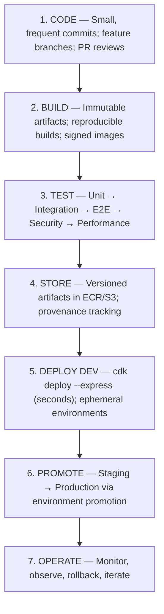
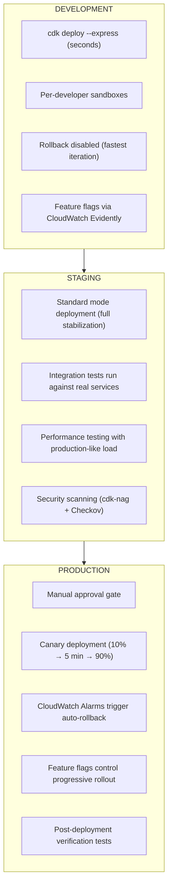
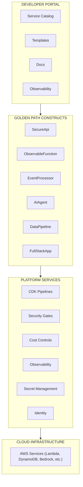
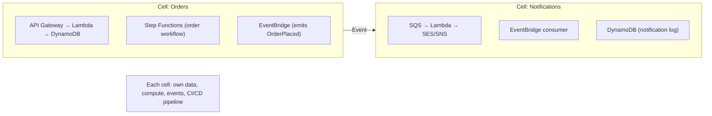

# Architecture Principles — Cloud-Native Serverless 2026

## Modern Architecture Foundation

This document consolidates the most important architectural principles for building modern cloud-native applications in 2026, drawing from:

- **Twelve-Factor App** (modernized for serverless)
- **Sixteen-Factor App** (extended for the AI era — Google Cloud, Oct 2025)
- **AWS Well-Architected Framework** (6 pillars + Serverless Lens)
- **Enterprise CI/CD** (Octopus Deploy best practices, DevOps 2.0)
- **Platform Engineering** (Gartner: 80% of orgs by 2026)
- **2026 Tendencies** (Agentic AI, cell-based architecture, sustainability)

---

## I. The Sixteen-Factor App (2026)

The original Twelve-Factor App (2011) remains the foundation. In 2026, four additional factors address the AI and cloud-native era.

### Original 12 Factors (Modernized for Serverless)

| # | Factor | Serverless Adaptation (2026) |
|---|--------|------------------------------|
| 1 | **Codebase** | One repo per cell/service; monorepo for related cells with CDK stacks |
| 2 | **Dependencies** | Lambda layers for shared deps; `package-lock.json` pinned; container images from ECR |
| 3 | **Config** | SSM Parameter Store + Secrets Manager; never in code; per-environment via CDK context |
| 4 | **Backing Services** | DynamoDB, S3, SQS are attached resources; swap via environment variables |
| 5 | **Build, Release, Run** | CDK synth (build) → CDK Pipelines (release) → CloudFormation deploy (run) |
| 6 | **Processes** | Lambda is stateless by design; state in DynamoDB/ElastiCache; no local filesystem |
| 7 | **Port Binding** | Lambda Function URLs / API Gateway handle port binding transparently |
| 8 | **Concurrency** | Lambda scales per-request automatically; no horizontal scaling config needed |
| 9 | **Disposability** | Lambda functions are ephemeral; SnapStart for fast cold starts; graceful shutdown |
| 10 | **Dev/Prod Parity** | CDK stacks deploy identically across environments; `cdk deploy --express` for dev |
| 11 | **Logs** | Lambda writes to stdout → CloudWatch Logs; structured JSON via Powertools |
| 12 | **Admin Processes** | One-off Lambda invocations; Step Functions for admin workflows; no SSH |

### Four New Factors for the AI Era (Factors XIII–XVI)

#### XIII. Prompts as Code

In AI applications, natural language prompts are source code:

- **Version prompts** alongside application code in Git
- **Behavioral specs:** Define golden datasets of inputs/expected outputs as tests
- **Context engineering:** The logic that builds prompts (RAG retrieval, history selection, tool availability) IS the application — version, test, deploy it
- **Prompt templates:** Treat prompts as templates populated by context logic

**AWS Implementation:**
```
prompts/
├── system-prompt.md          # Versioned prompt template
├── tests/
│   ├── golden-dataset.json   # Expected behavior specs
│   └── adversarial.json      # Safety test cases
└── context/
    └── rag-config.ts         # Context engineering logic
```

#### XIV. State as a Service

Conversational AI is stateful. Externalize ALL state:

- **Short-term memory:** AgentCore Memory / DynamoDB (conversation history per session)
- **Long-term memory:** AgentCore Memory / OpenSearch Serverless (semantic search across past conversations)
- **Application process remains stateless** — retrieves state with each turn via session ID
- **Lambda + state store** — never assume state persists between invocations

**AWS Implementation:**
- AgentCore Memory for agent state
- DynamoDB for session state (TTL for expiration)
- ElastiCache Serverless for hot state (microsecond access)

#### XV. Observability for Non-Determinism

AI apps can return 200 OK with garbage answers. Expand observability beyond system health:

- **Log prompts, responses, and token counts** for every AI interaction
- **Track tool-use errors** (which tools failed, what inputs caused failures)
- **User feedback mechanisms** integrated into the application
- **Quality metrics:** Response relevance scores, hallucination detection
- **Cost tracking:** Token consumption per model, per feature

**AWS Implementation:**
- Powertools Logger captures full AI request/response
- AgentCore Observability (OpenTelemetry) traces every agent decision
- CloudWatch custom metrics for AI quality scores
- X-Ray traces tool-call chains within agent workflows

#### XVI. Trust & Safety by Design

AI security is fundamentally different from traditional security:

**Three-Layer Defense:**

| Layer | Scope | AWS Implementation |
|-------|-------|-------------------|
| **Model safety** | Filter harmful content, block prompt injection | Bedrock Guardrails (content filters, denied topics, PII masking) |
| **Application access control** | Adapt agent capabilities per user identity | Cedar policies in AgentCore Identity |
| **Infrastructure permissions** | Least privilege for agent service roles | IAM roles scoped per-agent, per-tool |

---

## II. AWS Well-Architected Framework (6 Pillars)

The Well-Architected Framework provides the structural backbone. Every serverless application must address all six pillars.

### Pillar 1: Operational Excellence

| Practice | Serverless Implementation |
|----------|--------------------------|
| Operations as code | CDK stacks + CDK Pipelines (self-mutating CI/CD) |
| Frequent small changes | `cdk deploy --express` for seconds-fast iteration |
| Anticipate failure | DLQs on all async sources; canary deployments |
| Refine procedures | Runbooks as Step Functions (machine-executable) |
| Learn from events | CloudWatch Logs Insights for post-incident analysis |

### Pillar 2: Security

| Practice | Serverless Implementation |
|----------|--------------------------|
| Identity & access | IAM per-function roles; Cognito for users |
| Detection | CloudTrail + GuardDuty + Security Hub |
| Infrastructure protection | WAF on all public APIs; VPC for sensitive workloads |
| Data protection | KMS encryption at-rest; TLS 1.3 in-transit |
| Incident response | Automated response via EventBridge + Lambda |

### Pillar 3: Reliability

| Practice | Serverless Implementation |
|----------|--------------------------|
| Recover from failure | Multi-AZ (Lambda automatic); DynamoDB Global Tables |
| Scale to meet demand | On-demand scaling (Lambda, DynamoDB, ElastiCache Serverless) |
| Manage change | Canary deployments (CodeDeploy); rollback on alarm |
| Test recovery | Chaos engineering with AWS Fault Injection Service |
| Mitigate single points | Cell-based architecture; circuit breakers |

### Pillar 4: Performance Efficiency

| Practice | Serverless Implementation |
|----------|--------------------------|
| Select right resources | Lambda vs Fargate decision based on workload |
| Review with data | Lambda Power Tuning; CloudWatch metrics |
| Use serverless | Default to Lambda, DynamoDB, EventBridge |
| Experiment frequently | `cdk deploy --express` enables rapid experimentation |
| Mechanical sympathy | ARM64 for Lambda; SnapStart for cold starts |

### Pillar 5: Cost Optimization

| Practice | Serverless Implementation |
|----------|--------------------------|
| Pay only for consumption | On-demand DynamoDB; Lambda per-request; scales-to-zero |
| Match supply to demand | Auto-scaling inherent in serverless |
| Expenditure awareness | Cost allocation tags; AWS Budgets; CUR reports |
| Optimize over time | Right-size Lambda memory; Savings Plans for Fargate |

### Pillar 6: Sustainability

| Practice | Serverless Implementation |
|----------|--------------------------|
| Minimize waste | Scales-to-zero eliminates idle; ARM64 uses less energy |
| Maximize utilization | Serverless inherently maximizes — shared fleet |
| Use managed services | Reduce undifferentiated heavy lifting |
| Reduce downstream impact | Cache at edge (CloudFront); batch processing |

---

## III. Enterprise CI/CD Practices (Octopus Deploy / DevOps 2.0)

### The 7-Step Enterprise CI/CD Pipeline

Based on Octopus Deploy best practices and DORA metrics research for 2026:



### 5 Critical CI/CD Best Practices (2026)

#### 1. Pipeline-as-Code with Modular Reuse
```typescript
// CDK Pipeline — self-mutating, modular
const pipeline = new pipelines.CodePipeline(this, 'Pipeline', {
  synth: new pipelines.ShellStep('Synth', {
    commands: ['npm ci', 'npx cdk synth'],
  }),
});
// Reuse across cells — each cell is a pipeline stage
pipeline.addStage(new OrdersCell(this, 'Dev', { env: devEnv }));
pipeline.addStage(new OrdersCell(this, 'Prod', { env: prodEnv }), {
  pre: [new pipelines.ManualApprovalStep('ApproveProd')],
});
```

#### 2. Ephemeral Environments per Pull Request
- Every PR gets its own isolated AWS environment
- `cdk deploy --express` makes this feasible (seconds, not minutes)
- Developers test against real AWS services in isolation
- Environment destroyed on PR merge/close

#### 3. DORA Metrics Instrumentation
Track these four key metrics:

| Metric | Elite Performance (2026) |
|--------|-------------------------|
| **Deployment Frequency** | On-demand (multiple deploys per day) |
| **Lead Time for Changes** | Less than 1 hour (Express mode enables this) |
| **Change Failure Rate** | < 5% (canary deployments catch issues) |
| **Time to Restore** | < 10 minutes (automated rollback) |

#### 4. Supply Chain Security at Build-Time
- **Signed builds:** All artifacts signed with AWS Signer
- **SBOM generation:** Software Bill of Materials for every release
- **Dependency scanning:** Automated CVE checking in CI pipeline
- **Provenance tracking:** Trace artifacts back to specific commits
- **Immutable artifacts:** Once built, never modified — deploy same artifact to all envs

#### 5. Intelligent Test Parallelization
- Split tests across multiple CodeBuild instances
- Run only impacted tests per change (dependency graph analysis)
- Use SAM local testing for fast Lambda unit tests
- Integration tests against real AWS services in ephemeral environments
- Security tests (cdk-nag, Checkov) run automatically on every synth

### Environment Promotion Strategy



### Deployment Strategies

| Strategy | Risk | Speed | Use When |
|----------|------|-------|----------|
| **Canary (Recommended)** | Low | Moderate | Default for production |
| **Linear** | Low | Slow | High-risk changes needing gradual rollout |
| **Blue/Green** | Medium | Fast | Full environment swaps, database migrations |
| **All-at-Once** | ❌ High | ❌ Fastest | Never in production |

---

## IV. DevOps 2.0 — Platform Engineering

### Gartner Prediction (2026)

> "By 2026, 80% of large software engineering organizations will establish platform engineering teams as internal providers of reusable services, components and tools for application delivery."

### Platform Engineering Principles

#### 1. Internal Developer Platform (IDP)

Build a self-service platform that abstracts infrastructure complexity:



#### 2. Golden Path CDK Constructs

Create opinionated L3 constructs that encode organizational best practices:

```typescript
// SecureApi — one construct, all best practices built in
export class SecureApi extends Construct {
  // Creates: API Gateway + WAF + Cognito Auth + Lambda + 
  //          CloudWatch Alarms + X-Ray Tracing + Powertools +
  //          cdk-nag compliance
}

// ObservableFunction — Lambda with observability baked in
export class ObservableFunction extends Construct {
  // Creates: Lambda (ARM64 + SnapStart) + Powertools Layer +
  //          X-Ray Active Tracing + Structured Logging +
  //          Custom Metrics + DLQ + Alarms
}

// EventProcessor — reliable async processing
export class EventProcessor extends Construct {
  // Creates: SQS + DLQ + Lambda Consumer + Alarms on DLQ +
  //          X-Ray tracing + Idempotency via Powertools
}
```

#### 3. Treat Platforms as Products

- **Product managers** for the internal platform
- **SLAs** for platform reliability (99.9% pipeline availability)
- **Developer satisfaction surveys** (quarterly NPS)
- **Self-service documentation** (searchable, example-rich)
- **Feedback loops** — developers influence platform roadmap

#### 4. AI-Native Platform Engineering

The platform itself uses AI:

- **AI generates infrastructure:** CDK code from natural language via Kiro
- **AI validates changes:** Automated security review of CDK diffs
- **AI troubleshoots:** CloudFormation failure → AI agent diagnoses + suggests fix
- **AI monitors:** Operations agents detect anomalies and propose remediation

#### 5. ThothCTL — The Platform Engineering CLI

ThothCTL ([thothctl.readthedocs.io](https://thothctl.readthedocs.io)) is the CLI tool that implements the Internal Developer Platform principles described above. It provides the golden path automation for IaC teams.

```bash
pip install thothctl

# Initialize project from template (golden path)
thothctl init --project-type terraform-terragrunt --project-name my-service

# Validate structure + cost + blast radius (shift-left)
thothctl check

# Security scan (Checkov + Trivy + OPA)
thothctl scan

# Generate documentation automatically
thothctl document

# Full DevSecOps workflow (all phases)
thothctl workflow devsecops
```

| Business Objective | ThothCTL Mechanism |
|---|---|
| Minimize mistakes | Templates + meaningful defaults |
| Increase velocity | Automation + IaC scripts |
| Enforce compliance | Security scanning + OPA policies |
| Reduce lock-in | Abstraction via service layers |

ThothCTL operationalizes the golden path constructs and platform services described above, giving developers a single CLI entry point to the entire Internal Developer Platform without needing to understand the underlying toolchain complexity.

---

## V. Core Architecture Principles for 2026

### Principle 1: Serverless-First, Always

> **"If you're managing servers in 2026, you're doing infrastructure, not building products."**

- Default to managed, scales-to-zero services for every layer
- Only use containers (Fargate) when Lambda constraints are genuinely hit
- Accept eventual consistency as the default; use strong consistency selectively
- Eliminate idle costs — pay only for what you consume

### Principle 2: AI-Native by Design

> **"Every application is an AI application. The question is how much."**

- Integrate Bedrock as a first-class capability, not an afterthought
- Design data models with RAG in mind (chunking-friendly documents)
- Build tools as Lambda functions exposed via MCP
- Implement Guardrails on all AI interactions from day one
- Cedar policies for agent authorization

### Principle 3: Event-Driven Architecture as Default

> **"Synchronous calls are the exception, not the rule."**

- CQRS: separate read and write paths
- EventBridge as the central nervous system
- Idempotency at every consumer
- DynamoDB Streams + EventBridge Pipes for CDC
- Choreography for decoupled services; orchestration (Step Functions) for complex workflows

### Principle 4: Cell-Based Architecture

> **"Blast radius containment through independent, self-sufficient cells."**



### Principle 5: Zero-Trust Security

> **"Never trust, always verify. Least privilege is not optional."**

- IAM roles scoped per-function, per-resource
- VPC Lattice with auth policies for service-to-service
- Secrets Manager with automatic rotation
- WAF on every public endpoint
- Cedar policies for AI agent authorization
- Encrypt everything: at-rest (KMS) + in-transit (TLS 1.3)

### Principle 6: Shift-Left Everything

> **"If it's not tested/secured/validated before merge, it's not done."**

- cdk-nag on every `cdk synth`
- CloudFormation pre-deployment validation
- SAM CLI local testing before deployment
- Guardrails tested with adversarial prompts in dev
- Policy-as-code versioned alongside application code

### Principle 7: Observability-Driven Development

> **"If you can't observe it, you can't operate it."**

- Instrument first, code second — Powertools on every Lambda
- Structured logging (JSON) with correlation IDs
- Distributed tracing across sync + async boundaries
- Application Signals for automatic SLOs
- Custom business metrics via CloudWatch EMF
- Error budgets: alert when budget is burned

### Principle 8: Cost-Aware Architecture

> **"Cloud bills are an architectural concern, not an ops problem."**

| Optimization | Savings |
|-------------|---------|
| ARM64/Graviton | 20% on Lambda |
| SnapStart (not Provisioned Concurrency) | Free cold start fix |
| Valkey (not Redis) on ElastiCache | 33% cheaper |
| HTTP API (not REST API) | 70% cheaper |
| Express Workflows (not Standard) | Per-execution vs per-transition |
| CloudFront Functions (not Lambda@Edge) | Fraction of cost |
| EventBridge Scheduler | 14M free/month |

> **💡 Shift-Left Cost Estimation:** Use `thothctl check --cost-analysis` to estimate infrastructure costs *before* deployment. This integrates with the Platform Engineering CLI (Section IV.5) to provide cost projections from Terraform plans or CloudFormation templates, enabling teams to catch budget-breaking changes during development rather than in the monthly bill.

---

## VI. 2026 Architectural Tendencies

### Tendency 1: Agentic Architecture

Applications move from "human calls API" to "agent orchestrates on behalf of human":

- Design APIs as MCP tools (machine-callable, semantically described)
- Build for multi-turn interactions (session state, memory)
- Implement approval workflows for high-impact agent actions
- Monitor agent decision chains (every tool call traceable)

### Tendency 2: Infrastructure from Conversation

CloudFormation Express + AI tools enable:
- Developer describes intent → AI generates CDK → deploys in seconds → iterates
- L3 constructs ensure AI generates correct-by-default infrastructure
- Human reviews architecture decisions; AI handles implementation

### Tendency 3: Edge-First Data

- CloudFront Functions + KeyValueStore for dynamic config without origin calls
- DynamoDB Global Tables for multi-region active-active
- Cache aggressively at edge (stale-while-revalidate)

### Tendency 4: Autonomous Operations

- AI operations agents monitor, diagnose, and propose fixes
- Runbooks as Step Functions (machine-executable)
- EventBridge rules trigger automated responses to known patterns

### Tendency 5: Sustainability-Aware Design

- ARM64 uses less energy per transaction
- Scales-to-zero eliminates idle waste
- Right-sizing through Lambda Power Tuning
- Regional choice based on carbon intensity

### Tendency 6: Contract-First Development

- GraphQL schema → AppSync resolvers generated
- EventBridge schema registry documents all event shapes
- OpenAPI spec → API Gateway validates automatically
- MCP tool descriptions are the contract for AI tool use

---

## VII. Anti-Patterns to Avoid

| Anti-Pattern | Why It's Wrong | Modern Alternative |
|-------------|---------------|-------------------|
| Lambda monolith | Hard to debug, no independent scaling | One function per route/event |
| Direct service calls | Tight coupling, cascade failures | EventBridge + VPC Lattice |
| Shared database | Data coupling, schema conflicts | Database per cell/service |
| No dead-letter queues | Silent message loss | DLQ on every async source |
| Console-only infrastructure | Not reproducible | Everything as CDK/SAM code |
| Polling for status | Wasteful, high latency | EventBridge + Subscriptions |
| AI without guardrails | PII leaks, harmful content | Guardrails on every Bedrock call |
| All-at-once deployments | Maximum blast radius | Canary/linear via CodeDeploy |
| Hardcoded secrets | Security vulnerability | Secrets Manager + rotation |
| No observability | Blind operations | Powertools + Application Signals |

---

## VIII. The Modern Serverless Manifesto (2026)

1. **Managed services over custom infrastructure** — let AWS operate the undifferentiated
2. **Events over direct calls** — decouple through asynchronous communication
3. **Type safety over documentation** — types are living, always-current docs
4. **Automation over manual processes** — if a human does it twice, codify it
5. **AI-augmented over AI-free** — let models handle the repetitive
6. **Observability over hope** — instrument everything, alert on what matters
7. **Security by default over bolt-on** — cdk-nag, Guardrails, least privilege from day one
8. **Speed over perfection** — Express mode + canary deploys = ship fast, fix fast
9. **Composability over completeness** — small pieces that combine into powerful systems
10. **Sustainability over waste** — ARM64, scales-to-zero, right-sized resources
11. **Platform engineering over ticket queues** — self-service golden paths
12. **Contracts over assumptions** — schemas, types, and specs drive implementation

---

## IX. Getting Started Checklist

Use this checklist when starting a new project:

### Infrastructure
- [ ] Choose IaC tool (CDK + Express for most teams)
- [ ] Create golden path L3 constructs for your patterns
- [ ] Set up CDK Pipelines (self-mutating CI/CD)
- [ ] Configure dev/staging/prod environment promotion
- [ ] Enable cdk-nag for security validation

### Application
- [ ] One Lambda per route/event (no monoliths)
- [ ] ARM64 + SnapStart on all functions
- [ ] EventBridge as event backbone
- [ ] DynamoDB On-Demand for primary data
- [ ] Structured logging with Powertools

### Security
- [ ] Per-function IAM roles (least privilege)
- [ ] WAF on all public APIs
- [ ] Cognito for user auth
- [ ] Secrets Manager (no hardcoded secrets)
- [ ] Bedrock Guardrails on all AI calls

### Observability
- [ ] Powertools (Logger + Tracer + Metrics) on every function
- [ ] Application Signals enabled
- [ ] CloudWatch Alarms (Errors, Throttles, Duration)
- [ ] DLQs with alarms on all async processing
- [ ] DORA metrics tracking in CI/CD

### Deployment
- [ ] Canary deployment strategy (never all-at-once)
- [ ] CloudWatch Evidently for feature flags
- [ ] Ephemeral environments per PR
- [ ] Manual approval gate before production
- [ ] Automated rollback on alarm breach

### AI Integration
- [ ] Bedrock Converse API for model access
- [ ] Guardrails configured (content + PII + topics)
- [ ] Prompts versioned in Git
- [ ] Agent tools exposed as MCP via AgentCore Gateway
- [ ] Agent observability via AgentCore + CloudWatch
