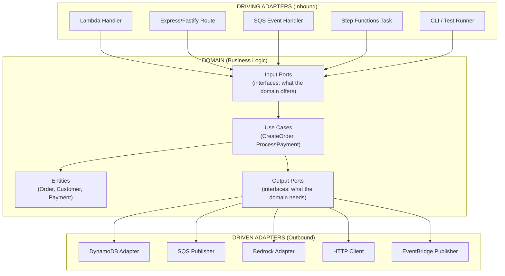
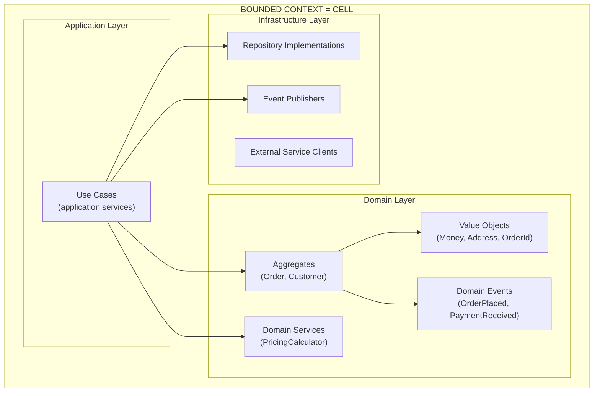
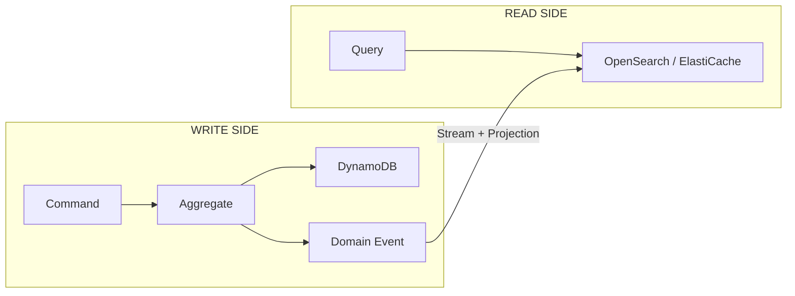
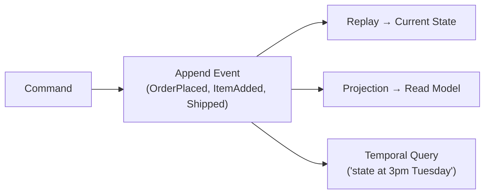
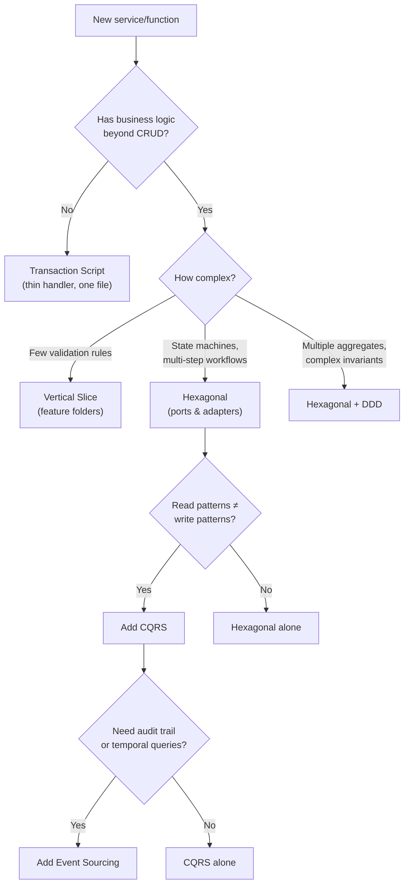

# Software Architecture Patterns — Code Design for Serverless & Containers

## Overview

This document defines **how to structure application code** inside each cell (Lambda functions, ECS services). While other documents cover infrastructure (CDK, EventBridge, DynamoDB), this document covers the **internal architecture of the code** that runs on that infrastructure.

### The Pattern: Hexagonal Architecture (Ports & Adapters)

The framework adopts **Hexagonal Architecture** (also called Ports & Adapters, or Clean Architecture) as the standard code structure for all serverless and container workloads.

**Why Hexagonal for Serverless/Containers:**
- **Testability** — Business logic tested without AWS services (no Docker, no LocalStack, no mocks of SDKs)
- **Portability** — Same domain logic runs in Lambda, ECS, or tests unchanged
- **AI-DLC friendly** — AI generates adapters; humans own domain logic
- **Framework agnostic** — Switch from Express to Fastify, or Lambda to ECS, without touching business logic

---

## The Three Layers



### Key Principle: Dependencies Point Inward

```
Adapters → Domain ← Adapters
              ↑
    (Domain NEVER depends on adapters)
    (Domain NEVER imports aws-sdk, express, or any framework)
```

---

## Project Structure (Lambda — TypeScript)

```
app/functions/create-order/
├── src/
│   ├── handler.ts              ← DRIVING ADAPTER (Lambda entry point)
│   ├── domain/
│   │   ├── entities/
│   │   │   ├── order.ts        ← ENTITY (pure business object)
│   │   │   └── order.test.ts   ← Unit test (no AWS, no mocks)
│   │   ├── use-cases/
│   │   │   ├── create-order.ts ← USE CASE (orchestrates business logic)
│   │   │   └── create-order.test.ts
│   │   └── ports/
│   │       ├── inbound/
│   │       │   └── create-order.port.ts    ← INPUT PORT (interface)
│   │       └── outbound/
│   │           ├── order-repository.port.ts ← OUTPUT PORT (interface)
│   │           └── event-publisher.port.ts  ← OUTPUT PORT (interface)
│   └── adapters/
│       ├── inbound/
│       │   └── lambda-handler.adapter.ts    ← Maps Lambda event → use case call
│       └── outbound/
│           ├── dynamodb-order.adapter.ts    ← Implements OrderRepository with DynamoDB
│           ├── eventbridge-publisher.adapter.ts ← Implements EventPublisher
│           └── bedrock-summary.adapter.ts   ← Implements AISummaryService
├── package.json
└── tsconfig.json
```

---

## Code Examples

### 1. Entity (Pure Business Logic — No Dependencies)

```typescript
// src/domain/entities/order.ts
export type OrderStatus = 'PLACED' | 'VALIDATED' | 'PROCESSING' | 'COMPLETED' | 'FAILED';

export interface OrderItem {
  productId: string;
  quantity: number;
  price: number;
}

export class Order {
  readonly id: string;
  readonly customerId: string;
  readonly items: OrderItem[];
  status: OrderStatus;
  readonly createdAt: Date;
  total: number;

  constructor(props: { id: string; customerId: string; items: OrderItem[] }) {
    this.id = props.id;
    this.customerId = props.customerId;
    this.items = props.items;
    this.status = 'PLACED';
    this.createdAt = new Date();
    this.total = this.calculateTotal();
  }

  private calculateTotal(): number {
    return this.items.reduce((sum, item) => sum + item.price * item.quantity, 0);
  }

  validate(): void {
    if (this.items.length === 0) {
      throw new OrderValidationError('Order must have at least one item');
    }
    if (this.total <= 0) {
      throw new OrderValidationError('Order total must be positive');
    }
    if (this.total > 10000) {
      throw new OrderValidationError('Order exceeds maximum value');
    }
    this.status = 'VALIDATED';
  }

  markProcessing(): void {
    if (this.status !== 'VALIDATED') {
      throw new OrderStateError(`Cannot process order in status: ${this.status}`);
    }
    this.status = 'PROCESSING';
  }

  complete(): void {
    if (this.status !== 'PROCESSING') {
      throw new OrderStateError(`Cannot complete order in status: ${this.status}`);
    }
    this.status = 'COMPLETED';
  }
}

export class OrderValidationError extends Error {
  constructor(message: string) { super(message); this.name = 'OrderValidationError'; }
}

export class OrderStateError extends Error {
  constructor(message: string) { super(message); this.name = 'OrderStateError'; }
}
```

**Note:** Zero imports from `aws-sdk`, `express`, or any framework. Pure TypeScript. Testable with `jest` alone.

### 2. Output Ports (Interfaces — What the Domain Needs)

```typescript
// src/domain/ports/outbound/order-repository.port.ts
import { Order } from '../../entities/order';

export interface OrderRepository {
  save(order: Order): Promise<void>;
  findById(id: string): Promise<Order | null>;
  findByCustomer(customerId: string): Promise<Order[]>;
}
```

```typescript
// src/domain/ports/outbound/event-publisher.port.ts
export interface DomainEvent {
  eventType: string;
  payload: Record<string, unknown>;
  timestamp: Date;
}

export interface EventPublisher {
  publish(event: DomainEvent): Promise<void>;
}
```

```typescript
// src/domain/ports/outbound/ai-summary.port.ts
import { Order } from '../../entities/order';

export interface AISummaryService {
  generateSummary(order: Order): Promise<string>;
}
```

### 3. Input Port (Interface — What the Domain Offers)

```typescript
// src/domain/ports/inbound/create-order.port.ts
export interface CreateOrderInput {
  customerId: string;
  items: { productId: string; quantity: number; price: number }[];
}

export interface CreateOrderOutput {
  orderId: string;
  status: string;
  total: number;
}

export interface CreateOrderUseCase {
  execute(input: CreateOrderInput): Promise<CreateOrderOutput>;
}
```

### 4. Use Case (Orchestrates Domain Logic)

```typescript
// src/domain/use-cases/create-order.ts
import { Order } from '../entities/order';
import { CreateOrderUseCase, CreateOrderInput, CreateOrderOutput } from '../ports/inbound/create-order.port';
import { OrderRepository } from '../ports/outbound/order-repository.port';
import { EventPublisher } from '../ports/outbound/event-publisher.port';
import { randomUUID } from 'crypto';

export class CreateOrderUseCaseImpl implements CreateOrderUseCase {
  constructor(
    private readonly orderRepository: OrderRepository,
    private readonly eventPublisher: EventPublisher,
  ) {}

  async execute(input: CreateOrderInput): Promise<CreateOrderOutput> {
    // 1. Create entity
    const order = new Order({
      id: randomUUID(),
      customerId: input.customerId,
      items: input.items,
    });

    // 2. Business validation (domain rules)
    order.validate();

    // 3. Persist (via output port — doesn't know about DynamoDB)
    await this.orderRepository.save(order);

    // 4. Emit domain event (via output port — doesn't know about EventBridge)
    await this.eventPublisher.publish({
      eventType: 'OrderPlaced',
      payload: { orderId: order.id, customerId: order.customerId, total: order.total },
      timestamp: order.createdAt,
    });

    // 5. Return result
    return {
      orderId: order.id,
      status: order.status,
      total: order.total,
    };
  }
}
```

**Note:** The use case depends ONLY on ports (interfaces). It doesn't know if it's running in Lambda, ECS, or a test.

### 5. Driven Adapter (DynamoDB Implementation)

```typescript
// src/adapters/outbound/dynamodb-order.adapter.ts
import { DynamoDBClient, PutItemCommand, GetItemCommand } from '@aws-sdk/client-dynamodb';
import { marshall, unmarshall } from '@aws-sdk/util-dynamodb';
import { Order } from '../../domain/entities/order';
import { OrderRepository } from '../../domain/ports/outbound/order-repository.port';

export class DynamoDBOrderRepository implements OrderRepository {
  private readonly client: DynamoDBClient;
  private readonly tableName: string;

  constructor(tableName: string, client?: DynamoDBClient) {
    this.tableName = tableName;
    this.client = client ?? new DynamoDBClient({});
  }

  async save(order: Order): Promise<void> {
    await this.client.send(new PutItemCommand({
      TableName: this.tableName,
      Item: marshall({
        PK: `ORDER#${order.id}`,
        SK: `ORDER#${order.id}`,
        GSI1PK: `CUSTOMER#${order.customerId}`,
        GSI1SK: `ORDER#${order.createdAt.toISOString()}`,
        id: order.id,
        customerId: order.customerId,
        items: order.items,
        status: order.status,
        total: order.total,
        createdAt: order.createdAt.toISOString(),
      }),
    }));
  }

  async findById(id: string): Promise<Order | null> {
    const result = await this.client.send(new GetItemCommand({
      TableName: this.tableName,
      Key: marshall({ PK: `ORDER#${id}`, SK: `ORDER#${id}` }),
    }));
    if (!result.Item) return null;
    const data = unmarshall(result.Item);
    return new Order({ id: data.id, customerId: data.customerId, items: data.items });
  }

  async findByCustomer(customerId: string): Promise<Order[]> {
    // GSI1 query implementation...
    return [];
  }
}
```

### 6. Driven Adapter (EventBridge Implementation)

```typescript
// src/adapters/outbound/eventbridge-publisher.adapter.ts
import { EventBridgeClient, PutEventsCommand } from '@aws-sdk/client-eventbridge';
import { EventPublisher, DomainEvent } from '../../domain/ports/outbound/event-publisher.port';

export class EventBridgePublisher implements EventPublisher {
  private readonly client: EventBridgeClient;
  private readonly busName: string;
  private readonly source: string;

  constructor(busName: string, source: string) {
    this.client = new EventBridgeClient({});
    this.busName = busName;
    this.source = source;
  }

  async publish(event: DomainEvent): Promise<void> {
    await this.client.send(new PutEventsCommand({
      Entries: [{
        EventBusName: this.busName,
        Source: this.source,
        DetailType: event.eventType,
        Detail: JSON.stringify(event.payload),
        Time: event.timestamp,
      }],
    }));
  }
}
```

### 7. Driving Adapter (Lambda Handler)

```typescript
// src/adapters/inbound/lambda-handler.adapter.ts
import { APIGatewayProxyEventV2, APIGatewayProxyResultV2 } from 'aws-lambda';
import { Logger } from '@aws-lambda-powertools/logger';
import { Tracer } from '@aws-lambda-powertools/tracer';
import { CreateOrderUseCaseImpl } from '../../domain/use-cases/create-order';
import { DynamoDBOrderRepository } from '../outbound/dynamodb-order.adapter';
import { EventBridgePublisher } from '../outbound/eventbridge-publisher.adapter';

const logger = new Logger({ serviceName: 'orders-api' });
const tracer = new Tracer({ serviceName: 'orders-api' });

// Compose the dependency graph (Dependency Injection)
const orderRepository = new DynamoDBOrderRepository(process.env.TABLE_NAME!);
const eventPublisher = new EventBridgePublisher(process.env.EVENT_BUS_NAME!, 'orders-service');
const createOrderUseCase = new CreateOrderUseCaseImpl(orderRepository, eventPublisher);

export const handler = async (event: APIGatewayProxyEventV2): Promise<APIGatewayProxyResultV2> => {
  try {
    const body = JSON.parse(event.body || '{}');
    logger.info('Creating order', { customerId: body.customerId });

    const result = await createOrderUseCase.execute({
      customerId: body.customerId,
      items: body.items,
    });

    return {
      statusCode: 201,
      body: JSON.stringify(result),
    };
  } catch (error: any) {
    if (error.name === 'OrderValidationError') {
      return { statusCode: 400, body: JSON.stringify({ error: error.message }) };
    }
    logger.error('Unexpected error', { error });
    return { statusCode: 500, body: JSON.stringify({ error: 'Internal server error' }) };
  }
};
```

**Key:** The handler is THIN — it only:
1. Parses the incoming event (adapter concern)
2. Calls the use case (domain logic)
3. Maps the result back to HTTP response (adapter concern)

---

## Testing Strategy

### Layer-by-Layer Testing

| Layer | Test Type | Dependencies | Speed |
|-------|-----------|-------------|-------|
| **Entities** | Unit test | None (pure logic) | Milliseconds |
| **Use Cases** | Unit test | Mocked ports (interfaces) | Milliseconds |
| **Adapters** | Integration test | Real DynamoDB Local / real AWS | Seconds |
| **Handler (full)** | E2E test | Real deployed stack | Seconds |

### Entity Tests (Zero Dependencies)

```typescript
// src/domain/entities/order.test.ts
import { Order, OrderValidationError } from './order';

describe('Order', () => {
  it('calculates total correctly', () => {
    const order = new Order({
      id: '123',
      customerId: 'cust-1',
      items: [
        { productId: 'p1', quantity: 2, price: 10 },
        { productId: 'p2', quantity: 1, price: 25 },
      ],
    });
    expect(order.total).toBe(45);
  });

  it('rejects empty orders', () => {
    const order = new Order({ id: '123', customerId: 'cust-1', items: [] });
    expect(() => order.validate()).toThrow(OrderValidationError);
  });

  it('rejects orders exceeding max value', () => {
    const order = new Order({
      id: '123',
      customerId: 'cust-1',
      items: [{ productId: 'p1', quantity: 1, price: 15000 }],
    });
    expect(() => order.validate()).toThrow('exceeds maximum value');
  });

  it('transitions state correctly', () => {
    const order = new Order({ id: '123', customerId: 'cust-1', items: [{ productId: 'p1', quantity: 1, price: 50 }] });
    order.validate();
    expect(order.status).toBe('VALIDATED');
    order.markProcessing();
    expect(order.status).toBe('PROCESSING');
    order.complete();
    expect(order.status).toBe('COMPLETED');
  });
});
```

**No mocks, no AWS SDK, no Docker. Pure logic. Runs in < 100ms.**

### Use Case Tests (Mocked Ports)

```typescript
// src/domain/use-cases/create-order.test.ts
import { CreateOrderUseCaseImpl } from './create-order';
import { OrderRepository } from '../ports/outbound/order-repository.port';
import { EventPublisher } from '../ports/outbound/event-publisher.port';

describe('CreateOrderUseCase', () => {
  const mockRepo: jest.Mocked<OrderRepository> = {
    save: jest.fn(),
    findById: jest.fn(),
    findByCustomer: jest.fn(),
  };

  const mockPublisher: jest.Mocked<EventPublisher> = {
    publish: jest.fn(),
  };

  const useCase = new CreateOrderUseCaseImpl(mockRepo, mockPublisher);

  beforeEach(() => jest.clearAllMocks());

  it('creates a valid order and publishes event', async () => {
    const result = await useCase.execute({
      customerId: 'cust-1',
      items: [{ productId: 'p1', quantity: 2, price: 25 }],
    });

    expect(result.status).toBe('VALIDATED');
    expect(result.total).toBe(50);
    expect(mockRepo.save).toHaveBeenCalledTimes(1);
    expect(mockPublisher.publish).toHaveBeenCalledWith(
      expect.objectContaining({ eventType: 'OrderPlaced' })
    );
  });

  it('rejects invalid order without persisting', async () => {
    await expect(useCase.execute({
      customerId: 'cust-1',
      items: [], // Empty → validation fails
    })).rejects.toThrow('at least one item');

    expect(mockRepo.save).not.toHaveBeenCalled();
    expect(mockPublisher.publish).not.toHaveBeenCalled();
  });
});
```

**Mocks only the port interfaces (not AWS SDK). Tests business rules in isolation.**

---

## Same Pattern for ECS (Express/Fastify)

The **only difference** is the driving adapter — the domain and outbound adapters are identical:

```typescript
// src/adapters/inbound/express-handler.adapter.ts (ECS version)
import express from 'express';
import { CreateOrderUseCaseImpl } from '../../domain/use-cases/create-order';
import { DynamoDBOrderRepository } from '../outbound/dynamodb-order.adapter';
import { EventBridgePublisher } from '../outbound/eventbridge-publisher.adapter';

const app = express();
app.use(express.json());

// Same composition — same ports, same adapters
const orderRepository = new DynamoDBOrderRepository(process.env.TABLE_NAME!);
const eventPublisher = new EventBridgePublisher(process.env.EVENT_BUS_NAME!, 'orders-service');
const createOrderUseCase = new CreateOrderUseCaseImpl(orderRepository, eventPublisher);

app.post('/orders', async (req, res) => {
  try {
    const result = await createOrderUseCase.execute(req.body);
    res.status(201).json(result);
  } catch (error: any) {
    if (error.name === 'OrderValidationError') {
      return res.status(400).json({ error: error.message });
    }
    res.status(500).json({ error: 'Internal server error' });
  }
});

app.listen(process.env.PORT || 8080);
```

**The domain code is 100% identical between Lambda and ECS** — only the driving adapter changes.

---

## Domain-Driven Design (DDD) Integration

For complex domains, apply DDD tactical patterns within each cell:



### DDD Terms → Framework Mapping

| DDD Concept | Framework Implementation |
|-------------|-------------------------|
| **Bounded Context** | Cell (CDK Stack + own data + own pipeline) |
| **Aggregate** | Entity class with invariant enforcement |
| **Value Object** | Immutable class (Money, OrderId, Email) |
| **Domain Event** | EventBridge event (OrderPlaced, PaymentFailed) |
| **Repository** | Output port interface + DynamoDB/Aurora adapter |
| **Domain Service** | Pure function or class for cross-entity logic |
| **Application Service** | Use Case class (orchestrates aggregates) |
| **Anti-Corruption Layer** | Adapter that translates external models → domain models |

---

## When to Apply Which Level of Architecture

| Complexity | Approach | Example |
|-----------|---------|---------|
| **Simple CRUD** | Thin handler + DynamoDB direct | Admin dashboard, config APIs |
| **Business rules** | Hexagonal (use cases + entities) | Order processing, payments |
| **Complex domain** | Full DDD (aggregates, value objects, domain events) | Financial systems, logistics |
| **AI/Agent actions** | Hexagonal + tool interface as port | Bedrock tool actions |

**Don't over-engineer:** A simple GET endpoint that reads from DynamoDB doesn't need hexagonal architecture. A 5-line handler is fine. Apply hexagonal when you have **business logic worth protecting from infrastructure changes**.

---

## AI-DLC Integration

When using AI-DLC with Kiro, the hexagonal structure helps:

| AI-DLC Phase | AI Generates | Human Owns |
|-------------|-------------|------------|
| Inception | Port interfaces (from requirements) | Business rules in entities |
| Construction | Adapters (DynamoDB, EventBridge, Lambda handler) | Use case orchestration logic |
| Operations | Infrastructure adapters (monitoring, logging) | Domain invariants |

**Kiro steering rule:**
```markdown
## Code Architecture

When generating application code:
1. ALWAYS use hexagonal architecture (ports & adapters)
2. Domain entities must have ZERO imports from aws-sdk or any framework
3. Use cases depend ONLY on port interfaces, never on concrete adapters
4. Lambda/ECS handlers are THIN — parse input, call use case, format output
5. Each adapter implements exactly one port interface
```

---

## Summary

| Principle | Implementation |
|-----------|---------------|
| **Hexagonal Architecture** | Ports (interfaces) + Adapters (implementations) |
| **Dependency Inversion** | Domain never depends on infrastructure |
| **Single Responsibility** | Each adapter does one thing |
| **Interface Segregation** | Small, focused port interfaces |
| **Testability** | Domain tested without AWS; adapters tested with real services |
| **Portability** | Same domain runs in Lambda, ECS, or tests |
| **AI-DLC friendly** | AI generates adapters; humans protect domain logic |


---

## Alternative Patterns & When to Use Each

Hexagonal Architecture is the framework's **default**, but not every service needs it. Here are the alternatives with their trade-offs.

### Pattern Comparison

| Pattern | Core Idea | Best For |
|---------|-----------|----------|
| **Hexagonal (Ports & Adapters)** | Domain isolated via interfaces; adapters swap freely | Business-heavy services needing testability |
| **Clean Architecture** | Concentric rings (same as hexagonal, more explicit layers) | Large teams, formal governance |
| **Vertical Slice** | Organize by feature, not by layer | Fast delivery, many independent features |
| **Transaction Script** | Procedural — handler does everything top-to-bottom | Simple CRUD, < 30 lines of logic |
| **CQRS** | Separate read and write models entirely | High-read/low-write, complex queries |
| **Event Sourcing** | Store events, not state; derive state from replay | Audit-critical, undo/replay needed |
| **Modular Monolith** | Monolith with strict module boundaries | Early-stage, unknown domain boundaries |

---

### 1. Transaction Script (Simplest)

```typescript
// Everything in one function — no abstractions
export const handler = async (event) => {
  const body = JSON.parse(event.body);
  if (!body.items?.length) return { statusCode: 400, body: '{"error":"No items"}' };
  const total = body.items.reduce((s, i) => s + i.price * i.quantity, 0);
  await dynamoClient.send(new PutItemCommand({ /* ... */ }));
  return { statusCode: 201, body: JSON.stringify({ orderId: id, total }) };
};
```

| Advantages | Disadvantages |
|-----------|---------------|
| Simplest — one file, top-to-bottom | Untestable without real AWS |
| No abstractions, no ceremony | Business logic mixed with infra |
| AI generates naturally | Becomes spaghetti as complexity grows |
| Perfect for < 30 lines of logic | Can't swap infrastructure |

**Use when:** Simple CRUD, webhook handlers, glue code, prototypes.

---

### 2. Vertical Slice Architecture

```
features/
├── create-order/
│   ├── handler.ts        ← Entry point
│   ├── command.ts        ← Input validation
│   ├── repository.ts     ← Data access (directly uses DynamoDB)
│   └── create-order.test.ts
├── get-order/
│   ├── handler.ts
│   ├── query.ts
│   └── repository.ts
└── process-payment/
    ├── handler.ts
    ├── command.ts
    └── repository.ts
```

| Advantages | Disadvantages |
|-----------|---------------|
| Minimal boilerplate | Code duplication between slices |
| Feature-focused (one folder = one capability) | No enforced domain model |
| Teams work independently | Cross-cutting changes touch every slice |
| Fast to build and ship | Business rules can scatter |
| AI-DLC: "implement create-order" → all in one folder | Harder to refactor shared patterns |

**Use when:** Many independent features, little shared business logic, CRUD-heavy, team values speed over purity.

---

### 3. Hexagonal (Framework Default)

See full implementation above. Summarized:

| Advantages | Disadvantages |
|-----------|---------------|
| Domain tested with zero AWS deps (milliseconds) | More files for simple operations |
| Swap Lambda ↔ ECS without touching logic | Port interfaces feel like ceremony for CRUD |
| AI generates adapters; humans own domain | Indirection harder to trace initially |
| Forces clear domain thinking | Team must understand DIP |

**Use when:** Real business rules, validation, state transitions, or infrastructure may change.

---

### 4. Clean Architecture (vs Hexagonal)

Clean Architecture adds a 4th ring (Enterprise Entities) and explicit Presenters/ViewModels:

| Advantages | Disadvantages |
|-----------|---------------|
| Most explicit separation (4 rings) | More layers = more mapping code |
| Well-documented (books, talks) | "Enterprise" vs "Application" distinction is artificial in microservices |
| Cross-application entity reuse | DTOs at every boundary = boilerplate |

**vs Hexagonal:** In microservices, the 4th ring (enterprise entities) rarely applies because each service has its own model. Hexagonal's 3-zone approach (adapters/domain/adapters) is usually sufficient.

---

### 5. CQRS (Command Query Responsibility Segregation)



| Advantages | Disadvantages |
|-----------|---------------|
| Read/write models optimized independently | Eventual consistency (UI complexity) |
| Scales reads and writes separately | Two data models to maintain |
| Natural fit for DynamoDB Streams → OpenSearch | Projection logic can be complex |
| Pre-computed read views = fast queries | Overkill for simple read-your-writes |

**Use when:** Read patterns differ from write patterns (dashboard aggregations, search, filters), high read:write ratio.

**AWS Implementation:** DynamoDB (write) → Stream → Lambda → OpenSearch Serverless (read) or ElastiCache (cache).

---

### 6. Event Sourcing



| Advantages | Disadvantages |
|-----------|---------------|
| Complete audit trail | Significant complexity |
| Temporal queries (state at any point) | Event schema evolution is HARD |
| Undo/replay capabilities | Eventually consistent |
| Debug by replaying events | Storage grows indefinitely |
| Regulatory compliance (finance, healthcare) | Most teams underestimate difficulty |

**Use when:** Regulatory audit, financial transactions, undo/compensation needed, "why did this happen" matters.

**Do NOT use when:** Simple CRUD, team hasn't built event-sourced before, you just want an audit log (use DynamoDB Streams + S3 instead).

---

### 7. Modular Monolith (Pre-Microservice)

```
src/modules/
├── orders/         ← Own domain, repos, use cases
├── payments/       ← Own domain, repos, use cases  
└── notifications/  ← Own domain, repos, use cases
# Single deployable → ECS Fargate container
```

| Advantages | Disadvantages |
|-----------|---------------|
| One deployment, simple operations | All modules scale together |
| Easier refactoring (same process) | One failure crashes everything |
| Extract to microservice when boundary proven | Not suitable for Lambda |
| No network latency between modules | Teams can couple via "shared" layer |

**Use when:** Early-stage (unknown boundaries), small team (< 5), deploying to ECS, preparing for future extraction.

---

## Decision Guide



### Quick Reference: Which Pattern for This Function?

| Your Function Does... | Use |
|----------------------|-----|
| Read from DynamoDB, return JSON | Transaction Script |
| CRUD with input validation | Vertical Slice |
| Business rules + state transitions | Hexagonal |
| Complex domain + multiple aggregates | Hexagonal + DDD |
| Write to DB + separate search/analytics view | + CQRS |
| Financial/regulatory with full audit | + Event Sourcing |
| Multiple related services, unclear boundaries | Modular Monolith (ECS) |

### Mixing Patterns Within a Cell

You don't have to use ONE pattern for the entire cell. Mix by complexity:

```
Cell: Order Processing
├── GET /orders/{id}         → Transaction Script (simple read)
├── GET /orders?status=...   → CQRS read side (OpenSearch query)
├── POST /orders             → Hexagonal (validation + state + events)
├── POST /orders/{id}/pay    → Hexagonal + DDD (payment aggregate)
└── GET /orders/report       → CQRS projection (pre-computed)
```

**Rule:** Use the simplest pattern that handles the complexity of THAT specific operation.
