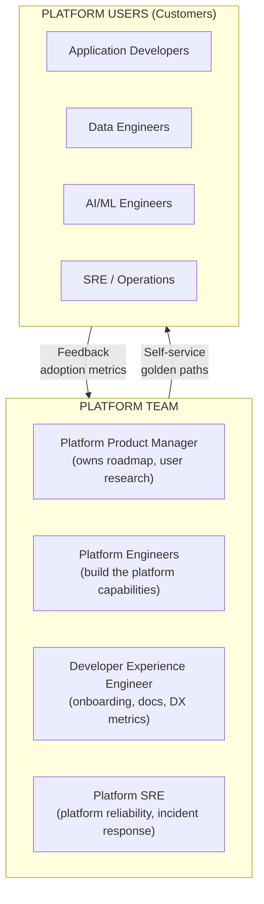
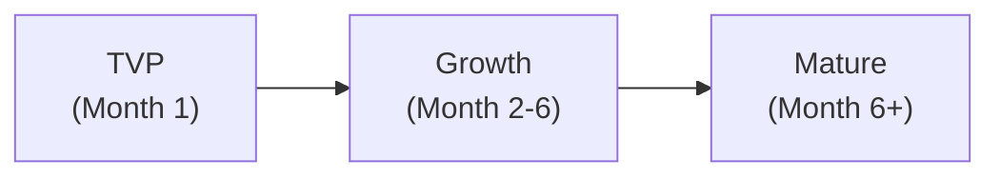
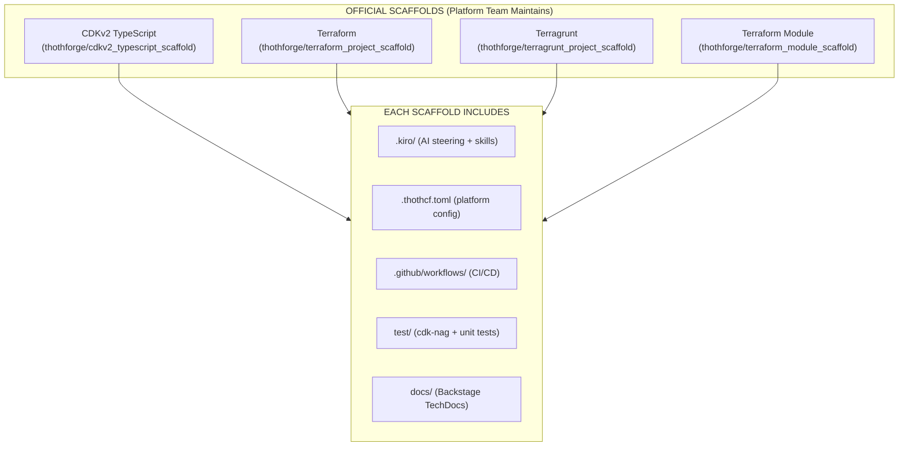
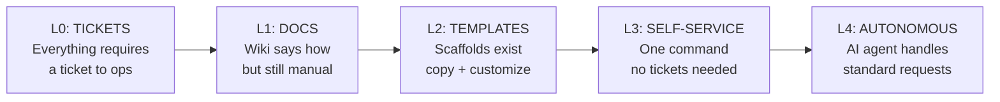
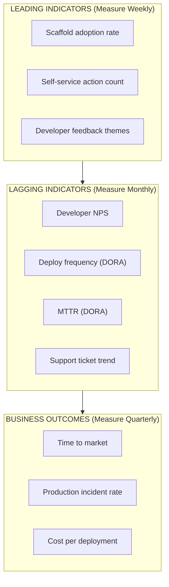
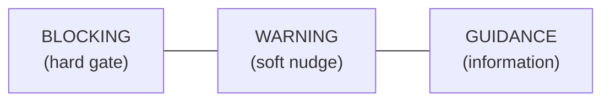
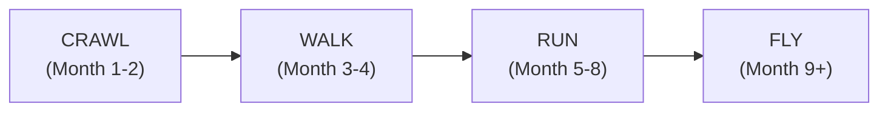

# Platform Engineering Guidelines

## What Is Platform Engineering?

Platform engineering is the discipline of designing and building **self-service capabilities** that enable development teams to deliver software faster, safer, and with less cognitive load — without filing tickets or waiting for another team.

> "Platform engineering improves developer experience, reduces SDLC friction, and eases the cognitive load of complex software architectures." — Gartner

**It is NOT:**
- A rebrand of DevOps or SRE
- Building tools nobody asked for
- A team that says "no" to everything
- A shared services team that becomes a bottleneck

**It IS:**
- Treating infrastructure as a product (with users, roadmap, feedback)
- Paving golden paths that make the right thing the easy thing
- Automating the undifferentiated heavy lifting
- Enabling 10x developer velocity while maintaining governance

---

## The Platform Engineering Manifesto

1. **Product over project** — The platform has users, a roadmap, and a feedback loop
2. **Self-service over tickets** — Developers never wait for another team for standard operations
3. **Golden paths over gatekeeping** — Make the right thing easy; don't just block the wrong thing
4. **Automation over documentation** — If it can be automated, it shouldn't be a wiki page
5. **Enablement over enforcement** — Developers should WANT to use the platform because it helps them
6. **Measured over assumed** — Track adoption, satisfaction, and velocity; don't assume value

---

## Platform Team Structure



### Team Sizing

| Organization Size | Platform Team Size | Ratio |
|-------------------|-------------------|-------|
| < 50 engineers | 2-3 platform engineers | 1:20 |
| 50-200 engineers | 5-8 (+ PM + DX) | 1:25 |
| 200-500 engineers | 10-15 (dedicated team) | 1:30 |
| 500+ engineers | Multiple platform squads | 1:30-40 |

### Key Roles

| Role | Responsibility | Measures |
|------|---------------|----------|
| **Platform Product Manager** | User research, roadmap prioritization, stakeholder alignment | Adoption rate, developer NPS, time-to-value |
| **Platform Engineer** | Build golden paths, CI/CD, scaffolds, automation | Capability coverage, system reliability |
| **Developer Experience Engineer** | Onboarding, documentation, support, DX measurement | Time-to-first-deploy, support ticket volume |
| **Platform SRE** | Platform availability, incident response, capacity | Platform SLO (99.9%+ pipeline availability) |

---

## Platform-as-Product

> The #1 mistake in platform engineering is building capabilities nobody uses. Treat the platform like a product.

### Product Thinking Applied

| Product Concept | Platform Application |
|----------------|---------------------|
| **Users** | Application developers, data engineers, AI engineers |
| **User research** | Developer surveys, shadowing sessions, support ticket analysis |
| **MVP** | Start with one golden path (e.g., deploy a Lambda function) |
| **Roadmap** | Prioritized by adoption impact + developer pain points |
| **NPS** | Quarterly developer satisfaction survey (target: > 40) |
| **Onboarding** | New developer productive in < 1 day |
| **Documentation** | Self-service docs with examples; not "how to file a ticket" |
| **Deprecation** | Old paths deprecated with migration guides; not killed overnight |
| **SLA** | Pipeline availability: 99.9% | Deploy latency: < 5 min (Express: < 30s) |

### The "Thinnest Viable Platform" (TVP)

Start with the minimum that unblocks developers:



| Stage | Capabilities | Tools |
|-------|-------------|-------|
| **TVP** | Scaffold + deploy + basic security | CDKv2 scaffold + `cdk deploy --express` + cdk-nag |
| **Growth** | + CI/CD + observability + cost estimation | + CDK Pipelines + OTEL + ThothCTL scan/check |
| **Mature** | + governance + self-healing + multi-account | + SCPs/RCPs + DevOps Agent + FinOps Agent + CodeArtifact |

---

## Golden Paths

### What Makes a Good Golden Path

A golden path is an **opinionated, pre-configured, self-service workflow** that makes the right architectural decision the default.

| Characteristic | Description |
|---------------|-------------|
| **Opinionated** | Makes choices for the developer (ARM64, DynamoDB on-demand, cdk-nag) |
| **Self-service** | Developer uses it without filing a ticket or asking permission |
| **Documented** | Clear guide on what you get and how to customize |
| **Escapable** | Can "eject" from the golden path when needed (but rarely should) |
| **Maintained** | Updated by platform team; consumers get updates via version bumps |
| **Compliant** | Security, cost, and governance baked in by default |

### Golden Paths in This Framework

| Golden Path | Implementation | What Developer Gets |
|-------------|---------------|---------------------|
| **New serverless project** | `git clone cdkv2_typescript_scaffold` | CDK + cdk-nag + Kiro + AI-DLC + ThothCTL pre-configured |
| **New Lambda function** | `ObservableFunction` L3 construct | ARM64 + Powertools + OTEL + tracing + alarms |
| **New API** | `SecureApi` L3 construct | WAF + auth + logging + throttling + X-Ray |
| **New event processor** | `EventProcessor` L3 construct | SQS + DLQ + Lambda + alarms + idempotency |
| **Security scan** | `thothctl scan iac` | Checkov + Trivy + OPA in one command |
| **Cost estimation** | `thothctl check iac -type cost-analysis` | Monthly cost estimate before deploying |
| **Full pipeline** | CDK Pipelines (from scaffold) | Self-mutating, multi-account, canary deploys |
| **AI development** | AI-DLC steering rules (from scaffold) | "Using AI-DLC, ..." activates structured workflow |

### Scaffold Strategy



---

## Self-Service Capabilities

### What Developers Should Do Without Tickets

| Capability | Self-Service How | Ticket Never |
|-----------|-----------------|--------------|
| Create new project | `thothctl init project` | ~~"Please create a repo for us"~~ |
| Deploy to dev | `cdk deploy --express` | ~~"Please deploy my branch"~~ |
| View logs/traces | CloudWatch + Application Signals | ~~"Can you check the logs?"~~ |
| Run security scan | `thothctl scan iac` | ~~"When will security review our code?"~~ |
| Get cost estimate | `thothctl check iac -type cost-analysis` | ~~"How much will this cost?"~~ |
| Create PR environment | Pipeline auto-creates per PR | ~~"Can you set up a test environment?"~~ |
| Generate docs | `thothctl document iac` | ~~"We need documentation for the module"~~ |
| Add a new service | Use L3 construct from CodeArtifact | ~~"We need infra for a new microservice"~~ |
| Debug production | ECS Exec / CloudWatch Logs Insights | ~~"Can you SSH in and check?"~~ |
| Feature flag | CloudWatch Evidently (self-service) | ~~"Can you toggle the feature?"~~ |

### Self-Service Maturity Levels



**Target: Level 3 minimum.** Level 4 for standard operations (create project, scan, deploy to dev).

---

## Developer Experience (DX) Metrics

### What to Measure

| Metric | Target | How to Measure |
|--------|--------|----------------|
| **Time to First Deploy** | < 1 day from joining team | Track from onboarding start → first prod deploy |
| **Time to Scaffold** | < 5 minutes | From `thothctl init` to running tests |
| **Pipeline Lead Time** | < 1 hour (commit → prod) | Pipeline execution timestamps |
| **Developer NPS** | > 40 | Quarterly survey: "How likely to recommend our platform?" |
| **Self-Service Rate** | > 90% | (Self-service actions) / (total actions including tickets) |
| **Support Ticket Volume** | Decreasing trend | Count tickets to platform team per month |
| **Cognitive Load Score** | Decreasing | Survey: "How much do you think about infrastructure?" |
| **Adoption Rate** | > 80% of new projects | Projects using scaffold / total new projects |
| **Platform Availability** | 99.9% | Pipeline uptime (deploys never blocked by platform) |

### Measuring Platform Success



---

## Platform API Contract

### Everything Must Be Machine-Consumable

In the ADP era, every platform capability must be accessible by both humans AND AI agents:

| Interface | For Humans | For Agents | Implementation |
|-----------|-----------|-----------|----------------|
| **CLI** | `thothctl scan iac` | Same command via MCP tool | ThothCTL CLI |
| **MCP Server** | — | `thothctl_scan_iac` MCP tool | ThothCTL MCP (24 tools) |
| **IaC Constructs** | `new SecureApi(...)` | AI generates construct usage | CDK L3 constructs |
| **Steering Files** | Read `.kiro/steering/` | AI follows rules automatically | Kiro steering |
| **Skills** | Read `.kiro/skills/` | AI uses decision logic | Kiro skills |
| **Templates** | `thothctl init project` | Agent calls same CLI | Template engine |
| **Policies** | `thothctl scan -t opa` | Agent validates against policies | OPA/Rego |

**Principle:** If a capability is only accessible via a UI or a wiki page, it's not platform engineering — it's documentation.

---

## Governance Without Friction

### The Governance Spectrum



| Control | Type | When to Use | Example |
|---------|------|-------------|---------|
| **Hard gate** (blocks deploy) | Blocking | Security critical, compliance mandatory | No public S3, encryption required, no `*` IAM |
| **Soft warning** (allows but warns) | Warning | Best practice, cost optimization | ARM64 recommended, on-demand DynamoDB preferred |
| **Guidance** (informational) | Guide | Suggestions, alternatives | "Consider using ElastiCache for this pattern" |

### Implementation: Layered Enforcement

| Layer | Tool | Friction Level |
|-------|------|---------------|
| IDE (real-time) | cdk-nag warnings in editor | Lowest — developer sees immediately |
| Build (pre-deploy) | ThothCTL scan + OPA policies | Low — fails fast in pipeline |
| Deploy (hard boundary) | SCPs + RCPs | Zero friction — AWS rejects silently |
| Runtime (continuous) | AWS Config + Continuum | None — monitors continuously, alerts/remediates |

**Principle:** Move governance LEFT. The earlier you catch it, the less friction it causes. A cdk-nag warning in the editor is 100x less disruptive than a blocked production deploy.

---

## Platform Maturity Model



| Stage | Platform Capabilities | Developer Experience | Governance |
|-------|----------------------|---------------------|-----------|
| **Crawl** | Scaffolds exist, manual deploy, basic docs | Developers copy scaffold, deploy manually | cdk-nag locally |
| **Walk** | CI/CD pipelines, security scan, observability | Self-service deploy, auto security scan | ThothCTL in pipeline |
| **Run** | Private constructs, multi-account, cost gates, AI-DLC | One command for everything, AI assists development | SCPs + RCPs + OPA policies |
| **Fly** | ADP (agents operate), self-healing, autonomous ops | Agents handle standard work, humans handle exceptions | Continuous compliance, auto-remediation |

---

## ThothCTL as Platform CLI

ThothCTL implements all platform engineering capabilities in a single CLI that works for both humans and AI agents:

```bash
# Foundation Layer
thothctl init env                    # Bootstrap development environment
thothctl init space                  # Create team space (multi-tenancy)
thothctl init project                # Scaffold from golden path template

# Platform Capabilities Layer  
thothctl scan iac                    # Security scanning (Checkov + Trivy + OPA)
thothctl check iac -type cost-analysis  # Cost estimation
thothctl check iac -type blast-radius   # Change impact analysis
thothctl check iac -type drift          # Configuration drift detection
thothctl inventory iac               # Dependency tracking + version checks
thothctl document iac                # Auto-generate documentation
thothctl generate                    # Generate components from rules

# Workflow Layer
thothctl workflow devsecops --phase all  # Full DevSecOps lifecycle

# AI Layer
thothctl mcp                         # Expose all capabilities to AI agents
thothctl ai-review                   # Multi-agent security analysis
```

### Platform Capabilities → ThothCTL Mapping

| Platform Capability | ThothCTL Command | Self-Service? |
|--------------------|-----------------|---------------|
| Project creation | `init project` | ✅ |
| Environment setup | `init env` | ✅ |
| Security scanning | `scan iac` | ✅ |
| Cost estimation | `check iac -type cost-analysis` | ✅ |
| Drift detection | `check iac -type drift` | ✅ |
| Dependency management | `inventory iac --check-versions` | ✅ |
| Documentation | `document iac` | ✅ |
| DevSecOps pipeline | `workflow devsecops` | ✅ |
| AI-powered review | `ai-review` | ✅ |
| Agent integration | `mcp` | ✅ (for AI agents) |

---

## Checklist: Building Your Platform

### Phase 1: Foundation (Crawl)
- [ ] Platform team identified (at least 1 dedicated engineer)
- [ ] First scaffold created (CDKv2 TypeScript)
- [ ] Basic deployment path working (`cdk deploy --express`)
- [ ] cdk-nag running on all projects
- [ ] ThothCTL installed and available to all developers

### Phase 2: Self-Service (Walk)
- [ ] CDK Pipelines deployed (self-mutating)
- [ ] Security scanning in pipeline (ThothCTL)
- [ ] Observability baseline (OTEL + Powertools)
- [ ] Developer onboarding guide written
- [ ] First DX survey conducted

### Phase 3: Product (Run)
- [ ] Platform Product Manager assigned
- [ ] Developer NPS tracked quarterly
- [ ] Private construct library in CodeArtifact
- [ ] Multi-account governance (SCPs + RCPs)
- [ ] Self-service rate > 90%
- [ ] AI-DLC methodology adopted by teams

### Phase 4: Agentic (Fly)
- [ ] ADP architecture implemented (see IDP → ADP doc)
- [ ] Agent paths operational (validate change, PR review)
- [ ] Self-healing patterns active
- [ ] Platform throughput metrics tracked
- [ ] Continuous compliance via Continuum

---

## References

| Resource | Link |
|----------|------|
| Gartner: Platform Engineering for Agentic AI | https://www.gartner.com/en/documents/7963773 |
| Gartner: 80% of Orgs by 2026 | https://www.gartner.com/en/infrastructure-and-it-operations-leaders/topics/platform-engineering |
| PlatformCon 2026 | https://platformcon.com |
| platformengineering.org | https://platformengineering.org |
| ThothCTL Framework Architecture | https://thothctl.readthedocs.io/en/latest/framework/framework_architecture/ |
| ThothCTL DevSecOps Quick Start | https://thothctl.readthedocs.io/en/latest/framework/use_cases/devsecops_quickstart/ |
| CDKv2 TypeScript Scaffold | https://github.com/thothforge/cdkv2_typescript_scaffold |
| Internal Developer Platform (definition) | https://internaldeveloperplatform.org/what-is-an-internal-developer-platform/ |
