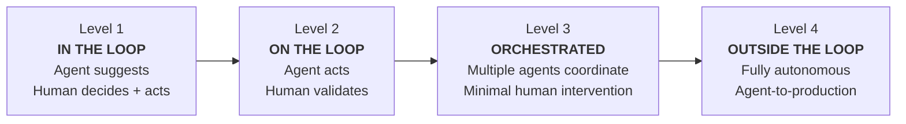
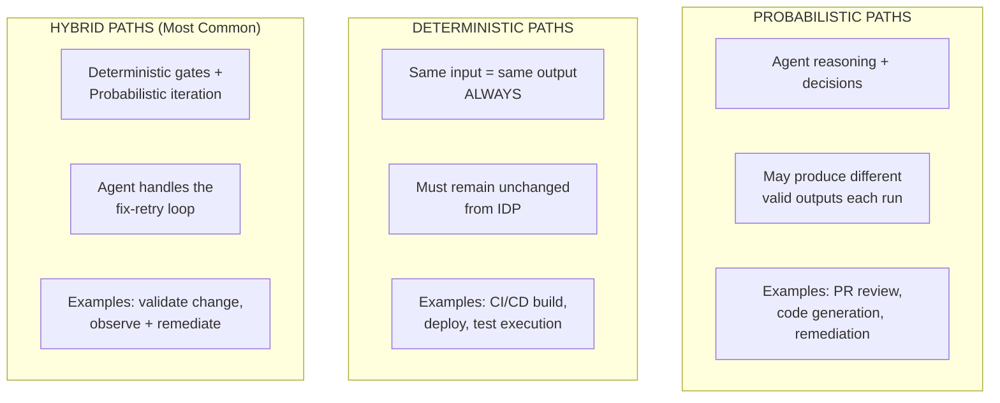
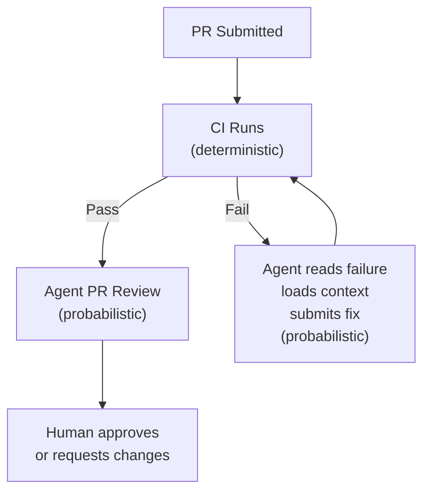
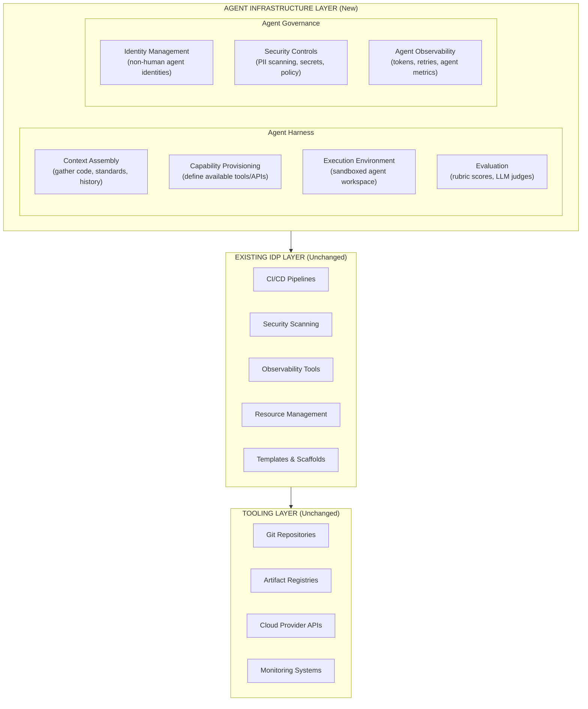

# Platform Engineering: From IDP to ADP

## The Evolution: Internal Developer Platform → Agentic Development Platform

> "Everything that you have done in your IDP is indeed the foundation of how everything is going to work in the future." — Ajay Chankramath, PlatformCon 2026

The platform engineering discipline is evolving from building platforms **for human developers** to building platforms that support **human developers and autonomous AI agents working side by side**.

**Key insight from PlatformCon 2026:** You don't tear down your IDP and start over. You **extend** it into an Agentic Development Platform (ADP).

---

## IDP vs ADP

| Dimension | IDP (Internal Developer Platform) | ADP (Agentic Development Platform) |
|-----------|----------------------------------|-------------------------------------|
| **Users** | Human developers | Humans + AI agents |
| **Triggers** | Human initiates workflows | Humans OR agents initiate workflows |
| **Paths** | Deterministic only (CI/CD, deploy) | Deterministic + Probabilistic + Hybrid |
| **Governance** | IAM roles for humans | + Non-human identities for agents |
| **Evaluation** | Tests pass/fail | + LLM judges, rubric scores, agent eval |
| **Observability** | App metrics + traces | + Token usage, retry counts, agent-specific metrics |
| **IDE dependency** | IDE is the primary interface | IDE becomes optional; platform is the control plane |
| **Throughput** | Individual developer productivity | System-level throughput (parallel agent workflows) |

---

## The Four Levels of Agentic Maturity

> Source: PlatformCon 2026 — "The Four Levels of Agentic Development"



| Level | Agent Role | Human Role | Platform Requirements | Example |
|-------|-----------|------------|----------------------|---------|
| **L1: In the Loop** | Autocomplete, suggestions | Full control | Basic IDE plugins | Kiro code suggestions |
| **L2: On the Loop** | Executes tasks, creates PRs | Validates results, approves | Agent identity, dispatch, eval | Agent fixes failing tests, human merges |
| **L3: Orchestrated** | Multiple agents coordinate | Exception handling only | Full agent infrastructure, governance | Agent reviews PR + runs tests + deploys to dev |
| **L4: Outside the Loop** | End-to-end autonomous | Sets policies, monitors | Self-healing, full governance, audit | Agent hears customer issue → fixes → ships to prod |

### Where Most Organizations Are

- **94%** of organizations have adopted or plan to adopt platform engineering (Frontiers in Computer Science, 2026)
- **Most teams** are between Level 1 and Level 2
- **Front-runners** are approaching Level 3-4 for specific workflows
- **Gartner predicts** by 2027, 65%+ of engineering teams using agentic coding will treat IDEs as optional

---

## The Three Path Types

Every workflow in an ADP falls into one of three categories:



### Hybrid Path Example: Validate Change



**In traditional IDP:** Human reads CI failure → debugs → fixes → pushes → waits for CI again (hours)
**In ADP:** Agent reads failure → fixes → resubmits → CI passes (seconds/minutes)

---

## ADP Reference Architecture

> Source: PlatformCon 2026 — Kaspar von Grünberg & Luca Galante



**Key insight:** The platform does ~90% of the work in agentic workflows. The AI model handles ~10% (the reasoning). Everything else is orchestration, context assembly, evaluation, and governance — platform engineering territory.

---

## The Eight Core Paths

| # | Path | Type | Description | Framework Implementation |
|---|------|------|-------------|-------------------------|
| 1 | **Dispatch Work** | Probabilistic | Route signals to right agents/humans | EventBridge → agent routing rules |
| 2 | **Retrieve Context** | Deterministic | Assemble relevant information | ThothCTL MCP + Kiro steering files |
| 3 | **Implement Code** | Probabilistic | Generate/modify code | Kiro + AI-DLC (Construction phase) |
| 4 | **Validate Change** | Hybrid | Deterministic gates + agent iteration | CI + ThothCTL scan + agent fix loop |
| 5 | **Promote Change** | Hybrid | Merge, approve, release | CDK Pipelines + DevOps Agent review |
| 6 | **Deploy** | Deterministic | Provision and deploy (MUST stay deterministic) | `cdk deploy --express` / CDK Pipelines |
| 7 | **Observe** | Hybrid | Monitor production + infer issues | OTEL + Application Signals + DevOps Agent |
| 8 | **Remediate** | Probabilistic | Diagnose and fix production issues | DevOps Agent + Continuum auto-fix |

### Where to Start: Two Paths

> "Start with validate change and PR review." — Ajay Chankramath

These two paths force you to build the essential agent infrastructure with low risk:
- **Validate change** → builds: agent identity, dispatch, execution environment, evaluation
- **PR review** → only writes comments (worst case: inconsistent feedback, not broken production)

---

## IDP → ADP Roadmap (Implementation)

### Stage 1: IDP Foundation (You May Already Have This)

```bash
# The existing IDP — golden paths for humans
thothctl init env                          # Environment setup
thothctl init project --project-type cdkv2 # Project scaffold
thothctl workflow devsecops --phase all     # DevSecOps pipeline
# CDK Pipelines, cdk-nag, security scanning, canary deploys
```

**What exists:** Templates, CI/CD, security scanning, observability, deployment automation.

### Stage 2: Agent-Ready IDP (Add Agent Support)

```bash
# Add AI-DLC workflow rules
# Install aidlc-workflows steering files for Kiro
cp -R aidlc-rules/aws-aidlc-rules .kiro/steering/

# Add ThothCTL MCP server (agents can call platform tools)
thothctl mcp  # Exposes 24 tools via MCP for AI agents

# Configure non-human identity for agents
# Agents get their own IAM roles with permission boundaries
```

**What's added:** AI-DLC methodology, MCP integration, Kiro steering, agent-accessible platform tools.

### Stage 3: Agentic Paths (Level 2 — On the Loop)

```bash
# Path: Validate Change (hybrid)
# Agent iterates on CI failures automatically
# Human approves final result

# Path: PR Review (probabilistic)
# DevOps Agent reviews every PR for release readiness
# Agent posts findings; human makes merge decision

# Path: Remediate (probabilistic)
# DevOps Agent investigates incidents autonomously
# Posts root cause + mitigation steps
# Human approves remediation actions
```

**What's added:** Agents execute tasks, humans validate. Two core paths operational.

### Stage 4: Full ADP (Level 3-4 — Orchestrated/Autonomous)

```bash
# Multiple agents coordinate:
# - Kiro generates code
# - ThothCTL validates (scan, cost, blast radius)
# - DevOps Agent reviews for release readiness
# - CDK Pipeline deploys with canary
# - DevOps Agent monitors post-deploy
# - FinOps Agent watches costs
# - Continuum runs continuous pen testing

# Self-healing platform:
# - Agent detects drift → auto-remediates
# - Agent detects cost anomaly → auto-right-sizes
# - Agent detects security finding → auto-patches
```

**What's added:** Multi-agent orchestration, self-healing, minimal human intervention for standard workflows.

---

## How This Framework Maps to the ADP

| ADP Component | This Framework's Implementation |
|---------------|-------------------------------|
| **Tooling Layer** | AWS services (Lambda, ECS, DynamoDB, EventBridge) |
| **IDP Layer** | ThothCTL (scan, check, workflow, generate) + CDK Pipelines + scaffolds |
| **Agent Harness: Context** | Kiro steering files + `.kiro/skills/` + MCP servers |
| **Agent Harness: Capabilities** | ThothCTL MCP (24 tools) + AWS MCP Server |
| **Agent Harness: Execution** | AgentCore Runtime (serverless agent execution) |
| **Agent Harness: Evaluation** | cdk-nag + ThothCTL scan + DevOps Agent release review |
| **Agent Governance: Identity** | AgentCore Identity (Cedar policies) + IAM permission boundaries |
| **Agent Governance: Security** | Bedrock Guardrails + Continuum + OPA policies |
| **Agent Governance: Observability** | AgentCore Observability + OTEL + Application Signals |

---

## Gartner Predictions (2026)

| Prediction | Implication |
|-----------|-------------|
| "By 2027, 65%+ of engineering teams using agentic coding will treat IDEs as optional" | Platform becomes the control plane, not the IDE |
| "80% of large orgs will have platform engineering teams by 2026" | IDP is table stakes; ADP is the differentiator |
| "Only 17% have deployed AI agents, but 60%+ expect to within 2 years" | Window to build agent infrastructure is NOW |
| "Platform engineering must deliver machine-consumable building blocks with embedded governance" | Everything must be API/MCP accessible, not just UI-accessible |

---

## Platform Engineering Checklist: IDP → ADP

### IDP Foundation (Stage 1)
- [ ] Project scaffolds (cdkv2_typescript_scaffold)
- [ ] CI/CD pipelines (CDK Pipelines, self-mutating)
- [ ] Security scanning (ThothCTL + cdk-nag)
- [ ] Deployment automation (canary + Express mode)
- [ ] Observability (OTEL + Powertools + Application Signals)
- [ ] Documentation automation (ThothCTL document)
- [ ] Cost estimation (ThothCTL check --cost-analysis)

### Agent-Ready IDP (Stage 2)
- [ ] AI-DLC workflow rules installed (.kiro/steering/)
- [ ] ThothCTL MCP server available for agents
- [ ] Kiro skills distributed via scaffolds
- [ ] Non-human agent identities configured (IAM + permission boundaries)
- [ ] Agent observability enabled (token tracking, retry monitoring)

### Agentic Paths (Stage 3)
- [ ] Validate Change path operational (agent fixes CI failures)
- [ ] PR Review path operational (DevOps Agent reviews)
- [ ] Agent dispatch mechanism working (route work to right agent)
- [ ] Evaluation framework in place (rubric scores for agent output)
- [ ] Human approval gates defined per path

### Full ADP (Stage 4)
- [ ] Multi-agent orchestration (Kiro + ThothCTL + DevOps Agent + Continuum)
- [ ] Self-healing platform (drift detection → auto-remediation)
- [ ] Autonomous cost optimization (FinOps Agent → right-sizing)
- [ ] Continuous security validation (Continuum → auto-patch)
- [ ] Throughput metrics tracked (not just individual productivity)

---

## References

| Resource | Link |
|----------|------|
| PlatformCon 2026: Architecting ADPs | https://platformcon.com/sessions/architecting-agentic-development-platforms |
| PlatformCon 2026: Four Levels of Agentic Development | https://platformcon.com/sessions/the-four-levels-of-agentic-development |
| PlatformCon 2026: Building IDPs for AI Era | https://platformcon.com/sessions/building-internal-developer-platforms-for-the-ai-era |
| Platform Engineering: How to Architect ADPs | https://platformengineering.org/events/how-to-architect-agentic-development-platforms-2026-06-18 |
| Platform Weekly: The ADP is Coming | https://platformweekly.com/p/the-adp-is-coming-your-idp-better-be-ready |
| Gartner: Agentic AI Readiness Requires PE | https://www.gartner.com/en/documents/7963773 |
| Gartner: Maturity Model for AI-Native SE | https://www.gartner.com/en/documents/7586633 |
| Gartner: 2026 Hype Cycle for Agentic AI | https://www.gartner.com/en/articles/hype-cycle-for-agentic-ai |
| ThothCTL Framework Architecture | https://thothctl.readthedocs.io/en/latest/framework/framework_architecture/ |
