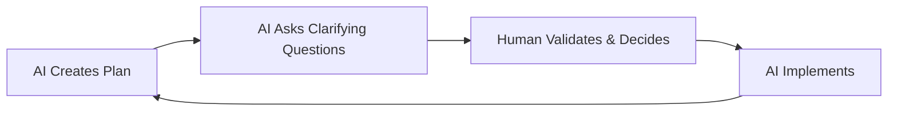
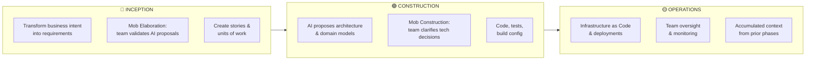
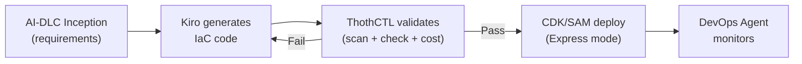
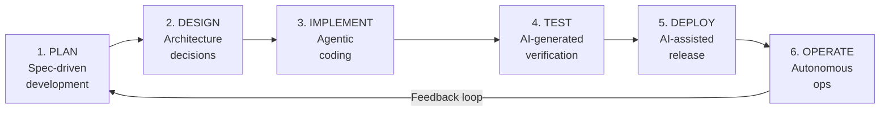
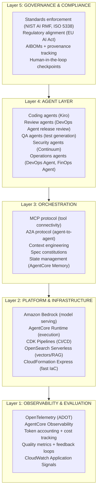
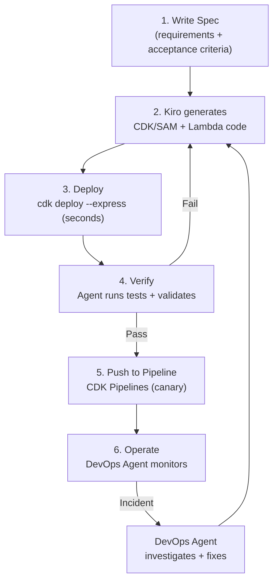

# AI-SDLC — The Agentic Software Development Lifecycle (2026)

## AWS AI-DLC: AI-Driven Development Life Cycle

**AI-DLC** is AWS's official AI-centric methodology for software development, created by the AWS Developer Transformation team. It is now open-source (v2.0 GA) and available as workflow steering rules for any AI coding agent.

> **References:**
> - [AI-DLC Blog](https://aws.amazon.com/blogs/devops/ai-driven-development-life-cycle/) — AWS DevOps Blog (Jul 2025)
> - [AI-DLC White Paper](https://prod.d13rzhkk8cj2z0.amplifyapp.com/) — Full methodology specification
> - [awslabs/aidlc-workflows](https://github.com/awslabs/aidlc-workflows) — Open-source workflow rules (3.7k ⭐, 627 forks)

### What Is AI-DLC?

AI-DLC is an **AI-centric transformative approach** that positions AI as a central collaborator and teammate in development, not just an assistant. It operates through two dimensions:

1. **AI-Powered Execution with Human Oversight** — AI creates plans, seeks clarification, and implements; humans make critical decisions
2. **Dynamic Team Collaboration** — As AI handles routine tasks, teams unite in collaborative "mob" sessions for real-time problem-solving

### The AI-DLC Mental Model



This pattern repeats rapidly for every SDLC activity.

### Three Phases of AI-DLC



| Phase | Determines | Key Activity | AWS Tools |
|-------|-----------|-------------|-----------|
| **Inception** | WHAT to build and WHY | Mob Elaboration — team validates AI's questions and proposals | Kiro specs + hooks |
| **Construction** | HOW to build it | Mob Construction — team provides clarification on technical/architectural choices | Kiro + CDK + Express mode |
| **Operations** | HOW to run it | AI applies accumulated context to manage IaC and deployments with team oversight | CDK Pipelines + DevOps Agent |

### AI-DLC Key Terminology

| Traditional | AI-DLC | Difference |
|------------|--------|-----------|
| Sprints (weeks) | **Bolts** (hours/days) | Shorter, more intense work cycles |
| Epics | **Units of Work** | Parallel-friendly decomposition |
| Planning meetings | **Mob Elaboration** | Real-time collaborative validation with AI |
| Code reviews | **Mob Construction** | Team validates AI's technical proposals in real-time |

### AI-DLC Tenets

1. **No duplication** — Source of truth in one place; generate from source rather than maintain copies
2. **Methodology first** — AI-DLC is a methodology, not a tool; no installation required
3. **Reproducible** — Rules clear enough that different models produce similar outcomes
4. **Agnostic** — Works with any IDE, agent, or model (Kiro, Cursor, Claude Code, Copilot, Cline, Q Developer, Codex)
5. **Human in the loop** — Critical decisions require explicit user confirmation; agent proposes, human approves

### Setting Up AI-DLC with Kiro

```bash
# Download latest release
curl -sL https://api.github.com/repos/awslabs/aidlc-workflows/releases/latest \
  | grep -o '"browser_download_url": *"[^"]*"' \
  | head -1 | cut -d'"' -f4 | xargs curl -Lo /tmp/aidlc.zip

# Extract and install
unzip -o /tmp/aidlc.zip -d /tmp/aidlc-release
mkdir -p .kiro/steering
cp -R /tmp/aidlc-release/aidlc-rules/aws-aidlc-rules .kiro/steering/
cp -R /tmp/aidlc-release/aidlc-rules/aws-aidlc-rule-details .kiro/

# Project structure:
# <project-root>/
#   ├── .kiro/
#   │   ├── steering/
#   │   │   └── aws-aidlc-rules/    ← Core workflow rules
#   │   └── aws-aidlc-rule-details/  ← Detailed rules
```

### Using AI-DLC

Start any project by stating your intent with **"Using AI-DLC, ..."** in the chat:

```
Using AI-DLC, build a serverless order processing API with DynamoDB and EventBridge
```

AI-DLC automatically:
1. Activates the three-phase workflow
2. Asks structured clarifying questions
3. Generates execution plan for your review
4. Creates all artifacts in `aidlc-docs/` directory
5. Proceeds through Inception → Construction → Operations with your approval at each gate

### ThothCTL MCP Integration with AI-DLC

ThothCTL provides a Model Context Protocol (MCP) server that connects AI coding agents (Kiro, Claude Code, Cursor) directly to IaC validation, scanning, and DevSecOps workflows.

```bash
# Start ThothCTL MCP server for AI agent integration
thothctl mcp

# AI agents can then use natural language:
# "Scan this terraform for security issues"
# "What's the cost estimate for this infrastructure?"
# "Check for drift in my production environment"
# "Generate documentation for this module"
```

#### AI-DLC + ThothCTL Workflow



#### AI Security Review

ThothCTL's multi-agent AI review system uses specialized agents for IaC analysis:

```bash
# Multi-agent security analysis
thothctl ai-review --mode orchestrate --agents security architecture fix decision

# Modes:
# analyze  — Security analysis of IaC
# decide   — Automated pass/fail decision
# improve  — Generate fixes for violations
# orchestrate — Run all agents in sequence
```

ThothCTL can deploy these review agents to **Amazon Bedrock AgentCore** for production-grade, serverless execution.

### AI-DLC Extensions

AI-DLC supports layered extensions for organizational standards:

| Extension | Purpose |
|-----------|---------|
| `security/baseline/` | Security rules (blocking — must pass before proceeding) |
| `testing/property-based/` | Property-based testing rules |
| `resiliency/baseline/` | Resilience best practices |
| Custom | Add your own org-specific rules |

### AI-DLC Supporting Tools

| Tool | Purpose |
|------|---------|
| [aidlc-evaluator](https://github.com/awslabs/aidlc-workflows/tree/main/scripts/aidlc-evaluator) | Automated testing/validation of AI-DLC workflows |
| [sample-aidlc-design-reviewer](https://github.com/aws-samples/sample-aidlc-design-reviewer) | Multi-agent design review (Critique, Alternatives, Gap Analysis) |
| [sample-aidlc-traceability](https://github.com/aws-samples/sample-aidlc-traceability) | Traceability matrices from requirements → design → code |
| [sample-aidlc-code-reviewer](https://github.com/aws-samples/sample-aidlc-code-reviewer) | Agent-native code review with static + AI analysis |

---

## The Broader AI-SDLC Landscape

AWS AI-DLC is the official AWS methodology. The broader industry has converged on similar principles under the term **Agentic SDLC (A-SDLC)**. Below we cover the industry-wide framework that aligns with and extends AI-DLC concepts.

### What Is the A-SDLC?

The **Agentic Software Development Lifecycle (A-SDLC)** is a lifecycle in which the canonical SDLC phases are executed by an ensemble of collaborating, role-specialized AI agents, orchestrated through explicit protocols (MCP, A2A) and human-in-the-loop oversight.

### The Shift

| Traditional SDLC | AI-SDLC (2026) |
|-----------------|----------------|
| Humans write code, AI suggests | AI agents execute multi-step workflows autonomously |
| Manual review of every line | Agents generate, humans verify and approve |
| CI/CD runs tests | Agents generate tests, run them, and fix failures |
| Ops responds to incidents | Agents detect, investigate, and remediate autonomously |
| Developers own the full cycle | Developers become **orchestrators and decision-makers** |

---

## The Six Stages of the AI-Native SDLC



### Stage 1: Planning — Specifications Become the Control Plane

| Activity | Agent Role | Human Role |
|----------|-----------|------------|
| Ticket analysis | Generates structured plans, identifies open questions | Reviews decomposition, validates scope |
| Requirements extraction | Collects from meetings, docs via NLP | Validates business intent, resolves ambiguities |
| Effort estimation | Produces estimates with justifications | Evaluates, provides calibrating feedback |
| Specification authoring | Drafts layered specs from intent | **Approves specs** — the control plane for all downstream agents |

**Key shift:** Requirements quality becomes the delivery bottleneck. Faster agent implementation exposes planning constraints that human teams previously absorbed later.

**AWS Implementation:** Kiro's specs and hooks → structured requirements that guide agent execution through the entire lifecycle.

### Stage 2: Design — Architecture Requires Explicit Human Review

AI agents now make framework, infrastructure, and integration choices faster than review processes can govern them. Every AI-generated design decision must be treated as an architectural decision.

| Architectural Area | Why Human Review Matters |
|-------------------|------------------------|
| Framework selection | Changes long-term implementation constraints |
| Infrastructure scaffolding | Sets platform and deployment assumptions |
| Integration wiring | Creates cross-system dependencies that outlast the prompt |
| Data model design | Determines scalability and access patterns permanently |

**Key shift:** An "intent engineer" role emerges — translating ambiguous business goals into testable specifications.

**AWS Implementation:** CDK L3 constructs encode approved architectural patterns → agents generate within approved boundaries.

### Stage 3: Implementation — Developers Become Orchestrators

Agentic Software Development (ASD) means agents plan, generate, modify, test, and explain software across multiple files and services. Developers spend more time **reviewing plans, validating outputs, and setting boundaries**.

| Before (2023) | After (2026) |
|--------------|-------------|
| Developer writes code | Agent writes code, developer reviews |
| Developer runs tests | Agent generates + runs tests, developer validates |
| Developer creates PR | Agent creates PR with description + test results |
| Developer debugs | Agent proposes fix with root cause analysis |

**Key shift:** Developer value bifurcates — AI absorbs code translation faster than it absorbs business judgment.

**AWS Implementation:** Kiro generates CDK/SAM code → deploys via Express mode (seconds) → validates → iterates.

### Stage 4: Testing — Specification Governance Is Central

The core risk in AI-SDLC testing: **circular validation** — AI-generated tests inherit the same assumptions as AI-generated code, confirming implementation instead of verifying behavior against specs.

| Testing Capability | Agent Maturity | Human Role |
|-------------------|---------------|------------|
| Self-healing test locators | Production-ready | Monitor false-positive rates |
| Test generation from specs | Functional (requires spec quality) | Author and maintain specifications |
| Autonomous test strategy | Emerging | Define risk-based strategy, review coverage |
| Circular validation prevention | Requires architectural controls | **Ensure tests derive from specs, not from code** |

**Key shift:** QA becomes specification governance — humans must keep AI-generated tests grounded in requirements, not in implementation.

**AWS Implementation:** SAM local testing → Agent-generated integration tests → Express deploy → Smoke tests via CodeDeploy hooks.

### Stage 5: Deployment — Throughput Gains Need Stronger Controls

DORA 2025 found: AI adoption shows positive relationship with throughput but **negative relationship with stability**. Change failure rates increase with AI adoption unless proper controls exist.

| DORA Metric | Impact of AI | Mitigation |
|-------------|-------------|------------|
| Deployment Frequency | Increases ✅ | Express mode enables multiple/day |
| Lead Time for Changes | Decreases ✅ | Seconds with Express mode |
| Change Failure Rate | **Increases ⚠️** | Canary deploys + auto-rollback |
| Time to Restore | Depends on controls | AWS DevOps Agent (auto-investigation) |

**Key shift:** Stronger rollback controls and canary deploys become non-negotiable as deployment velocity increases.

**AWS Implementation:** CDK Pipelines + Canary (`Canary10Percent5Minutes`) + CloudWatch Alarms + auto-rollback.

### Stage 6: Operations — Autonomous Detection and Remediation

AI agents detect incidents, suggest remediation, and learn from operational patterns. Human work concentrates on exceptions, hardening, and shifting risk management earlier.

| Operations Area | Agent Contribution | Human Focus |
|----------------|-------------------|-------------|
| Incident response | Detection + remediation | Exception handling |
| Repeated failures | Learned remediation patterns | Infrastructure hardening |
| Postmortems | Analysis support | Risk management earlier in lifecycle |
| Cost management | Anomaly detection + attribution | Strategic cost decisions |

**Key shift:** SRE work moves earlier in the lifecycle — AI handles detection and mitigation, humans focus on prevention.

**AWS Implementation:** AWS DevOps Agent (incident RCA) + AWS FinOps Agent (cost) + AWS Continuum (security).

---

## Five-Layer Reference Architecture



---

## New Roles in the AI-SDLC

| Role | Responsibility | Emerging At |
|------|---------------|-------------|
| **Intent Engineer** | Translates ambiguous business goals into testable specs for agents | All teams |
| **AI Workflow Orchestrator** | Designs and manages multi-agent workflows | Platform teams |
| **Agent Governance Lead** | Defines policies, review gates, audit trails for AI agents | Enterprise |
| **Spec-Driven QA Engineer** | Ensures tests derive from specifications, prevents circular validation | QA teams |
| **AgentOps Engineer** | Manages agent runtime, observability, cost, and performance | SRE teams |

---

## Anti-Patterns in AI-SDLC

| Anti-Pattern | Failure Mechanism | Prevention |
|-------------|-------------------|-----------|
| **Tool sprawl** | Disconnected AI tools create decision-making toil and trapped knowledge | Unified platform (AgentCore + shared context) |
| **Review bottleneck cascade** | Agents generate PRs faster than humans can review | Context-aware automated review + approval gates |
| **Circular validation** | AI tests confirm AI code assumptions, not business requirements | Tests must derive from specs, not implementation |
| **Shadow AI** | Uncontrolled agent use in production repos | Governance layer + AgentCore Identity (Cedar policies) |
| **Verification tax** | Time saved coding is re-spent auditing unverifiable output | Structured specs + agent observability traces |
| **Agentic debt** | Moving fast without governance → hard-to-reverse architectural decisions | Governance layer before autonomy; architecture reviews |

---

## AI-SDLC Applied to AWS Serverless

### The Kiro-Driven Development Loop



### AWS Services Mapped to AI-SDLC Layers

| AI-SDLC Layer | AWS Services |
|---------------|-------------|
| **Governance** | Bedrock Guardrails, AgentCore Identity (Cedar), IAM, CloudTrail |
| **Agent Layer** | Kiro (coding), DevOps Agent (release + ops), FinOps Agent (cost), Continuum (security) |
| **Orchestration** | AgentCore Gateway (MCP), A2A protocol, AgentCore Memory, Step Functions |
| **Platform** | Bedrock, AgentCore Runtime, Lambda, CDK + Express, DynamoDB, EventBridge |
| **Observability** | ADOT (OpenTelemetry), AgentCore Observability, Application Signals, CloudWatch |

---

## The Amplifier Effect (DORA 2025)

> "AI's primary role is an amplifier of existing organizational strengths and weaknesses."

| If You Have... | AI Will... |
|---------------|-----------|
| Strong architecture reviews | Help agents generate correct-by-default code within approved patterns |
| Weak test coverage | Generate more untested code faster (higher failure rates) |
| Good governance controls | Enable safe autonomy expansion |
| No review boundaries | Amplify chaos — more PRs, more drift, more debt |
| Disciplined engineering culture | Compound productivity gains |
| Weak delivery practices | Create technical debt at machine speed |

**Before scaling agents, stress-test:**
1. Are architecture reviews rigorous enough?
2. Is test coverage strong enough?
3. Are governance controls explicit?
4. Are deployment controls (canary, rollback) in place?

---

## AI-SDLC Adoption Tiers (PwC Framework)

| Tier | AI Coverage | Characteristics |
|------|-------------|----------------|
| **Observer** | ≤1 SDLC stage | AI-assisted coding only (autocomplete) |
| **Experimenter** | 2-3 stages | AI in coding + testing + some deployment |
| **Integrator** | 4-5 stages | AI across most of SDLC with governance |
| **Pioneer** | ≥6 stages | Full AI-native SDLC with autonomous agents |

### AWS Serverless Pioneer Stack

To reach **Pioneer** tier with AWS:
- **Plan:** Kiro specs + hooks
- **Design:** CDK L3 constructs (approved patterns)
- **Implement:** Kiro code generation + Express deploy
- **Test:** Agent-generated tests + SAM local + Continuum security
- **Deploy:** CDK Pipelines + canary + DevOps Agent release review
- **Operate:** DevOps Agent (incidents) + FinOps Agent (cost) + Continuum (security)

---

## AI-SDLC Readiness Checklist

### Foundation (Before Scaling Agents)
- [ ] Architecture review process defined and enforced
- [ ] Test coverage sufficient to catch agent-generated regressions
- [ ] Governance controls explicit (who approves what)
- [ ] Deployment controls in place (canary, rollback, alarms)
- [ ] Observability baseline (traces, metrics, logs) working

### Agent Enablement
- [ ] Specifications are the control plane (not verbal instructions)
- [ ] Kiro configured with project context and coding standards
- [ ] CDK L3 constructs encode approved architectural patterns
- [ ] AgentCore Gateway exposes tools via MCP
- [ ] Express mode enabled for rapid agent iteration

### Governance
- [ ] Human review gates defined per SDLC stage
- [ ] Bedrock Guardrails on all AI-generated content
- [ ] AgentCore Identity (Cedar policies) for agent authorization
- [ ] Audit trail: every agent action emits structured events
- [ ] AIBOM tracking for AI-generated artifacts

### Operations
- [ ] AWS DevOps Agent deployed for incident investigation
- [ ] AWS FinOps Agent enabled for cost monitoring
- [ ] AWS Continuum configured for continuous security
- [ ] Custom SRE agents for recurring operational tasks
- [ ] Feedback loops from operations back to specifications
