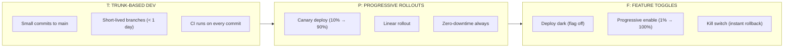
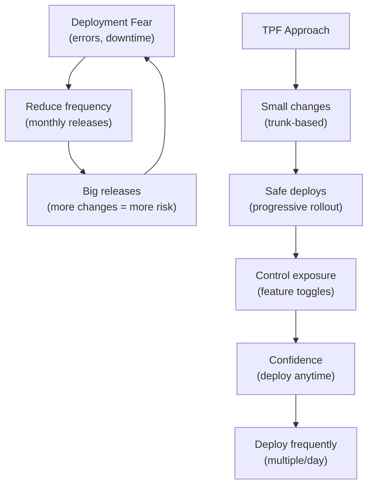
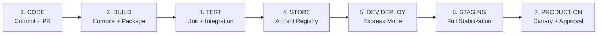
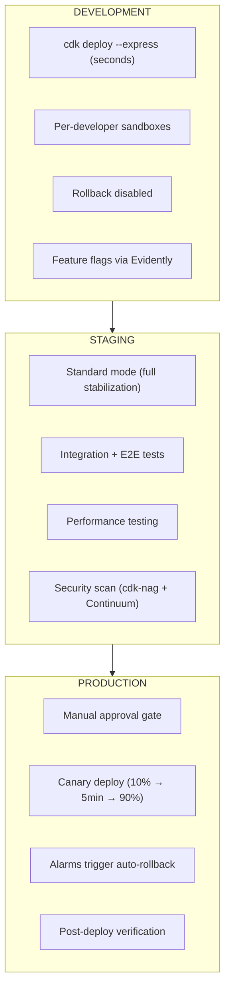
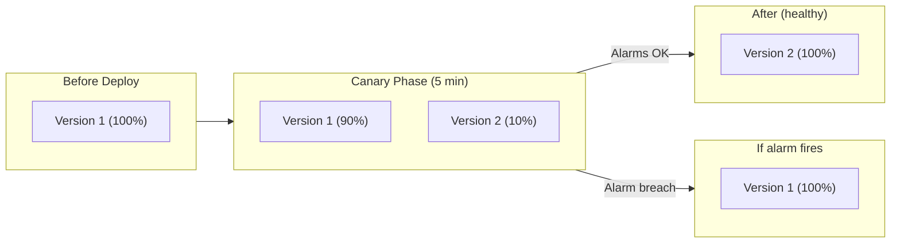
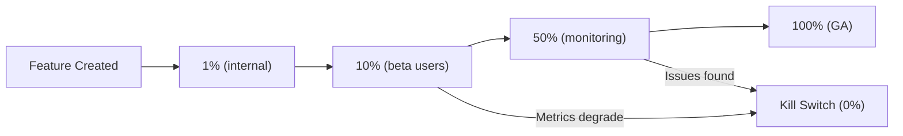

# DevOps & CI/CD — Enterprise Practices 2026

## TPF: Trunk-Based Development + Progressive Rollouts + Feature Toggles

**TPF** is Octopus Deploy's framework for achieving Continuous Delivery. It addresses the root problem: when deployments are inconsistent and error-prone, companies reduce deployment frequency (monthly/quarterly releases), which ironically **increases** risk. The solution is making deployments consistent, predictable, and reliable — then changing how you introduce work into the pipeline.

> **Source:** [Achieving Continuous Delivery with TPF](https://i.octopus.com/whitepapers/achieving-continuous-delivery-with-tpf.pdf) — Octopus Deploy

### What TPF Means

| Letter | Practice | Description |
|--------|----------|-------------|
| **T** | **Trunk-Based Development** | Make small, incremental changes directly to main/trunk instead of long-lived feature branches. Every commit is integration-ready. |
| **P** | **Progressive Rollouts** | Deploy small incremental changes frequently with zero-downtime strategies (canary, linear, blue/green). Each deployment is low-risk because the change is small. |
| **F** | **Feature Toggles** | Use feature flags to support multiple work streams and get fast feedback in production. Features are deployed dark, then toggled on progressively. |

### How TPF Works Together



### TPF Applied to AWS Serverless

| TPF Practice | AWS Implementation |
|-------------|-------------------|
| **Trunk-based dev** | Short-lived branches → PR → merge to `main`; `main` triggers CDK Pipeline |
| **Progressive rollouts** | Lambda alias + CodeDeploy canary (`Canary10Percent5Minutes`) |
| **Feature toggles** | CloudWatch Evidently (progressive rollout, A/B testing, kill switch) |

### Why TPF Solves Deployment Fear



---

## The Ten Pillars of Pragmatic Deployments

Beyond TPF, Octopus Deploy defines **Ten Pillars** that ensure deployments are enterprise-grade. These pillars shape how modern teams deploy serverless applications reliably.

---

## I. The Ten Pillars

### Pillar 1: Repeatable Deployments

> **"Deploy the same thing, in the same way, every time."**

A release must capture a snapshot of:
1. The **application version** (immutable artifact)
2. The **deployment process** (versioned pipeline definition)
3. The **variables** for the target environment
4. The **scripts** that support deployment and configuration

| Principle | AWS Serverless Implementation |
|-----------|-------------------------------|
| Same artifact to all environments | Single CDK/SAM package deployed via CDK Pipelines to dev → staging → prod |
| Versioned deployment process | CDK Pipelines self-mutating; SAM Pipelines from `samconfig.toml` |
| Environment-specific config only | SSM Parameter Store + Secrets Manager per environment |
| No manual steps in deployment | Fully automated `cdk deploy --express` (dev) / canary (prod) |

### Pillar 2: Verifiable Deployments

> **"Confidence increases as releases progress through environments."**

| Test Type | When | AWS Implementation |
|-----------|------|-------------------|
| Unit tests | Build (CI) | CodeBuild / GitHub Actions |
| Integration tests | Post-deploy (dev) | Lambda invocations against real services |
| End-to-end tests | Post-deploy (staging) | Step Functions test workflows |
| Smoke tests | Post-deploy (prod canary) | CodeDeploy pre/post-traffic hooks |
| Chaos tests | Periodic (staging) | AWS Fault Injection Service |
| Security tests | Build + deploy | cdk-nag + Continuum code scanning |

### Pillar 3: Seamless Deployments

> **"Users should not notice when you deploy."**

| Strategy | Risk | Use When (Serverless) |
|----------|------|-----------------------|
| **Canary** (recommended) | Low | Default for Lambda production (10% → 5 min → 90%) |
| **Linear** | Low | High-risk changes (10% every 1-10 minutes) |
| **Blue/Green** | Medium | Full stack swaps, database migrations |
| **Feature flags** | Very low | Progressive feature rollout (CloudWatch Evidently) |
| **All-at-once** | ❌ High | Never in production |

**AWS Implementation:**
```yaml
# SAM — Canary deployment
MyFunction:
  Type: AWS::Serverless::Function
  Properties:
    AutoPublishAlias: live
    DeploymentPreference:
      Type: Canary10Percent5Minutes
      Alarms:
        - !Ref ErrorsAlarm
        - !Ref LatencyAlarm
      Hooks:
        PreTraffic: !Ref PreTrafficHookFunction
        PostTraffic: !Ref PostTrafficHookFunction
```

### Pillar 4: Recoverable Deployments

> **"When things go wrong, recover quickly and safely."**

| Strategy | Implementation |
|----------|---------------|
| **Automatic rollback** | CloudWatch Alarm → CodeDeploy auto-rollback to previous Lambda version |
| **Canary rollback** | If alarm fires during canary window, 100% traffic returns to old version |
| **Roll forward** | Fix the issue, deploy new version through same pipeline |
| **Feature flag kill switch** | Disable feature via Evidently without deployment |

**Decision:** Roll forward for database changes (can't undo data mutations). Roll back for stateless Lambda issues (instant via alias shift).

### Pillar 5: Visible Deployments

> **"Everyone should see what's deployed where, and what changed."**

| Visibility Aspect | AWS Implementation |
|-------------------|-------------------|
| Which version is in each environment | CDK Pipelines stage view; CloudFormation stack outputs |
| What changed in this release | Git commit messages → CodePipeline execution notes |
| Who approved the deployment | CDK Pipelines ManualApprovalStep with SNS notification |
| Deployment history | CloudFormation stack events; CodeDeploy deployment history |
| Issue tracking link | Commit messages reference Jira/GitHub issue IDs |

### Pillar 6: Measurable Deployments (DORA Metrics)

> **"Measure what matters — DORA metrics define elite performance."**

| DORA Metric | Elite (2026) | How to Measure |
|-------------|-------------|----------------|
| **Deployment Frequency** | Multiple per day | Count CodePipeline executions to prod |
| **Lead Time for Changes** | < 1 hour | Commit timestamp → prod deploy timestamp |
| **Change Failure Rate** | < 5% | Failed deployments / total deployments |
| **Time to Restore (MTTR)** | < 10 minutes | Alarm trigger → resolution (auto-rollback) |

**Express mode impact:** `cdk deploy --express` reduces lead time dramatically — infrastructure deploys in seconds, not minutes.

### Pillar 7: Auditable Deployments

> **"Track who did what, when, and why — for compliance and learning."**

| Audit Event | AWS Implementation |
|-------------|-------------------|
| Who deployed | IAM identity in CloudTrail + Pipeline execution identity |
| Who approved | ManualApprovalStep approver in CodePipeline |
| What was deployed | CloudFormation changeset + artifact version |
| When it was deployed | CloudFormation stack events timestamp |
| Why it was deployed | Git commit message + linked issue |
| What changed | CloudFormation drift detection + changeset diff |

### Pillar 8: Standardized Deployments

> **"Use proven patterns as templates — don't reinvent for each project."**

| Standardization | Implementation |
|----------------|---------------|
| Shared deployment templates | L3 CDK Constructs (SecureApi, ObservableFunction, EventProcessor) |
| Consistent pipeline structure | CDK Pipelines with organization-standard stages |
| Permission boundaries | Only platform team can edit pipeline definitions |
| Naming conventions | Enforced via CDK aspects and cdk-nag rules |
| Environment parity | Same CDK stacks, different context/parameters per environment |

### Pillar 9: Maintainable Deployments

> **"Operations tasks should be as automated and auditable as deployments."**

| Operations Task | Implementation |
|----------------|---------------|
| Log rotation / cleanup | Lambda + EventBridge Scheduler |
| Secret rotation | Secrets Manager automatic rotation |
| Database maintenance | Step Functions runbooks (machine-executable) |
| Health checks | Custom SRE agents (AWS DevOps Agent) |
| Incident response | DevOps Agent autonomous investigation |

**Key principle:** Maintenance tasks are **runbooks** — versioned, repeatable, auditable, just like deployments. Never SSH, never click in console.

### Pillar 10: Coordinated Deployments

> **"Deployments don't happen in isolation — coordinate with the business."**

| Coordination Need | Implementation |
|-------------------|---------------|
| Approval workflows | CDK Pipelines ManualApprovalStep → SNS → Slack |
| Deployment windows | EventBridge Scheduler triggers pipeline at approved times |
| Dependency ordering | CDK Pipeline stages with explicit dependencies |
| Priority handling | Separate fast-track pipeline for hotfixes |
| External triggers | GitHub webhook → CodePipeline; EventBridge → Pipeline |
| Notification | SNS → Slack/Teams on deploy success/failure |

---

## II. Enterprise CI/CD Pipeline Architecture

### The 7-Step Pipeline



### Pipeline-as-Code (CDK Pipelines)

```typescript
import * as pipelines from 'aws-cdk-lib/pipelines';

const pipeline = new pipelines.CodePipeline(this, 'AppPipeline', {
  pipelineName: 'MyApp-Pipeline',
  synth: new pipelines.ShellStep('Synth', {
    input: pipelines.CodePipelineSource.gitHub('org/my-app', 'main'),
    commands: [
      'npm ci',
      'npm run build',
      'npm run test',
      'npx cdk synth',
    ],
  }),
  // Self-mutating: pipeline updates itself when you change this code
  selfMutation: true,
});

// Development — Express mode, no approval
const devStage = pipeline.addStage(new AppStage(this, 'Dev', {
  env: { account: '111111111111', region: 'us-east-1' },
  expressMode: true,
}));
devStage.addPost(new pipelines.ShellStep('IntegrationTests', {
  commands: ['npm run test:integration'],
}));

// Staging — Standard mode, full test suite
const stagingStage = pipeline.addStage(new AppStage(this, 'Staging', {
  env: { account: '222222222222', region: 'us-east-1' },
}));
stagingStage.addPost(new pipelines.ShellStep('E2ETests', {
  commands: ['npm run test:e2e'],
}));

// Production — Approval gate + canary deployment
const prodStage = pipeline.addStage(new AppStage(this, 'Prod', {
  env: { account: '333333333333', region: 'us-east-1' },
}), {
  pre: [new pipelines.ManualApprovalStep('ApproveProd', {
    comment: 'Review staging results before production deployment',
  })],
});
```

### Environment Promotion



---

## III. Supply Chain Security

### Build-Time Security (Shift-Left)

| Practice | Implementation |
|----------|---------------|
| **Signed artifacts** | AWS Signer for Lambda deployment packages |
| **SBOM generation** | Software Bill of Materials in every release |
| **Dependency scanning** | `npm audit` / `pip-audit` in CI pipeline |
| **Provenance tracking** | SLSA Level 2 — trace artifacts to commits |
| **Immutable artifacts** | Build once → deploy to all environments unchanged |
| **Container scanning** | ECR image scanning for Fargate workloads |

### Pipeline Security

| Practice | Implementation |
|----------|---------------|
| **Least-privilege CI/CD** | Scoped IAM roles for CodeBuild/CodePipeline |
| **Branch protection** | Require PR reviews + passing tests before merge |
| **Secret management** | Never in code; Secrets Manager referenced at deploy time |
| **Pipeline isolation** | Separate accounts for dev/staging/prod |
| **Audit trail** | CloudTrail logs every pipeline action |

---

## IV. ThothCTL — DevSecOps Workflow Automation

ThothCTL ([thothctl.readthedocs.io](https://thothctl.readthedocs.io)) orchestrates the full DevSecOps lifecycle in a single CLI, implementing the Ten Pillars and TPF practices.

### 8-Phase DevSecOps Lifecycle

```bash
# Run individual phases
thothctl workflow devsecops --phase plan      # Cost analysis + blast radius
thothctl workflow devsecops --phase develop   # Environment + structure + docs
thothctl workflow devsecops --phase build     # Inventory + version checks
thothctl workflow devsecops --phase test      # Terraform plan validation
thothctl workflow devsecops --phase secure    # Checkov + Trivy + OPA scanning
thothctl workflow devsecops --phase deploy    # Enforcement gate
thothctl workflow devsecops --phase monitor   # Drift detection

# Or run the full pipeline
thothctl workflow devsecops --phase all

# Pre-deploy validation (test + secure combined)
thothctl workflow devsecops --phase pre-deploy
```

### Mapping to Ten Pillars

| Pillar | ThothCTL Command |
|---|---|
| Repeatable | `thothctl init` (templated projects) |
| Verifiable | `thothctl check` (structure + plan validation) |
| Measurable | `thothctl check --cost-analysis` (cost metrics) |
| Auditable | `thothctl inventory` (dependency tracking + reports) |
| Standardized | `thothctl generate` (from organizational rules) |
| Maintainable | `thothctl document` (auto-generated docs) |
| Visible | `thothctl check --drift-detection` (state vs live) |

### Security Scanning (Shift-Left)

```bash
# Multi-tool scanning in one command
thothctl scan --tools checkov trivy opa

# With enforcement (fail CI on violations)
thothctl scan --enforcement hard

# AI-powered security review
thothctl ai-review --mode analyze --agents security architecture fix
```

---

## V. Deployment Strategies for Serverless

### Lambda Canary Deployment (Recommended)



### Available Configurations

| Configuration | Behavior |
|--------------|----------|
| `Canary10Percent5Minutes` | 10% first → remaining 90% after 5 min ✅ Default |
| `Canary10Percent10Minutes` | 10% first → remaining 90% after 10 min |
| `Canary10Percent30Minutes` | 10% first → remaining 90% after 30 min |
| `Linear10PercentEvery1Minute` | +10% every minute |
| `Linear10PercentEvery10Minutes` | +10% every 10 minutes |
| `AllAtOnce` | ❌ **Never use in production** |

### AWS DevOps Agent — Release Management (Preview)

AWS DevOps Agent adds AI-powered release management:

| Capability | What It Does |
|------------|-------------|
| **Release readiness review** | Checks code for standards, dependency impacts, access controls, blast radius |
| **Cross-repo dependency mapping** | Surfaces breaking changes before merge |
| **Permission verification** | Mathematical verification that IaC doesn't drift outside Well-Architected |
| **Release testing** | Generates + runs change-specific tests in production-like environments |
| **Integrations** | GitHub, GitLab, Azure DevOps, ServiceNow, PagerDuty, Slack |

---

## VI. CloudFormation Express Mode in CI/CD

### Development Workflow

```bash
# Lambda code change → instant (bypasses CloudFormation)
cdk deploy --hotswap

# Infrastructure change → seconds (Express mode)
cdk deploy --express

# SAM equivalent
sam deploy --express
sam sync --express --watch
```

### Production Workflow

```bash
# Via CDK Pipelines (automated)
# Pipeline uses Standard mode for production stages
# + canary deployment via CodeDeploy
# + manual approval gate
# + automatic rollback on alarm
```

### Express Mode + DORA Metrics

| Metric | Without Express | With Express |
|--------|----------------|--------------|
| Lead Time (infra change) | 5-15 minutes | 10-30 seconds |
| Deployment Frequency | Limited by speed | Multiple per hour possible |
| Developer feedback loop | Minutes | Seconds |
| AI agent iteration | 1 cycle per 10 min | 10+ cycles per 10 min |

---

## VII. SAM Pipelines

### Generate Pipeline

```bash
# Bootstrap (creates required AWS resources)
sam pipeline bootstrap

# Generate pipeline config (interactive)
sam pipeline init

# Supports:
# - AWS CodePipeline
# - GitHub Actions
# - GitLab CI/CD
# - Bitbucket Pipelines
```

### Express Mode with SAM

```bash
# Development — fastest iteration
sam deploy --express

# Save as default for this project
sam deploy --express --save-params
# → Saved to samconfig.toml

# CI/CD production — standard mode + canary
sam deploy --config-env production
```

---

## VIII. Feature Flags — CloudWatch Evidently

### Progressive Rollout Pattern



### Capabilities

| Feature | Description |
|---------|-------------|
| **Feature flags** | Enable/disable without deployment |
| **Progressive rollout** | 1% → 10% → 50% → 100% |
| **A/B testing** | Up to 5 variations with statistical analysis |
| **Kill switch** | Instant rollback without deployment |
| **Targeting** | Specific users, segments, or random % |
| **Metrics** | Monitor business + technical metrics per variation |

---

## IX. DevOps Checklist (Starting a New Project)

### Pipeline Setup
- [ ] CDK Pipelines (self-mutating) or SAM Pipelines configured
- [ ] Dev / Staging / Prod environments with separate AWS accounts
- [ ] Express mode enabled for development stages
- [ ] Standard mode + canary for production
- [ ] Manual approval gate before production
- [ ] Pipeline-as-code committed alongside application

### Deployment Safety
- [ ] Canary deployment strategy (`Canary10Percent5Minutes`)
- [ ] CloudWatch Alarms trigger auto-rollback
- [ ] Pre/post-traffic hooks for verification
- [ ] Feature flags via Evidently for progressive rollout
- [ ] Rollback tested and verified in staging

### Supply Chain
- [ ] Dependency scanning in CI (`npm audit` / `pip-audit`)
- [ ] Signed artifacts (AWS Signer)
- [ ] SBOM generated per release
- [ ] Branch protection enforced (PR reviews + tests)
- [ ] Secrets in Secrets Manager (never in code or env vars)

### Measurement
- [ ] DORA metrics tracked (frequency, lead time, failure rate, MTTR)
- [ ] Pipeline performance dashboard
- [ ] Deployment notifications to Slack/Teams
- [ ] AWS DevOps Agent deployed for release management

### Standards (Ten Pillars)
- [ ] ✅ Repeatable: Same artifact to all environments
- [ ] ✅ Verifiable: Tests run post-deploy in every environment
- [ ] ✅ Seamless: Canary/linear, never all-at-once
- [ ] ✅ Recoverable: Auto-rollback on alarm
- [ ] ✅ Visible: Everyone sees what's deployed where
- [ ] ✅ Measurable: DORA metrics tracked
- [ ] ✅ Auditable: CloudTrail + pipeline approval logs
- [ ] ✅ Standardized: L3 CDK constructs as templates
- [ ] ✅ Maintainable: Runbooks as Step Functions, not manual SSH
- [ ] ✅ Coordinated: Approval workflows + scheduling + notifications

### ThothCTL Integration
- [ ] ThothCTL installed and configured for DevSecOps workflow
- [ ] `thothctl scan` integrated into CI pipeline
- [ ] `thothctl check --cost-analysis` runs on every PR
