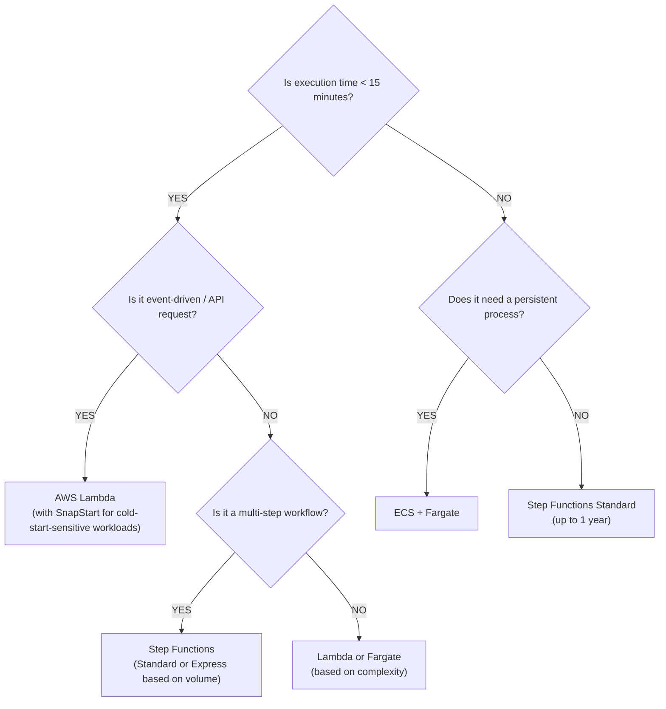

# Compute Layer — AWS Serverless 2026

## Overview

The serverless compute layer in 2026 consists of three primary services that complement each other based on workload characteristics.

## 1. AWS Lambda

The foundation of serverless compute. Event-driven, pay-per-invocation functions.

### Key Features (2026)

| Feature | Details |
|---------|---------|
| **SnapStart** | Python 3.12/3.13, .NET 8, Java 11+ — up to 10x faster cold starts |
| **Response Streaming** | Up to 200 MB responses, improved TTFB for LLM outputs |
| **Lambda Web Adapter** | Run Express, Flask, Spring Boot unchanged on Lambda |
| **ARM64/Graviton** | 20% cost savings vs x86_64 |
| **Node.js 24.x** | Latest managed runtime |
| **Function URLs** | Direct HTTPS endpoint per function |

### SnapStart (Expanded Beyond Java)

SnapStart now supports **Python 3.12, Python 3.13, .NET 8, and Java 11+**. It caches an encrypted snapshot of the initialized execution environment at deployment time, eliminating cold starts.

```yaml
# SAM Template
MyFunction:
  Type: AWS::Serverless::Function
  Properties:
    Runtime: python3.13
    SnapStart:
      ApplyOn: PublishedVersions
```

**Limitations:** Cannot use with Provisioned Concurrency, EFS, or ephemeral storage >512 MB.

### Response Streaming

Stream responses progressively for LLM outputs, large payloads, or improved TTFB:

```javascript
export const handler = awslambda.streamifyResponse(async (event, responseStream) => {
  responseStream.write("Starting...\n");
  // Stream LLM tokens as they arrive
  for await (const token of generateTokens()) {
    responseStream.write(token);
  }
  responseStream.end();
});
```

- First 6 MB streams at uncapped rate
- Up to 200 MB total (vs 6 MB buffered limit)
- Works with Function URLs and InvokeWithResponseStream API

### Lambda Web Adapter

Run existing web applications unchanged on Lambda:

```dockerfile
FROM public.ecr.aws/docker/library/node:24-slim
COPY --from=public.ecr.aws/awsguru/aws-lambda-adapter:0.7.0 /lambda-adapter /opt/extensions/lambda-adapter
ENV PORT=8080
COPY app/ .
CMD ["node", "server.js"]
```

Supports response streaming via `AWS_LWA_INVOKE_MODE=response_stream`.

### Pricing Model

- $0.20 per 1M requests
- Per GB-second of compute time
- ARM64: ~20% cheaper than x86_64
- Free tier: 1M requests + 400,000 GB-seconds/month

---

## 2. AWS Step Functions

Workflow orchestration for multi-step serverless applications.

### Standard Workflows
- **Duration:** Up to 1 year
- **Execution model:** Exactly-once
- **Rate:** 2,000+ executions/second
- **Pricing:** Per state transition
- **Use for:** Long-running, durable, auditable workflows; saga patterns; non-idempotent actions

### Express Workflows
- **Duration:** Up to 5 minutes
- **Execution model:** At-least-once
- **Rate:** 100,000+ executions/second
- **Pricing:** Per execution count + duration + memory
- **Use for:** High-volume event processing, IoT, streaming data

### Distributed Map
- Up to **10,000 parallel** child workflow executions
- Optimized for S3 data sources (JSON, CSV)
- Each iteration runs as separate child execution
- Use for large-scale parallel data processing

---

## 3. Amazon ECS + AWS Fargate

Serverless containers for workloads that exceed Lambda's constraints.

### When to Choose Fargate Over Lambda

| Criteria | Lambda | Fargate |
|----------|--------|---------|
| Max execution time | 15 minutes | Unlimited |
| Scaling unit | Per-request | Per-task |
| State | Stateless | Stateful possible |
| Cold starts | SnapStart mitigates | Always warm (min 1 task) |
| Networking | VPC optional | Full VPC |
| Custom runtime | Web Adapter or layers | Any Docker container |
| Pricing | Per-invocation | Per vCPU-sec + memory |

### Pricing
- Per-second billing (1-minute minimum)
- Pay for vCPU and memory consumed
- No upfront costs

---

## 4. AWS App Runner — Status Note

**⚠️ AWS App Runner is CLOSED to new customers (as of 2025).** Existing customers can continue using it. New applications should use **ECS + Fargate** or **Lambda** instead.

---

## Decision Matrix



## Cost Optimization Tips

1. **Use ARM64/Graviton** — 20% savings on Lambda with no code changes (most runtimes)
2. **SnapStart over Provisioned Concurrency** — Free cold start elimination for Python/.NET/Java
3. **Express Workflows** for high-volume, short (<5 min) idempotent processing
4. **Right-size Lambda memory** — Use AWS Lambda Power Tuning to find optimal config
5. **Response streaming** — Avoid oversized memory for large payloads
