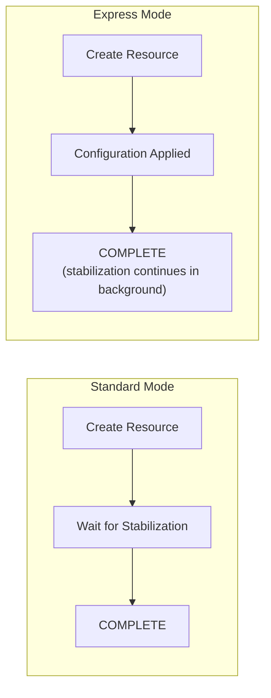
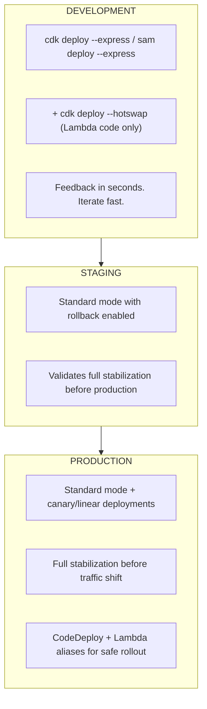

# CloudFormation Express Mode — Paradigm Shift Analysis

## Launch Details

- **Announced:** June 30, 2026
- **Available:** All AWS Commercial Regions
- **Cost:** No additional cost
- **Compatibility:** All existing CloudFormation templates, nested stacks, change sets

## What Is CloudFormation Express Mode?

Express mode is a deployment option that marks stack operations as complete once CloudFormation **confirms resource configuration is applied**, rather than waiting for full resource stabilization (traffic readiness, propagation, cleanup).

### Key Insight

CloudFormation always had two phases:
1. **Configuration** — Resource is created/configured via AWS APIs ✓
2. **Stabilization** — Resource is verified ready to serve traffic (health checks pass, propagation completes, ENIs cleaned up)

Express mode returns success after phase 1, while resources continue stabilizing in the background.

## How Express Mode Works



### What Remains Unchanged:
- Resources are provisioned in dependency order
- If Resource B depends on Resource A's ID, A's configuration completes first
- CloudFormation retries dependent resources that hit transient failures
- Same template, same resources, same final state
- Supports nested stacks (propagates to all children)

### What Changes:
- Stack reports `CREATE_COMPLETE` / `UPDATE_COMPLETE` faster
- Rollback disabled by default (fastest iteration)
- Status reason: "Resource operation completed using express mode. It may continue becoming available in the background."

## Benchmarks

| Operation | Standard Mode | Express Mode | Speedup |
|-----------|--------------|--------------|---------|
| SQS queue + DLQ creation | 64 seconds | ~10 seconds | ~6x |
| Lambda + ENI deletion | 20-30 minutes | ~10 seconds | ~120x+ |
| CloudFront distribution | 5-10 minutes | < 1 minute | ~5-10x |
| IAM Role + InstanceProfile + EC2 | ~3 minutes | ~27 seconds | ~6.7x |
| General (AWS stated) | Baseline | Up to 4x faster | 4x |

## The Paradigm Shift

### Before Express Mode (2023-early 2026)

The IaC tool selection narrative was:

| Tool | Speed | Reason Teams Chose It |
|------|-------|----------------------|
| SST v3 (Pulumi/Terraform) | ⭐⭐⭐⭐⭐ | "CloudFormation is too slow" |
| Terraform | ⭐⭐⭐⭐ | "Direct API calls, no CFN overhead" |
| Pulumi | ⭐⭐⭐⭐ | "No CloudFormation bottleneck" |
| CDK | ⭐⭐⭐ | "Great abstractions but CFN is slow" |
| SAM | ⭐⭐⭐ | "Good for serverless but waits too long" |

**CloudFormation was the bottleneck** — teams accepted trade-offs (smaller ecosystems, less AWS-native integration, state management complexity) just to avoid 5-15 minute deployments.

### After Express Mode (July 2026+)

| Tool | Speed | New Narrative |
|------|-------|---------------|
| CDK + Express | ⭐⭐⭐⭐⭐ | "Fast deploys + best AWS integration + L2/L3 constructs + cdk-nag" |
| SAM + Express | ⭐⭐⭐⭐⭐ | "Seconds to deploy + best local testing + SAM Accelerate" |
| SST v3 | ⭐⭐⭐⭐⭐ | "Still fastest Live Lambda, but speed gap closed" |
| Terraform | ⭐⭐⭐⭐ | "Multi-cloud, but no longer faster than CFN Express" |
| Pulumi | ⭐⭐⭐⭐ | "Code-first, but CDK offers same with bigger ecosystem" |

## Impact on Each IaC Tool

### AWS CDK — Big Winner ✅

Express mode makes CDK the **strongest overall choice** for AWS-only teams:
- `cdk deploy --express` — sub-minute deployments
- Retains all CDK advantages: L2/L3 constructs, type safety, Construct Hub, cdk-nag compliance
- CDK Pipelines for self-mutating CI/CD
- Largest AWS-specific community and ecosystem
- Combined with `cdk deploy --hotswap` (bypasses CFN entirely for Lambda code) = near-instant for code changes

**New developer workflow:**
```bash
# Code change to Lambda → instant
cdk deploy --hotswap

# Infrastructure change → seconds  
cdk deploy --express

# Production deployment → full stabilization (default)
cdk deploy
```

### AWS SAM — Big Winner ✅

SAM was already the simplest serverless tool. Express mode removes its last weakness:
- `sam deploy --express` or `sam sync --express` — seconds for infrastructure changes
- `sam sync --watch` was already fast for code — now infrastructure is fast too
- Best local testing (Docker emulation)
- Persist with `sam deploy --express --save-params` → saves to `samconfig.toml`

**New developer workflow:**
```bash
# Local testing
sam local invoke MyFunction

# Deploy to cloud (seconds with Express)
sam deploy --express

# Watch mode (code changes instant, infra changes now fast)
sam sync --express --watch
```

### SST v3 — Still Relevant but Advantage Narrowed

SST's killer differentiation was speed. Now:
- **Live Lambda** remains unique — real AWS events proxied to local code (<10ms)
- Speed advantage over CDK/SAM is significantly reduced
- Still better DX for full-stack apps (Next.js/Astro/Remix integration)
- Trade-off: Pulumi state management vs CloudFormation's built-in state

**SST remains best for:** Teams needing Live Lambda development and tight frontend framework integration. But the "CloudFormation is too slow" argument no longer holds.

### Terraform — Multi-Cloud Remains Its Story

- No longer faster than CloudFormation for AWS-only deployments
- Strength is multi-cloud and massive ecosystem, not speed
- Teams choosing Terraform for AWS-only speed reasons should reconsider CDK + Express
- CDKTF was sunsetted in Dec 2025, so teams must choose native Terraform or switch to CDK

### Pulumi — Code-First Alternative

- Speed parity with Express mode removes its deployment speed advantage
- Strength remains: real programming languages without CloudFormation opinions
- Powers SST v3 under the hood
- For AWS-only teams: CDK provides similar code-first DX with larger ecosystem

## AI Agent Workflows — The Hidden Game Changer

Express mode was explicitly designed for **AI-assisted infrastructure development**:

> "AI-assisted infrastructure development that benefits from sub-minute feedback loops"

This means tools like **Kiro** and custom AI agents using the **AWS MCP Server** can now:
1. Generate CloudFormation/CDK/SAM templates
2. Deploy in seconds (Express mode)
3. Observe results
4. Iterate and redeploy

Previously: AI agent → generate template → wait 5-10 minutes → feedback
Now: AI agent → generate template → feedback in seconds → iterate 10x faster

## When NOT to Use Express Mode

Express mode is for development and iteration. **Use Standard mode when:**

1. **Production deployments** where "stack complete" must mean "ready for traffic"
2. **Blue/green deployments** where the new stack must be fully ready before traffic shift
3. **Database migrations** where you need the database accepting connections before proceeding
4. **Compliance workflows** that require full stabilization verification
5. **External dependencies** that will immediately call the new resource after deployment

## Recommended Strategy



## Conclusion

CloudFormation Express mode is the most significant IaC deployment improvement since CloudFormation's inception. It:

1. **Eliminates the #1 criticism** of CloudFormation (slow deployments)
2. **Strengthens CDK and SAM** as the premier AWS-native IaC tools
3. **Reduces SST/Terraform/Pulumi's speed advantage** to near-zero for dev workflows
4. **Enables AI-first infrastructure development** with sub-minute feedback loops
5. **Requires no template changes** — works with all existing templates

The new paradigm: **CDK + Express mode** for AWS-native teams wanting the best combination of developer experience, deployment speed, type safety, compliance (cdk-nag), and ecosystem (Construct Hub).
