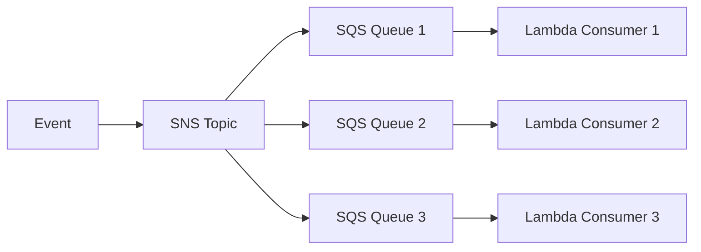

# API & Event-Driven Patterns — AWS Serverless 2026

## Synchronous Patterns (Request/Response)

### 1. Amazon API Gateway

#### HTTP API (Recommended Default)
- **70% cheaper** than REST API
- Lower latency
- Built-in CORS, OIDC/OAuth 2.0
- Lambda and HTTP backend integrations
- Service integrations: EventBridge, Kinesis, SQS, Step Functions

#### REST API (When You Need Management Features)
- API keys and usage plans with per-client throttling
- Request validation
- AWS WAF integration
- Private API endpoints
- Mock integrations

#### WebSocket API
- Real-time bidirectional communication
- Route-based message handling ($connect, $disconnect, custom routes)
- Connection tracking via DynamoDB
- Server-to-client push via API Gateway Management API

#### When to Choose

| Need | Choose |
|------|--------|
| Cost-effective Lambda proxy | HTTP API |
| WAF, API keys, request validation | REST API |
| Real-time bidirectional | WebSocket API |

---

### 2. AWS AppSync (GraphQL)

The **GraphQL-first** API layer for frontend-driven applications.

#### Key Features (2026)
- **JavaScript resolvers** (replaces VTL) — ECMAScript 6.0 subset
- **Pipeline resolvers** — compose multiple functions in sequence
- **Merged APIs** — federate up to 10 source APIs from independent teams
- **Real-time subscriptions** — automatic WebSocket management
- **AppSync Events (March 2025)** — dedicated PubSub API via WebSocket
- **Data sources:** DynamoDB, Lambda, HTTP, EventBridge, OpenSearch, RDS, Bedrock

#### Merged APIs (Multi-Team GraphQL Federation)
- Teams develop source APIs independently
- Build-time schema composition (not router-based runtime federation)
- No extra network hops (single merged server)
- Cross-account support via AWS RAM
- Supports subscriptions (unlike most federation routers)

#### When to Choose AppSync
- Frontend needs flexible data queries (GraphQL)
- Real-time updates required (subscriptions)
- Multi-source data aggregation
- Multi-team API federation
- Bedrock integration for AI-powered responses

---

### 3. Lambda Function URLs

Simplest HTTP endpoint — no API Gateway needed.

- Dedicated HTTPS endpoint per Lambda function
- Format: `https://<url-id>.lambda-url.<region>.on.aws`
- Auth: AWS_IAM or NONE
- Built-in CORS
- Response streaming support

**Use when:** Single-function webhooks, simple microservices, or when you don't need API management features.

---

## Asynchronous Patterns (Event-Driven)

### 4. Amazon EventBridge

The **event backbone** for serverless architectures.

#### Event Buses (Fan-Out Routing)
- Router receives events and delivers to zero or more targets
- Rules evaluate events using JSON-based pattern matching
- Cross-account event delivery
- Event archiving and replay

#### EventBridge Pipes (Point-to-Point)
- Source → Filter → Enrichment → Target
- Sources: DynamoDB Streams, Kinesis, Amazon MQ, MSK, SQS
- Enrichment: Lambda, Step Functions, API Gateway, API Destinations
- Preserves ordering in batches
- Pay only for events matching filters

#### EventBridge Scheduler
- **1 million schedules per account** (vs 300 rules limit)
- **1000s TPS** throughput
- Cron, fixed rate, or one-time schedules
- 270+ services, 6,000+ API actions as targets
- **14 million free invocations/month**
- Timezone-aware with DST support
- Configurable retry with exponential backoff

---

### 5. SNS + SQS (Messaging)

#### Fan-Out Pattern

- SNS for pub/sub fan-out to multiple subscribers
- SQS for reliable queue-based buffering and load leveling
- Message filtering at subscription level (reduce costs)
- FIFO variants for exactly-once, ordered processing
- Dead-letter queues for failed message handling

---

### 6. Amazon VPC Lattice (Service Mesh)

Internal service-to-service communication without sidecars.

- **Layer 7** application networking
- Supports EC2, EKS, Lambda, ALB targets
- Weighted routing (blue/green, canary)
- IAM-based auth policies
- Cross-VPC, cross-account via AWS RAM
- On-premises connectivity via Direct Connect/VPN

**Use for:** East-west traffic between microservices across VPCs and accounts.

---

## Composition Patterns

### Full Application Event Flow

```mermaid
flowchart TD
    subgraph SYNC["SYNCHRONOUS (Client-Facing)"]
        Client["Browser/Mobile"]
        Client --> AppSync["AppSync (GraphQL + Subscriptions)"]
        AppSync --> DynamoDB1["DynamoDB/Lambda"]
        Client --> HTTPAPI["API Gateway HTTP API"]
        HTTPAPI --> Lambda1["Lambda"]
        Lambda1 --> DynamoDB2["DynamoDB"]
        Client --> FnURL["Lambda Function URLs"]
        FnURL --> Webhook["Simple webhook handlers"]
    end

    subgraph ASYNC["ASYNCHRONOUS (Backend Processing)"]
        LambdaEmit["Lambda emits events"] --> EB["EventBridge Bus"]
        EB -->|Rule| LambdaEmail["Lambda (email notifications)"]
        EB -->|Rule| StepFn["Step Functions (order processing)"]
        EB -->|Rule| SQS["SQS"]
        SQS --> LambdaBatch["Lambda (batch analytics)"]
        DDBStreams["DynamoDB Streams"] --> Pipe["EventBridge Pipe"]
        Pipe --> LambdaCDC["Lambda (CDC)"]
        Scheduler["EventBridge Scheduler"] --> LambdaScheduled["Lambda (daily reports, cleanups)"]
    end

    subgraph INTERNAL["INTERNAL (Service-to-Service)"]
        ServiceA["Service A"] --> Lattice["VPC Lattice"]
        Lattice --> ServiceB["Service B (cross-VPC)"]
    end

    SYNC --> ASYNC
    ASYNC --> INTERNAL
```

### Pattern Selection Guide

| Need | Service |
|------|---------|
| Frontend GraphQL + real-time | AppSync |
| REST API with management | API Gateway REST API |
| Cost-effective HTTP proxy | API Gateway HTTP API |
| Simplest webhook endpoint | Lambda Function URLs |
| Event routing to multiple consumers | EventBridge Event Bus |
| Point-to-point stream processing | EventBridge Pipes |
| Scheduled tasks at scale | EventBridge Scheduler |
| Pub/sub fan-out | SNS → SQS |
| Reliable queue processing | SQS → Lambda |
| Service mesh (east-west) | VPC Lattice |
