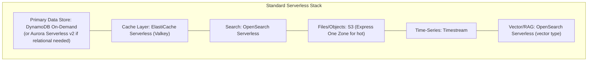
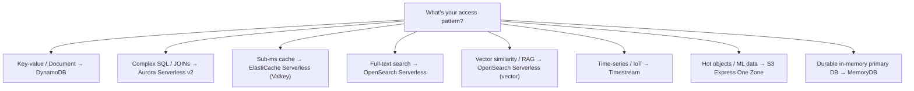

# Data Layer — AWS Serverless 2026

## Overview

The serverless data layer in 2026 offers purpose-built databases that scale to zero or near-zero, with pay-per-use pricing and no capacity management.

## Comparison Table

| Service | Pricing | Latency | Scaling | Best For |
|---------|---------|---------|---------|----------|
| **DynamoDB On-Demand** | Per-request | Single-digit ms | Instant | Primary NoSQL datastore |
| **Aurora Serverless v2** | Per-ACU | Sub-10ms | 0.5 ACU increments | Relational/SQL workloads |
| **ElastiCache Serverless** | ECPUs + storage | Microseconds | Instant, zero-config | Caching, sessions |
| **OpenSearch Serverless** | Compute + storage | Sub-second | Scales to zero | Search, vectors, RAG |
| **S3 Express One Zone** | Per-GB + requests | Single-digit ms | 2M GET TPS | Hot data, ML, analytics |
| **Timestream** | Writes + queries | Near real-time | Fully automatic | IoT, time-series |

---

## 1. Amazon DynamoDB (On-Demand)

**The default primary database for serverless applications.**

### Key Features
- **On-demand mode:** Pay per read/write request — no capacity planning
- **Single-digit millisecond latency** at any scale
- **Global Tables:** Multi-region active-active replication with Multi-Region Strong Consistency (MRSC)
- **DynamoDB Streams:** Ordered item-level change data capture (CDC)
- **PartiQL:** SQL-compatible query language
- **Default quota:** 40,000 table-level RCU/WCU (can be raised)

### When to Choose DynamoDB
- Key-value or document access patterns
- Predictable, fast reads/writes at any scale
- Event-driven architectures (DynamoDB Streams → Lambda)
- Session stores, user profiles, shopping carts, IoT data
- Global applications (Global Tables)

### Cost Optimization
- Per-table maximum throughput caps for cost control
- On-demand is default and recommended for serverless
- Use Reserved Capacity for sustained high-volume tables

---

## 2. Amazon Aurora Serverless v2 + Data API

**When you need SQL/relational semantics in a serverless architecture.**

### Key Features
- **Auto-scaling:** 0.5 ACU increments based on CPU/memory/connections
- **Data API:** HTTP-based access — no VPC, no connection pooling needed
- **Mixed instances:** Combine provisioned + serverless in same cluster
- **HA:** Multi-AZ with database failover
- **Engines:** PostgreSQL and MySQL

### Data API Advantages for Lambda
- No VPC configuration needed
- No connection pool management
- Only 5 API calls in the entire interface
- Works over HTTP (no persistent connections)
- No 1,000 RPS limit (removed in v2)

### When to Choose Aurora Serverless v2
- Complex queries, JOINs, transactions
- Relational data models
- Applications migrating from traditional RDBMS
- Variable-traffic web applications
- When DynamoDB's access patterns are too limiting

---

## 3. Amazon ElastiCache Serverless (Valkey)

**Microsecond caching with zero management.**

### Key Features
- **Valkey engine:** 33% cheaper than Redis OSS on serverless
- **Zero-config scaling:** Monitors compute/memory/network, scales instantly
- **Microsecond read latency**
- **Multi-AZ:** 99.99% availability SLA
- **Deploy in under 1 minute**
- **Starting at ~$6/month** with Valkey

### When to Choose ElastiCache Serverless
- Caching layer for DynamoDB/Aurora queries
- Session stores
- Rate limiting
- Real-time leaderboards
- Ephemeral data with sub-millisecond access needs

---

## 4. Amazon OpenSearch Serverless

**Full-text search and vector search that scales to zero.**

### Key Features
- **Scales compute to zero** when idle (up to 60% cheaper for variable traffic)
- **Collection types:** Search, Time Series, Vector Search
- **Vector engine:** HNSW/IVF with FAISS and Lucene, quantization
- **GPU acceleration** for index builds
- **Automatic Semantic Enrichment** (sparse models for relevance)
- **Supports RAG workflows** and agents
- **Petabyte-scale** search and analytics

### When to Choose OpenSearch Serverless
- Full-text search features in applications
- Vector search for AI/RAG
- Log analytics and observability
- Applications with idle periods (scales to zero = cost efficient)

---

## 5. Amazon S3 Express One Zone

**Ultra-fast object storage for hot data.**

### Key Features
- **Single-digit millisecond latency** (10x faster than S3 Standard)
- **2M GET TPS / 200K PUT TPS** per directory bucket
- **Price reductions (April 2025):** Storage -31%, PUT -55%, GET -85%
- **Append operations** to existing objects
- **99.95% availability SLA**

### When to Choose S3 Express One Zone
- AI/ML training data
- Analytics intermediate data
- Media rendering pipelines
- HPC workloads
- Any hot data requiring sub-10ms latency

---

## 6. Amazon Timestream

**Serverless time-series database.**

### Key Features
- **Trillions of events per day**
- **Automatic data tiering:** Memory → magnetic (policy-based)
- **Built-in time-series functions:** Smoothing, interpolation, approximation
- **SQL interface** with time-series extensions
- **Multi-AZ** quorum-based writes
- **~1/10th cost** of relational databases for time-series

### When to Choose Timestream
- IoT sensor data
- DevOps monitoring metrics
- Application performance data
- Fleet management telemetry
- Any time-stamped, append-only data

---

## 7. Amazon MemoryDB for Redis/Valkey

**Durable in-memory database (NOT just a cache).**

> ⚠️ **Note:** MemoryDB does NOT have a serverless deployment option. It requires node-based clusters with manual scaling. Use ElastiCache Serverless for true serverless caching.

### When to Choose MemoryDB (Over ElastiCache)
- Need durability (data survives failures) — Multi-AZ transactional log
- Using as a **primary database**, not just a cache
- Financial transactions, real-time inventory, gaming state
- Microsecond reads + single-digit ms writes + durability guarantee

---

## Architecture Recommendations

### Standard Serverless Stack

### Decision Tree

