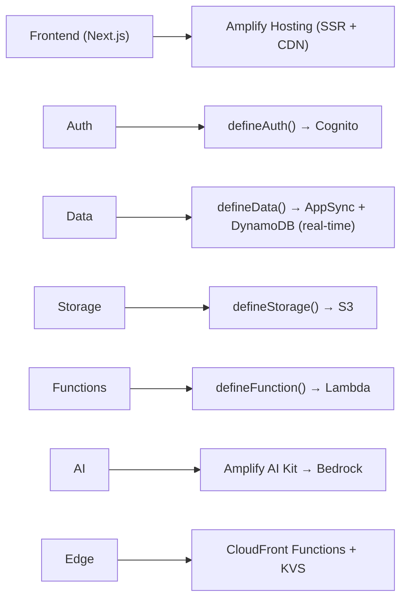
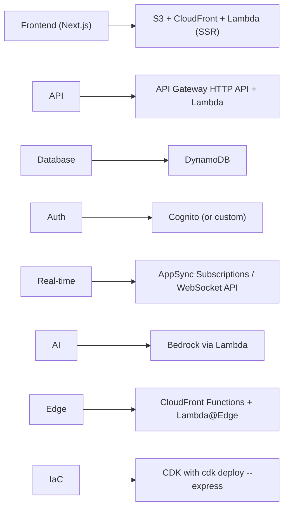

# Frontend & Full-Stack — AWS Serverless 2026

## Options Overview

| Framework | Abstraction | Control | Best For |
|-----------|-------------|---------|----------|
| **Amplify Gen 2** | Highest | Low | Fastest time-to-production, code-first |
| **SST v3** | High | High | Full-stack with infrastructure control |
| **Custom (CDK/SAM)** | Low | Highest | Granular control, existing IaC practices |

---

## 1. AWS Amplify Gen 2 — Code-First Full-Stack

### Architecture

```
amplify/
├── auth/resource.ts        → Amazon Cognito
├── data/resource.ts        → AppSync + DynamoDB
├── storage/resource.ts     → Amazon S3
├── functions/
│   ├── api/resource.ts     → Lambda function
│   └── ai/resource.ts      → Bedrock integration
└── backend.ts              → Combines all resources
```

### Key Features
- **TypeScript-first** backend definitions
- **Per-developer cloud sandboxes:** `npx ampx sandbox` syncs on every save
- **Built-in auth:** Cognito (email, social, MFA, SAML/OIDC, passwordless)
- **Built-in data:** AppSync + DynamoDB with real-time subscriptions
- **AI Kit:** Conversation and generation routes via Amazon Bedrock
- **Hosting:** SSR support for Next.js, Nuxt, React

### Core Packages

| Package | Purpose |
|---------|---------|
| `@aws-amplify/backend` | defineAuth, defineData, defineStorage, defineFunction |
| `aws-amplify` | Frontend: configure(), generateClient(), auth/data/storage APIs |
| `@aws-amplify/ui-react` | Pre-built UI: `<Authenticator>`, `<StorageBrowser>` |
| `@aws-amplify/ui-react-ai` | AI UI: `<AIConversation>`, useAIConversation |

### Developer Workflow

```bash
# Start sandbox (deploys personal cloud environment)
npx ampx sandbox

# Code changes auto-deploy to your sandbox
# Frontend sees changes immediately via amplify_outputs.json

# Deploy to production
npx ampx pipeline-deploy

# Fullstack Git branch deployments (auto per-PR environments)
git push origin feature/new-feature  # → deploys preview env
```

### Example: Data Schema with Auth

```typescript
// amplify/data/resource.ts
import { defineData, a } from '@aws-amplify/backend';

export const data = defineData({
  schema: a.schema({
    Todo: a.model({
      content: a.string().required(),
      done: a.boolean().default(false),
      priority: a.enum(['low', 'medium', 'high']),
    }).authorization(allow => [
      allow.owner(),
      allow.authenticated().to(['read']),
    ]),
  }),
});
```

### When to Choose Amplify Gen 2
- Want fastest path from code to production
- Need built-in auth + data + storage + AI
- Building with React/Next.js/Vue/Angular
- Prefer code-first over template-first
- Don't need fine-grained infrastructure control

---

## 2. SST v3 — Full Infrastructure Control

### Architecture

```typescript
// sst.config.ts
export default $config({
  app(input) {
    return { name: "my-app", region: "us-east-1" };
  },
  async run() {
    const table = new sst.aws.Dynamo("Items", {
      fields: { id: "string" },
      primaryIndex: { hashKey: "id" },
    });

    const api = new sst.aws.Function("Api", {
      handler: "packages/api/src/handler.main",
      link: [table],
      url: true,
    });

    const web = new sst.aws.Nextjs("Web", {
      path: "packages/web",
      link: [api],
    });

    return { url: web.url, api: api.url };
  },
});
```

### Frontend Framework Components

| Component | Framework | Deployment |
|-----------|-----------|------------|
| `sst.aws.Nextjs` | Next.js | S3 + CloudFront + Lambda (SSR) |
| `sst.aws.Astro` | Astro | S3 + CloudFront + Lambda |
| `sst.aws.Remix` | Remix | S3 + CloudFront + Lambda |
| `sst.aws.SvelteKit` | SvelteKit | S3 + CloudFront + Lambda |
| `sst.aws.StaticSite` | Any static | S3 + CloudFront |

### Live Lambda Development

```bash
sst dev
# → Real AWS events (API Gateway, SQS, DynamoDB) proxied to local code
# → VS Code breakpoint debugging
# → <10ms code reload
# → No Docker, no emulation — real cloud services
```

### When to Choose SST v3
- Need Live Lambda development (code runs locally with real AWS events)
- Building full-stack with Next.js/Astro/Remix
- Want type-safe resource bindings between frontend and backend
- Need infrastructure control beyond what Amplify offers
- Multi-provider support (Cloudflare + AWS)

---

## 3. Edge Computing

### CloudFront Functions (Lightweight Edge)

- Sub-millisecond startup at **all 225+ PoPs**
- JavaScript runtime 2.0
- **KeyValueStore (KVS):** Global key-value data readable from edge
- Millions of RPS, fraction of Lambda@Edge cost

**Use cases:** URL rewrites, header manipulation, A/B testing, geo-routing, feature flags, token validation

### Lambda@Edge (Heavy Edge Compute)

- Node.js or Python
- Full Lambda environment (libraries, network calls, AWS services)
- Runs at Regional edge caches (not all PoPs)
- Deploy to us-east-1, auto-replicated globally

**Use cases:** SSR at edge, complex auth, image processing, HLS streaming, bot detection

### Decision Guide

| Need | Choose |
|------|--------|
| Sub-ms, lightweight | CloudFront Functions |
| External API calls | Lambda@Edge |
| Millions RPS, low cost | CloudFront Functions |
| Complex computation | Lambda@Edge |
| Dynamic config (feature flags) | CloudFront Functions + KVS |

---

## 4. Static Hosting (CloudFront + S3)

### Best Practices (2026)

```yaml
# CDK Example
const bucket = new s3.Bucket(this, 'Site', {
  blockPublicAccess: s3.BlockPublicAccess.BLOCK_ALL,  # All 4 settings
});

const distribution = new cloudfront.Distribution(this, 'CDN', {
  defaultBehavior: {
    origin: origins.S3BucketOrigin.withOriginAccessControl(bucket),  # OAC (not OAI)
  },
  certificate: cert,
  domainNames: ['app.example.com'],
});
```

- Keep all 4 Block Public Access settings enabled
- Use **OAC** (Origin Access Control) — not legacy OAI
- ACM-managed TLS for custom domains
- CloudFront provides HTTPS, security headers, DDoS protection

---

## 5. Amplify Hosting (SSR)

### Supported Frameworks
- **Next.js** — First-class, zero-config detection
- **Nuxt.js** — Built-in Amplify adapter
- Other SSR frameworks via deployment specification adapters

### Features
- Auto CI/CD from Git repositories
- Branch-based deployments (preview per PR)
- Custom domains with ACM TLS
- SSR logs to CloudWatch
- Hybrid: mix static + server-rendered pages

---

## Recommended Full-Stack Architecture

### Fastest Path (Amplify Gen 2)


### Maximum Control (SST v3 or CDK + Express)

