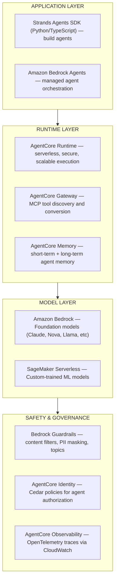
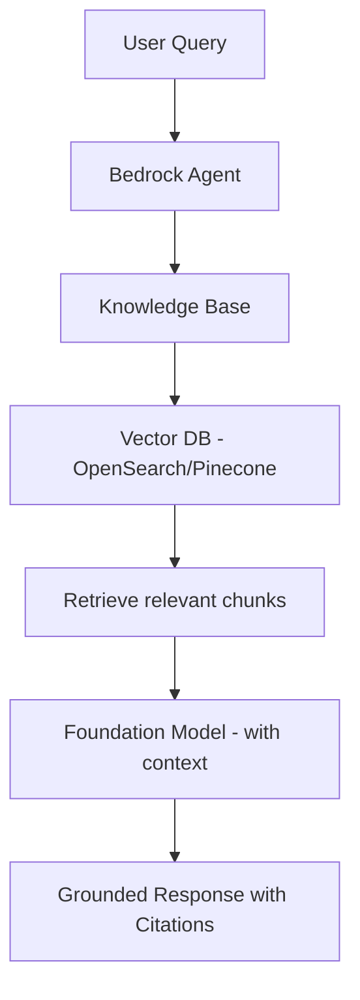
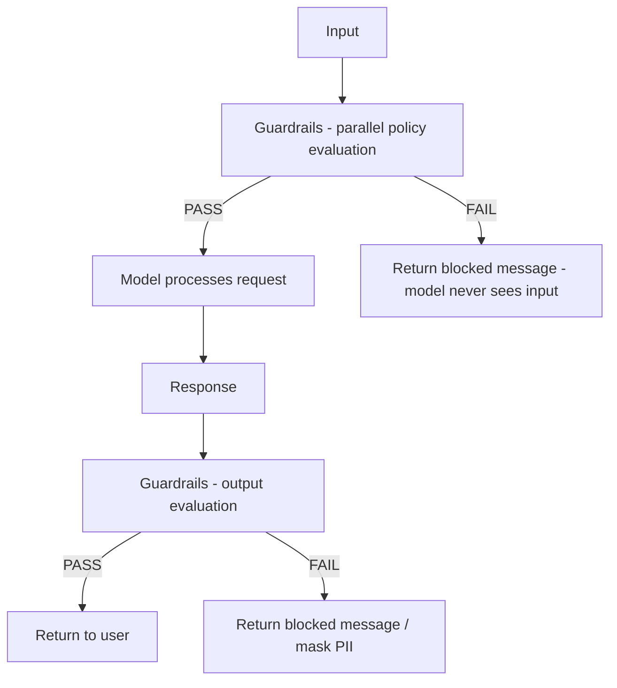
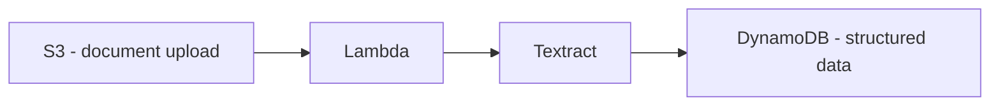
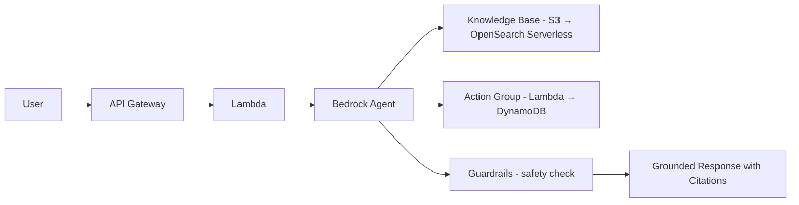
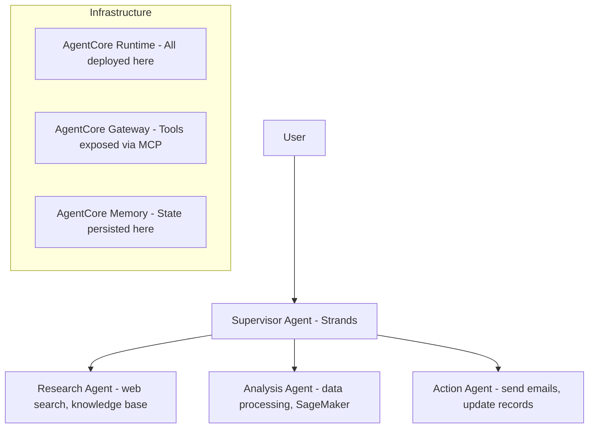
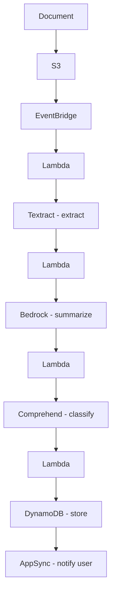

# AI/ML Integration — AWS Serverless 2026

## The Agentic AI Era

2026 marks the year AI agents became first-class serverless citizens on AWS. The stack has evolved from "call an LLM API" to "deploy autonomous AI agents at scale."

## Architecture Overview



---

## 1. Amazon Bedrock — Foundation Models

Fully managed, serverless access to foundation models via a single API.

### Available Models (2026)
- **Anthropic:** Claude 3.5 Sonnet, Claude 3 Opus/Haiku
- **Amazon:** Nova Micro, Nova Lite, Nova Pro
- **Meta:** Llama 3.x
- **Mistral AI:** Mistral Large, Mixtral
- **DeepSeek, Cohere, AI21 Labs, Stability AI, Luma**

### Key Features
- **Pay-per-token** — no provisioning
- **Converse API** (recommended) — unified interface across models
- **Response streaming** — real-time token delivery
- **Cross-region inference** — automatic routing during peak utilization
- **No infrastructure management**

### Lambda Integration Pattern

```python
import boto3
import json

bedrock = boto3.client("bedrock-runtime")

def handler(event, context):
    response = bedrock.converse(
        modelId="anthropic.claude-3-sonnet-20240229-v1:0",
        messages=[{
            "role": "user",
            "content": [{"text": event["prompt"]}]
        }],
        inferenceConfig={"maxTokens": 1024, "temperature": 0.7}
    )
    return response["output"]["message"]["content"][0]["text"]
```

---

## 2. Amazon Bedrock Agents

Managed AI agents that understand requests, break down tasks, and orchestrate actions.

### Capabilities
- **Action Groups:** Interact with external systems via APIs (Lambda functions)
- **Knowledge Bases (RAG):** Connect to S3/Redshift data for grounded responses
- **Multi-Agent Collaboration (GA March 2025):** Multiple agents coordinate on complex workflows
- **Inline Agents:** Dynamically adjust agent roles at runtime
- **MCP Support:** Connect to Model Context Protocol servers for tool access

### RAG Pattern



### Setting Up Knowledge Bases
1. Upload documents to S3
2. Configure Knowledge Base (embedding model, vector store, chunking strategy)
3. Run ingestion job (StartIngestionJob API)
4. Connect to agent or query directly

---

## 3. Amazon Bedrock AgentCore (2025-2026)

Enterprise-grade platform to **build, deploy, and operate agents** at scale using any framework.

### Core Services

| Service | Purpose |
|---------|---------|
| **AgentCore Runtime** | Serverless execution with session isolation, long-running task support |
| **AgentCore Gateway** | Converts Lambda/APIs to MCP-compatible tools; tool discovery |
| **AgentCore Memory** | Managed short-term (conversation) + long-term memory |
| **AgentCore Identity** | Agent-specific IAM with Cedar policy authorization |
| **AgentCore Built-in Tools** | Code Interpreter (sandbox), Browser Tool (web at scale) |
| **AgentCore Observability** | OpenTelemetry traces → CloudWatch |

### Key Insight: Framework Agnostic
AgentCore works with **any** agent framework:
- Strands Agents SDK
- LangGraph
- CrewAI
- LlamaIndex
- Custom frameworks

And **any** model:
- Bedrock models
- Models outside Bedrock (OpenAI, self-hosted)

---

## 4. Strands Agents SDK — Open Source (1.0 GA)

The model-driven agent SDK used in production by Kiro, AWS Glue, VPC Reachability Analyzer.

### Key Facts
- **2,000+ GitHub stars**, 150K+ PyPI downloads
- **Python** and **TypeScript** (RC since April 2026)
- **Version 1.0** — production-ready with stability guarantees
- Used internally across AWS services

### Core Philosophy
Model-driven: Give the model tools and a prompt → it plans, chains thoughts, calls tools, and reflects. Strands manages the event loop.

### Minimal Agent

```python
from strands import Agent
from strands.tools import tool

@tool
def get_weather(city: str) -> str:
    """Get current weather for a city."""
    # Call weather API
    return f"72°F, sunny in {city}"

@tool
def send_email(to: str, subject: str, body: str) -> str:
    """Send an email."""
    # Send via SES
    return f"Email sent to {to}"

agent = Agent(
    system_prompt="You are a helpful assistant that can check weather and send emails.",
    tools=[get_weather, send_email]
)

response = agent("What's the weather in Seattle? If it's nice, email john@example.com about it.")
```

### 1.0 Features (2026)
- **Multi-agent orchestration** — 4 new coordination primitives
- **Agent-to-Agent (A2A) protocol** — agents communicate with each other
- **Session Manager** — remote state persistence
- **Improved async support** throughout
- **5+ model providers** — Anthropic, Meta, OpenAI, Cohere, Mistral, Stability, Writer

### Deployment to AgentCore

```python
from strands import Agent
# Build agent locally
agent = Agent(system_prompt="...", tools=[...])

# Deploy to AgentCore Runtime for production
# → Serverless execution
# → Session isolation
# → Auto-scaling
# → Cedar policy authorization
# → OpenTelemetry observability
```

---

## 5. Bedrock Guardrails

Configurable safety policies applied consistently across all AI interactions.

### Policy Types

| Policy | Function |
|--------|----------|
| **Content filters** | Block hate, insults, sexual, violence (configurable thresholds) |
| **Denied topics** | Block specific topics via natural language description |
| **Word filters** | Block words, phrases, profanity |
| **Sensitive info** | Block or mask PII (built-in types + custom regex) |
| **Image filters** | Filter harmful image content |

### How It Works


### Apply to Any Model
```python
# Works with Converse, InvokeModel, Agents, Knowledge Bases
response = bedrock.converse(
    modelId="...",
    messages=[...],
    guardrailConfig={
        "guardrailIdentifier": "my-guardrail-id",
        "guardrailVersion": "1"
    }
)

# Also works with self-hosted models via ApplyGuardrail API
```

---

## 6. SageMaker Serverless Inference

For **custom-trained** ML models with intermittent traffic.

### When to Use (vs Bedrock)

| Dimension | Bedrock | SageMaker Serverless |
|-----------|---------|---------------------|
| Model type | Foundation models (LLMs) | Custom-trained models |
| Setup | Minimal (API call) | Requires model training/packaging |
| Use case | Generative, conversational | Predictive, numerical, structured |
| Scaling | Always available | Scales to zero (cold starts) |
| Cost | Pay per token | Pay per inference |

### Best For
- Custom classification/regression models
- Proprietary algorithms
- Structured data prediction
- Intermittent traffic patterns (scales to zero)

---

## 7. Serverless AI Services (Pre-trained)

| Service | Capability | Use Case |
|---------|------------|----------|
| **Comprehend** | NLP (sentiment, entities, key phrases) | Text analysis pipelines |
| **Rekognition** | Computer vision (objects, faces, content moderation) | Image/video processing |
| **Textract** | Document processing (tables, forms, handwriting) | Document automation |

All integrate directly with Lambda for event-driven AI pipelines:


---

## Architecture Patterns

### Pattern 1: RAG Application (Serverless)


### Pattern 2: Multi-Agent System


### Pattern 3: Event-Driven AI Pipeline


---

## Key Principles for AI in Serverless (2026)

1. **Every app should integrate Bedrock** — it's just an API call with pay-per-token
2. **Use Guardrails on every AI interaction** — safety is not optional
3. **MCP is the tool standard** — expose Lambda functions as MCP tools via AgentCore Gateway
4. **Strands for custom agents** — production-ready, used by AWS internally
5. **AgentCore for deployment** — don't run agents on raw Lambda, use the managed runtime
6. **RAG for grounded responses** — Knowledge Bases + OpenSearch Serverless for vector search
7. **Cedar policies govern agent actions** — fine-grained authorization for production agents
8. **Observe agent behavior** — OpenTelemetry traces show every tool call, every decision
