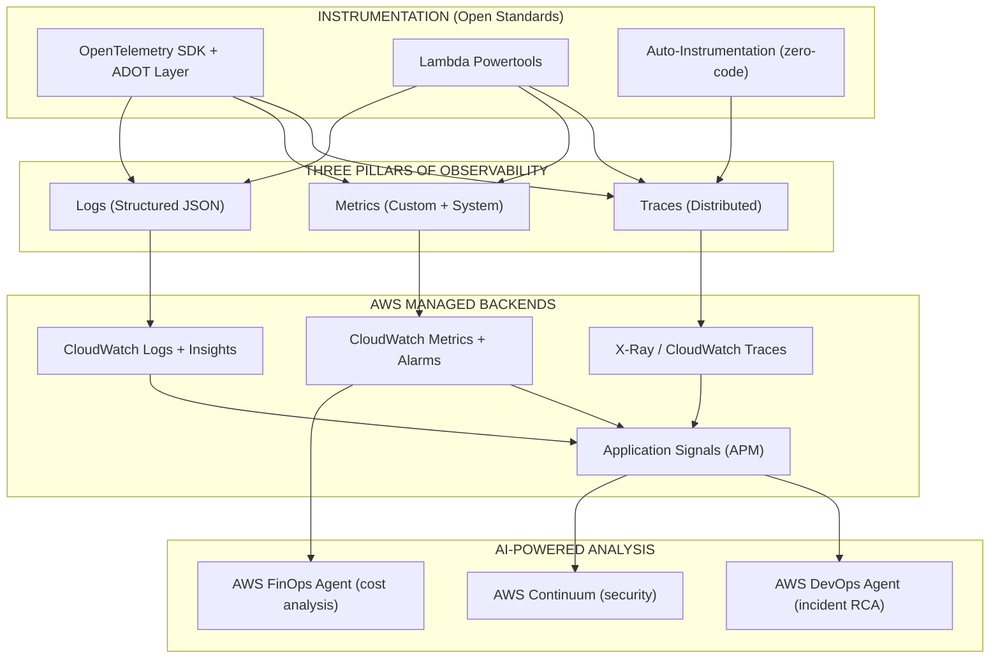
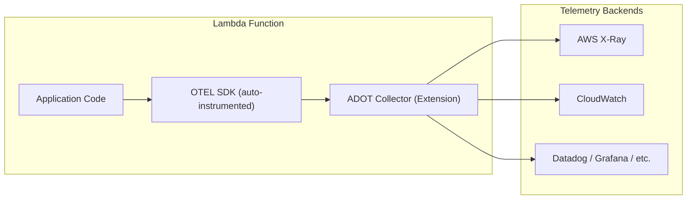
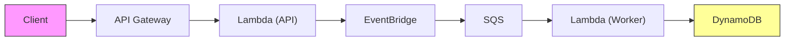

# Observability — Modern Standards for Serverless 2026

## The Modern Observability Stack

In 2026, observability for serverless and cloud-native applications is built on **open standards** — primarily OpenTelemetry (OTEL) — with AWS services providing managed backends. The shift is away from proprietary instrumentation and toward portable, vendor-neutral telemetry.



---

## I. OpenTelemetry — The Universal Standard

### What Is OpenTelemetry (OTEL)?

OpenTelemetry is the **CNCF standard** for generating, collecting, and exporting telemetry data (traces, metrics, logs). It is vendor-neutral and portable — instrument once, send to any backend.

### Why OTEL for Serverless in 2026

| Before (Proprietary) | After (OTEL Standard) |
|----------------------|----------------------|
| X-Ray SDK (AWS-only) | OpenTelemetry SDK (portable) |
| Vendor lock-in on telemetry | Send to any backend (Datadog, Grafana, New Relic, CloudWatch) |
| Different SDKs per vendor | One SDK, multiple exporters |
| Manual instrumentation | Auto-instrumentation via ADOT Layer |

### AWS Distro for OpenTelemetry (ADOT)

ADOT is AWS's production-ready distribution of OpenTelemetry. It provides:

- **Lambda Layers** for auto-instrumentation (Python, Node.js, Java, .NET)
- **Collector** bundled as a Lambda extension
- **Zero-code instrumentation** for AWS SDK calls, HTTP requests, database queries
- **Export to multiple backends** simultaneously (X-Ray + Datadog + custom)

#### How to Add ADOT to Lambda

```yaml
# SAM Template
MyFunction:
  Type: AWS::Serverless::Function
  Properties:
    Runtime: python3.13
    Handler: app.handler
    Layers:
      - !Sub arn:aws:lambda:${AWS::Region}:901920570463:layer:aws-otel-python-amd64-ver-1-25-0:1
    Environment:
      Variables:
        AWS_LAMBDA_EXEC_WRAPPER: /opt/otel-instrument
        OTEL_SERVICE_NAME: my-service
        OTEL_EXPORTER_OTLP_ENDPOINT: http://localhost:4318
    Tracing: Active
```

#### ADOT Architecture in Lambda



### OTEL Signals for Serverless

#### 1. Traces (Distributed Tracing)

```python
from opentelemetry import trace

tracer = trace.get_tracer("my-service")

def handler(event, context):
    with tracer.start_as_current_span("process-order") as span:
        span.set_attribute("order.id", event["orderId"])
        span.set_attribute("customer.tier", "premium")
        # Automatic propagation across Lambda → SQS → Lambda → DynamoDB
        result = process_order(event)
        span.set_attribute("order.status", result["status"])
    return result
```

**Key capabilities:**
- Automatic context propagation across: API Gateway → Lambda → SQS → Lambda → DynamoDB
- W3C TraceContext standard (interoperable with any OTEL-compatible service)
- Custom spans for business logic
- Attributes for filtering and searching

#### 2. Metrics (Custom + System)

```python
from opentelemetry import metrics

meter = metrics.get_meter("my-service")
order_counter = meter.create_counter("orders.processed")
latency_histogram = meter.create_histogram("orders.latency_ms")

def handler(event, context):
    start = time.time()
    result = process_order(event)
    
    order_counter.add(1, {"status": result["status"], "tier": "premium"})
    latency_histogram.record((time.time() - start) * 1000)
    return result
```

**Key capabilities:**
- Custom business metrics (orders processed, revenue, conversion rates)
- Dimensions/attributes for slicing (by customer tier, region, product)
- Export to CloudWatch Metrics, Prometheus, or any OTLP backend

#### 3. Logs (Structured + Correlated)

```python
import logging
from opentelemetry import trace

logger = logging.getLogger("my-service")

def handler(event, context):
    span = trace.get_current_span()
    trace_id = span.get_span_context().trace_id
    
    logger.info("Processing order", extra={
        "trace_id": format(trace_id, '032x'),
        "order_id": event["orderId"],
        "customer_id": event["customerId"]
    })
```

**Key capability:** Logs are automatically correlated with traces via trace_id — click from a log entry directly to the full distributed trace.

---

## II. AWS Lambda Powertools — The Serverless DX Layer

Powertools sits **on top of** OpenTelemetry and provides the best developer experience for Lambda-specific observability.

### Available For
Python, TypeScript/Node.js, Java, .NET

### Three Core Utilities

| Utility | What It Does | Backend |
|---------|-------------|---------|
| **Logger** | Structured JSON logging with correlation IDs, cold start tracking | CloudWatch Logs |
| **Tracer** | X-Ray traces with annotations, subsegments, cold start detection | X-Ray via OTEL |
| **Metrics** | Custom metrics via CloudWatch Embedded Metric Format (EMF) — async, no external calls | CloudWatch Metrics |

### Example: Full Instrumentation (TypeScript)

```typescript
import { Logger } from '@aws-lambda-powertools/logger';
import { Tracer } from '@aws-lambda-powertools/tracer';
import { Metrics, MetricUnit } from '@aws-lambda-powertools/metrics';

const logger = new Logger({ serviceName: 'orders-api' });
const tracer = new Tracer({ serviceName: 'orders-api' });
const metrics = new Metrics({ namespace: 'OrdersApp', serviceName: 'orders-api' });

export const handler = async (event: APIGatewayEvent) => {
  // Structured logging (JSON)
  logger.info('Processing order', { orderId: event.body.orderId });

  // Custom trace segment
  const subsegment = tracer.getSegment()!.addNewSubsegment('processOrder');
  
  const result = await processOrder(event.body);
  
  // Business metrics (async via EMF — no external calls)
  metrics.addMetric('OrderProcessed', MetricUnit.Count, 1);
  metrics.addMetric('OrderValue', MetricUnit.None, result.total);
  
  subsegment.close();
  metrics.publishStoredMetrics();
  
  return { statusCode: 200, body: JSON.stringify(result) };
};
```

### Beyond Observability

Powertools also provides: **Idempotency**, **Parameters** (SSM/Secrets), **Batch Processing**, **Event Handler**, **Data Masking**, **Validation** — all serverless best practices in one library.

---

## III. CloudWatch Application Signals — Zero-Code APM

### What It Is

Application Signals provides **automatic APM** with no code changes — just enable it. It auto-discovers services, collects metrics and traces, and provides pre-built dashboards.

### Capabilities

| Feature | Description |
|---------|-------------|
| **One-click setup** | No manual instrumentation or code changes |
| **Pre-built dashboards** | Call volume, availability, latency, faults, errors |
| **Service Level Objectives (SLOs)** | Create and monitor SLOs with burn-rate alerts |
| **Application topology map** | Auto-discovers dependencies across services and accounts |
| **Correlated traces** | Click from dashboard → specific distributed trace |
| **Works everywhere** | Lambda, ECS, EKS, EC2 — unified view |

### When to Use What

| Need | Choose |
|------|--------|
| Zero-effort APM with SLOs | Application Signals |
| Custom business metrics + structured logging | Lambda Powertools |
| Vendor-neutral portable telemetry | OpenTelemetry (ADOT) |
| Deep Lambda-specific insights (memory, CPU, network) | Lambda Insights |
| Ad-hoc log analysis | CloudWatch Logs Insights |

---

## IV. AWS Frontier Agents for Monitoring

### AWS DevOps Agent — Autonomous Incident Investigation

**GA June 2026** — Always-on, autonomous on-call engineer.

| Capability | What It Does |
|------------|-------------|
| **Autonomous investigation** | Begins investigating when alarm fires (24/7) |
| **Root cause analysis** | Correlates metrics, deployments, logs, service health |
| **Prevention recommendations** | Analyzes historical incidents → observability/infra/pipeline improvements |
| **Custom SRE agents** | Scheduled tasks: daily DB health, log anomaly review |
| **Integrations** | CloudWatch, Dynatrace, Datadog, Grafana, New Relic, Splunk |

### AWS FinOps Agent — Cost Anomaly Investigation

**Preview June 2026** — Autonomous cost monitoring and investigation.

| Capability | What It Does |
|------------|-------------|
| **Cost anomaly investigation** | Correlates cost spikes with CloudTrail events |
| **Root cause attribution** | Identifies which change caused the spike and who's responsible |
| **Optimization recommendations** | Rightsizing, idle resources, commitment opportunities |
| **Delivers to existing tools** | Jira, Slack integration |

### AWS Continuum — Security at Machine Speed

**2026** — Continuous security validation across the software lifecycle.

| Feature | What It Does |
|---------|-------------|
| **Penetration testing** | Weeks → hours; reproducible proof + ready-to-implement fixes |
| **Code scanning** | Deep analysis against compliance, known exploits, emerging threats |
| **Threat modeling** | Auto-generates STRIDE models from design docs or code |
| **Code vulnerabilities** | Confirms exploitability, drives toward resolution |

### Infrastructure Observability — Drift Detection

Beyond application observability, infrastructure drift detection ensures your deployed resources match your IaC definitions. ThothCTL provides continuous drift monitoring:

```bash
# Detect drift between IaC state and live resources
thothctl check --drift-detection

# With tag filtering (e.g., only production resources)
thothctl check --drift-detection --filter-tags "env=prod,team=platform"

# AI-powered drift analysis
thothctl check --drift-detection --ai-provider bedrock
```

| Drift Type | Detection | Remediation |
|---|---|---|
| Resource configuration drift | ThothCTL compares tfstate vs live | Re-apply IaC (terraform apply) |
| Unmanaged resources | Resources exist but not in IaC | Import or remove |
| Missing resources | In IaC but not deployed | Re-deploy |

---

## V. Observability Patterns for Serverless

### Pattern 1: End-to-End Trace Propagation



**Context propagation:** W3C TraceContext headers flow automatically across all services when using ADOT/Powertools — a single trace_id links the entire request.

### Pattern 2: SLO-Based Alerting

```yaml
# Define SLO: 99.9% availability, 500ms p99 latency
SLO:
  Name: OrdersAPI
  Availability: 99.9%  # max 43.8 min downtime/month
  Latency:
    p99: 500ms
    
Alert:
  BurnRate: 14.4x  # Alert when burning error budget 14.4x faster than allowed
  Window: 1h       # Over a 1-hour window
```

### Pattern 3: Business Observability

Don't just measure technical metrics — measure **business outcomes**:

| Technical Metric | Business Metric |
|-----------------|----------------|
| Lambda duration | Order processing time |
| Error rate | Failed checkout rate |
| Invocation count | Orders per minute |
| DynamoDB consumed RCU | Customer queries served |
| Bedrock token count | AI cost per conversation |

---

## VI. Observability Checklist

### Instrumentation
- [ ] ADOT Lambda layer on all functions (auto-instrumentation)
- [ ] Lambda Powertools (Logger + Tracer + Metrics) on every function
- [ ] Structured JSON logging with correlation IDs
- [ ] Custom business metrics via EMF
- [ ] Trace propagation verified end-to-end (sync + async)

### Monitoring
- [ ] Application Signals enabled (zero-code APM)
- [ ] SLOs defined for critical services
- [ ] CloudWatch Alarms on: Errors, Throttles, Duration, DeadLetterErrors
- [ ] DLQ alarms on all async processing
- [ ] Anomaly detection on key metrics

### Intelligence
- [ ] AWS DevOps Agent deployed (autonomous incident investigation)
- [ ] AWS FinOps Agent enabled (cost anomaly detection)
- [ ] AWS Continuum configured (continuous security validation)
- [ ] Custom SRE agents for recurring operational tasks

### Analysis
- [ ] CloudWatch Logs Insights queries saved for common debugging
- [ ] X-Ray service map reviewed for dependency bottlenecks
- [ ] Cost-per-transaction tracking enabled
- [ ] Weekly error budget review process

### Infrastructure Drift
- [ ] ThothCTL drift detection configured for production
- [ ] Drift alerts integrated into monitoring workflow
