# 25. FinOps & Cost Governance

> **Status**: Active · **Owner**: Platform Engineering  
> **Last Updated**: 2026-07-29

## Overview

This document defines the FinOps practices, cost governance policies, and optimization strategies for
our AWS serverless framework. Every architectural decision balances cost, performance, and reliability
using data-driven insights.

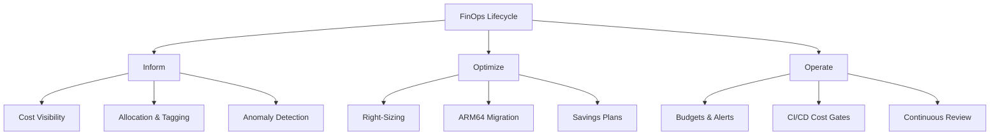

---

## 1. Cost Principles

### 1.1 Pay-Per-Use

Every service in this framework is selected for its pay-per-use pricing model. We do not provision
idle capacity unless explicitly justified by latency requirements.

| Principle | Description | Impact |
|-----------|-------------|--------|
| **Pay-per-use** | Pay only for consumed resources (invocations, requests, bytes) | Eliminates idle cost |
| **Scales-to-zero** | Services incur $0 when no traffic flows | Dev/staging cost → ~$0 overnight |
| **ARM64-first** | Graviton processors for all compute workloads | **20-40% cost reduction** |
| **Right-sizing** | Match resource allocation to actual utilization | **25-60% savings** on over-provisioned workloads |

### 1.2 Scales-to-Zero Architecture

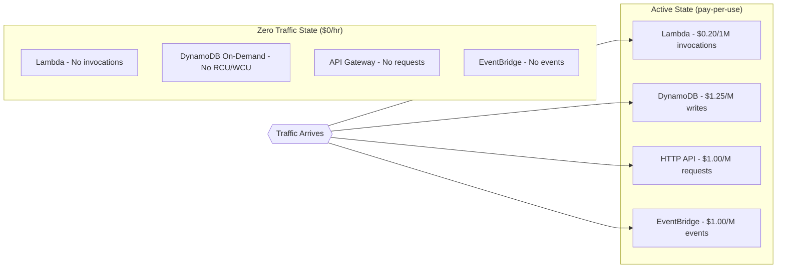

### 1.3 ARM64 Savings Strategy

All compute workloads MUST use ARM64 (Graviton) unless a documented technical blocker exists:

- **Lambda**: ARM64 = **20% cheaper** per ms of execution + **up to 34% better price/performance**
- **ECS Fargate**: ARM64 = **20% cheaper** per vCPU-hour
- **ElastiCache**: Graviton3 nodes = **20-30% cheaper** than x86 equivalents
- **RDS/Aurora**: Graviton = **up to 35% savings**

### 1.4 Right-Sizing

Right-sizing is enforced through:
1. **Lambda Power Tuning** — automated memory/CPU optimization per function
2. **Fargate task profiling** — CPU/memory utilization analysis weekly
3. **DynamoDB auto-scaling** — target 70% utilization on provisioned tables

---

## 2. Tagging Strategy

### 2.1 Mandatory Tags

Every resource MUST carry these tags. Untagged resources trigger alerts and are flagged for remediation.

| Tag Key | Description | Example Values | Enforcement |
|---------|-------------|----------------|-------------|
| `cost:project` | Project or product name | `marketplace`, `payments` | **HARD BLOCK** |
| `cost:environment` | Deployment environment | `prod`, `staging`, `dev` | **HARD BLOCK** |
| `cost:team` | Owning team | `platform`, `checkout`, `search` | **HARD BLOCK** |
| `cost:cell` | Cell-based deployment identifier | `cell-us-east-1-a`, `cell-eu-west-1-b` | **HARD BLOCK** |
| `cost:service` | Microservice name | `order-api`, `inventory-sync` | **HARD BLOCK** |
| `cost:managed-by` | IaC tool identifier | `cdk`, `terraform` | WARN |
| `cost:data-classification` | Data sensitivity level | `public`, `internal`, `confidential` | WARN |

### 2.2 CDK Aspect for Tag Enforcement

```typescript
import { IAspect, Annotations, Stack, Tags } from 'aws-cdk-lib';
import { IConstruct } from 'constructs';
import { CfnResource } from 'aws-cdk-lib';

const MANDATORY_TAGS = [
  'cost:project',
  'cost:environment',
  'cost:team',
  'cost:cell',
  'cost:service',
] as const;

/**
 * CDK Aspect that enforces mandatory cost-allocation tags on all resources.
 * Add to your App or Stack: Aspects.of(app).add(new CostTagEnforcementAspect());
 */
export class CostTagEnforcementAspect implements IAspect {
  public visit(node: IConstruct): void {
    if (node instanceof CfnResource) {
      const stack = Stack.of(node);
      const existingTags = Tags.of(node);

      for (const requiredTag of MANDATORY_TAGS) {
        // Check if tag exists in the resource's tag list
        const cfnTags = (node as any).tags?.renderedTags ?? [];
        const hasTag = cfnTags.some(
          (t: { key: string }) => t.key === requiredTag
        );

        if (!hasTag) {
          Annotations.of(node).addError(
            `[FinOps] Missing mandatory tag "${requiredTag}" on ${node.node.path}. ` +
            `All resources must have cost-allocation tags for chargeback.`
          );
        }
      }
    }
  }
}

// Usage in CDK App
// import { App, Aspects } from 'aws-cdk-lib';
// const app = new App();
// Aspects.of(app).add(new CostTagEnforcementAspect());
```

### 2.3 Tag Propagation

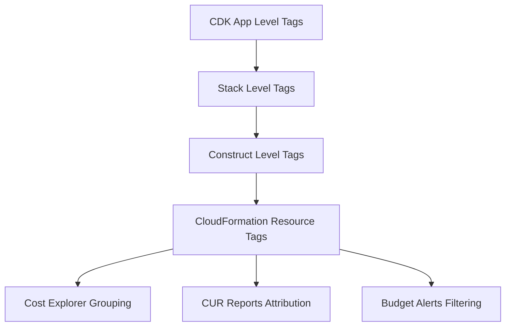


---

## 3. Service-Level Cost Optimization

### 3.1 Optimization Matrix

| Service | Optimization | Savings | Implementation | Priority |
|---------|-------------|---------|----------------|----------|
| **Lambda** | ARM64 (Graviton) | **20%** per-ms cost reduction | Set `architecture: arm64` | P0 |
| **Lambda** | SnapStart (Java/Python) | **Free** — eliminates cold starts | Enable in function config | P0 |
| **Lambda** | Right-size memory (Power Tuning) | **25-60%** | Run `aws-lambda-power-tuning` weekly | P1 |
| **Lambda** | Provisioned Concurrency (remove if unused) | **$0 idle cost** | Audit monthly | P1 |
| **DynamoDB** | On-Demand mode (unpredictable traffic) | **Scales to zero** | Default for new tables | P0 |
| **DynamoDB** | Reserved Capacity (stable traffic) | **Up to 77%** vs on-demand | Commit annually for predictable tables | P1 |
| **DynamoDB** | Standard-IA table class | **60%** storage savings | Tables accessed < 20% of time | P2 |
| **ECS Fargate** | ARM64 (Graviton) | **20%** per vCPU-hour | Set `runtimePlatform.cpuArchitecture: ARM64` | P0 |
| **ECS Fargate** | Spot capacity | **Up to 70%** | Non-critical batch workloads | P1 |
| **ECS Fargate** | Right-size tasks | **30-50%** | Analyze with Container Insights | P1 |
| **ElastiCache** | Valkey (OSS) over Redis | **33% cheaper** licensing | Migrate to Valkey engine | P0 |
| **ElastiCache** | Graviton3 nodes | **20%** vs x86 | Use `cache.r7g.*` instance family | P1 |
| **ElastiCache** | Reserved nodes | **Up to 55%** | 1-year commitment for prod | P2 |
| **API Gateway** | HTTP API over REST API | **70% cheaper** | $1.00 vs $3.50 per million requests | P0 |
| **API Gateway** | Remove unused stages | **$0 idle** | Audit quarterly | P2 |
| **EventBridge** | Scheduler free tier | **14M free invocations/month** | Use Scheduler over cron-Lambda | P0 |
| **EventBridge** | Archive only what's needed | **Storage cost** | Set retention policies | P2 |
| **S3** | Intelligent-Tiering | **Up to 95%** for cold data | Enable on all data buckets | P1 |
| **CloudWatch** | Log retention policies | **50-80%** | Set 30d dev, 90d staging, 1yr prod | P1 |

### 3.2 Lambda Optimization Deep Dive

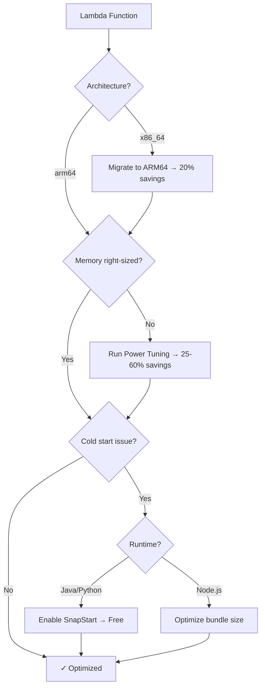

### 3.3 DynamoDB Cost Decision Tree

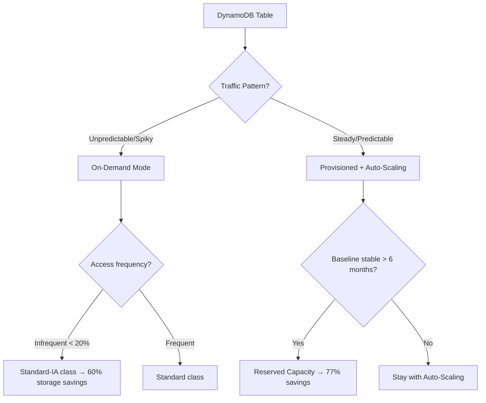


---

## 4. AWS FinOps Agent

### 4.1 What It Does

The AWS FinOps Agent (GA 2026) provides AI-powered cost optimization recommendations directly
in your workflow. It continuously analyzes spend patterns, detects anomalies, and suggests
actionable optimizations.

| Capability | Description |
|-----------|-------------|
| **Spend Forecasting** | ML-based 30/60/90 day cost projections per account |
| **Anomaly Explanation** | Natural-language root cause analysis for cost spikes |
| **Optimization Recommendations** | Right-sizing, commitment, and architecture suggestions |
| **Waste Detection** | Identifies idle/underutilized resources automatically |
| **Chargeback Reports** | Automated team-level cost attribution |

### 4.2 How to Enable

```bash
# Enable FinOps Agent via AWS CLI
aws finops enable-agent \
  --management-account-id 123456789012 \
  --linked-accounts "all" \
  --analysis-scope "FULL" \
  --recommendation-level "AGGRESSIVE"

# Verify activation
aws finops get-agent-status
```

### 4.3 Slack Integration

```yaml
# finops-agent-slack-config.yaml
integration:
  type: slack
  channel: "#finops-alerts"
  notifications:
    - type: anomaly_detected
      threshold: 10  # % above baseline
      severity: [high, critical]
    - type: optimization_found
      min_savings: 100  # USD/month minimum
    - type: budget_exceeded
      threshold: [80, 90, 100]  # % thresholds
  weekly_digest:
    enabled: true
    day: monday
    time: "09:00"
    timezone: "America/Chicago"
```

### 4.4 Jira Integration

```yaml
# finops-agent-jira-config.yaml
integration:
  type: jira
  project: "FINOPS"
  auto_create_tickets:
    - trigger: optimization_recommendation
      min_savings: 500  # USD/month
      issue_type: "Task"
      priority: "Medium"
      assignee_rule: "tag:cost:team"  # Auto-assign by team tag
    - trigger: anomaly_critical
      issue_type: "Bug"
      priority: "High"
      labels: ["cost-anomaly", "auto-created"]
  sla:
    acknowledge: 24h
    resolve: 7d
```

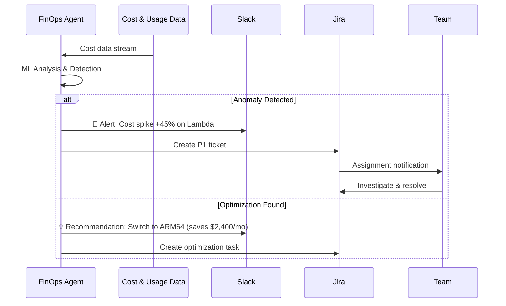

---

## 5. Cost in CI/CD Pipeline

### 5.1 Cost Analysis Gate

Every pull request MUST pass a cost analysis check before merge. We use `thothctl` for
infrastructure cost estimation.

```yaml
# .github/workflows/cost-gate.yaml
name: Cost Analysis Gate
on:
  pull_request:
    paths:
      - 'infrastructure/**'
      - 'cdk/**'

jobs:
  cost-analysis:
    runs-on: ubuntu-latest
    steps:
      - uses: actions/checkout@v4

      - name: Install thothctl
        run: |
          curl -sSL https://get.thothctl.io | bash
          thothctl --version

      - name: Synthesize CDK
        run: |
          cd infrastructure
          npx cdk synth --output cdk.out

      - name: Run Cost Analysis
        id: cost
        run: |
          thothctl check iac \
            --type cost-analysis \
            --source ./cdk.out \
            --format json \
            --baseline main \
            --output cost-report.json

      - name: Enforce Cost Gate
        run: |
          MONTHLY_DELTA=$(jq '.monthly_cost_delta' cost-report.json)
          PERCENT_CHANGE=$(jq '.percent_change' cost-report.json)

          echo "Monthly cost delta: \$${MONTHLY_DELTA}"
          echo "Percent change: ${PERCENT_CHANGE}%"

          # HARD GATE: Block if cost increase > $500/month or > 20%
          if (( $(echo "$MONTHLY_DELTA > 500" | bc -l) )); then
            echo "::error::Cost increase exceeds $500/month threshold"
            exit 1
          fi

          if (( $(echo "$PERCENT_CHANGE > 20" | bc -l) )); then
            echo "::error::Cost increase exceeds 20% threshold"
            exit 1
          fi

      - name: Post Cost Comment on PR
        uses: actions/github-script@v7
        with:
          script: |
            const report = require('./cost-report.json');
            const body = `## 💰 Cost Analysis Report
            | Metric | Value |
            |--------|-------|
            | Current Monthly | \$${report.current_monthly} |
            | Projected Monthly | \$${report.projected_monthly} |
            | Delta | \$${report.monthly_cost_delta} (${report.percent_change}%) |
            | Status | ${report.monthly_cost_delta > 500 ? '🔴 BLOCKED' : '🟢 PASSED'} |
            `;
            github.rest.issues.createComment({
              issue_number: context.issue.number,
              owner: context.repo.owner,
              repo: context.repo.repo,
              body: body
            });
```

### 5.2 Cost Gate Thresholds

| Environment | Max Monthly Increase | Max % Change | Approval Required |
|-------------|---------------------|--------------|-------------------|
| Dev | $100 | 50% | None (warn only) |
| Staging | $250 | 30% | Tech Lead |
| Production | $500 | 20% | FinOps Team + VP Eng |

### 5.3 Pipeline Cost Visibility

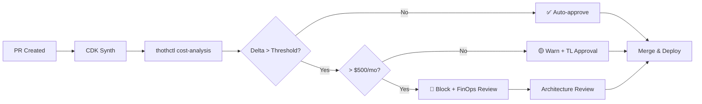


---

## 6. AWS Budgets

### 6.1 Per-Account Budgets

Every AWS account has a monthly budget with tiered alerts:

```typescript
// CDK Budget construct
import { CfnBudget } from 'aws-cdk-lib/aws-budgets';

new CfnBudget(this, 'AccountBudget', {
  budget: {
    budgetName: `${accountName}-monthly-budget`,
    budgetType: 'COST',
    timeUnit: 'MONTHLY',
    budgetLimit: { amount: 10000, unit: 'USD' },
  },
  notificationsWithSubscribers: [
    {
      notification: {
        comparisonOperator: 'GREATER_THAN',
        notificationType: 'ACTUAL',
        threshold: 80,
        thresholdType: 'PERCENTAGE',
      },
      subscribers: [{ subscriptionType: 'EMAIL', address: 'finops@company.com' }],
    },
    {
      notification: {
        comparisonOperator: 'GREATER_THAN',
        notificationType: 'ACTUAL',
        threshold: 90,
        thresholdType: 'PERCENTAGE',
      },
      subscribers: [{ subscriptionType: 'SNS', address: snsTopicArn }],
    },
    {
      notification: {
        comparisonOperator: 'GREATER_THAN',
        notificationType: 'FORECASTED',
        threshold: 100,
        thresholdType: 'PERCENTAGE',
      },
      subscribers: [{ subscriptionType: 'SNS', address: pagerDutyArn }],
    },
  ],
});
```

### 6.2 Per-OU Budget Hierarchy

| Organizational Unit | Monthly Budget | Alert Thresholds | Escalation |
|---------------------|---------------|------------------|------------|
| **Production** | $50,000 | 70%, 85%, 95%, 100% | FinOps → VP Eng → CTO |
| **Staging** | $5,000 | 80%, 90%, 100% | FinOps → Tech Lead |
| **Development** | $2,000 | 80%, 100% | Team Lead |
| **Sandbox** | $500 | 90%, 100% | Individual → Auto-shutdown |
| **Shared Services** | $15,000 | 75%, 90%, 100% | Platform Lead → VP Eng |

### 6.3 Budget Actions (Auto-Remediation)

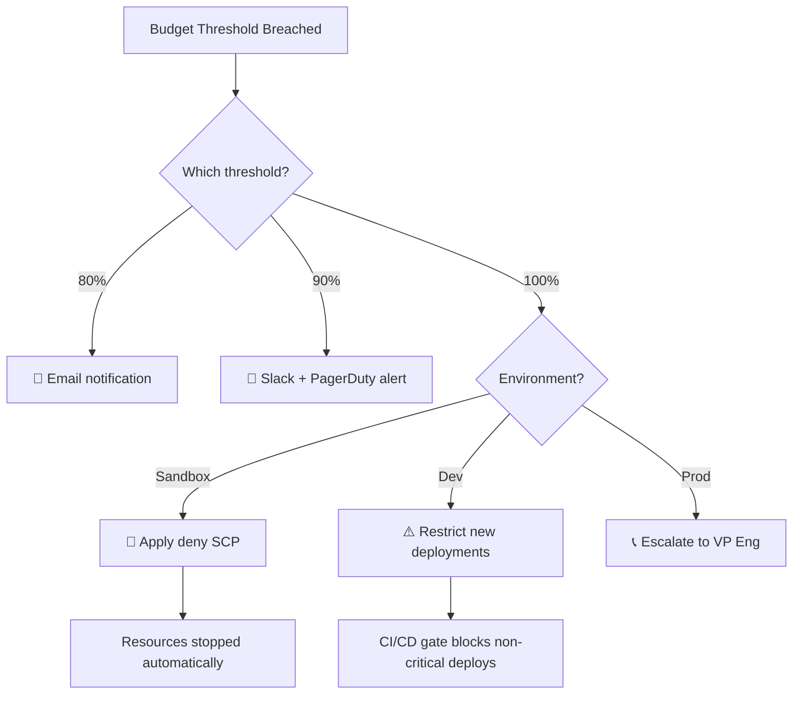

---

## 7. Cost Anomaly Detection

### 7.1 Setup

```typescript
// CDK Cost Anomaly Detection
import { CfnAnomalyMonitor, CfnAnomalySubscription } from 'aws-cdk-lib/aws-ce';

// Monitor per service
const serviceMonitor = new CfnAnomalyMonitor(this, 'ServiceMonitor', {
  monitorName: 'serverless-service-monitor',
  monitorType: 'DIMENSIONAL',
  monitorDimension: 'SERVICE',
});

// Monitor per cost-allocation tag
const teamMonitor = new CfnAnomalyMonitor(this, 'TeamMonitor', {
  monitorName: 'team-cost-monitor',
  monitorType: 'CUSTOM',
  monitorSpecification: JSON.stringify({
    Tags: { Key: 'cost:team', Values: [] },  // Monitor all teams
  }),
});

// Subscription for alerts
new CfnAnomalySubscription(this, 'AnomalyAlerts', {
  subscriptionName: 'finops-anomaly-alerts',
  monitorArnList: [serviceMonitor.attrMonitorArn, teamMonitor.attrMonitorArn],
  subscribers: [
    { type: 'EMAIL', address: 'finops@company.com' },
    { type: 'SNS', address: anomalySnsTopic.topicArn },
  ],
  frequency: 'IMMEDIATE',
  thresholdExpression: {
    dimensions: {
      key: 'ANOMALY_TOTAL_IMPACT_ABSOLUTE',
      matchOptions: ['GREATER_THAN_OR_EQUAL'],
      values: ['100'],  // Alert when impact >= $100
    },
  },
});
```

### 7.2 Anomaly Response Runbook

| Severity | Impact | Response Time | Action |
|----------|--------|---------------|--------|
| **Critical** | > $1,000/day | 15 minutes | Page on-call, investigate immediately |
| **High** | $500-$1,000/day | 1 hour | Slack alert, investigate same day |
| **Medium** | $100-$500/day | 4 hours | Email notification, investigate within 24h |
| **Low** | < $100/day | 24 hours | Weekly review digest |

### 7.3 Anomaly Investigation Flow

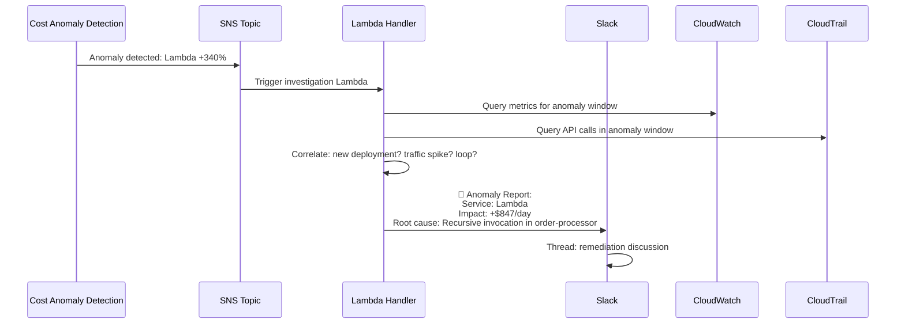

---

## 8. Savings Plans

### 8.1 When to Commit

| Criteria | Ready to Commit? | Recommendation |
|----------|-----------------|----------------|
| Workload running > 6 months with stable baseline | ✅ Yes | 1-year No Upfront |
| Workload running > 12 months, predictable growth | ✅ Yes | 3-year Partial Upfront |
| New workload < 3 months | ❌ No | Wait for baseline |
| Highly variable/seasonal workload | ⚠️ Partial | Commit only to trough baseline |
| Workload being migrated/deprecated | ❌ No | Do not commit |

### 8.2 Compute Savings Plans vs EC2 Savings Plans

| Feature | Compute Savings Plans | EC2 Instance Savings Plans |
|---------|----------------------|---------------------------|
| **Discount** | Up to **66%** | Up to **72%** |
| **Applies to** | Lambda, Fargate, EC2 | EC2 only |
| **Flexibility** | Any region, family, OS, tenancy | Specific instance family + region |
| **Best for** | Serverless-heavy workloads | Large EC2 fleets |
| **Our recommendation** | ✅ **PRIMARY** | Only for dedicated EC2 |

### 8.3 Savings Plan Coverage Strategy

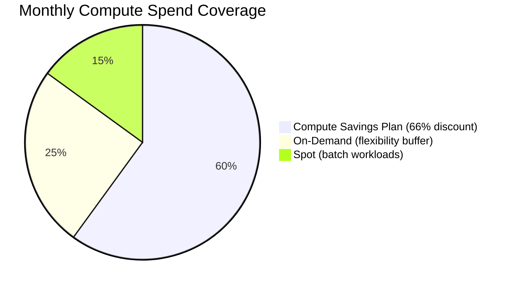

**Strategy**: Cover **60%** of steady-state compute with Compute Savings Plans.
Keep 25% on-demand for growth and 15% on Spot for batch/non-critical workloads.

### 8.4 Annual Savings Projection

| Service | Monthly On-Demand | With Savings Plans | Monthly Savings | Annual Savings |
|---------|-------------------|-------------------|-----------------|----------------|
| Lambda | $8,000 | $3,200 (60% SP) | **$4,800** | **$57,600** |
| Fargate | $12,000 | $5,400 (55% SP) | **$6,600** | **$79,200** |
| EC2 (remaining) | $4,000 | $1,600 (60% SP) | **$2,400** | **$28,800** |
| **Total** | **$24,000** | **$10,200** | **$13,800** | **$165,600** |


---

## 9. Cost Allocation

### 9.1 Cost and Usage Reports (CUR)

CUR 2.0 is configured to deliver hourly granularity data to S3 with Athena integration:

```typescript
// CDK CUR Report Configuration
import { CfnReportDefinition } from 'aws-cdk-lib/aws-cur';

new CfnReportDefinition(this, 'CURReport', {
  reportName: 'serverless-framework-cur',
  timeUnit: 'HOURLY',
  format: 'Parquet',
  compression: 'Parquet',
  s3Bucket: curBucket.bucketName,
  s3Prefix: 'cur-data/',
  s3Region: 'us-east-1',
  additionalSchemaElements: ['RESOURCES', 'SPLIT_COST_ALLOCATION_DATA'],
  reportVersioning: 'OVERWRITE_REPORT',
  refreshClosedReports: true,
  additionalArtifacts: ['ATHENA'],
});
```

### 9.2 Per-Cell Cost Attribution

Our cell-based architecture requires cost attribution at the cell level. The `cost:cell` tag enables this:

```sql
-- Athena query: Monthly cost per cell
SELECT
  resource_tags_cost_cell AS cell_id,
  resource_tags_cost_service AS service_name,
  line_item_product_code AS aws_service,
  SUM(line_item_unblended_cost) AS monthly_cost,
  SUM(line_item_usage_amount) AS total_usage
FROM cur_database.cur_table
WHERE month = '07' AND year = '2026'
  AND resource_tags_cost_cell IS NOT NULL
GROUP BY 1, 2, 3
ORDER BY monthly_cost DESC;
```

```sql
-- Athena query: Cost per team with month-over-month change
WITH current_month AS (
  SELECT
    resource_tags_cost_team AS team,
    SUM(line_item_unblended_cost) AS cost
  FROM cur_database.cur_table
  WHERE month = '07' AND year = '2026'
  GROUP BY 1
),
previous_month AS (
  SELECT
    resource_tags_cost_team AS team,
    SUM(line_item_unblended_cost) AS cost
  FROM cur_database.cur_table
  WHERE month = '06' AND year = '2026'
  GROUP BY 1
)
SELECT
  c.team,
  c.cost AS current_cost,
  p.cost AS previous_cost,
  ROUND((c.cost - p.cost) / p.cost * 100, 2) AS pct_change
FROM current_month c
JOIN previous_month p ON c.team = p.team
ORDER BY c.cost DESC;
```

### 9.3 Cost Attribution Architecture

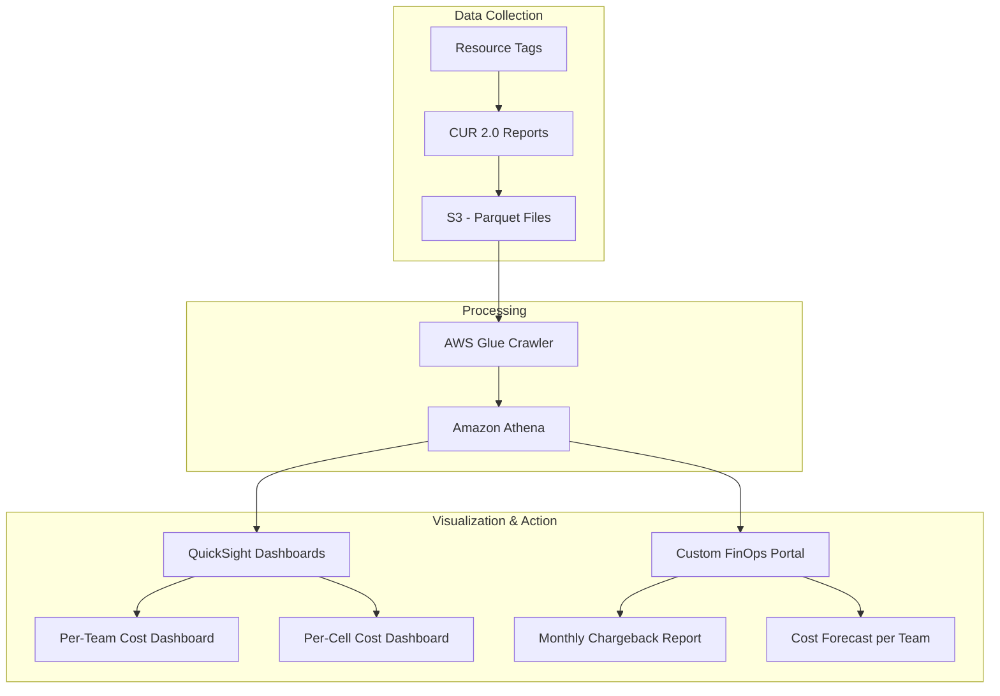

### 9.4 Shared Cost Distribution

Shared services (networking, observability, security tooling) are distributed proportionally:

| Shared Service | Distribution Method | Basis |
|---------------|--------------------|----- |
| VPC / Transit Gateway | Proportional | Data transfer volume |
| CloudWatch (shared) | Proportional | Log volume per service |
| WAF / Shield | Equal split | Per-cell count |
| Secrets Manager | Direct attribution | Tag-based |
| KMS | Direct attribution | Tag-based |

---

## 10. FinOps Checklist

### 10.1 Pre-Deployment Checklist

- [ ] All resources tagged with mandatory `cost:*` tags
- [ ] ARM64 architecture selected for Lambda, Fargate, ElastiCache
- [ ] HTTP API Gateway used (not REST API) unless REST features required
- [ ] DynamoDB table class appropriate (Standard vs Standard-IA)
- [ ] CloudWatch log retention set (not infinite)
- [ ] EventBridge Scheduler used instead of cron-triggered Lambda where applicable
- [ ] `thothctl check iac --type cost-analysis` passes in CI/CD
- [ ] Cost estimate reviewed and approved per threshold policy
- [ ] No provisioned concurrency unless cold-start SLA requires it

### 10.2 Weekly Review Checklist

- [ ] Review Cost Anomaly Detection alerts (resolve within SLA)
- [ ] Check Lambda Power Tuning recommendations
- [ ] Verify budget utilization across all accounts
- [ ] Review idle/unused resource report from FinOps Agent
- [ ] Check Savings Plan utilization rate (target > 95%)

### 10.3 Monthly Review Checklist

- [ ] Generate per-team chargeback reports from CUR
- [ ] Review Savings Plan coverage and consider new commitments
- [ ] Audit DynamoDB reserved capacity utilization
- [ ] Review top-10 cost drivers per account
- [ ] Update cost forecasts for next quarter
- [ ] Validate Spot termination rate and batch job reliability
- [ ] Review FinOps Agent optimization recommendations backlog

### 10.4 Quarterly Review Checklist

- [ ] Evaluate new Savings Plan commitments (60% coverage target)
- [ ] Review ElastiCache reserved node renewals
- [ ] Assess Valkey migration progress
- [ ] Benchmark current architecture against latest AWS pricing
- [ ] Update this document with new optimizations/learnings
- [ ] Present FinOps scorecard to leadership

### 10.5 Cost Governance Maturity Model

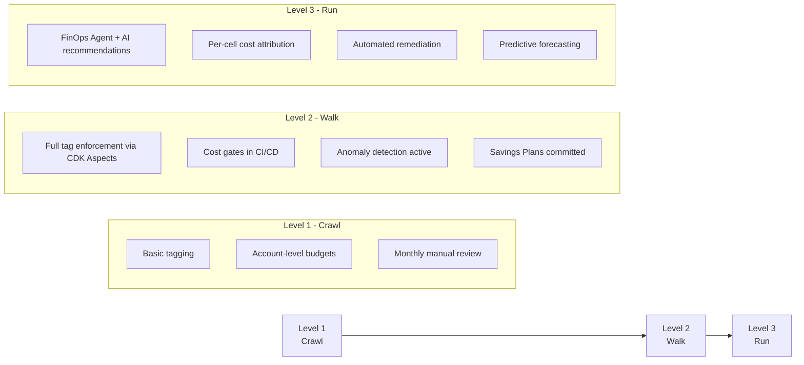

---

## Summary of Expected Savings

| Optimization | Annual Savings Estimate | Effort |
|-------------|------------------------|--------|
| ARM64 migration (Lambda + Fargate) | **$96,000** | Medium |
| HTTP API Gateway migration | **$42,000** | Low |
| Valkey migration (from Redis) | **$28,800** | Medium |
| Savings Plans (Compute) | **$165,600** | Low |
| Right-sizing (Power Tuning + Fargate) | **$72,000** | Low |
| EventBridge Scheduler (free tier) | **$16,800** | Low |
| CloudWatch log retention | **$12,000** | Low |
| **Total Projected Annual Savings** | **$433,200** | — |

---

*Document maintained by Platform Engineering. Review cycle: Monthly.*  
*Next review: 2026-08-29*
