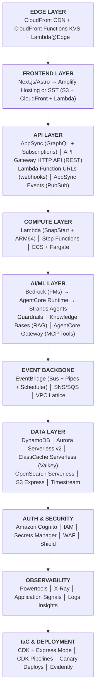
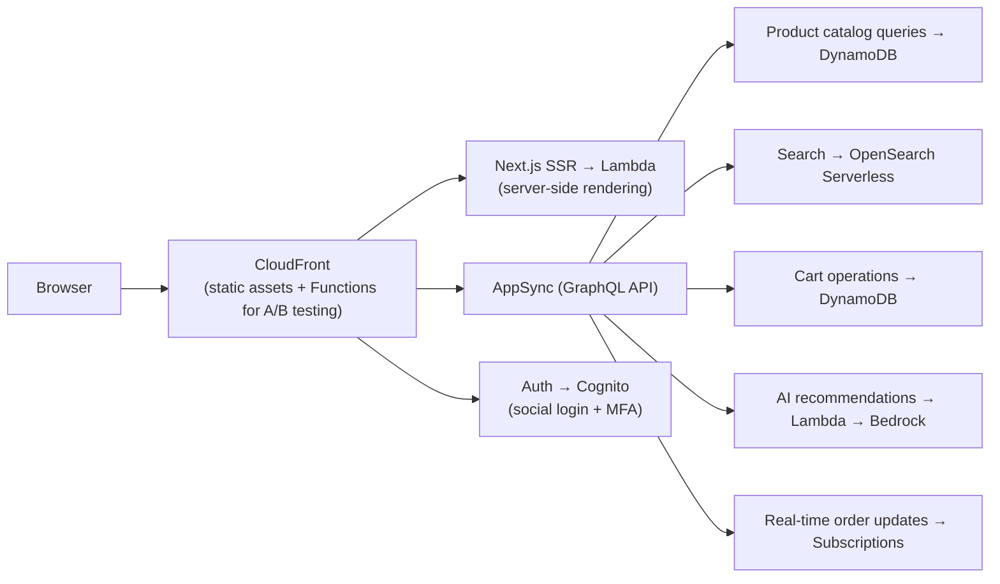
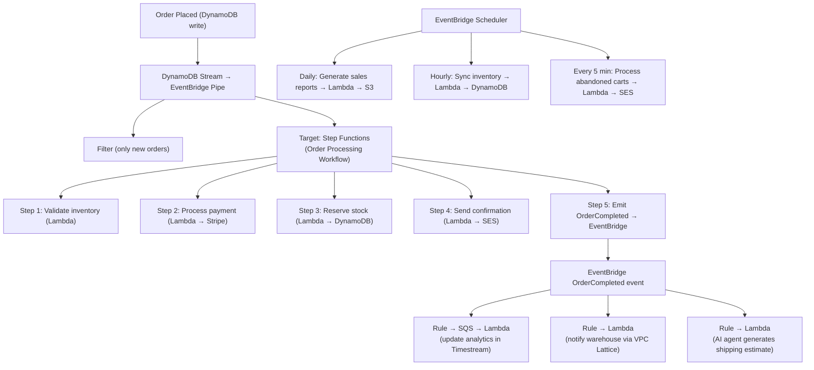
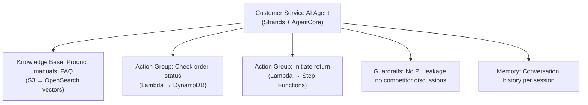
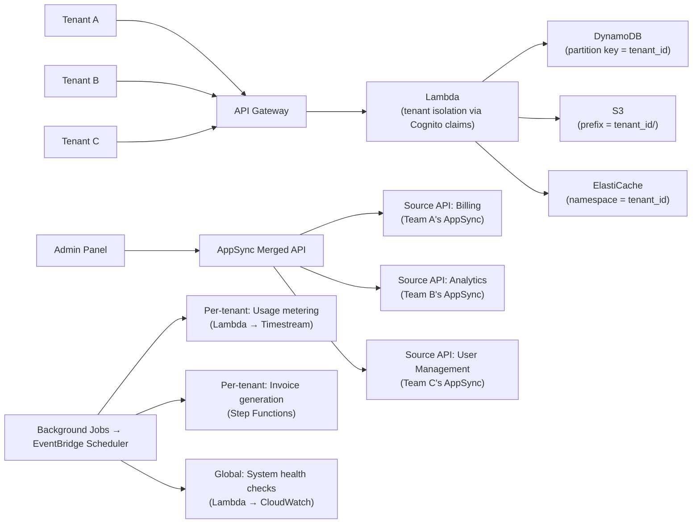
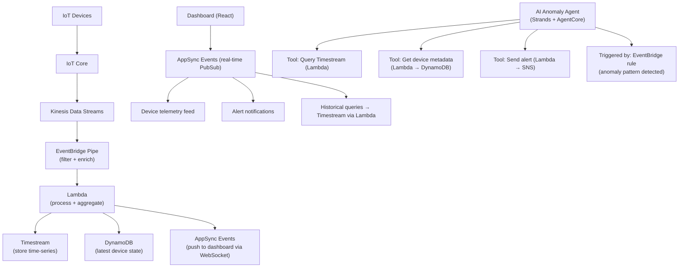

# Reference Architecture — Full Serverless Application 2026

## Complete Stack Diagram



---

## Example: E-Commerce Application

### Synchronous Flow (User-Facing)



### Asynchronous Flow (Backend Processing)



### AI Layer



---

## Example: SaaS Platform

### Multi-Tenant Architecture



---

## Example: IoT / Real-Time Dashboard



---

## IaC Implementation (CDK + Express)

### Project Structure

```
my-app/
├── bin/
│   └── app.ts                    # CDK app entry point
├── lib/
│   ├── stacks/
│   │   ├── api-stack.ts          # AppSync / API Gateway
│   │   ├── compute-stack.ts      # Lambda functions
│   │   ├── data-stack.ts         # DynamoDB, Aurora, ElastiCache
│   │   ├── events-stack.ts       # EventBridge, SQS
│   │   ├── ai-stack.ts           # Bedrock, AgentCore
│   │   ├── frontend-stack.ts     # CloudFront, S3, hosting
│   │   └── observability-stack.ts # Alarms, dashboards
│   ├── constructs/
│   │   ├── secure-api.ts         # L3: API + WAF + Auth
│   │   └── event-processor.ts    # L3: SQS + DLQ + Lambda
│   └── pipeline-stack.ts         # CDK Pipelines CI/CD
├── lambda/
│   ├── api/                      # API handler functions
│   ├── events/                   # Event processing functions
│   └── ai/                       # AI agent action handlers
├── frontend/
│   └── next-app/                 # Next.js application
├── cdk.json
└── package.json
```

### Development Commands

```bash
# Development iteration (seconds with Express mode)
cdk deploy --express

# Lambda code only (instant, bypasses CloudFormation)
cdk deploy --hotswap

# Production deployment (full stabilization + canary)
cdk deploy  # via CDK Pipelines with approval gates

# Destroy dev environment
cdk destroy --express
```

---

## Cost Optimization Strategies

| Strategy | Savings | Applies To |
|----------|---------|------------|
| ARM64/Graviton | ~20% | Lambda |
| SnapStart | Free cold start fix | Lambda (Python/Java/.NET) |
| Valkey over Redis | 33% | ElastiCache Serverless |
| HTTP API over REST API | 70% | API Gateway |
| Express Workflows | Per-execution vs per-transition | Step Functions |
| On-Demand over Provisioned | Avoid idle capacity | DynamoDB |
| Scales-to-zero | No idle costs | OpenSearch, ElastiCache, Aurora |
| EventBridge Scheduler | 14M free/month | Scheduled tasks |
| CloudFront Functions over Lambda@Edge | Fraction of cost | Edge compute |

---

## Security Best Practices

1. **Least privilege IAM** — scoped per-function, per-resource
2. **WAF on all public APIs** — rate limiting, geo-blocking, bot mitigation
3. **Cognito for auth** — MFA enabled, short token expiration
4. **Secrets Manager** — no hardcoded secrets, automatic rotation
5. **VPC for sensitive workloads** — Lambda in VPC when accessing RDS/ElastiCache
6. **Guardrails on all AI** — prevent data leakage and prompt injection
7. **Cedar policies for agents** — fine-grained agent action authorization
8. **cdk-nag** — automated security validation at build time
9. **Encryption everywhere** — at-rest (KMS) and in-transit (TLS)
10. **DLQs on all async processing** — no lost messages
