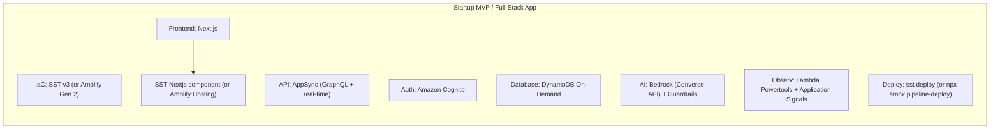
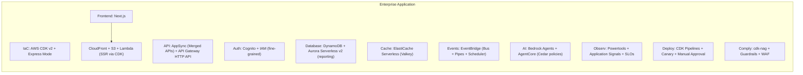
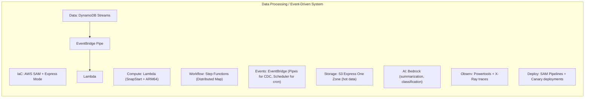
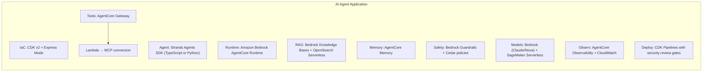
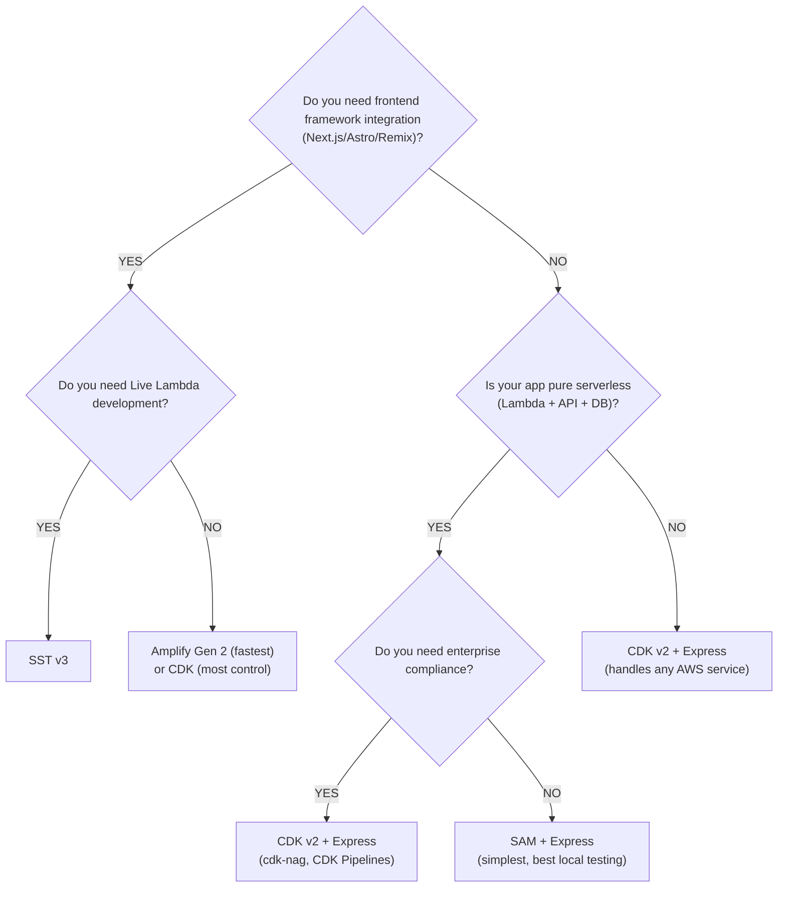

# Recommendations — AWS Serverless 2026

## The New Paradigm Post-CloudFormation Express

CloudFormation Express mode (June 2026) fundamentally changes the IaC recommendation landscape. The "CloudFormation is too slow" narrative that drove adoption of SST/Terraform/Pulumi is no longer valid.

---

## Primary Recommendation: CDK v2 + Express Mode

For **AWS-only teams** building serverless applications in 2026, **AWS CDK v2 with Express mode** is the strongest overall choice:

| Dimension | CDK v2 + Express |
|-----------|-----------------|
| Speed | `--express` (seconds) + `--hotswap` (instant for Lambda) |
| Type Safety | Full TypeScript/Python/Java with IDE support |
| Abstractions | L2 + L3 constructs reduce boilerplate by 70%+ |
| Compliance | cdk-nag validates security automatically |
| CI/CD | CDK Pipelines (self-mutating, cross-account) |
| Ecosystem | Construct Hub (thousands of community constructs) |
| AI Integration | Largest template corpus for AI-generated infrastructure |
| Maturity | Backed by AWS, used in production across AWS services |

---

## Recommended Stack by Application Type

### 1. Startup MVP / Full-Stack App



**Why:** Fastest time-to-production. SST provides Live Lambda development. Amplify Gen 2 provides even higher abstraction with built-in auth/data/AI.

### 2. Enterprise Application



**Why:** CDK provides type safety, compliance validation, self-mutating CI/CD, and the largest AWS ecosystem. Express mode makes iteration fast. Multi-team support via AppSync Merged APIs.

### 3. Data Processing / Event-Driven System



**Why:** SAM is simplest for Lambda-centric workloads. Express mode + sam sync provides rapid iteration. Step Functions Distributed Map handles massive parallel processing.

### 4. AI Agent Application



**Why:** AgentCore provides production-grade serverless agent execution. Strands is AWS-battle-tested (powers Kiro). CDK manages all infrastructure including agent resources.

### 5. Multi-Cloud / Platform Team

```
IaC:      Terraform (or OpenTofu)
AWS:      Lambda, DynamoDB, EventBridge
GCP/Azure: Comparable services
State:    Terraform Cloud / S3 backend
Modules:  terraform-aws-lambda, custom modules
Testing:  SAM CLI (via Serverless.tf integration)
Deploy:   Terraform Cloud / GitHub Actions
```

**Why:** Only Terraform provides true multi-cloud with a unified language and state management.

---

## Key Decision: CDK vs SAM vs SST



---

## The Express Mode Development Workflow

```bash
# Morning: Start development
cdk deploy --express          # Deploy full stack in seconds

# During the day: Iterate on Lambda code
cdk deploy --hotswap          # Instant Lambda updates (no CFN)

# Infrastructure changes (add a DynamoDB table, new API route)
cdk deploy --express          # Still seconds, not minutes

# Ready for staging
git push                      # CDK Pipelines auto-deploys to staging
                              # Standard mode (full stabilization)
                              # Canary deployment strategy

# Ready for production
# Manual approval gate in pipeline
# Standard mode + canary + alarms + auto-rollback
```

---

## Principles for 2026

1. **Default serverless** — Use managed services that scale to zero
2. **Express mode for dev, Standard for prod** — Fast iteration, safe deployments
3. **Event-driven architecture** — Decouple via EventBridge, process async
4. **AI-native** — Every app should integrate Bedrock (just an API call)
5. **MCP as tool standard** — Build tools as Lambda, expose via AgentCore Gateway
6. **Observe everything** — Powertools + Application Signals = zero-effort APM
7. **Deploy safely** — Canary via CodeDeploy, never all-at-once
8. **Cost-optimize** — ARM64, SnapStart, Valkey, HTTP API, scales-to-zero services
9. **Compliance as code** — cdk-nag + Guardrails + Cedar policies
10. **AI-assisted development** — Use Express mode feedback loops with Kiro

---

## What CloudFormation Express Means for the Ecosystem

### Winners
- **CDK** — Gains speed without losing anything. Now has best overall package.
- **SAM** — Simple + fast. Perfect for serverless microservices.
- **CloudFormation native** — Direct templates now deploy in seconds.
- **AI agents** — Sub-minute feedback loops enable rapid infrastructure iteration.

### Repositioned
- **SST v3** — Live Lambda remains unique, but speed is no longer a differentiator.
- **Terraform** — Multi-cloud is its story now, not speed.
- **Pulumi** — Code-first without CFN opinions, but CDK offers similar with bigger ecosystem.

### The Bottom Line

> In 2026, there is no longer a compelling speed reason to avoid CloudFormation-based tools.
> CDK + Express mode gives you: fast deployments + type safety + L2/L3 abstractions + 
> compliance validation + self-mutating CI/CD + the largest AWS ecosystem.
>
> Choose SST v3 for Live Lambda DX. Choose Terraform for multi-cloud. 
> Choose CDK for everything else.
