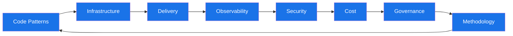
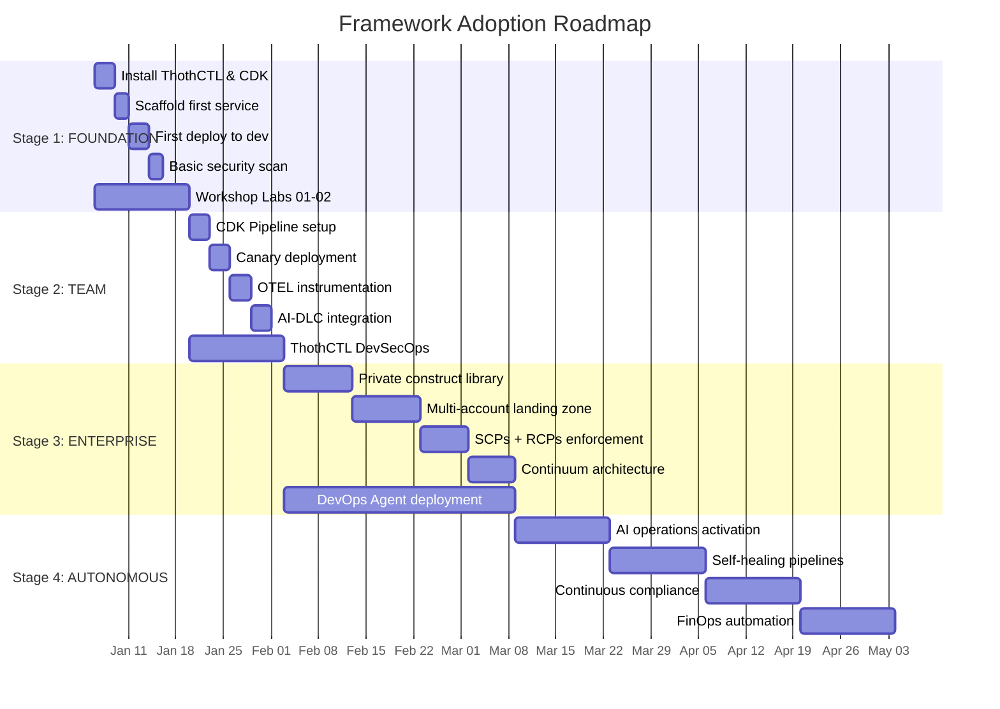
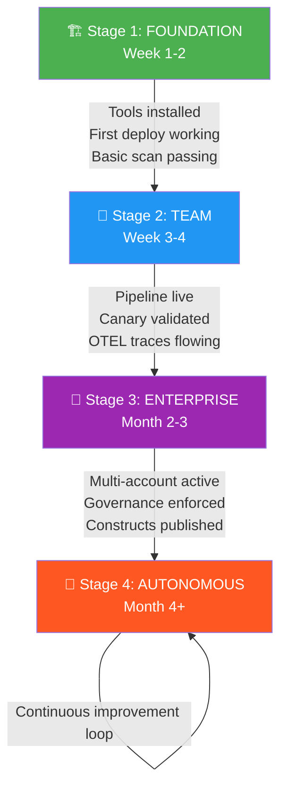
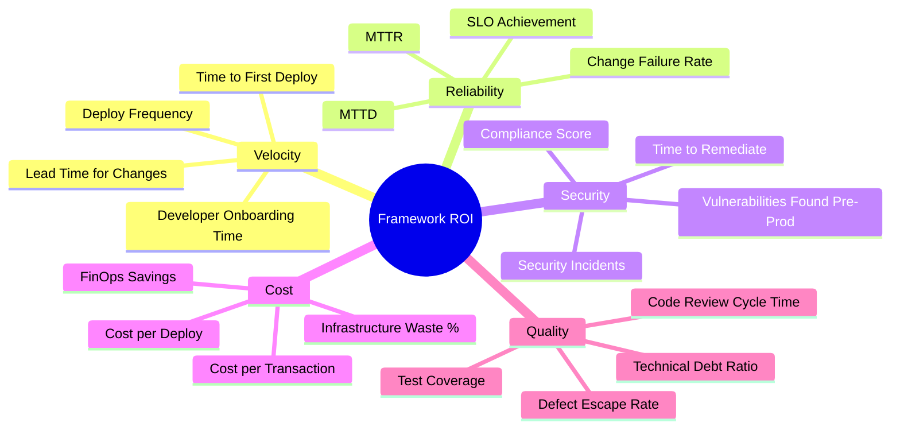
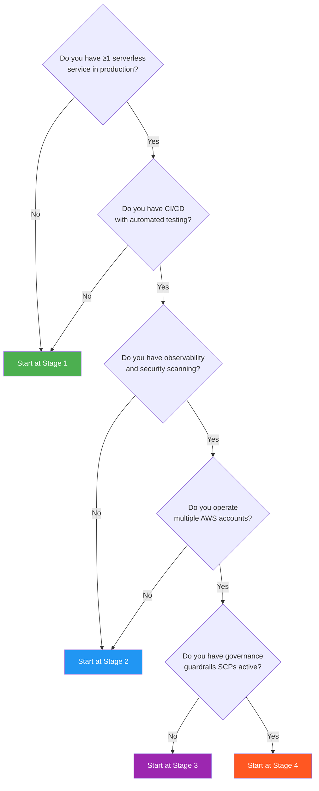

# 23 — Adoption Roadmap & Framework Comparison

> **Document Version:** 2.0 — July 2026  
> **Audience:** Engineering Leadership, Platform Teams, DevOps Engineers, Solution Architects  
> **Purpose:** Justify adoption, compare alternatives, and provide a staged rollout plan with measurable outcomes.

---

## Table of Contents

1. [Why This Framework](#1-why-this-framework)
2. [Framework Comparison](#2-framework-comparison)
3. [Key Differentiators](#3-key-differentiators)
4. [Staged Adoption Roadmap](#4-staged-adoption-roadmap)
5. [Adoption Checklists](#5-adoption-checklists)
6. [ROI Metrics & Measurement](#6-roi-metrics--measurement)
7. [Common Pitfalls & Mitigations](#7-common-pitfalls--mitigations)

---

## 1. Why This Framework

### The Problem Space

Organizations building serverless systems face fragmented tooling, disconnected concerns, and compounding complexity:

| Pain Point | What Happens Without This Framework |
|---|---|
| **Tool Sprawl** | Teams duct-tape 8+ tools (IaC, CI/CD, observability, security, cost) with no unifying model |
| **Knowledge Silos** | Expertise fragments across individuals; onboarding takes months |
| **Security Gaps** | Scanning happens post-deploy or not at all; compliance is reactive |
| **Delivery Inconsistency** | Each team invents its own deployment patterns; no standardization |
| **Observability Blind Spots** | Traces, metrics, and logs are disconnected; debugging is archaeology |
| **Cost Drift** | No proactive FinOps; bills surprise leadership quarterly |
| **AI Disconnect** | AI/ML workloads run on separate stacks with separate governance |
| **Scale Friction** | What works for 1 service breaks at 50; no architecture runway |

### What This Framework Solves

The **AWS Serverless 2026 Framework** provides a **single, opinionated, AI-native system** that spans the entire lifecycle:

```
Code Patterns → Infrastructure → Delivery → Observability → Security → Cost → Governance
```

It is not another tool to add to the stack — it **is** the stack. It replaces fragmentation with a unified model where every decision (from function structure to multi-account topology) is pre-integrated and continuously validated.

---

## 2. Framework Comparison

### Comparison Matrix

| Capability | **This Framework** | Serverless Framework | SAM-Only | Terraform-Only | SST-Only | Well-Architected (alone) | TOGAF | Custom Internal |
|---|:---:|:---:|:---:|:---:|:---:|:---:|:---:|:---:|
| **IaC (CDK L3 Constructs)** | ✅ Native | ❌ YAML/plugins | ⚠️ CFN only | ⚠️ HCL only | ✅ CDK-based | ❌ Advisory | ❌ Advisory | ⚠️ Varies |
| **CI/CD Pipeline** | ✅ CDK Pipelines + Canary | ⚠️ Plugin-based | ⚠️ Basic | ⚠️ Separate tool | ✅ Built-in | ❌ | ❌ | ⚠️ Custom |
| **Security (DevSecOps)** | ✅ Shift-left + continuous | ❌ | ⚠️ Basic | ⚠️ Sentinel | ❌ | ⚠️ Guidance only | ⚠️ Governance model | ⚠️ Varies |
| **Observability (OTEL)** | ✅ Auto-instrumented | ❌ Plugin | ⚠️ X-Ray only | ❌ | ⚠️ Basic | ⚠️ Pillar guidance | ❌ | ⚠️ Custom |
| **AI/ML Native** | ✅ DLC + Bedrock + Agents | ❌ | ❌ | ⚠️ Modules exist | ❌ | ❌ | ❌ | ❌ |
| **FinOps** | ✅ Automated budgets + alerts | ❌ | ❌ | ⚠️ Infracost | ❌ | ⚠️ Pillar guidance | ❌ | ⚠️ Custom |
| **Multi-Account Governance** | ✅ SCPs + RCPs + Continuum | ❌ | ❌ | ⚠️ Manual | ❌ | ⚠️ Guidance | ✅ Model only | ⚠️ Custom |
| **CLI Automation (ThothCTL)** | ✅ Full lifecycle | ❌ | ⚠️ `sam` CLI | ⚠️ `terraform` CLI | ✅ `sst` CLI | ❌ | ❌ | ⚠️ Custom scripts |
| **Workshop-Driven Adoption** | ✅ Structured labs | ❌ | ⚠️ Tutorials | ❌ | ⚠️ Examples | ✅ Labs (separate) | ❌ | ❌ |
| **Self-Healing / Autonomous** | ✅ AI-driven ops | ❌ | ❌ | ❌ | ❌ | ❌ | ❌ | ❌ |
| **Architecture Methodology** | ✅ Integrated | ❌ Tool only | ❌ Tool only | ❌ Tool only | ❌ Tool only | ✅ But no tooling | ✅ But no tooling | ⚠️ Varies |

### Legend

- ✅ **Native/Built-in** — First-class, integrated, no additional setup
- ⚠️ **Partial/Manual** — Possible but requires additional work, plugins, or separate tools
- ❌ **Not Provided** — Out of scope or not addressed

### Summary Verdict

| Alternative | Best For | Falls Short When |
|---|---|---|
| **Serverless Framework** | Quick prototypes, plugin ecosystem | Enterprise governance, multi-account, AI workloads |
| **SAM-Only** | Simple Lambda + API Gateway | Complex architectures, observability, security automation |
| **Terraform-Only** | Multi-cloud IaC | AWS-native patterns, application-level concerns, developer experience |
| **SST-Only** | Fast local dev, live Lambda debugging | Enterprise governance, security scanning, AI/ML |
| **Well-Architected (alone)** | Assessment and review | No implementation tooling; guidance without guardrails |
| **TOGAF** | Enterprise architecture governance | No code, no automation, no deployment |
| **Custom Internal** | Exact fit to org needs | Maintenance burden, knowledge loss, slow evolution |

---

## 3. Key Differentiators

### 3.1 Complete Stack Coverage



No other framework spans **all eight domains** with integrated tooling. Alternatives address 1–3 concerns and leave the rest as "exercise for the reader."

### 3.2 AI-Native Architecture

- **Amazon Bedrock** integration for generative AI workloads
- **AI Deep Learning Containers (DLC)** for model training and inference
- **DevOps Agent** powered by foundation models for autonomous operations
- **AI-assisted code generation** via ThothCTL scaffolding
- **Intelligent alerting** — AI triages alarms and suggests remediations

### 3.3 ThothCTL Automation

ThothCTL is the framework's CLI orchestrator — a single command surface that unifies:

```bash
# Scaffold a new service with all framework patterns
thothctl scaffold --template event-driven --ai-enabled

# Run full DevSecOps scan
thothctl scan --security --compliance --cost --drift

# Deploy with canary and automatic rollback
thothctl deploy --strategy canary --auto-rollback

# Generate architecture documentation
thothctl docs --format adr --output docs/

# Continuous compliance check
thothctl compliance --standard pci-dss --report
```

### 3.4 Workshop-Driven Adoption

Every concept has a corresponding hands-on lab. Teams don't just read — they **build**:

- Lab 01: First serverless service (scaffold → deploy → observe)
- Lab 02: CDK Pipeline with canary deployment
- Lab 03: OTEL instrumentation and distributed tracing
- Lab 04: AI workload with Bedrock and DLC
- Lab 05: Multi-account governance with SCPs
- Lab 06: FinOps automation and budget guardrails
- Lab 07: Self-healing with DevOps Agent

---

## 4. Staged Adoption Roadmap

### Visual Roadmap



### Stage Flow Diagram



---

### Stage 1 — FOUNDATION (Week 1–2)

**Goal:** Individual developer can scaffold, deploy, and scan a service using the framework.

| Day | Activity | Outcome |
|-----|----------|---------|
| 1–2 | Install ThothCTL, AWS CDK, configure credentials | Local environment ready |
| 3–4 | Run `thothctl scaffold` for first service | Working project structure with all patterns |
| 5–7 | Deploy to `dev` account with `thothctl deploy` | Live service in AWS, accessible via API |
| 8–9 | Run `thothctl scan --security` | Baseline security posture documented |
| 10 | Complete Workshop Labs 01–02 | Hands-on validation of core concepts |

**Exit Criteria:**
- [ ] ThothCTL version ≥ 3.0 installed
- [ ] CDK v2 bootstrapped in dev account
- [ ] First service deployed and returning 200 OK
- [ ] Security scan passing with zero critical findings
- [ ] Developer can explain the project structure

---

### Stage 2 — TEAM (Week 3–4)

**Goal:** Team operates with automated pipelines, observability, and integrated AI workloads.

| Day | Activity | Outcome |
|-----|----------|---------|
| 1–3 | Configure CDK Pipeline with source → build → deploy stages | Automated CI/CD |
| 4–5 | Add canary deployment with automatic rollback | Safe deployments with blast-radius control |
| 6–7 | Instrument with OTEL; connect to X-Ray + CloudWatch | End-to-end distributed traces |
| 8–9 | Deploy AI workload using DLC construct | ML inference endpoint live |
| 10–14 | Enable ThothCTL DevSecOps continuous scanning | Shift-left security in pipeline |

**Exit Criteria:**
- [ ] Pipeline deploys on every push to `main`
- [ ] Canary catches synthetic failures and rolls back
- [ ] Traces visible in X-Ray for all service interactions
- [ ] AI endpoint responds to inference requests
- [ ] `thothctl scan` integrated as pipeline gate (blocks on Critical)

---

### Stage 3 — ENTERPRISE (Month 2–3)

**Goal:** Organization-wide governance, multi-account topology, and reusable constructs.

| Week | Activity | Outcome |
|------|----------|---------|
| 1–2 | Build private construct library (L3 patterns) | Org-specific reusable components |
| 2–3 | Deploy multi-account landing zone (Dev/Staging/Prod/Shared) | Account isolation and boundaries |
| 3–4 | Enforce SCPs (preventive) + RCPs (detective) | Governance guardrails active |
| 4–5 | Implement Continuum architecture model | Service mesh and event backbone |
| 5–8 | Deploy DevOps Agent for automated operations | AI-assisted incident response |

**Exit Criteria:**
- [ ] Private constructs published to CodeArtifact
- [ ] ≥3 accounts with proper OU structure
- [ ] SCPs preventing resource creation in non-approved regions
- [ ] RCPs alerting on configuration drift
- [ ] Continuum event bus routing cross-service events
- [ ] DevOps Agent responding to P1 alerts within 2 minutes

---

### Stage 4 — AUTONOMOUS (Month 4+)

**Goal:** System operates with minimal human intervention; AI handles routine operations.

| Month | Activity | Outcome |
|-------|----------|---------|
| 4 | Activate AI operations (AIOps) for pattern detection | Anomaly detection live |
| 4–5 | Self-healing pipelines (auto-rollback, auto-scale, auto-patch) | Reduced MTTR to <5 min |
| 5–6 | Continuous compliance with automated remediation | Zero compliance drift |
| 6+ | FinOps automation (right-sizing, reservation, waste elimination) | Cost optimized continuously |

**Exit Criteria:**
- [ ] AI detects anomalies before alerts fire (predictive)
- [ ] Self-healing resolves ≥60% of incidents without human intervention
- [ ] Compliance score ≥ 98% continuously (not just at audit time)
- [ ] FinOps saves ≥20% vs. baseline spend
- [ ] Mean time to detection (MTTD) < 1 minute

---

## 5. Adoption Checklists

### Stage 1 — Foundation Checklist

```markdown
## Foundation Readiness ✅

### Prerequisites
- [ ] AWS account with admin access (dev)
- [ ] Node.js ≥ 20 LTS installed
- [ ] Python ≥ 3.12 installed
- [ ] Docker Desktop running
- [ ] Git configured with SSH keys

### Installation
- [ ] `npm install -g thothctl@latest`
- [ ] `npm install -g aws-cdk@latest`
- [ ] AWS CLI v2 configured with profiles
- [ ] CDK bootstrapped: `cdk bootstrap aws://ACCOUNT/REGION`

### First Deploy
- [ ] `thothctl scaffold --template api-service --name my-first-service`
- [ ] `cd my-first-service && npm install`
- [ ] `thothctl deploy --env dev`
- [ ] Verify endpoint returns expected response
- [ ] Check CloudWatch Logs for invocation

### Security Baseline
- [ ] `thothctl scan --security`
- [ ] Review findings report
- [ ] Remediate any CRITICAL or HIGH findings
- [ ] Re-scan and confirm clean
```

### Stage 2 — Team Checklist

```markdown
## Team Readiness ✅

### Pipeline
- [ ] CDK Pipeline stack created
- [ ] Source stage connected to repository
- [ ] Build stage runs tests + lint + scan
- [ ] Deploy stage targets dev → staging → prod
- [ ] Manual approval gate before prod

### Canary
- [ ] Canary function deployed
- [ ] Synthetic monitoring active (5-min interval)
- [ ] Rollback triggers configured (error rate > 5%)
- [ ] Validated rollback with intentional failure

### Observability
- [ ] OTEL collector sidecar deployed
- [ ] Traces flowing to X-Ray
- [ ] Custom metrics in CloudWatch
- [ ] Dashboard created with SLI/SLO widgets
- [ ] Alarms configured for SLO breach

### AI Integration
- [ ] DLC construct deployed
- [ ] Model artifact in S3
- [ ] Inference endpoint accessible
- [ ] Latency < P99 target

### DevSecOps
- [ ] `thothctl scan` in pipeline (gate on Critical)
- [ ] Dependency scanning (npm audit / safety)
- [ ] Container image scanning (if applicable)
- [ ] Secrets detection (no hardcoded credentials)
```

### Stage 3 — Enterprise Checklist

```markdown
## Enterprise Readiness ✅

### Construct Library
- [ ] Private npm scope created (@org/constructs)
- [ ] ≥5 L3 constructs published
- [ ] Construct documentation generated
- [ ] Versioning strategy (semver) enforced
- [ ] Construct tests with integ-runner

### Multi-Account
- [ ] AWS Organizations configured
- [ ] OU structure: Security, Shared, Workloads (Dev/Staging/Prod)
- [ ] SSO/Identity Center configured
- [ ] Cross-account roles established
- [ ] Centralized logging account active

### Governance
- [ ] SCPs applied: region restriction, root user block, service boundaries
- [ ] RCPs applied: drift detection, tagging enforcement
- [ ] Compliance dashboard in Security Hub
- [ ] Exception process documented

### Continuum Architecture
- [ ] EventBridge event bus (org-wide)
- [ ] Service catalog registered
- [ ] API Gateway shared domain
- [ ] Cross-service tracing working

### DevOps Agent
- [ ] Agent deployed to shared services account
- [ ] Connected to PagerDuty/OpsGenie
- [ ] Runbooks uploaded as agent knowledge
- [ ] Tested with simulated incident
```

### Stage 4 — Autonomous Checklist

```markdown
## Autonomous Readiness ✅

### AIOps
- [ ] Anomaly detection models trained on 30+ days baseline
- [ ] Predictive alerts active (forecast breaches)
- [ ] Root cause analysis automated
- [ ] Noise reduction (alert deduplication) active

### Self-Healing
- [ ] Auto-rollback on deployment failure
- [ ] Auto-scale on traffic spikes (predictive)
- [ ] Auto-patch non-breaking dependency updates
- [ ] Auto-remediate common infrastructure drift
- [ ] Chaos engineering tests validate healing

### Continuous Compliance
- [ ] Real-time compliance scoring
- [ ] Automated remediation for ≥80% of findings
- [ ] Audit trail immutable (S3 + Glacier)
- [ ] Compliance reports auto-generated monthly

### FinOps
- [ ] Budget alerts at 50%, 75%, 90%, 100%
- [ ] Right-sizing recommendations auto-applied (non-prod)
- [ ] Unused resource cleanup automated
- [ ] Reserved capacity recommendations reviewed monthly
- [ ] Cost allocation tags enforced (100% coverage)
```

---

## 6. ROI Metrics & Measurement

### What to Measure



### Metric Targets by Stage

| Metric | Baseline (Pre-Framework) | Stage 1 | Stage 2 | Stage 3 | Stage 4 |
|--------|:---:|:---:|:---:|:---:|:---:|
| **Deploy Frequency** | Weekly | Daily | Multiple/day | On-demand | Continuous |
| **Lead Time** | 2 weeks | 3 days | 1 day | Hours | Minutes |
| **MTTR** | 4 hours | 2 hours | 30 min | 10 min | < 5 min |
| **MTTD** | 30 min | 15 min | 5 min | 2 min | < 1 min |
| **Change Failure Rate** | 25% | 15% | 8% | 5% | < 2% |
| **Security Scan Coverage** | 20% | 60% | 90% | 98% | 100% |
| **Compliance Score** | 60% | 75% | 90% | 95% | ≥ 98% |
| **Cost per Deploy** | $50 | $30 | $15 | $8 | < $5 |
| **Developer Onboarding** | 3 months | 1 month | 2 weeks | 1 week | 3 days |
| **Infrastructure Waste** | 40% | 25% | 15% | 8% | < 5% |

### ROI Calculation Template

```
Annual Savings = (Baseline Cost - Framework Cost) × 12

Where:
  Baseline Cost/month = 
    (Avg deploys × cost per deploy) +
    (Incidents × MTTR hours × engineer hourly rate) +
    (Compliance audit prep hours × rate) +
    (Infrastructure waste $ amount) +
    (Developer onboarding months × salary/month × new hires)

  Framework Cost/month =
    (Avg deploys × new cost per deploy) +
    (Incidents × new MTTR hours × rate) +
    (Automated compliance cost) +
    (Optimized infrastructure) +
    (Reduced onboarding × salary/month × new hires) +
    (Framework tooling/license cost)
```

**Example ROI for a 20-developer team:**

| Category | Before | After (Stage 3) | Annual Savings |
|----------|--------|-----------------|----------------|
| Deploy costs (100 deploys/mo) | $5,000/mo | $800/mo | $50,400 |
| Incident response (10 incidents/mo) | $8,000/mo | $1,000/mo | $84,000 |
| Compliance prep (quarterly) | $40,000/qtr | $5,000/qtr | $140,000 |
| Infrastructure waste | $15,000/mo | $3,000/mo | $144,000 |
| Onboarding (5 hires/yr) | $75,000 | $25,000 | $50,000 |
| **Total Annual Savings** | | | **$468,400** |

---

## 7. Common Pitfalls & Mitigations

### Pitfall Matrix

| # | Pitfall | Impact | Root Cause | Mitigation |
|---|---------|--------|------------|------------|
| 1 | **Big Bang Adoption** | Team overwhelm, failed rollout | Trying all 4 stages at once | Follow staged approach; each stage has exit criteria before proceeding |
| 2 | **Skipping Workshops** | Knowledge gaps, misuse of patterns | Time pressure | Block 2 hours/week for labs; treat as non-negotiable investment |
| 3 | **Ignoring Exit Criteria** | Unstable foundation for next stage | Eagerness to advance | Use checklists as gates; require sign-off before stage transition |
| 4 | **Single Champion Dependency** | Progress stops when champion leaves | No knowledge distribution | Require ≥2 trained engineers per team before advancing |
| 5 | **Customizing Too Early** | Framework divergence, upgrade friction | Premature optimization | Use framework patterns for 2 months before customizing constructs |
| 6 | **Ignoring FinOps** | Cost surprises undermine leadership support | "We'll optimize later" | Enable budget alerts in Stage 1; cost visibility from day one |
| 7 | **No Baseline Metrics** | Can't prove ROI | Didn't measure before adoption | Capture baseline metrics in Week 0, before any changes |
| 8 | **Over-Governing Early** | Developer friction, shadow IT | SCPs too strict too fast | Start permissive in dev; tighten progressively toward prod |
| 9 | **Treating AI as Magic** | Unrealistic expectations, disappointment | Hype without understanding | Set clear AI capability boundaries; humans review AI decisions initially |
| 10 | **Not Automating Compliance** | Manual toil remains; drift between audits | Treating compliance as periodic | Enable continuous compliance in Stage 3; never rely on point-in-time scans |

### Anti-Pattern: The "Tool-Only" Trap

```mermaid
flowchart LR
    subgraph ❌ Anti-Pattern
        T1[Install ThothCTL] --> T2[Deploy once]
        T2 --> T3[Never use scan/observe/govern]
        T3 --> T4[Claim framework doesn't work]
    end

    subgraph ✅ Correct Approach
        C1[Install ThothCTL] --> C2[Complete Workshop]
        C2 --> C3[Deploy with pipeline]
        C3 --> C4[Observe + Scan + Govern]
        C4 --> C5[Iterate and improve]
        C5 --> C4
    end
```

### Recovery Playbook

If adoption stalls at any stage:

1. **Identify the blocker** — Is it technical, organizational, or knowledge-based?
2. **Run a retrospective** — What assumption failed? What was harder than expected?
3. **Re-engage workshops** — Go back to the relevant lab and rebuild confidence
4. **Reduce scope** — Apply the framework to ONE service end-to-end before expanding
5. **Get executive sponsor** — Stage 3+ requires organizational authority; ensure sponsorship exists
6. **Measure and share wins** — Nothing builds momentum like demonstrated metrics improvement

---

## Appendix: Decision Framework

### When to Adopt Each Stage



### Stakeholder Communication Template

| Audience | Message | Cadence |
|----------|---------|---------|
| **CTO/VP Engineering** | ROI metrics, risk reduction, velocity improvement | Monthly |
| **Engineering Managers** | Team velocity, onboarding time, incident reduction | Bi-weekly |
| **Developers** | New capabilities, workshop schedule, tooling updates | Weekly |
| **Security/Compliance** | Posture score, findings trend, audit readiness | Monthly |
| **Finance** | Cost trends, FinOps savings, budget forecast | Monthly |

---

## Quick Start

```bash
# Week 0: Baseline (do this BEFORE starting Stage 1)
# Document current: deploy frequency, MTTR, costs, compliance score

# Stage 1: Foundation
npm install -g thothctl@latest aws-cdk@latest
thothctl init --org my-org --region us-east-1
thothctl scaffold --template api-service --name hello-world
thothctl deploy --env dev
thothctl scan --security --report baseline-scan.json

# You're on your way. 🚀
```

---

> **Next Steps:** Proceed to [Workshop Lab 01](./workshops/lab-01-first-service.md) for hands-on implementation of Stage 1.

---

*Document maintained by the Platform Engineering team. Last updated: July 2026.*
