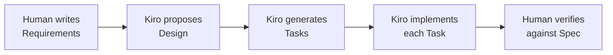
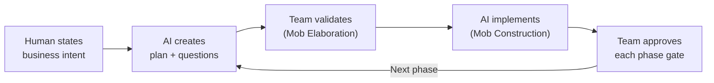
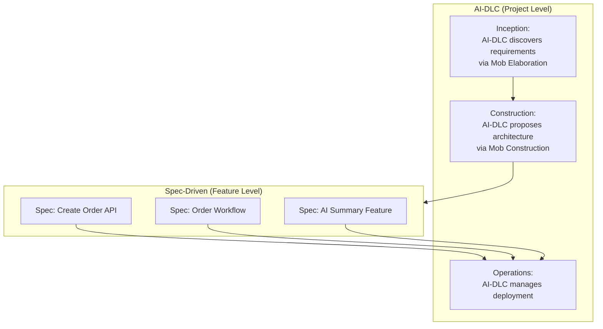
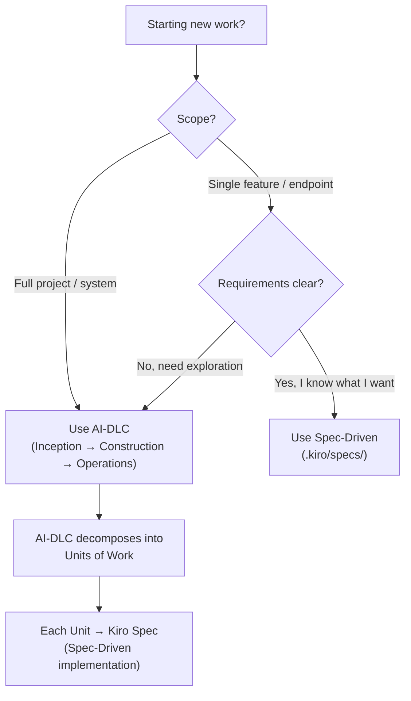
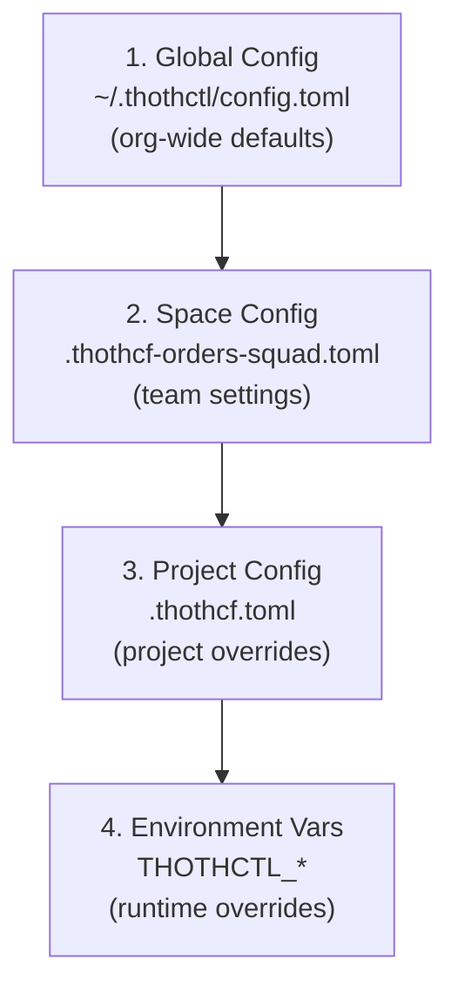
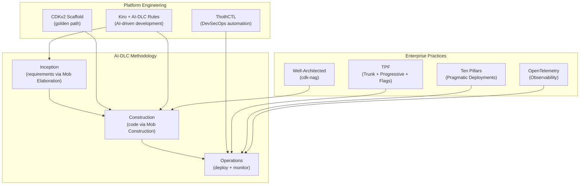

# Workshop: End-to-End Serverless Application with AI-DLC & ThothCTL

> **Persona:** 👩‍💻 Developer (primary) · 🧑‍🔧 SME / Platform (secondary)
> **Maturity level:** L1 (Team)
> **Prerequisite:** [Workshop 0: Foundations](35-workshop-foundations.md) — complete it first if you have never deployed CDK.
> **Leads to:** [Workshop: CI/CD Phase 1](26-workshop-cicd-phase1.md)
>
> **Suggested path by persona:**
> - **Developer:** do the full workshop hands-on (Phases 1–4).
> - **SME / Platform:** skim Phase 1 (methodology), focus on the governance/spaces setup (Step 1.2b) and the security/cost gates — these are the controls that let you grant developers autonomy safely.

## Overview

This workshop applies **every principle and practice** from this framework to build a production-ready serverless application from scratch using:

- **Scaffold:** [thothforge/cdkv2_typescript_scaffold](https://github.com/thothforge/cdkv2_typescript_scaffold)
- **AI Methodology:** AWS AI-DLC (Inception → Construction → Operations)
- **Platform CLI:** ThothCTL (DevSecOps workflow, security, cost, governance)
- **AI Agent:** Kiro (AI-driven development with MCP + steering files)
- **IaC:** AWS CDK v2 + Express Mode + cdk-nag
- **Deployment:** CDK Pipelines + Canary (TPF practices)

### What You'll Build

A serverless **Order Processing API** with:
- API Gateway HTTP API → Lambda (ARM64 + SnapStart)
- DynamoDB (On-Demand) for orders
- EventBridge for async event processing
- Step Functions for order workflow
- Bedrock integration for AI-powered order summaries
- Full observability (OTEL + Powertools + Application Signals)

### Principles Applied

| Principle | Applied Through |
|-----------|----------------|
| Sixteen-Factor App | Stateless Lambda, config in SSM, logs to stdout |
| AWS Well-Architected | 6 pillars validated via cdk-nag |
| TPF (Trunk + Progressive + Feature flags) | Main branch → canary deploy → Evidently |
| Ten Pillars of Pragmatic Deployments | ThothCTL DevSecOps workflow |
| AI-DLC (Inception/Construction/Operations) | Kiro + AI-DLC steering rules |
| Platform Engineering | CDKv2 scaffold + golden path constructs |
| Zero-Trust Security | Per-function IAM + Guardrails + Checkov |

---

## Prerequisites

```bash
# Install ThothCTL (manages all tool installations)
pip install thothctl

# Initialize development environment (installs all required tools automatically)
thothctl init env
# → Installs: Node.js, AWS CDK, Kiro CLI, Terraform, Checkov, Trivy, graphviz, etc.
```

- AWS Account with CLI configured
- Git

---

## Spec-Driven Development vs AI-DLC: When to Use Each

Kiro supports **two development methodologies** — understanding when to use each is critical for this workshop.

### Comparison

| Dimension | Spec-Driven Development (SDD) | AI-DLC |
|-----------|-------------------------------|--------|
| **Origin** | Kiro native (built-in) | AWS DevOps team (open-source steering rules) |
| **Mental model** | Write specs first → AI implements against spec → verify | AI creates plan → asks questions → human validates → AI implements |
| **Who drives?** | Human writes the spec; AI follows it | AI proposes; human approves/rejects |
| **Artifacts** | `.kiro/specs/` (requirements, design, tasks) | `aidlc-docs/` (requirements, architecture, units of work) |
| **Workflow** | Spec → Design → Tasks → Implementation (waterfall within a feature) | Inception → Construction → Operations (iterative bolts) |
| **Collaboration** | Individual developer + AI pair | Team "mob" sessions (Mob Elaboration, Mob Construction) |
| **Best for** | Well-understood features with clear requirements | Exploratory work, complex systems, team discovery |
| **Iteration unit** | Task (from spec) | Bolt (hours/days, not sprints) |
| **Quality gate** | Spec acceptance criteria | AI-DLC phase approval gates |
| **Activation** | Kiro auto-detects `.kiro/specs/` | Triggered by "Using AI-DLC, ..." prompt |

### Spec-Driven Development (Kiro Native)

Kiro's native mode uses **structured specifications** as the control plane:

```
.kiro/specs/
├── order-api.md            # Feature spec with requirements
│   ├── Requirements        # WHAT (acceptance criteria)
│   ├── Design              # HOW (technical approach)
│   └── Tasks               # STEPS (implementation plan)
```

**Flow:**


**When to use SDD:**
- You know exactly what you want to build
- Solo developer or small team
- Feature-level work within an existing system
- You want Kiro to follow your spec precisely
- Tight scope, clear acceptance criteria

### AI-DLC (AI-Driven Development Life Cycle)

AI-DLC uses **AI-initiated workflows** with human oversight:

```
aidlc-docs/
├── requirements.md         # AI-generated, human-validated
├── architecture.md         # AI-proposed, team-approved
├── units-of-work.md        # AI-decomposed, team-reviewed
├── risk-assessment.md      # AI-analyzed, team-accepted
```

**Flow:**


**When to use AI-DLC:**
- Exploring a new system or domain
- Team needs shared understanding (mob sessions)
- Requirements are ambiguous — AI helps discover them
- Large scope needing decomposition into units of work
- You want AI to lead discovery, with humans guiding decisions

### Using Both Together (This Workshop's Approach)

In this workshop, we use **AI-DLC for the overall project lifecycle** and **SDD for individual features**:



**Practical workflow:**

1. **Start with AI-DLC** — "Using AI-DLC, build a serverless order processing API..." → AI discovers requirements, proposes architecture, decomposes into units of work

2. **Switch to SDD per feature** — For each unit of work, create a Kiro spec:
   ```bash
   # Kiro creates spec from AI-DLC unit of work
   # In Kiro: "Create a spec for the Create Order API endpoint"
   # → .kiro/specs/create-order-api.md
   ```

3. **Kiro implements against spec** — Precise, testable implementation following the spec's acceptance criteria

4. **Return to AI-DLC** — For the next phase (Operations), AI-DLC manages deployment, monitoring, and iteration

### Decision Guide



---

## Phase 1: INCEPTION — What to Build & Why

> AI-DLC Phase: Transform business intent into detailed requirements

### Step 1.1: Scaffold the Project

```bash
# Clone the CDKv2 TypeScript scaffold
git clone https://github.com/thothforge/cdkv2_typescript_scaffold.git order-processing-api
cd order-processing-api

# Install dependencies
npm install

# Verify scaffold structure
ls -la
# .kiro/          ← Kiro steering files + AI-DLC rules (pre-configured)
# .thothcf.toml   ← ThothCTL project configuration
# lib/stacks/     ← Foundation / Platform / Application layers
# app/functions/  ← Lambda function source code
# test/           ← CDK assertions + cdk-nag tests
# project_configs/ ← YAML-driven environment configuration
```

### Step 1.2: Initialize ThothCTL

```bash
# Check environment (validates all tools are installed)
thothctl check environment

# Register project in ThothCTL
thothctl init project -p order-processing-api --project-type cdkv2
```

### Step 1.2b: Set Up Team Requirements (Governance & Spaces)

Before coding, configure the **organizational governance layer** — this ensures all team members and AI agents operate within approved boundaries.

#### Create a Space (Team Isolation)

Spaces provide multi-tenancy: credential isolation, VCS integration, and project organization per team.

```bash
# Create a space for your team (e.g., "platform-team" or "orders-squad")
thothctl init space --space-name orders-squad

# This creates .thothcf-orders-squad.toml with:
# - VCS integration (GitHub/GitLab/Azure DevOps)
# - Credential isolation per team
# - Shared configuration for all team projects
```

#### Configure the Governance Policy Repository

The Platform Capabilities Layer (Layer 3) requires a centralized **policy repository** that enforces organizational standards via OPA/Rego policies. This is distributed from a Git repository shared across all team projects.

```bash
# Option 1: Use your organization's policy repo (recommended)
thothctl scan iac -t opa --policy-dir https://github.com/your-org/iac-policies.git

# Option 2: Create a new policy repo for your team
# Structure:
# iac-policies/
# ├── policies/
# │   ├── terraform/
# │   │   ├── naming-conventions.rego
# │   │   ├── tagging-required.rego
# │   │   ├── encryption-required.rego
# │   │   └── public-access-denied.rego
# │   └── cloudformation/
# │       ├── s3-encryption.rego
# │       └── lambda-vpc.rego
# └── config.yaml  ← Parameterized config (injected as data namespace)
```

#### Example: Organization Policy Configuration

```toml
# .thothcf.toml — Project-level config (inherits from space + global)
[project]
name = "order-processing-api"
type = "cdkv2"

[space]
name = "orders-squad"
vcs = "github"

[governance]
# Remote policy repository (auto-cloned, cached, versioned)
policy_repo = "https://github.com/your-org/iac-governance-policies.git"
policy_branch = "main"

# Enforcement mode: "soft" (report only) or "hard" (block on violation)
enforcement = "hard"

[governance.required_tags]
Project = "order-processing-api"
Environment = "{{env}}"
Owner = "orders-squad"
ManagedBy = "CDK"
CostCenter = "CC-1234"

[tools]
cdk_version = "2.170.0"
node_version = "20"

[ai]
provider = "bedrock"
model = "anthropic.claude-3-sonnet"
```

#### Configuration Hierarchy (How Settings Inherit)



This hierarchy means:
- **Organization** sets baseline policies, approved tool versions, required tags
- **Team (Space)** configures VCS, credentials, team-specific policies
- **Project** overrides specific settings for this application
- **Environment** provides runtime secrets and CI/CD context

#### Team Skills Distribution

The scaffold includes pre-configured Kiro skills (`.kiro/skills/`) that teach AI agents your team's patterns:

```bash
# Skills included in the CDKv2 scaffold:
ls .kiro/skills/
# devsecops/           ← DevSecOps workflow orchestration, remediation patterns
# terraform-skill/     ← Terraform/Terragrunt patterns, module design
# iac-versioning/      ← Conventional commits and versioning for IaC

# Skills are automatically loaded by Kiro — all team members get consistent AI behavior
```

### Step 1.3: Install AI-DLC Workflow Rules

```bash
# Download and install AI-DLC rules for Kiro
curl -sL https://api.github.com/repos/awslabs/aidlc-workflows/releases/latest \
  | grep -o '"browser_download_url": *"[^"]*"' \
  | head -1 | cut -d'"' -f4 | xargs curl -Lo /tmp/aidlc.zip

unzip -o /tmp/aidlc.zip -d /tmp/aidlc-release
cp -R /tmp/aidlc-release/aidlc-rules/aws-aidlc-rules .kiro/steering/
cp -R /tmp/aidlc-release/aidlc-rules/aws-aidlc-rule-details .kiro/
```

### Step 1.4: Start AI-DLC Inception with Kiro

```bash
# Launch Kiro with Thoth agent (pre-configured in scaffold)
kiro-cli chat --agent thoth
```

In Kiro, begin the AI-DLC Inception phase:

```
Using AI-DLC, build a serverless order processing API with the following requirements:
- REST API for creating, reading, and listing orders
- Event-driven order workflow (placed → validated → processed → completed)
- AI-powered order summary generation using Amazon Bedrock
- Multi-environment support (dev, staging, production)
- Full observability with OpenTelemetry
- cdk-nag compliance (AwsSolutions pack)
```

**AI-DLC will:**
1. Ask clarifying questions (answer them collaboratively — "Mob Elaboration")
2. Generate requirements document in `aidlc-docs/`
3. Create units of work for parallel development
4. Propose architecture for your approval

### Step 1.5: Review AI-DLC Artifacts

```bash
# AI-DLC generates all artifacts in aidlc-docs/
ls aidlc-docs/
# requirements.md
# architecture.md
# units-of-work.md
# risk-assessment.md
```

**✅ Checkpoint:** Review and approve the architecture before proceeding.

---

## Phase 2: CONSTRUCTION — How to Build It

> AI-DLC Phase: Propose architecture, domain models, code, and tests

### Step 2.1: Configure Environments

Edit `project_configs/environment_options.yaml`:

```yaml
environments:
  dev:
    account: "111111111111"
    region: "us-east-1"
  staging:
    account: "222222222222"
    region: "us-east-1"
  prd:
    account: "333333333333"
    region: "us-east-1"

tags:
  Project: "order-processing-api"
  ManagedBy: "CDK"
  Framework: "ThothForge"
```

### Step 2.2: Build Application Stack (AI-DLC Construction)

In Kiro, continue the AI-DLC Construction phase:

```
Continue with AI-DLC Construction phase. Implement the Application stack with:
- OrdersTable (DynamoDB, on-demand, GSI on status)
- CreateOrderFunction (Lambda, ARM64, Powertools, SnapStart)
- GetOrderFunction
- ListOrdersFunction  
- OrderWorkflow (Step Functions)
- EventBridge bus for order events
- API Gateway HTTP API with Lambda integrations
```

**AI-DLC + Kiro will generate code through "Mob Construction"** — review each proposal.

### Step 2.3: Add Observability (OpenTelemetry + Powertools)

```typescript
// lib/constructs/observable-function.ts
import { Construct } from 'constructs';
import * as lambda from 'aws-cdk-lib/aws-lambda';
import * as cdk from 'aws-cdk-lib';

export class ObservableFunction extends Construct {
  public readonly function: lambda.Function;

  constructor(scope: Construct, id: string, props: ObservableFunctionProps) {
    super(scope, id);

    this.function = new lambda.Function(this, 'Function', {
      runtime: lambda.Runtime.NODEJS_24_X,
      architecture: lambda.Architecture.ARM_64,
      handler: 'index.handler',
      code: props.code,
      environment: {
        POWERTOOLS_SERVICE_NAME: props.serviceName,
        POWERTOOLS_LOG_LEVEL: 'INFO',
        AWS_LAMBDA_EXEC_WRAPPER: '/opt/otel-instrument',
        OTEL_SERVICE_NAME: props.serviceName,
        ...props.environment,
      },
      layers: [
        // ADOT Lambda Layer (OpenTelemetry auto-instrumentation)
        lambda.LayerVersion.fromLayerVersionArn(this, 'ADOT',
          `arn:aws:lambda:${cdk.Stack.of(this).region}:901920570463:layer:aws-otel-nodejs-amd64-ver-1-25-0:1`
        ),
        // Powertools Layer
        lambda.LayerVersion.fromLayerVersionArn(this, 'Powertools',
          `arn:aws:lambda:${cdk.Stack.of(this).region}:094274105915:layer:AWSLambdaPowertoolsTypeScriptV2:22`
        ),
      ],
      tracing: lambda.Tracing.ACTIVE,
      timeout: cdk.Duration.seconds(30),
      memorySize: 256,
    });
  }
}
```

### Step 2.4: Run Tests + cdk-nag Compliance

```bash
# Run all tests (CDK assertions + cdk-nag AwsSolutions)
npm test

# Expected: cdk-nag validates all resources against AwsSolutions pack
# Fix any violations before proceeding
```

### Step 2.5: ThothCTL Security Scan

```bash
# Multi-tool security scan
thothctl scan iac -t checkov -t trivy

# Cost analysis (estimate before deploying)
npx cdk synth --context env=dev
thothctl check iac -type cost-analysis

# Blast radius assessment
thothctl check iac -type blast-radius

# AI-powered security review
thothctl ai-review --mode orchestrate --agents security architecture fix
```

### Step 2.6: Deploy to Dev (Express Mode)

```bash
# Fast iteration with Express mode (seconds, not minutes)
npx cdk deploy --all --context env=dev --express

# Verify deployment
aws lambda invoke --function-name OrderProcessing-CreateOrder /tmp/response.json
cat /tmp/response.json
```

**✅ Checkpoint:** Application deployed to dev, tests pass, security scan clean.

---

## Phase 3: OPERATIONS — How to Run It

> AI-DLC Phase: Manage IaC, deployments, and monitoring with team oversight

### Step 3.1: Set Up CDK Pipeline (TPF: Trunk-Based + Progressive)

```typescript
// lib/pipeline-stack.ts
import * as pipelines from 'aws-cdk-lib/pipelines';

export class PipelineStack extends cdk.Stack {
  constructor(scope: Construct, id: string, props?: cdk.StackProps) {
    super(scope, id, props);

    const pipeline = new pipelines.CodePipeline(this, 'Pipeline', {
      pipelineName: 'OrderProcessing-Pipeline',
      synth: new pipelines.ShellStep('Synth', {
        input: pipelines.CodePipelineSource.gitHub('your-org/order-processing-api', 'main'),
        commands: [
          'npm ci',
          'npm run build',
          'npm test',
          'npx cdk synth',
        ],
      }),
      selfMutation: true,
    });

    // Dev — Express mode, auto-deploy on push
    const dev = pipeline.addStage(new AppStage(this, 'Dev', {
      env: { account: '111111111111', region: 'us-east-1' },
    }));
    dev.addPost(new pipelines.ShellStep('IntegrationTests', {
      commands: ['npm run test:integration'],
    }));

    // Staging — Standard mode, full verification
    const staging = pipeline.addStage(new AppStage(this, 'Staging', {
      env: { account: '222222222222', region: 'us-east-1' },
    }));
    staging.addPost(
      new pipelines.ShellStep('E2ETests', { commands: ['npm run test:e2e'] }),
      new pipelines.ShellStep('SecurityScan', { commands: ['thothctl scan iac -t checkov --enforcement hard'] }),
    );

    // Production — Approval + Canary
    pipeline.addStage(new AppStage(this, 'Prod', {
      env: { account: '333333333333', region: 'us-east-1' },
    }), {
      pre: [new pipelines.ManualApprovalStep('ApproveProd')],
    });
  }
}
```

### Step 3.2: Configure Canary Deployments (TPF: Progressive Rollouts)

```yaml
# In SAM or CDK — Lambda canary deployment
DeploymentPreference:
  Type: Canary10Percent5Minutes
  Alarms:
    - !Ref ErrorsAlarm
    - !Ref LatencyAlarm
```

### Step 3.3: Feature Flags (TPF: Feature Toggles)

```bash
# Create feature flag for AI-powered summaries
aws cloudwatchevidently create-feature \
  --project order-processing \
  --name ai-order-summary \
  --variations '[{"name":"enabled","value":{"boolValue":true}},{"name":"disabled","value":{"boolValue":false}}]' \
  --default-variation disabled
```

### Step 3.4: Full DevSecOps Pipeline (ThothCTL)

```bash
# Run the complete DevSecOps SDLC workflow
thothctl workflow devsecops --phase all

# Or run specific phases:
thothctl workflow devsecops --phase plan      # Cost + blast radius
thothctl workflow devsecops --phase secure    # Checkov + Trivy + OPA
thothctl workflow devsecops --phase monitor   # Drift detection

# Pre-deploy gate (blocks on violations)
thothctl workflow devsecops --phase pre-deploy --enforcement hard
```

### Step 3.5: Generate Documentation

```bash
# Auto-generate IaC documentation
thothctl document iac --ai

# Create inventory report
thothctl inventory iac --check-versions --project-name order-processing-api
```

### Step 3.6: Set Up Monitoring (AWS Frontier Agents)

```bash
# Deploy AWS DevOps Agent for incident investigation
# (via AWS Console or CDK)
# → Connects to CloudWatch, GitHub, Slack
# → Autonomous investigation when alarms fire

# Enable FinOps Agent for cost monitoring
# → Correlates cost spikes with CloudTrail events
# → Reports to Slack/Jira
```

**✅ Checkpoint:** Full CI/CD pipeline deployed, canary strategy configured, monitoring active.

---

## Phase 4: VALIDATE — Iterate and Improve

> Apply the "Amplifier Effect" — ensure strong foundations before scaling

### Iteration 1: Security Hardening

```bash
# Run AI-powered security review
thothctl ai-review --mode orchestrate --agents security architecture fix decision

# Verify cdk-nag compliance
npm test -- --testPathPattern=cdk-nag

# Check for drift (post-deployment)
thothctl check iac -type drift --filter-tags "env=dev"
```

### Iteration 2: Cost Optimization

```bash
# Analyze current costs
thothctl check iac -type cost-analysis

# Verify ARM64 on all Lambda functions
# Verify DynamoDB on-demand mode
# Verify no over-provisioned resources
```

### Iteration 3: Observability Verification

```bash
# Verify end-to-end traces
# API Gateway → Lambda → DynamoDB → EventBridge → Step Functions
# Should see single trace_id across all services

# Verify Application Signals are active
# Check CloudWatch → Application Signals → Services

# Verify Powertools structured logging
aws logs filter-log-events --log-group-name /aws/lambda/CreateOrder \
  --filter-pattern '{ $.level = "INFO" }'
```

---

## Workshop Summary

### What You Applied



### Commands Reference

| Phase | Command | Purpose |
|-------|---------|---------|
| Setup | `git clone thothforge/cdkv2_typescript_scaffold` | Golden path scaffold |
| Setup | `thothctl init project` | Register with ThothCTL |
| Inception | `kiro-cli chat --agent thoth` + "Using AI-DLC, ..." | AI-driven requirements |
| Construction | Kiro generates CDK code | AI-powered implementation |
| Construction | `npm test` | cdk-nag compliance validation |
| Construction | `thothctl scan iac -t checkov -t trivy` | Security scanning |
| Construction | `thothctl check iac -type cost-analysis` | Cost estimation |
| Construction | `npx cdk deploy --express` | Fast dev deployment |
| Operations | `thothctl workflow devsecops --phase all` | Full DevSecOps pipeline |
| Operations | `thothctl document iac --ai` | Auto-documentation |
| Operations | `thothctl check iac -type drift` | Drift detection |
| Operations | `thothctl ai-review --mode orchestrate` | AI security review |

### Learning Path

| Level | Week | Focus |
|-------|------|-------|
| **Beginner** | 1 | Scaffold + basic deploy + security scan |
| **Intermediate** | 2-3 | AI-DLC workflow + CDK Pipelines + canary |
| **Advanced** | 4+ | Full DevSecOps + drift + AI agents + policy-as-code |

---

## Teardown & Cost Guardrails

> **Do not skip this.** This workshop deploys API Gateway, Lambda, DynamoDB, Step Functions, EventBridge, and (optionally) Bedrock integrations across one or more environments. Most scale to zero, but leaving them running — especially provisioned resources or multiple environments — accrues cost. Always clean up when done.

### Set a budget guardrail before deploying

```bash
# Lab-scale monthly budget with an alert (adjust amount/email)
ACCOUNT_ID=$(aws sts get-caller-identity --query Account --output text)
aws budgets create-budget \
  --account-id "$ACCOUNT_ID" \
  --budget '{"BudgetName":"orders-api-guardrail","BudgetLimit":{"Amount":"20","Unit":"USD"},"TimeUnit":"MONTHLY","BudgetType":"COST"}' \
  --notifications-with-subscribers '[{"Notification":{"NotificationType":"ACTUAL","ComparisonOperator":"GREATER_THAN","Threshold":80,"ThresholdType":"PERCENTAGE"},"Subscribers":[{"SubscriptionType":"EMAIL","Address":"you@example.com"}]}]'
```

For organization-wide cost governance (anomaly detection, FinOps Agent), see [FinOps & Cost Governance](18-finops-cost-governance.md).

### Destroy the application

```bash
# Destroy all stacks in the environment you deployed
npx cdk destroy --all --context env=dev

# Faster teardown with Express mode (dev only)
npx cdk destroy --all --context env=dev --express
```

### Verify nothing is left behind

```bash
# No workshop stacks should remain
aws cloudformation list-stacks \
  --stack-status-filter CREATE_COMPLETE UPDATE_COMPLETE \
  --query "StackSummaries[?contains(StackName,'OrderProcessing') || contains(StackName,'OrderApi')].StackName"

# Check for retained resources (DynamoDB tables / log groups may use RETAIN policies)
aws dynamodb list-tables --query "TableNames[?contains(@,'orders')]"
aws logs describe-log-groups --query "logGroups[?contains(logGroupName,'CreateOrder') || contains(logGroupName,'OrderProcessing')].logGroupName"
```

> **Watch for RETAIN policies.** Enterprise constructs often set `RemovalPolicy.RETAIN` on stateful resources (DynamoDB tables, log groups, S3 buckets) so `cdk destroy` intentionally leaves them. Delete these manually if you truly want a clean account:
> ```bash
> aws dynamodb delete-table --table-name <orders-table-name>
> ```

### Optional: remove the budget and feature flags

```bash
aws budgets delete-budget --account-id "$ACCOUNT_ID" --budget-name orders-api-guardrail
# Evidently project (if created in Operations phase)
aws cloudwatchevidently delete-project --project order-processing 2>/dev/null || true
```

**✅ Checkpoint:** No `OrderProcessing`/`OrderApi` stacks remain and no unexpected tables/log groups persist.

---

## References

| Resource | Link |
|----------|------|
| CDKv2 TypeScript Scaffold | https://github.com/thothforge/cdkv2_typescript_scaffold |
| ThothCTL Documentation | https://thothctl.readthedocs.io |
| AI-DLC Workflows | https://github.com/awslabs/aidlc-workflows |
| AI-DLC Blog | https://aws.amazon.com/blogs/devops/ai-driven-development-life-cycle/ |
| ThothCTL DevSecOps Quick Start | https://thothctl.readthedocs.io/en/latest/framework/use_cases/devsecops_quickstart/ |
| ThothCTL Framework Architecture | https://thothctl.readthedocs.io/en/latest/framework/framework_architecture/ |
| Kiro Documentation | https://kiro.dev/docs/ |
