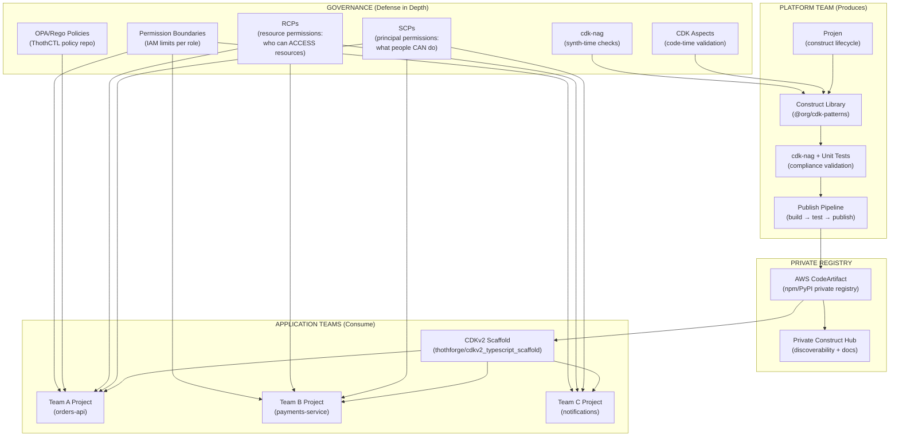
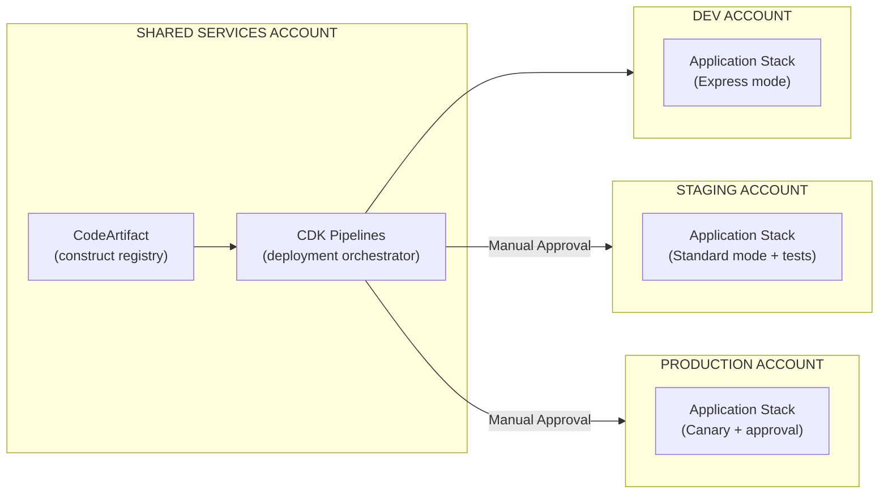
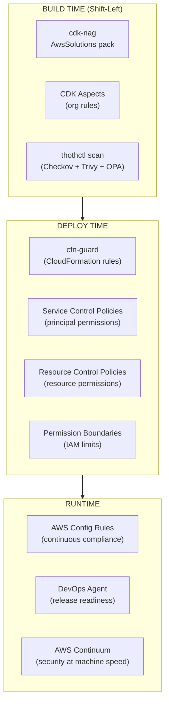
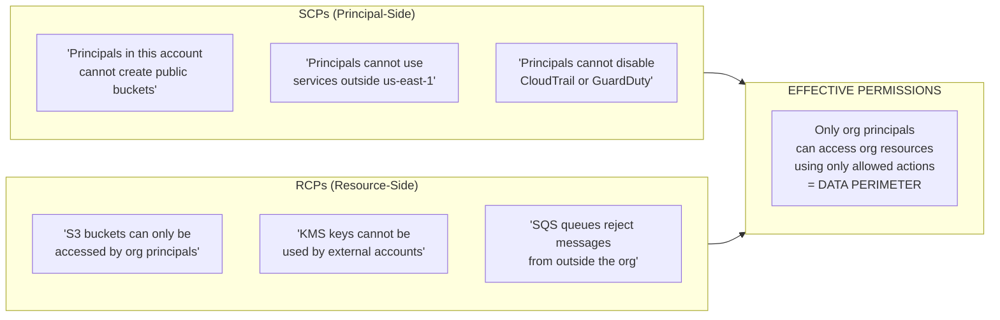
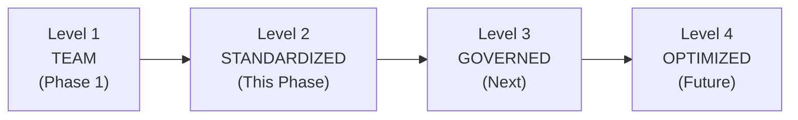

# Workshop Phase 2: Enterprise-Grade CDK Adoption

## Overview

Phase 2 elevates the project from a team-level application to **enterprise-grade infrastructure** by establishing:

- **Private CDK Construct Libraries** published to AWS CodeArtifact
- **Organizational L2.5/L3 constructs** encoding compliance, security, and cost best practices
- **Multi-account deployment** with CDK Pipelines (dev → staging → production)
- **Governance layer** with cdk-nag, aspects, SCPs, and ThothCTL policy-as-code
- **Projen** for construct library lifecycle management
- **Private Construct Hub** for discoverability across teams

### What Makes This "Enterprise-Grade"

| Team-Level (Phase 1) | Enterprise-Grade (Phase 2) |
|----------------------|---------------------------|
| Single project scaffold | Reusable construct library consumed by 10+ projects |
| cdk-nag runs locally | Governance enforced via pipeline gates + SCPs + OPA |
| Direct CDK deploy | CDK Pipelines with cross-account OIDC + approval gates |
| Individual team patterns | Organization-wide patterns in CodeArtifact registry |
| AI generates per-project | AI generates from approved constructs only |
| One team | Multi-team consumption with versioned releases |

---

## Architecture: Enterprise CDK Ecosystem



---

## Step 1: Create the Private Construct Library

### 1.1 Initialize with Projen

[Projen](https://projen.io) manages the construct library lifecycle: build, test, version, publish — all from a single `.projenrc.ts` file.

```bash
# Create a new construct library project
mkdir org-cdk-patterns && cd org-cdk-patterns
npx projen new awscdk-construct \
  --name "@myorg/cdk-patterns" \
  --description "Enterprise CDK construct patterns for MyOrg" \
  --author "Platform Team" \
  --cdkVersion "2.170.0" \
  --defaultReleaseBranch main \
  --license "UNLICENSED" \
  --repositoryUrl "https://github.com/myorg/cdk-patterns"
```

### 1.2 Configure Projen for CodeArtifact

Edit `.projenrc.ts`:

```typescript
import { awscdk } from 'projen';

const project = new awscdk.AwsCdkConstructLibrary({
  name: '@myorg/cdk-patterns',
  description: 'Enterprise CDK patterns — compliance-ready constructs',
  author: 'Platform Team',
  authorAddress: 'platform@myorg.com',
  cdkVersion: '2.170.0',
  defaultReleaseBranch: 'main',
  repositoryUrl: 'https://github.com/myorg/cdk-patterns',

  // Publish to private CodeArtifact (not public npm)
  npmRegistryUrl: 'https://myorg-123456789012.d.codeartifact.us-east-1.amazonaws.com/npm/constructs/',
  
  // jsii for multi-language support (TypeScript, Python, Java, .NET)
  publishToPypi: {
    distName: 'myorg-cdk-patterns',
    module: 'myorg_cdk_patterns',
  },

  // Development dependencies
  devDeps: [
    'cdk-nag',
    '@aws-cdk/assert',
  ],

  // Peer dependencies (consumers must have these)
  peerDeps: [
    'aws-cdk-lib',
    'constructs',
  ],

  // Auto-approve dependabot PRs
  autoApproveUpgrades: true,
  autoApproveOptions: { allowedUsernames: ['dependabot[bot]'] },
});

project.synth();
```

### 1.3 Build Enterprise Constructs

```typescript
// src/secure-api.ts — L3 construct: Secure API with all enterprise requirements
import { Construct } from 'constructs';
import * as apigw from 'aws-cdk-lib/aws-apigateway';
import * as lambda from 'aws-cdk-lib/aws-lambda';
import * as wafv2 from 'aws-cdk-lib/aws-wafv2';
import * as logs from 'aws-cdk-lib/aws-logs';
import * as cdk from 'aws-cdk-lib';
import { NagSuppressions } from 'cdk-nag';

export interface SecureApiProps {
  readonly handler: lambda.IFunction;
  readonly apiName: string;
  readonly stage?: string;
  readonly throttlingRateLimit?: number;
  readonly throttlingBurstLimit?: number;
  readonly enableWaf?: boolean;
}

export class SecureApi extends Construct {
  public readonly api: apigw.RestApi;
  public readonly url: string;

  constructor(scope: Construct, id: string, props: SecureApiProps) {
    super(scope, id);

    // Access logging (required by AwsSolutions-APIG1)
    const accessLogGroup = new logs.LogGroup(this, 'AccessLogs', {
      retention: logs.RetentionDays.ONE_YEAR,
      removalPolicy: cdk.RemovalPolicy.RETAIN,
    });

    // REST API with all AwsSolutions compliance
    this.api = new apigw.RestApi(this, 'Api', {
      restApiName: props.apiName,
      deployOptions: {
        stageName: props.stage ?? 'v1',
        throttlingRateLimit: props.throttlingRateLimit ?? 1000,
        throttlingBurstLimit: props.throttlingBurstLimit ?? 500,
        accessLogDestination: new apigw.LogGroupLogDestination(accessLogGroup),
        accessLogFormat: apigw.AccessLogFormat.jsonWithStandardFields(),
        tracingEnabled: true, // X-Ray
        metricsEnabled: true,
        loggingLevel: apigw.MethodLoggingLevel.INFO,
      },
      defaultMethodOptions: {
        authorizationType: apigw.AuthorizationType.IAM, // No open access
      },
    });

    // Lambda integration
    this.api.root.addMethod('ANY', new apigw.LambdaIntegration(props.handler));
    this.api.root.addProxy({ defaultIntegration: new apigw.LambdaIntegration(props.handler) });

    // WAF (optional but recommended)
    if (props.enableWaf !== false) {
      const waf = new wafv2.CfnWebACL(this, 'WebACL', {
        scope: 'REGIONAL',
        defaultAction: { allow: {} },
        rules: [
          {
            name: 'AWSManagedRulesCommonRuleSet',
            priority: 1,
            overrideAction: { none: {} },
            statement: {
              managedRuleGroupStatement: {
                vendorName: 'AWS',
                name: 'AWSManagedRulesCommonRuleSet',
              },
            },
            visibilityConfig: { sampledRequestsEnabled: true, cloudWatchMetricsEnabled: true, metricName: 'CommonRules' },
          },
        ],
        visibilityConfig: { sampledRequestsEnabled: true, cloudWatchMetricsEnabled: true, metricName: 'WebACL' },
      });

      new wafv2.CfnWebACLAssociation(this, 'WebACLAssociation', {
        resourceArn: this.api.deploymentStage.stageArn,
        webAclArn: waf.attrArn,
      });
    }

    this.url = this.api.url;
  }
}
```

```typescript
// src/observable-function.ts — L2.5: Lambda with observability baked in
import { Construct } from 'constructs';
import * as lambda from 'aws-cdk-lib/aws-lambda';
import * as cdk from 'aws-cdk-lib';

export interface ObservableFunctionProps {
  readonly functionName: string;
  readonly serviceName: string;
  readonly code: lambda.Code;
  readonly handler?: string;
  readonly runtime?: lambda.Runtime;
  readonly memorySize?: number;
  readonly timeout?: cdk.Duration;
  readonly environment?: Record<string, string>;
}

export class ObservableFunction extends Construct {
  public readonly function: lambda.Function;

  constructor(scope: Construct, id: string, props: ObservableFunctionProps) {
    super(scope, id);

    this.function = new lambda.Function(this, 'Function', {
      functionName: props.functionName,
      runtime: props.runtime ?? lambda.Runtime.NODEJS_20_X,
      architecture: lambda.Architecture.ARM_64, // Cost optimization (20% savings)
      handler: props.handler ?? 'index.handler',
      code: props.code,
      memorySize: props.memorySize ?? 256,
      timeout: props.timeout ?? cdk.Duration.seconds(30),
      tracing: lambda.Tracing.ACTIVE, // X-Ray
      environment: {
        POWERTOOLS_SERVICE_NAME: props.serviceName,
        POWERTOOLS_LOG_LEVEL: 'INFO',
        NODE_OPTIONS: '--enable-source-maps',
        ...props.environment,
      },
      // Layers added by CDK aspect (see ComplianceAspect below)
    });

    // Tags (mandatory in enterprise)
    cdk.Tags.of(this.function).add('Service', props.serviceName);
  }
}
```

```typescript
// src/aspects/compliance-aspect.ts — CDK Aspect for org-wide enforcement
import { IAspect, Annotations } from 'aws-cdk-lib';
import * as lambda from 'aws-cdk-lib/aws-lambda';
import * as s3 from 'aws-cdk-lib/aws-s3';
import * as dynamodb from 'aws-cdk-lib/aws-dynamodb';
import { IConstruct } from 'constructs';

export class ComplianceAspect implements IAspect {
  visit(node: IConstruct): void {
    // Enforce ARM64 on all Lambda functions
    if (node instanceof lambda.Function) {
      const cfnFunction = node.node.defaultChild as lambda.CfnFunction;
      if (cfnFunction.architectures?.[0] !== 'arm64') {
        Annotations.of(node).addWarning(
          'ORG-LAMBDA-001: Lambda functions must use ARM64 architecture for cost optimization.'
        );
      }
    }

    // Enforce encryption on S3
    if (node instanceof s3.Bucket) {
      const cfnBucket = node.node.defaultChild as s3.CfnBucket;
      if (!cfnBucket.bucketEncryption) {
        Annotations.of(node).addError(
          'ORG-S3-001: S3 buckets must have encryption enabled.'
        );
      }
    }

    // Enforce on-demand for DynamoDB
    if (node instanceof dynamodb.Table) {
      const cfnTable = node.node.defaultChild as dynamodb.CfnTable;
      if (cfnTable.billingMode !== 'PAY_PER_REQUEST') {
        Annotations.of(node).addWarning(
          'ORG-DDB-001: DynamoDB tables should use PAY_PER_REQUEST (on-demand) for serverless workloads.'
        );
      }
    }
  }
}
```

### 1.4 Test with cdk-nag

```typescript
// test/compliance.test.ts
import { App, Stack, Aspects } from 'aws-cdk-lib';
import { AwsSolutionsChecks } from 'cdk-nag';
import { SecureApi } from '../src/secure-api';
import * as lambda from 'aws-cdk-lib/aws-lambda';

test('SecureApi passes AwsSolutions checks', () => {
  const app = new App();
  const stack = new Stack(app, 'TestStack');
  Aspects.of(app).add(new AwsSolutionsChecks({ verbose: true }));

  const fn = new lambda.Function(stack, 'Handler', {
    runtime: lambda.Runtime.NODEJS_20_X,
    handler: 'index.handler',
    code: lambda.Code.fromInline('exports.handler = async () => ({ statusCode: 200 })'),
  });

  new SecureApi(stack, 'Api', {
    handler: fn,
    apiName: 'test-api',
  });

  // cdk-nag will throw if any AwsSolutions violations exist
  const messages = app.synth().getStackArtifact(stack.artifactId).messages;
  const errors = messages.filter(m => m.level === 'error');
  expect(errors).toHaveLength(0);
});
```

---

## Step 2: Publish to CodeArtifact

### 2.1 Set Up CodeArtifact Domain + Repository

```bash
# Create CodeArtifact domain (organization-wide)
aws codeartifact create-domain --domain myorg

# Create repository for CDK constructs
aws codeartifact create-repository \
  --domain myorg \
  --repository constructs \
  --description "Organization CDK construct libraries"

# Create upstream connection to public npm
aws codeartifact create-repository \
  --domain myorg \
  --repository npm-store

aws codeartifact associate-external-connection \
  --domain myorg \
  --repository npm-store \
  --external-connection public:npmjs

# Set npm-store as upstream for constructs repo
aws codeartifact update-repository \
  --domain myorg \
  --repository constructs \
  --upstreams repositoryName=npm-store
```

### 2.2 Publish Pipeline (GitHub Actions)

```yaml
# .github/workflows/release.yml
name: Release Construct Library

on:
  push:
    branches: [main]

permissions:
  id-token: write   # OIDC
  contents: write   # Release

jobs:
  release:
    runs-on: ubuntu-latest
    steps:
      - uses: actions/checkout@v4
        with:
          fetch-depth: 0

      - uses: actions/setup-node@v4
        with:
          node-version: '20'

      - name: Configure AWS Credentials (OIDC)
        uses: aws-actions/configure-aws-credentials@v4
        with:
          role-to-assume: arn:aws:iam::123456789012:role/GitHubActionsPublishRole
          aws-region: us-east-1

      - name: Login to CodeArtifact
        run: |
          aws codeartifact login \
            --tool npm \
            --domain myorg \
            --domain-owner 123456789012 \
            --repository constructs

      - name: Install & Build
        run: |
          npm ci
          npx projen build

      - name: Security Scan
        run: |
          pip install thothctl
          thothctl scan iac -t checkov --enforcement hard

      - name: Publish
        run: npx projen release
```

### 2.3 Versioning Strategy

```
# Semantic versioning for constructs
MAJOR.MINOR.PATCH

# MAJOR: Breaking changes (removed props, changed behavior)
#   → Consumers must explicitly upgrade
# MINOR: New constructs or optional props added
#   → Backward compatible, consumers can upgrade safely
# PATCH: Bug fixes, security patches
#   → Auto-upgrade recommended

# In package.json of consuming projects:
"@myorg/cdk-patterns": "^2.0.0"  # Accept minor+patch upgrades
```

---

## Step 3: Consume in Application Projects

### 3.1 Configure the CDKv2 Scaffold

In the `order-processing-api` project from Phase 1:

```bash
# Login to CodeArtifact
aws codeartifact login \
  --tool npm \
  --domain myorg \
  --domain-owner 123456789012 \
  --repository constructs

# Install the organization's construct library
npm install @myorg/cdk-patterns
```

### 3.2 Use Enterprise Constructs

```typescript
// lib/stacks/application/order-api-stack.ts
import { Stack, StackProps, Aspects } from 'aws-cdk-lib';
import { Construct } from 'constructs';
import { SecureApi, ObservableFunction, ComplianceAspect } from '@myorg/cdk-patterns';
import * as lambda from 'aws-cdk-lib/aws-lambda';

export class OrderApiStack extends Stack {
  constructor(scope: Construct, id: string, props?: StackProps) {
    super(scope, id, props);

    // Apply organization compliance aspect
    Aspects.of(this).add(new ComplianceAspect());

    // Use enterprise ObservableFunction (ARM64 + Powertools + OTEL baked in)
    const createOrder = new ObservableFunction(this, 'CreateOrder', {
      functionName: 'OrderProcessing-CreateOrder',
      serviceName: 'orders-api',
      code: lambda.Code.fromAsset('app/functions/create-order'),
      environment: {
        TABLE_NAME: 'orders',
      },
    });

    // Use enterprise SecureApi (WAF + logging + auth + tracing baked in)
    const api = new SecureApi(this, 'OrdersApi', {
      handler: createOrder.function,
      apiName: 'orders-api',
      enableWaf: true,
      throttlingRateLimit: 500,
    });
  }
}
```

**What the developer writes:** 15 lines of application-specific code
**What they get:** WAF, access logging, X-Ray tracing, ARM64, Powertools, auth, throttling, cdk-nag compliance — all from the enterprise construct library.

---

## Step 4: Multi-Account Deployment

### 4.1 Account Strategy



### 4.2 Bootstrap All Accounts

```bash
# Bootstrap shared services (pipeline account)
npx cdk bootstrap aws://111111111111/us-east-1 \
  --trust 111111111111 \
  --cloudformation-execution-policies arn:aws:iam::aws:policy/AdministratorAccess

# Bootstrap dev account (trust pipeline account)
npx cdk bootstrap aws://222222222222/us-east-1 \
  --trust 111111111111 \
  --cloudformation-execution-policies arn:aws:iam::aws:policy/AdministratorAccess

# Bootstrap staging
npx cdk bootstrap aws://333333333333/us-east-1 \
  --trust 111111111111 \
  --cloudformation-execution-policies arn:aws:iam::aws:policy/AdministratorAccess

# Bootstrap production
npx cdk bootstrap aws://444444444444/us-east-1 \
  --trust 111111111111 \
  --cloudformation-execution-policies arn:aws:iam::aws:policy/AdministratorAccess
```

---

## Step 5: Governance at Scale

### 5.1 Defense in Depth



### 5.2 SCPs vs RCPs — Understanding Both Policy Types

AWS Organizations provides **two complementary preventative controls**. You need BOTH for complete governance.

| Dimension | SCPs (Service Control Policies) | RCPs (Resource Control Policies) |
|-----------|-------------------------------|----------------------------------|
| **Controls** | What **principals** (users/roles) can do | What can access your **resources** |
| **Perspective** | Principal-centric ("who can do what") | Resource-centric ("who can access this resource") |
| **Protects against** | Internal users exceeding permissions | External entities accessing your resources |
| **Use case** | Restrict which services/actions accounts can use | Enforce data perimeters — ensure resources only accessed by org identities |
| **Example** | "No one in this account can create public S3 buckets" | "This S3 bucket can only be accessed by principals from MY organization" |
| **Evaluated when** | A principal in your org makes an API call | Any principal (internal OR external) accesses your resource |
| **Affects root user?** | Yes (member accounts) | Yes (member accounts) |
| **Affects AWS service principals?** | No (SLRs exempt) | Yes — can limit AWS service access |
| **Quota** | 5 per target (up to 2,000/org) | 5 per target (up to 2,000/org) |
| **Supported services** | All AWS services | S3, STS, KMS, SQS, Secrets Manager (expanding) |

#### How They Work Together



**Key insight:** SCPs + RCPs together create a **complete data perimeter** — SCPs control what your people can do, RCPs control who can access your resources. Neither alone is sufficient.

#### Enterprise RCP Examples for Serverless

```json
// RCP: Only organization principals can access S3 buckets
{
  "Version": "2012-10-17",
  "Statement": [
    {
      "Sid": "RestrictToOrgPrincipals",
      "Effect": "Deny",
      "Principal": "*",
      "Action": "s3:*",
      "Resource": "*",
      "Condition": {
        "StringNotEqualsIfExists": {
          "aws:PrincipalOrgID": "o-myorgid123"
        },
        "BoolIfExists": {
          "aws:PrincipalIsAWSService": "false"
        }
      }
    }
  ]
}
```

```json
// RCP: KMS keys cannot be used by principals outside the organization
{
  "Version": "2012-10-17",
  "Statement": [
    {
      "Sid": "RestrictKMSToOrg",
      "Effect": "Deny",
      "Principal": "*",
      "Action": ["kms:Decrypt", "kms:Encrypt", "kms:GenerateDataKey*"],
      "Resource": "*",
      "Condition": {
        "StringNotEqualsIfExists": {
          "aws:PrincipalOrgID": "o-myorgid123"
        },
        "BoolIfExists": {
          "aws:PrincipalIsAWSService": "false"
        }
      }
    }
  ]
}
```

#### Applying SCPs + RCPs in CDK

```typescript
// In your organization management CDK stack
import * as organizations from 'aws-cdk-lib/aws-organizations';

// SCP: Restrict what principals can do
const scp = new organizations.CfnPolicy(this, 'DenyPublicAccess', {
  type: 'SERVICE_CONTROL_POLICY',
  name: 'DenyPublicS3',
  content: JSON.stringify({
    Version: '2012-10-17',
    Statement: [{
      Effect: 'Deny',
      Action: ['s3:PutBucketPolicy'],
      Resource: '*',
      Condition: { /* block public policies */ }
    }]
  }),
  targetIds: ['ou-prod-xxxxx'], // Apply to Production OU
});

// RCP: Restrict who can access resources
const rcp = new organizations.CfnPolicy(this, 'OrgOnlyAccess', {
  type: 'RESOURCE_CONTROL_POLICY',
  name: 'OrgOnlyResourceAccess',
  content: JSON.stringify({
    Version: '2012-10-17',
    Statement: [{
      Effect: 'Deny',
      Principal: '*',
      Action: ['s3:*', 'sqs:*', 'kms:*'],
      Resource: '*',
      Condition: {
        StringNotEqualsIfExists: { 'aws:PrincipalOrgID': 'o-myorgid123' },
        BoolIfExists: { 'aws:PrincipalIsAWSService': 'false' }
      }
    }]
  }),
  targetIds: ['ou-prod-xxxxx'],
});
```

### 5.3 The "L2.5 Library" Warning

From AWS best practices:

> "Creating a collection of construct libraries with a 1-1 mapping of subclasses (e.g., `MyCompanyBucket extends s3.Bucket`) is useful for surfacing security guidance early, **but it cannot be relied on as the sole means of enforcement**."

**Enterprise approach — defense in depth:**

| Layer | Tool | Controls | Enforcement |
|-------|------|----------|-------------|
| Code-time | CDK Aspects + cdk-nag | Lint-level warnings/errors | Developer feedback |
| Build-time | ThothCTL scan + OPA policies | Pipeline gate | Hard fail on violations |
| Deploy-time | **SCPs** (principal controls) | Who can do what | Hard AWS-level block |
| Deploy-time | **RCPs** (resource controls) | Who can access resources | Hard AWS-level block |
| Deploy-time | Permission Boundaries | IAM limits per role | Hard AWS-level block |
| Runtime | AWS Config + Continuum | Continuous compliance | Auto-remediation |

### 5.4 ThothCTL Policy Repository

```bash
# Organization's OPA policy repository
thothctl scan iac -t opa --policy-dir https://github.com/myorg/iac-governance-policies.git

# Policy repository structure:
# iac-governance-policies/
# ├── policies/
# │   ├── aws/
# │   │   ├── lambda-arm64-required.rego
# │   │   ├── s3-encryption-required.rego
# │   │   ├── dynamodb-on-demand.rego
# │   │   ├── no-public-endpoints.rego
# │   │   └── tagging-mandatory.rego
# │   └── cost/
# │       ├── max-lambda-memory.rego
# │       └── no-provisioned-capacity.rego
# └── config.yaml
```

---

## Step 6: AI-Assisted Enterprise Development

### 6.1 Kiro + Private Construct Library

When Kiro generates code, it should use your organization's constructs, not raw L1/L2:

```
# In Kiro steering files (.kiro/steering/org-standards.md):

## Organization CDK Standards

When generating CDK code:
1. ALWAYS use @myorg/cdk-patterns constructs when available
2. Use SecureApi instead of raw apigw.RestApi
3. Use ObservableFunction instead of raw lambda.Function
4. Apply ComplianceAspect to every stack
5. Never create S3 buckets without encryption
6. Always use ARM64 architecture for Lambda
7. Always use PAY_PER_REQUEST for DynamoDB
```

### 6.2 ThothCTL + CodeArtifact Inventory

```bash
# Track which teams consume which construct versions
thothctl inventory iac --check-versions

# Output shows:
# @myorg/cdk-patterns@2.3.1 → used by: orders-api, payments, notifications
# @myorg/cdk-patterns@2.2.0 → used by: legacy-service (OUTDATED)
# → Recommendation: upgrade legacy-service to 2.3.1
```

---

## Summary: Enterprise Maturity Model



| Level | Characteristics | Tools |
|-------|----------------|-------|
| **L1: Team** | Individual scaffold, local cdk-nag, manual deploys | CDKv2 scaffold + ThothCTL |
| **L2: Standardized** | Private construct library, CodeArtifact, CDK Pipelines | + Projen + CodeArtifact + multi-account |
| **L3: Governed** | OPA policies, SCPs, permission boundaries, continuous compliance | + AWS Config + ThothCTL policy repo + Continuum |
| **L4: Optimized** | AI-driven cost optimization, auto-remediation, self-healing | + FinOps Agent + DevOps Agent + autonomous ops |

---

## References

| Resource | Link |
|----------|------|
| AWS CDK Enterprise Best Practices | https://aws.amazon.com/blogs/devops/best-practices-for-developing-cloud-applications-with-aws-cdk/ |
| Developing Enterprise Patterns with CDK | https://aws.amazon.com/blogs/devops/developing-application-patterns-cdk |
| CDK Construct Library with Projen | https://projen.io/docs/project-types/aws-cdk-construct-library |
| AWS CodeArtifact Private npm | https://aws.amazon.com/blogs/devops/publishing-private-npm-packages-aws-codeartifact/ |
| CDK Version Control Best Practices | https://docs.aws.amazon.com/prescriptive-guidance/latest/best-practices-cdk-typescript-iac/version-control-best-practices.html |
| CDKv2 TypeScript Scaffold | https://github.com/thothforge/cdkv2_typescript_scaffold |
| ThothCTL Policy as Code | https://thothctl.readthedocs.io/en/latest/framework/policy_as_code/ |
