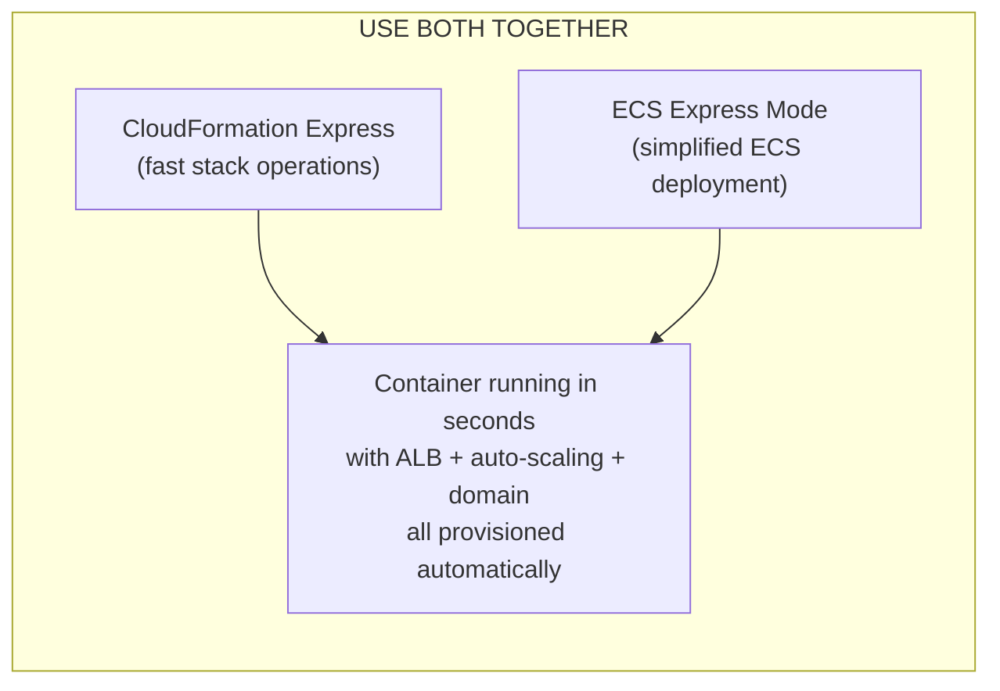
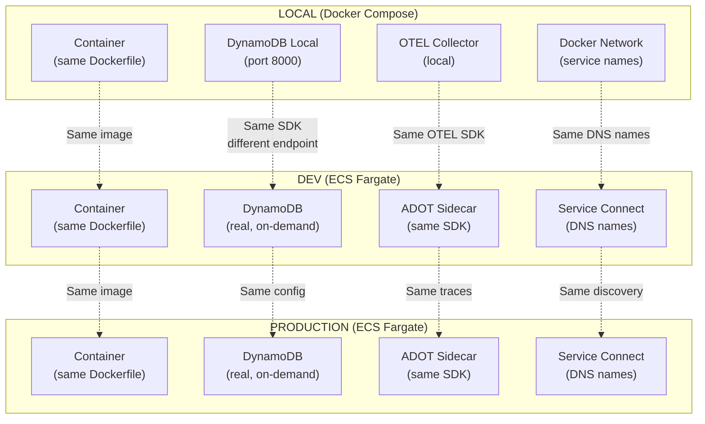
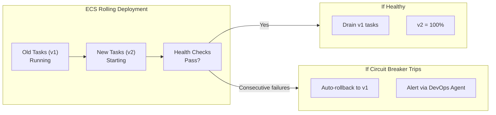
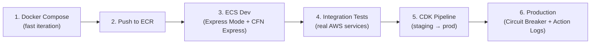

# Workshop: ECS Backend — Containers on Fargate (2026)

## Overview

This workshop focuses on building **containerized backend services** on ECS Fargate, applying all framework principles with the specific patterns and tools that differ from serverless Lambda workloads.

### Key Differences: ECS vs Lambda Workshops

| Dimension | Lambda Workshop (Phase 1) | ECS Workshop (This) |
|-----------|--------------------------|---------------------|
| Compute unit | Function (event-driven) | Container (long-running process) |
| Local development | SAM local / Kiro Live Lambda | Docker Compose → ECS deploy |
| Deployment speed | Express mode (seconds) | ECS Express Mode + CFN Express (minutes → seconds) |
| Scaling unit | Per-request (automatic) | Per-task (auto-scaling policies) |
| Networking | Optional VPC | Always VPC (Service Connect) |
| Service mesh | VPC Lattice | ECS Service Connect |
| State | Stateless | Stateful possible (sessions, connections) |
| Cold starts | SnapStart / Provisioned | Always warm (min 1 task) |
| Best for | API handlers, event processing | APIs, web apps, gRPC, WebSocket, AI agents |

### What You'll Build

A production-ready **microservice backend** on ECS Fargate:
- Express.js / FastAPI containerized service
- ECS Express Mode deployment (single command)
- Service Connect for service-to-service communication
- Deployment circuit breaker with auto-rollback
- Container Insights + OpenTelemetry observability
- Docker Compose local → ECS cloud environment homologation
- CDK + CloudFormation Express for fast infrastructure iteration

---

## The Two "Express Modes" (Don't Confuse Them!)

AWS now has **two** Express modes relevant to ECS — they solve different problems:

| Feature | ECS Express Mode (Nov 2025) | CloudFormation Express Mode (Jun 2026) |
|---------|---------------------------|---------------------------------------|
| **What it does** | Simplifies ECS deployment — auto-provisions ALB, auto-scaling, networking, domains | Makes CFN stack operations complete faster (skip stabilization) |
| **Problem solved** | "Too many config parameters to deploy a container" | "CloudFormation takes too long to complete" |
| **CLI command** | `aws ecs create-express-gateway-service` | `--deployment-config '{"mode": "EXPRESS"}'` |
| **CDK command** | CDK L2 construct for ECS Express | `cdk deploy --express` |
| **Result** | Production-ready ECS service with 1 command | Stack completes in seconds instead of minutes |
| **Use together?** | ✅ YES — deploy ECS Express Mode infra with CFN Express mode |



---

## Prerequisites

```bash
# Install all tools via ThothCTL
pip install thothctl
thothctl init env
# → Installs: Docker, Node.js, AWS CDK, Kiro CLI, etc.

# Verify Docker is running
docker --version
docker compose version
```

---

## Phase 1: Local Development (Docker Compose)

> **Principle:** Develop locally with the same container that runs in production

### Step 1.1: Scaffold the Project

```bash
# Clone the CDKv2 scaffold
git clone https://github.com/thothforge/cdkv2_typescript_scaffold.git orders-service
cd orders-service

# Initialize ThothCTL
thothctl init project -p orders-service --project-type cdkv2
```

### Step 1.2: Create the Container Application

```bash
mkdir -p app/services/orders-api
```

```dockerfile
# app/services/orders-api/Dockerfile
FROM node:20-slim AS builder
WORKDIR /app
COPY package*.json ./
RUN npm ci --only=production

FROM node:20-slim
WORKDIR /app
COPY --from=builder /app/node_modules ./node_modules
COPY . .
ENV PORT=8080
EXPOSE 8080
HEALTHCHECK --interval=10s --timeout=3s \
  CMD curl -f http://localhost:8080/health || exit 1
CMD ["node", "src/server.js"]
```

```typescript
// app/services/orders-api/src/server.ts
import express from 'express';
import { Logger } from '@aws-lambda-powertools/logger';
import { DynamoDBClient } from '@aws-sdk/client-dynamodb';

const app = express();
const logger = new Logger({ serviceName: 'orders-api' });
const port = process.env.PORT || 8080;

app.get('/health', (req, res) => res.json({ status: 'healthy' }));

app.post('/orders', async (req, res) => {
  logger.info('Creating order', { body: req.body });
  // Business logic here
  res.status(201).json({ orderId: 'new-order-id' });
});

app.listen(port, () => {
  logger.info(`Orders API listening on port ${port}`);
});
```

### Step 1.3: Docker Compose for Local Development

```yaml
# docker-compose.yml — Local development environment
version: '3.8'

services:
  orders-api:
    build:
      context: ./app/services/orders-api
      dockerfile: Dockerfile
    ports:
      - "8080:8080"
    environment:
      - PORT=8080
      - AWS_REGION=us-east-1
      - DYNAMODB_ENDPOINT=http://dynamodb-local:8000
      - TABLE_NAME=orders
      - OTEL_EXPORTER_OTLP_ENDPOINT=http://otel-collector:4318
      - POWERTOOLS_SERVICE_NAME=orders-api
    depends_on:
      - dynamodb-local
      - otel-collector
    volumes:
      - ./app/services/orders-api/src:/app/src  # Hot reload

  dynamodb-local:
    image: amazon/dynamodb-local:latest
    ports:
      - "8000:8000"
    command: "-jar DynamoDBLocal.jar -sharedDb"

  otel-collector:
    image: amazon/aws-otel-collector:latest
    ports:
      - "4317:4317"   # gRPC
      - "4318:4318"   # HTTP
    volumes:
      - ./otel-config.yaml:/etc/otel-config.yaml

  # Optional: LocalStack for full AWS emulation
  localstack:
    image: localstack/localstack:latest
    ports:
      - "4566:4566"
    environment:
      - SERVICES=sqs,sns,events,s3
```

```bash
# Start local development
docker compose up -d

# Test locally
curl http://localhost:8080/health
curl -X POST http://localhost:8080/orders -H "Content-Type: application/json" -d '{"item":"widget"}'

# View logs
docker compose logs -f orders-api
```

---

## Phase 2: Cloud Development (ECS Express Mode)

> **Principle:** Cloud environment matches local as closely as possible (Twelve-Factor: Dev/Prod Parity)

### Step 2.1: Push Image to ECR

```bash
# Create ECR repository
aws ecr create-repository --repository-name orders-service/orders-api

# Login to ECR
aws ecr get-login-password | docker login --username AWS --password-stdin \
  $(aws sts get-caller-identity --query Account --output text).dkr.ecr.us-east-1.amazonaws.com

# Build and push
docker build -t orders-api ./app/services/orders-api
docker tag orders-api:latest $ECR_URI:latest
docker push $ECR_URI:latest
```

### Step 2.2: Deploy with ECS Express Mode (Single Command)

```bash
# Deploy production-ready container with ONE command
aws ecs create-express-gateway-service \
  --primary-container "image"="123456789012.dkr.ecr.us-east-1.amazonaws.com/orders-service/orders-api:latest" \
  --execution-role-arn arn:aws:iam::123456789012:role/ecsTaskExecutionRole \
  --infrastructure-role-arn arn:aws:iam::123456789012:role/ecsInfraRole \
  --monitor-resources
```

**What ECS Express Mode auto-provisions:**
- ✅ ECS Cluster (if not existing)
- ✅ Fargate task definition (CPU, memory from container)
- ✅ Application Load Balancer with health checks
- ✅ Auto-scaling policy (CPU-based)
- ✅ Security groups and VPC networking
- ✅ Custom domain with AWS-provided URL
- ✅ CloudWatch log group

### Step 2.3: Deploy with CDK (Enterprise Approach)

For teams needing more control, use CDK with both Express modes:

```typescript
// lib/stacks/application/ecs-orders-stack.ts
import * as cdk from 'aws-cdk-lib';
import * as ecs from 'aws-cdk-lib/aws-ecs';
import * as ec2 from 'aws-cdk-lib/aws-ec2';
import * as elbv2 from 'aws-cdk-lib/aws-elasticloadbalancingv2';
import * as ecr from 'aws-cdk-lib/aws-ecr';
import { Construct } from 'constructs';

export class EcsOrdersStack extends cdk.Stack {
  constructor(scope: Construct, id: string, props?: cdk.StackProps) {
    super(scope, id, props);

    // VPC (or import shared VPC from Platform stack)
    const vpc = new ec2.Vpc(this, 'Vpc', {
      maxAzs: 2,
      natGateways: 1,
    });

    // ECS Cluster with Container Insights
    const cluster = new ecs.Cluster(this, 'Cluster', {
      vpc,
      containerInsights: true,
      defaultCloudMapNamespace: { name: 'orders.local' }, // Service Connect
    });

    // Task Definition
    const taskDef = new ecs.FargateTaskDefinition(this, 'TaskDef', {
      cpu: 256,
      memoryLimitMiB: 512,
      runtimePlatform: {
        cpuArchitecture: ecs.CpuArchitecture.ARM64, // Cost optimization
        operatingSystemFamily: ecs.OperatingSystemFamily.LINUX,
      },
    });

    // Container
    const container = taskDef.addContainer('orders-api', {
      image: ecs.ContainerImage.fromEcrRepository(
        ecr.Repository.fromRepositoryName(this, 'Repo', 'orders-service/orders-api')
      ),
      logging: ecs.LogDrivers.awsLogs({ streamPrefix: 'orders-api' }),
      environment: {
        PORT: '8080',
        POWERTOOLS_SERVICE_NAME: 'orders-api',
      },
      healthCheck: {
        command: ['CMD-SHELL', 'curl -f http://localhost:8080/health || exit 1'],
        interval: cdk.Duration.seconds(10),
        timeout: cdk.Duration.seconds(3),
      },
      portMappings: [{ containerPort: 8080, name: 'orders-api' }],
    });

    // Service with Service Connect + Circuit Breaker
    const service = new ecs.FargateService(this, 'Service', {
      cluster,
      taskDefinition: taskDef,
      desiredCount: 2,
      minHealthyPercent: 100,
      maxHealthyPercent: 200,
      circuitBreaker: { enable: true, rollback: true }, // Auto-rollback on failure
      serviceConnectConfiguration: {
        namespace: 'orders.local',
        services: [{
          portMappingName: 'orders-api',
          dnsName: 'orders-api',
          port: 8080,
        }],
      },
      enableExecuteCommand: true, // ECS Exec for debugging
    });

    // Auto-scaling
    const scaling = service.autoScaleTaskCount({ minCapacity: 2, maxCapacity: 20 });
    scaling.scaleOnCpuUtilization('CpuScaling', { targetUtilizationPercent: 70 });
    scaling.scaleOnRequestCount('RequestScaling', {
      requestsPerTarget: 1000,
      targetGroup: /* ALB target group */,
    });

    // ALB
    const alb = new elbv2.ApplicationLoadBalancer(this, 'ALB', { vpc, internetFacing: true });
    const listener = alb.addListener('Listener', { port: 443 });
    listener.addTargets('Target', {
      port: 8080,
      targets: [service],
      healthCheck: { path: '/health' },
      deregistrationDelay: cdk.Duration.seconds(30),
    });
  }
}
```

```bash
# Deploy with BOTH Express modes (fast infrastructure + simplified ECS)
cdk deploy EcsOrdersStack --express
# → Stack completes in seconds (CFN Express)
# → ECS service starts with circuit breaker + auto-scaling
```

---

## Phase 3: Environment Homologation

> **Principle:** Local, Dev, Staging, and Production environments must behave identically

### The Homologation Challenge

| Layer | Local (Docker Compose) | Cloud (ECS Fargate) | Solution |
|-------|----------------------|--------------------|---------| 
| **Container** | Same Dockerfile | Same Dockerfile | ✅ Already solved |
| **Networking** | localhost:port | Service Connect / ALB | Config via env vars |
| **Data** | DynamoDB Local | DynamoDB (real) | Endpoint override |
| **Observability** | Local OTEL collector | ADOT sidecar | Same SDK, different exporter |
| **Secrets** | .env file | Secrets Manager | AWS SDK resolves both |
| **Service mesh** | Docker network | ECS Service Connect | DNS-based discovery |

### Environment Configuration Strategy

```typescript
// src/config.ts — Same code, different environments
export const config = {
  port: process.env.PORT || 8080,
  
  // Data layer: same SDK, different endpoint
  dynamodb: {
    endpoint: process.env.DYNAMODB_ENDPOINT, // Local: http://dynamodb-local:8000, Cloud: undefined (uses default)
    tableName: process.env.TABLE_NAME || 'orders',
  },
  
  // Service discovery: same pattern, different resolution
  services: {
    payments: process.env.PAYMENTS_URL || 'http://payments-api:8080', // Local: Docker DNS, Cloud: Service Connect DNS
    notifications: process.env.NOTIFICATIONS_URL || 'http://notifications:8080',
  },
  
  // Observability: same SDK, different backend
  otel: {
    endpoint: process.env.OTEL_EXPORTER_OTLP_ENDPOINT, // Local: http://otel-collector:4318, Cloud: auto (ADOT sidecar)
    serviceName: process.env.POWERTOOLS_SERVICE_NAME || 'orders-api',
  },
};
```

### Homologation Diagram



### Key Pattern: ECS Exec for Cloud Debugging

When local and cloud behave differently, use ECS Exec to debug directly in the running container:

```bash
# Connect to running container (like SSH but for ECS)
aws ecs execute-command \
  --cluster orders-cluster \
  --task arn:aws:ecs:us-east-1:123456789012:task/orders-cluster/abc123 \
  --container orders-api \
  --interactive \
  --command "/bin/sh"

# Inside the container — debug exactly as in production
curl http://localhost:8080/health
env | grep TABLE
cat /tmp/otel-traces.log
```

---

## Phase 4: CI/CD for ECS

### Deployment Strategy: Rolling + Circuit Breaker



### Configurable Circuit Breaker (July 2026)

```typescript
// CDK — Configurable circuit breaker settings
const service = new ecs.FargateService(this, 'Service', {
  // ...
  circuitBreaker: {
    enable: true,
    rollback: true,
  },
  // New in 2026: configurable thresholds
  deploymentConfiguration: {
    minimumHealthyPercent: 100,
    maximumPercent: 200,
    alarms: {
      alarmNames: ['HighErrorRate', 'HighLatency'],
      rollback: true, // Rollback if CloudWatch alarm triggers during deployment
    },
  },
});
```

### CDK Pipeline for ECS

```typescript
// ECS-specific pipeline stage
const devStage = pipeline.addStage(new EcsAppStage(this, 'Dev', {
  env: devEnv,
}));

devStage.addPost(
  // Build and push container image
  new pipelines.CodeBuildStep('BuildImage', {
    commands: [
      'docker build -t orders-api ./app/services/orders-api',
      'docker tag orders-api:latest $ECR_URI:latest',
      'docker push $ECR_URI:latest',
    ],
  }),
  // Integration tests against running ECS service
  new pipelines.ShellStep('IntegrationTests', {
    commands: ['npm run test:integration -- --endpoint $SERVICE_URL'],
  }),
);
```

---

## Phase 5: Observability for ECS

### Container Insights + OTEL

```yaml
# ADOT sidecar in task definition (CDK)
taskDef.addContainer('otel-sidecar', {
  image: ecs.ContainerImage.fromRegistry('amazon/aws-otel-collector:latest'),
  essential: false,
  command: ['--config=/etc/ecs/ecs-default-config.yaml'],
  logging: ecs.LogDrivers.awsLogs({ streamPrefix: 'otel' }),
});
```

### Key ECS Metrics to Monitor

| Metric | Alert When | Source |
|--------|-----------|--------|
| CPUUtilization | > 80% sustained | Container Insights |
| MemoryUtilization | > 85% | Container Insights |
| RunningTaskCount | < desiredCount | ECS Metrics |
| HealthyHostCount | < expected | ALB Metrics |
| 5xx errors | > threshold | ALB Metrics |
| Service deployment state | FAILED | ECS Action Logs |

### ECS Action Logs (July 2026)

New feature: detailed timestamped records of ECS actions during deployments:

```bash
# View deployment actions
aws ecs describe-services --cluster orders --services orders-api \
  --query 'services[0].events[:10]'

# Event capture — stores ALL ECS events (beyond last 100)
# Includes: service actions, task lifecycle, deployment state changes
# → Queryable via CloudWatch Logs Insights
```

---

## Phase 6: ThothCTL Integration

```bash
# Security scan the ECS infrastructure
thothctl scan iac -t checkov -t trivy

# Cost analysis (Fargate pricing: vCPU + memory per second)
thothctl check iac -type cost-analysis

# Full DevSecOps workflow
thothctl workflow devsecops --phase all

# AI review of ECS task definitions
thothctl ai-review --mode analyze --agents security architecture
```

---

## Local vs Cloud: Decision Matrix

| Scenario | Use Local (Docker Compose) | Use Cloud (ECS Dev) |
|----------|---------------------------|---------------------|
| Fast iteration on business logic | ✅ | |
| Test container build/startup | ✅ | |
| Test with real AWS services | | ✅ |
| Test Service Connect / service mesh | | ✅ |
| Test auto-scaling behavior | | ✅ |
| Test IAM permissions | | ✅ |
| Debug production-like networking | | ✅ (ECS Exec) |
| Offline development | ✅ | |
| Cost-sensitive development | ✅ | |
| Reproduce production issues | | ✅ |

### Recommended Workflow



---

## Summary: ECS-Specific Principles Applied

| Principle | ECS Implementation |
|-----------|-------------------|
| **Twelve-Factor (Dev/Prod Parity)** | Same Dockerfile everywhere; env vars for config |
| **TPF (Progressive Rollouts)** | Rolling deployment + circuit breaker + alarm-based rollback |
| **Observability (OTEL)** | ADOT sidecar + Container Insights + same SDK local/cloud |
| **Cost-Aware** | ARM64 Fargate tasks + auto-scaling + right-sized CPU/memory |
| **Platform Engineering** | ECS Express Mode (simplified) + CDK constructs (enterprise) |
| **CFN Express** | `cdk deploy --express` for fast ECS infrastructure changes |
| **AI-DLC** | Kiro generates ECS CDK code + ThothCTL validates |
| **DevOps Agent** | Investigates ECS deployment failures + Action Logs correlation |

---

## References

| Resource | Link |
|----------|------|
| ECS Express Mode Blog | https://aws.amazon.com/blogs/aws/build-production-ready-applications-without-infrastructure-complexity-using-amazon-ecs-express-mode/ |
| ECS Express Mode Docs | https://docs.aws.amazon.com/AmazonECS/latest/developerguide/express-service-overview.html |
| ECS Local with Docker Compose | https://aws.amazon.com/blogs/compute/a-guide-to-locally-testing-containers-with-amazon-ecs-local-endpoints-and-docker-compose/ |
| Migrate EC2 to ECS Express with Kiro | https://aws.amazon.com/blogs/containers/migrate-amazon-ec2-to-ecs-express-mode-using-kiro-cli-and-mcp-servers/ |
| ECS Configurable Circuit Breaker (2026) | https://aws.amazon.com/about-aws/whats-new/2026/07/amazon-ecs-circuit-breaker-settings/ |
| ECS Action Logs (2026) | https://docs.aws.amazon.com/AmazonECS/latest/developerguide/task-lifecycle-events.html |
| Container Insights | https://docs.aws.amazon.com/AmazonCloudWatch/latest/monitoring/Container-Insights-metrics-ECS.html |
| ECS Deployment Tuning (242s → 47s) | https://dev.classmethod.jp/en/articles/ecs-deploy-wait-time-tuning-242s-to-47s/ |
