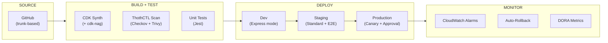
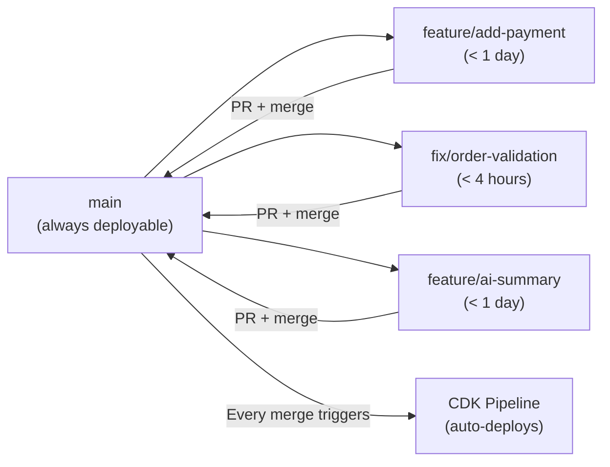
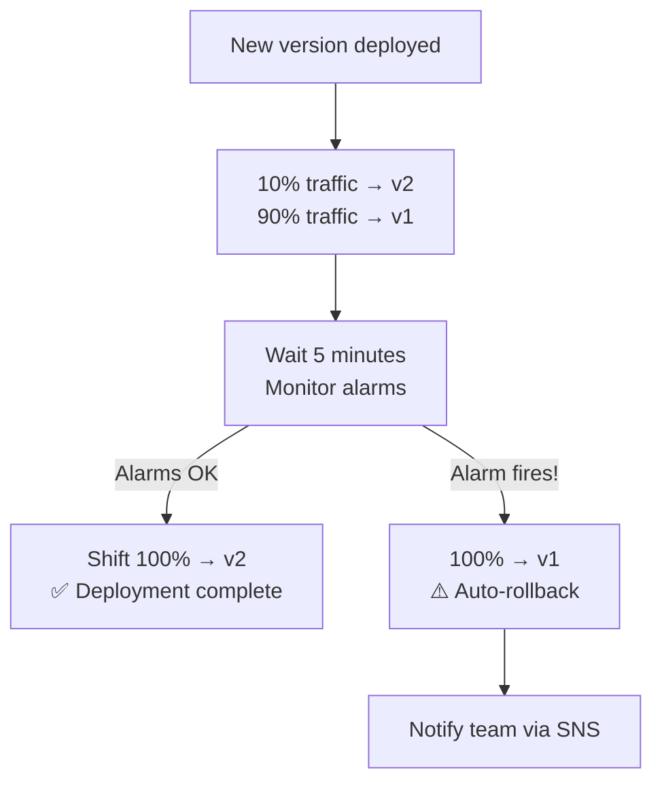

# Workshop: CI/CD Phase 1 — Team-Level Pipelines

## Overview

This workshop builds a **team-level CI/CD pipeline** applying TPF practices (Trunk-based + Progressive rollouts + Feature toggles) with CDK Pipelines, canary deployments, Express mode acceleration, and ThothCTL DevSecOps workflow integration.

### What You'll Build



### Maturity Level: L1 → L2

| Maturity | Before This Workshop | After This Workshop |
|----------|---------------------|---------------------|
| Deployment | Manual `cdk deploy` | Self-mutating CDK Pipeline |
| Testing | Local only | Automated per-environment |
| Security | Manual scan | Automated in pipeline (ThothCTL) |
| Rollback | Manual intervention | Automatic (canary + alarms) |
| Speed | 5-15 min deploys | Seconds (Express mode) |
| Metrics | None | DORA metrics tracked |
| Feature control | Deploy = release | Feature flags (Evidently) |

---

## Prerequisites

```bash
# Install all tools
pip install thothctl
thothctl init env

# Existing project from Workshop Phase 1
cd order-processing-api
```

---

## Step 1: Trunk-Based Development (TPF: "T")

### 1.1 Branch Strategy



**Rules:**
- Feature branches live < 1 day (short-lived)
- Every merge to `main` triggers the pipeline
- `main` is always deployable (no broken builds)
- No `develop`, `release`, or `hotfix` branches — just `main` + short PRs

### 1.2 Configure Branch Protection

```bash
# GitHub branch protection via CLI
gh api repos/{owner}/{repo}/branches/main/protection -X PUT -f \
  required_status_checks='{"strict":true,"contexts":["build","test","scan"]}' \
  enforce_admins=true \
  required_pull_request_reviews='{"required_approving_review_count":1}'
```

---

## Step 2: Self-Mutating CDK Pipeline

### 2.1 Create the Pipeline Stack

```typescript
// lib/pipeline-stack.ts
import * as cdk from 'aws-cdk-lib';
import * as pipelines from 'aws-cdk-lib/pipelines';
import { Construct } from 'constructs';
import { AppStage } from './app-stage';

export class PipelineStack extends cdk.Stack {
  constructor(scope: Construct, id: string, props?: cdk.StackProps) {
    super(scope, id, props);

    // Self-mutating pipeline — updates itself when you change this code
    const pipeline = new pipelines.CodePipeline(this, 'Pipeline', {
      pipelineName: 'OrderProcessing-Pipeline',
      crossAccountKeys: true, // Required for multi-account
      
      synth: new pipelines.ShellStep('Synth', {
        input: pipelines.CodePipelineSource.gitHub('your-org/order-processing-api', 'main', {
          authentication: cdk.SecretValue.secretsManager('github-token'),
        }),
        commands: [
          'npm ci',
          'npm run build',
          'npm test',                          // Unit tests + cdk-nag
          'pip install thothctl',
          'thothctl scan iac -t checkov',      // Security scan
          'npx cdk synth',
        ],
        primaryOutputDirectory: 'cdk.out',
      }),
    });

    // ═══════════════════════════════════════
    // DEV STAGE — Express mode, auto-deploy
    // ═══════════════════════════════════════
    const dev = pipeline.addStage(new AppStage(this, 'Dev', {
      env: { account: '111111111111', region: 'us-east-1' },
    }));
    
    dev.addPost(
      new pipelines.ShellStep('IntegrationTests', {
        commands: [
          'npm run test:integration',
        ],
        envFromCfnOutputs: {
          API_URL: /* reference to API URL output */,
        },
      }),
    );

    // ═══════════════════════════════════════
    // STAGING — Full stabilization + E2E tests
    // ═══════════════════════════════════════
    const staging = pipeline.addStage(new AppStage(this, 'Staging', {
      env: { account: '222222222222', region: 'us-east-1' },
    }));

    staging.addPost(
      new pipelines.ShellStep('E2ETests', {
        commands: ['npm run test:e2e'],
      }),
      new pipelines.ShellStep('SecurityGate', {
        commands: [
          'pip install thothctl',
          'thothctl workflow devsecops --phase secure --enforcement hard',
        ],
      }),
    );

    // ═══════════════════════════════════════
    // PRODUCTION — Approval + Canary
    // ═══════════════════════════════════════
    pipeline.addStage(new AppStage(this, 'Prod', {
      env: { account: '333333333333', region: 'us-east-1' },
    }), {
      pre: [
        new pipelines.ManualApprovalStep('ApproveProd', {
          comment: 'Review staging E2E results and security scan before production',
        }),
      ],
    });
  }
}
```

### 2.2 Deploy the Pipeline (First Time Only)

```bash
# Bootstrap accounts (one-time setup)
npx cdk bootstrap aws://111111111111/us-east-1  # Dev
npx cdk bootstrap aws://222222222222/us-east-1 --trust 111111111111  # Staging
npx cdk bootstrap aws://333333333333/us-east-1 --trust 111111111111  # Prod

# Deploy the pipeline stack itself
npx cdk deploy PipelineStack

# After this, the pipeline updates ITSELF on every commit
# You never run cdk deploy manually again
```

### 2.3 Express Mode in the Pipeline

For the Dev stage, use Express mode for faster feedback:

```typescript
// lib/app-stage.ts
export class AppStage extends cdk.Stage {
  constructor(scope: Construct, id: string, props: cdk.StageProps) {
    super(scope, id, props);

    // Application stacks deployed by this stage
    new OrderApiStack(this, 'OrderApi');
    new EventsStack(this, 'Events');
    new DataStack(this, 'Data');
  }
}
```

```bash
# The pipeline deploys Dev with Express mode via deployment config:
# (configured in the pipeline source, not manually)
# Dev: --deployment-config '{"mode": "EXPRESS"}' → seconds
# Staging/Prod: Standard mode → full stabilization
```

---

## Step 3: Progressive Rollouts (TPF: "P")

### 3.1 Lambda Canary Deployment

```yaml
# In SAM template or CDK-generated CFN
MyFunction:
  Type: AWS::Serverless::Function
  Properties:
    AutoPublishAlias: live
    DeploymentPreference:
      Type: Canary10Percent5Minutes
      Alarms:
        - !Ref FunctionErrorsAlarm
        - !Ref FunctionLatencyAlarm
      Hooks:
        PreTraffic: !Ref PreTrafficHookFunction
        PostTraffic: !Ref PostTrafficHookFunction
```

### 3.2 CDK Canary Configuration

```typescript
// lib/constructs/canary-function.ts
import * as lambda from 'aws-cdk-lib/aws-lambda';
import * as codedeploy from 'aws-cdk-lib/aws-codedeploy';
import * as cloudwatch from 'aws-cdk-lib/aws-cloudwatch';

export class CanaryFunction extends Construct {
  constructor(scope: Construct, id: string, props: CanaryFunctionProps) {
    super(scope, id);

    const fn = new lambda.Function(this, 'Function', {
      // ... function config
    });

    // Create alias for traffic shifting
    const alias = fn.addAlias('live');

    // Alarms that trigger rollback
    const errorsAlarm = new cloudwatch.Alarm(this, 'Errors', {
      metric: alias.metricErrors(),
      threshold: 5,
      evaluationPeriods: 1,
    });

    const latencyAlarm = new cloudwatch.Alarm(this, 'Latency', {
      metric: alias.metricDuration(),
      threshold: 5000, // 5 seconds
      evaluationPeriods: 2,
    });

    // CodeDeploy canary deployment
    new codedeploy.LambdaDeploymentGroup(this, 'Canary', {
      alias,
      deploymentConfig: codedeploy.LambdaDeploymentConfig.CANARY_10PERCENT_5MINUTES,
      alarms: [errorsAlarm, latencyAlarm],
      autoRollback: {
        failedDeployment: true,
        stoppedDeployment: true,
        deploymentInAlarm: true,
      },
    });
  }
}
```

### 3.3 How Canary Works



---

## Step 4: Feature Toggles (TPF: "F")

### 4.1 Set Up CloudWatch Evidently

```typescript
// lib/constructs/feature-flags.ts
import * as evidently from 'aws-cdk-lib/aws-evidently';

const project = new evidently.CfnProject(this, 'FeatureFlags', {
  name: 'order-processing',
});

// Feature: AI-powered order summaries
new evidently.CfnFeature(this, 'AiSummary', {
  project: project.name,
  name: 'ai-order-summary',
  variations: [
    { variationName: 'enabled', booleanValue: true },
    { variationName: 'disabled', booleanValue: false },
  ],
  defaultVariation: 'disabled',
});

// Launch: Progressive rollout
new evidently.CfnLaunch(this, 'AiSummaryLaunch', {
  project: project.name,
  name: 'ai-summary-rollout',
  groups: [{ feature: 'ai-order-summary', variation: 'enabled', groupName: 'enabled' }],
  scheduledSplitsConfig: {
    steps: [
      { startTime: '2026-08-01T00:00:00Z', groupWeights: [{ groupName: 'enabled', splitWeight: 10000 }] },  // 10%
      { startTime: '2026-08-02T00:00:00Z', groupWeights: [{ groupName: 'enabled', splitWeight: 50000 }] },  // 50%
      { startTime: '2026-08-03T00:00:00Z', groupWeights: [{ groupName: 'enabled', splitWeight: 100000 }] }, // 100%
    ],
  },
});
```

### 4.2 Use in Lambda Code

```typescript
// app/functions/create-order/index.ts
import { EvidentlyClient, EvaluateFeatureCommand } from '@aws-sdk/client-evidently';

const evidently = new EvidentlyClient({});

export const handler = async (event: any) => {
  // Check feature flag
  const featureEval = await evidently.send(new EvaluateFeatureCommand({
    project: 'order-processing',
    feature: 'ai-order-summary',
    entityId: event.requestContext.accountId,
  }));

  const order = await createOrder(event.body);

  // Progressive feature rollout (no deployment needed to enable/disable)
  if (featureEval.value?.boolValue) {
    order.summary = await generateAiSummary(order);
  }

  return { statusCode: 201, body: JSON.stringify(order) };
};
```

### 4.3 Kill Switch (Instant Rollback Without Deployment)

```bash
# Disable feature immediately (no deployment needed!)
aws cloudwatchevidently update-feature \
  --project order-processing \
  --feature ai-order-summary \
  --default-variation disabled

# Re-enable later
aws cloudwatchevidently update-feature \
  --project order-processing \
  --feature ai-order-summary \
  --default-variation enabled
```

---

## Step 5: ThothCTL DevSecOps Workflow in Pipeline

### 5.1 Pipeline Integration

```bash
# In the Build stage (before deploy):
thothctl workflow devsecops --phase secure --enforcement hard
# → Runs Checkov + Trivy + OPA
# → Fails pipeline on critical violations

# In Staging post-deploy:
thothctl workflow devsecops --phase pre-deploy --enforcement hard
# → test + secure combined
# → Blocks production promotion if violations found
```

### 5.2 Cost Gate

```bash
# Add cost estimation to pipeline
thothctl check iac -type cost-analysis

# If monthly cost exceeds threshold → require additional approval
# Configure in .thothcf.toml:
# [governance]
# max_monthly_cost_usd = 500
# cost_increase_threshold_percent = 20
```

---

## Step 6: DORA Metrics

### 6.1 What to Measure

| DORA Metric | Source | Target (Elite) |
|-------------|--------|----------------|
| **Deployment Frequency** | Pipeline execution count (prod stage) | Multiple per day |
| **Lead Time for Changes** | Commit timestamp → prod deploy timestamp | < 1 hour |
| **Change Failure Rate** | Failed deployments (rollbacks) / total | < 5% |
| **Time to Restore (MTTR)** | Alarm trigger → rollback complete | < 10 minutes |

### 6.2 Automatic Tracking

```typescript
// Custom CloudWatch metrics for DORA
const deployFrequency = new cloudwatch.Metric({
  namespace: 'DORA',
  metricName: 'DeploymentFrequency',
  dimensionsMap: { Service: 'order-processing', Environment: 'prod' },
});

const changeFailRate = new cloudwatch.Metric({
  namespace: 'DORA',
  metricName: 'ChangeFailureRate',
  dimensionsMap: { Service: 'order-processing' },
});

// Dashboard
new cloudwatch.Dashboard(this, 'DORaDashboard', {
  widgets: [
    [new cloudwatch.GraphWidget({ title: 'Deploy Frequency', left: [deployFrequency] })],
    [new cloudwatch.GraphWidget({ title: 'Change Failure Rate', left: [changeFailRate] })],
  ],
});
```

---

## Step 7: SAM Pipelines Alternative

For teams using SAM instead of CDK:

```bash
# Generate pipeline config (interactive wizard)
sam pipeline init --bootstrap

# Supports:
# - AWS CodePipeline
# - GitHub Actions
# - GitLab CI/CD
# - Bitbucket Pipelines

# Deploy with Express mode in dev
sam deploy --express --config-env dev

# Save Express as default for dev
sam deploy --express --save-params --config-env dev
```

```toml
# samconfig.toml (generated)
[dev.deploy.parameters]
stack_name = "orders-api-dev"
resolve_s3 = true
capabilities = "CAPABILITY_IAM"
express = true              # Express mode for dev

[prod.deploy.parameters]
stack_name = "orders-api-prod"
resolve_s3 = true
capabilities = "CAPABILITY_IAM"
confirm_changeset = true    # Manual confirmation for prod
```

---

## Summary: Phase 1 CI/CD Checklist

### Pipeline
- [ ] CDK Pipelines (self-mutating) deployed
- [ ] Source: GitHub with branch protection on `main`
- [ ] Build: npm ci + test + cdk-nag + ThothCTL scan
- [ ] Dev: Express mode, auto-deploy on merge
- [ ] Staging: Standard mode, E2E tests, security gate
- [ ] Prod: Manual approval + canary deployment

### TPF Practices
- [ ] **T:** Trunk-based (short-lived branches < 1 day)
- [ ] **P:** Canary (`Canary10Percent5Minutes`) with alarm-based rollback
- [ ] **F:** Feature flags via CloudWatch Evidently

### DevSecOps
- [ ] ThothCTL `scan` in build stage (Checkov + Trivy)
- [ ] ThothCTL `workflow devsecops --phase secure` as pipeline gate
- [ ] Cost analysis on every deployment

### Metrics
- [ ] DORA metrics dashboard created
- [ ] Deployment frequency tracked
- [ ] MTTR measured (alarm → rollback complete)

---

## Next: Phase 2 (Enterprise CI/CD)

Phase 2 elevates to enterprise-grade with:
- AWS Continuum (security at machine speed)
- AWS DevOps Agent (release management + incident investigation)
- Multi-account with SCPs + RCPs
- Supply chain security (SBOM, artifact signing)
- Policy-as-code gates
