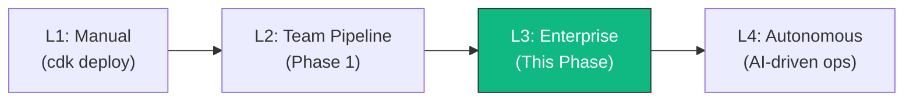
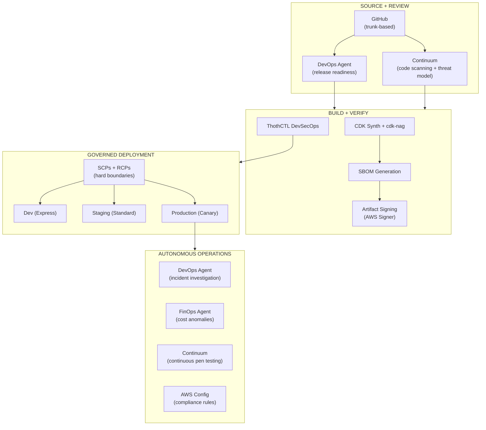
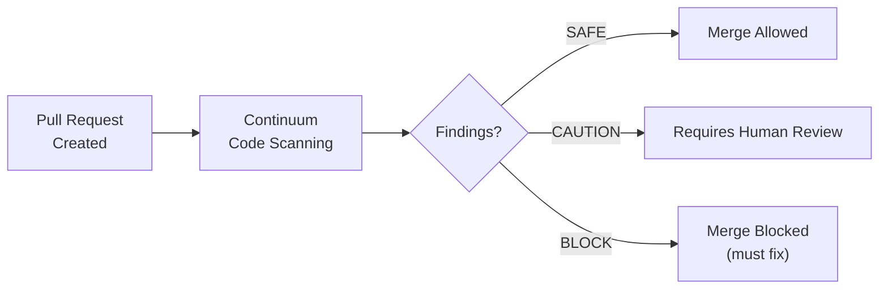
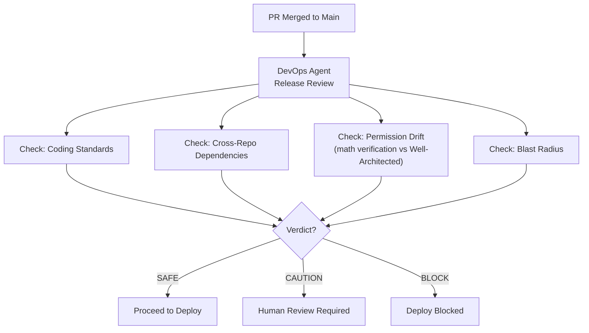
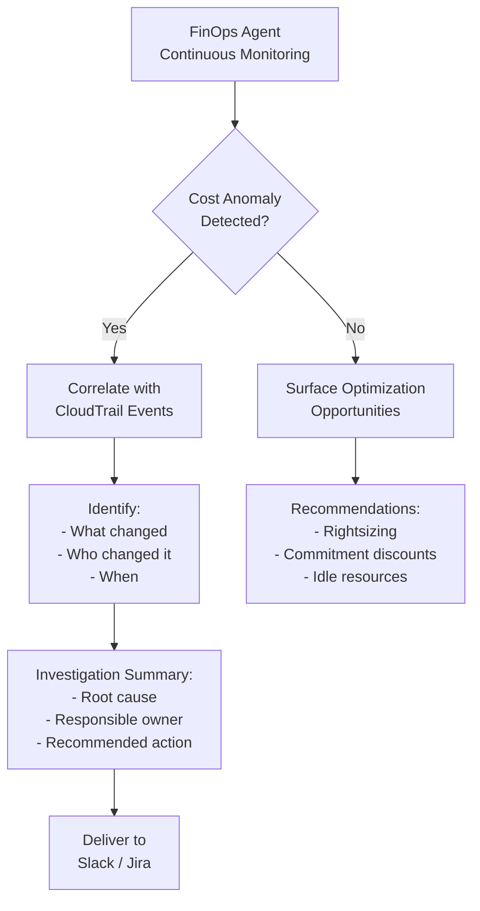
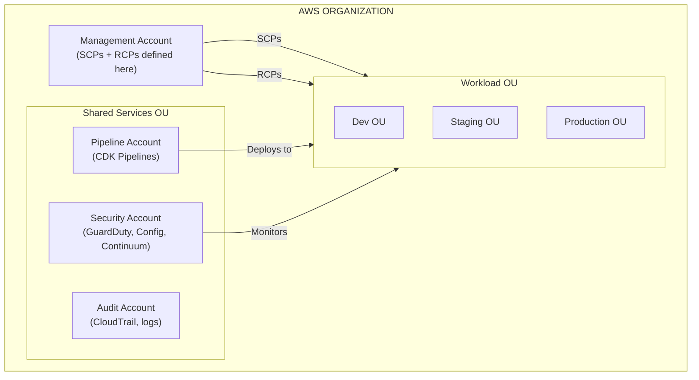
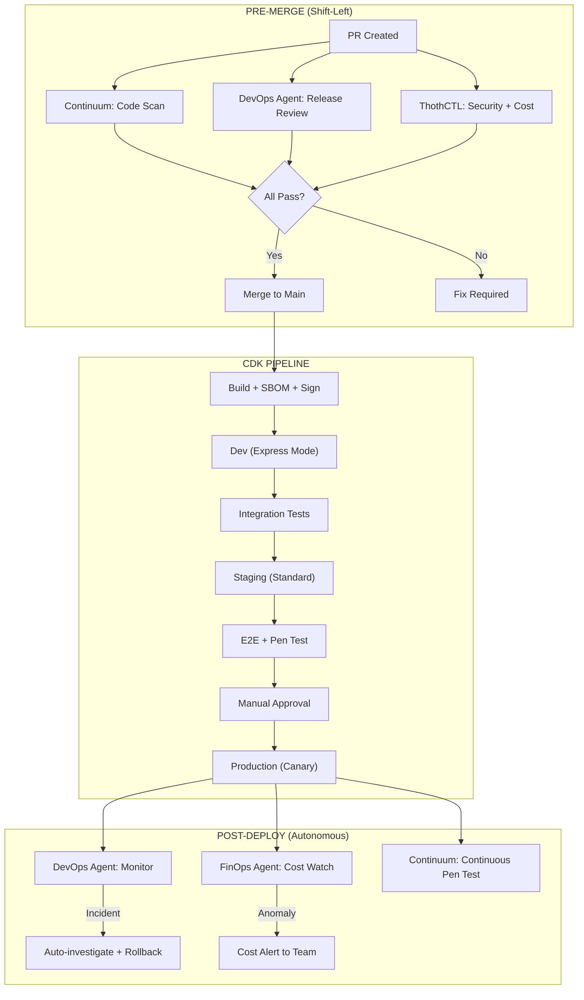
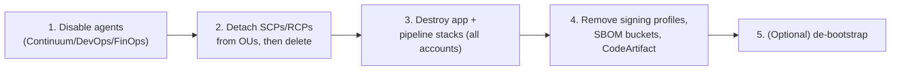

# Workshop: CI/CD Phase 2 — Enterprise Pipelines

> **Persona:** 🧑‍🔧 SME / Platform + 🛡️ Security/Governance (primary) · 👩‍💻 Developer (aware, not hands-on)
> **Maturity level:** L2 → L3 → L4 (Standardized → Governed → Autonomous)
> **Prerequisite:** [Workshop: CI/CD Phase 1](26-workshop-cicd-phase1.md), [Workshop: Enterprise CDK](24-workshop-enterprise-cdk.md)
>
> **Suggested path by persona:**
> - **SME / Platform / Security:** this is your workshop — SCPs/RCPs, supply-chain security, and policy-as-code gates are the org-level guardrails that make broad developer autonomy safe.
> - **Developer:** you don't build this, but understanding it explains why your deploys are blocked/allowed the way they are.

## Overview

Phase 2 elevates CI/CD to **enterprise-grade** with AWS frontier agents (Continuum, DevOps Agent, FinOps Agent), supply chain security, multi-account governance (SCPs + RCPs), and policy-as-code gates.

### Maturity Level: L2 → L3 → L4



| Capability | Phase 1 (Team) | Phase 2 (Enterprise) |
|-----------|---------------|---------------------|
| Security scanning | ThothCTL Checkov + Trivy | + AWS Continuum (pen testing + code scan + threat model) |
| Release review | Manual PR review | + DevOps Agent (AI release readiness + cross-repo impact) |
| Incident response | Manual investigation | + DevOps Agent (autonomous root cause analysis) |
| Cost control | ThothCTL cost estimation | + FinOps Agent (continuous anomaly investigation) |
| Supply chain | npm audit | + SBOM generation + artifact signing + provenance |
| Governance | cdk-nag | + SCPs + RCPs + Permission Boundaries + OPA policy repo |
| Multi-account | Dev + Prod | + Shared Services + Security + Audit accounts |
| Compliance | Build-time checks | + Runtime continuous compliance (AWS Config + Continuum) |

---

## Architecture: Enterprise CI/CD



---

## Step 1: AWS Continuum in the Pipeline

### 1.1 Continuum for Code Scanning (Pre-Merge)

AWS Continuum performs deep security analysis against organizational compliance requirements, known exploit patterns, and emerging threat vectors.



**Capabilities in the pipeline:**
- Deep security analysis against compliance requirements
- Known exploit pattern detection
- Emerging threat vector identification
- Actionable remediation guidance with validated fixes

### 1.2 Continuum for Threat Modeling (Design Phase)

Run automatically when architecture documents change:

```bash
# In pipeline — when docs/ or lib/stacks/ files change
# Continuum generates STRIDE threat model from design docs or codebase
# → Prioritized mitigations across all 6 STRIDE categories
# → Integrated into PR comments
```

### 1.3 Continuum for Penetration Testing (Post-Deploy)

```bash
# After staging deployment — automated pen testing
# Compresses weeks of manual pen testing into hours
# → Multi-step attack scenarios
# → Reproducible proof for each finding
# → Ready-to-implement fixes
```

### 1.4 Graduated Trust Model

Continuum operates within guardrails **you** define:

| Trust Level | What Continuum Can Do | Human Action |
|-------------|----------------------|-------------|
| **Propose** (default) | Finds issues, suggests fixes | Human approves each fix |
| **Auto-fix low severity** | Automatically fixes style/config issues | Human reviews in batch |
| **Auto-fix + deploy** | Fixes and deploys patches | Human monitors results |

Configure the trust level based on your organization's risk tolerance. Start with "Propose" and graduate.

---

## Step 2: AWS DevOps Agent — Release Management

### 2.1 Release Readiness Review (Pre-Production)

DevOps Agent automatically reviews code changes before they reach production:



**What DevOps Agent checks:**
- Code adherence to organizational standards
- Dependency impacts across repositories
- IAM permission changes (mathematical verification — not drift from Well-Architected)
- Blast radius of infrastructure changes
- Cross-repository breaking changes before merge

### 2.2 Release Testing (AI-Generated Tests)

DevOps Agent generates and runs **change-specific** test plans:

```bash
# DevOps Agent:
# 1. Analyzes what changed in the PR
# 2. Generates targeted tests (not a full regression suite)
# 3. Runs tests in customer-provisioned staging environment
# 4. Reports: regressions, UX issues, integration failures
# 5. Results posted to PR / deployment record
```

### 2.3 Post-Deployment Incident Investigation

When alarms fire in production, DevOps Agent begins investigating immediately:

```bash
# DevOps Agent autonomous investigation:
# 1. Correlates CloudWatch metrics + deployment history + logs
# 2. Checks: Was there a recent deployment? (likely cause)
# 3. Maps service dependencies
# 4. Identifies root cause
# 5. Proposes mitigation steps
# 6. Routes findings to Slack/PagerDuty/ServiceNow

# Results: 77% reduction in MTTR (real customer data)
```

### 2.4 Custom SRE Agents

Create agents that run on a schedule for proactive operations:

```bash
# Examples of custom SRE agents:
# - Daily database health check (slow queries, parameter tuning)
# - 24-hour log anomaly review (flag unusual patterns)
# - Weekly dependency vulnerability scan
# - Pre-release infrastructure health verification
```

### 2.5 Integrations

| Category | Tools |
|----------|-------|
| **Observability** | CloudWatch, Dynatrace, Datadog, Grafana, New Relic, Splunk |
| **Code + CI/CD** | GitHub, GitLab, Azure DevOps |
| **Incident** | ServiceNow, PagerDuty, Slack |
| **Extensible** | A2A protocol, private/remote MCP servers |

---

## Step 3: AWS FinOps Agent — Cost Governance

### 3.1 Continuous Cost Monitoring



### 3.2 Pipeline Cost Gate

```typescript
// In CDK Pipeline — cost estimation gate
staging.addPost(
  new pipelines.ShellStep('CostGate', {
    commands: [
      'pip install thothctl',
      'thothctl check iac -type cost-analysis',
      // If cost increase > 20%, require additional approval
      'if [ "$COST_INCREASE_PERCENT" -gt 20 ]; then echo "COST_REVIEW_REQUIRED"; exit 1; fi',
    ],
  }),
);
```

---

## Step 4: Supply Chain Security

### 4.1 SBOM Generation (Software Bill of Materials)

```yaml
# In pipeline build stage
- name: Generate SBOM
  commands:
    # For Node.js projects
    - npx @cyclonedx/cyclonedx-npm --output-file sbom.json --output-format json
    
    # For container images
    - syft scan $ECR_URI:latest -o cyclonedx-json > container-sbom.json
    
    # Store as pipeline artifact
    - aws s3 cp sbom.json s3://artifacts-bucket/releases/$VERSION/sbom.json
```

### 4.2 Artifact Signing (AWS Signer)

```bash
# Sign Lambda deployment packages
aws signer put-signing-profile \
  --profile-name OrgLambdaSigning \
  --platform-id AWSLambda-SHA384-ECDSA

# In pipeline: sign before deploy
aws signer start-signing-job \
  --source 's3={"bucketName":"deploy-bucket","key":"function.zip","version":"xxx"}' \
  --destination 's3={"bucketName":"signed-bucket","prefix":"signed/"}' \
  --profile-name OrgLambdaSigning
```

```typescript
// CDK: Lambda requires signed code
const fn = new lambda.Function(this, 'Function', {
  // ... config
  codeSigningConfig: new lambda.CodeSigningConfig(this, 'Signing', {
    signingProfiles: [signingProfile],
    untrustedArtifactOnDeployment: lambda.UntrustedArtifactOnDeployment.ENFORCE,
  }),
});
```

### 4.3 Dependency Scanning

```bash
# In pipeline build stage
npm audit --audit-level=high    # Fail on high/critical
pip-audit                       # Python dependencies
trivy fs --severity HIGH,CRITICAL .  # Filesystem scan

# ThothCTL dependency inventory with version checks
thothctl inventory iac --check-versions
```

### 4.4 Provenance Tracking (SLSA Level 2)

```yaml
# GitHub Actions — generate provenance
- uses: slsa-framework/slsa-github-generator/.github/workflows/builder_nodejs_slsa3.yml@v2.1.0
  with:
    artifact-path: dist/
    
# Result: cryptographic attestation that:
# - This artifact was built from THIS commit
# - Using THIS pipeline
# - On THIS date
# - With THESE dependencies
```

---

## Step 5: Multi-Account Governance (SCPs + RCPs)

### 5.1 Account Structure



### 5.2 SCPs for Pipeline Accounts

```json
// SCP: Deny actions that bypass the pipeline
{
  "Version": "2012-10-17",
  "Statement": [
    {
      "Sid": "DenyDirectDeploy",
      "Effect": "Deny",
      "Action": [
        "cloudformation:CreateStack",
        "cloudformation:UpdateStack",
        "cloudformation:DeleteStack"
      ],
      "Resource": "*",
      "Condition": {
        "StringNotEquals": {
          "aws:PrincipalArn": [
            "arn:aws:iam::*:role/cdk-*-deploy-role-*",
            "arn:aws:iam::*:role/cdk-*-cfn-exec-role-*"
          ]
        }
      }
    },
    {
      "Sid": "DenyDisableSecurityServices",
      "Effect": "Deny",
      "Action": [
        "guardduty:DeleteDetector",
        "config:DeleteConfigRule",
        "cloudtrail:StopLogging"
      ],
      "Resource": "*"
    }
  ]
}
```

### 5.3 RCPs for Data Perimeter

```json
// RCP: Resources only accessible by organization principals
{
  "Version": "2012-10-17",
  "Statement": [
    {
      "Sid": "EnforceOrgDataPerimeter",
      "Effect": "Deny",
      "Principal": "*",
      "Action": ["s3:*", "sqs:*", "kms:*", "secretsmanager:*"],
      "Resource": "*",
      "Condition": {
        "StringNotEqualsIfExists": {
          "aws:PrincipalOrgID": "o-myorgid123"
        },
        "BoolIfExists": {
          "aws:PrincipalIsAWSService": "false"
        }
      }
    }
  ]
}
```

### 5.4 Pipeline Permission Boundaries

```typescript
// Every role created by CDK in workload accounts gets a permission boundary
const boundary = new iam.ManagedPolicy(this, 'Boundary', {
  statements: [
    new iam.PolicyStatement({
      effect: iam.Effect.DENY,
      actions: [
        'iam:CreateUser',           // No IAM users (roles only)
        'iam:CreateAccessKey',      // No long-lived credentials
        'organizations:LeaveOrganization',
        's3:PutBucketPolicy',       // Can't make buckets public
      ],
      resources: ['*'],
    }),
  ],
});
```

---

## Step 6: Policy-as-Code Gates

### 6.1 ThothCTL OPA Policies in Pipeline

```bash
# Pipeline gate: enforce organizational policies
thothctl scan iac -t opa \
  --policy-dir https://github.com/myorg/iac-governance-policies.git \
  --enforcement hard

# If any policy fails → pipeline blocks
# Policies cover:
# - Naming conventions
# - Required tags
# - Encryption requirements
# - No public endpoints
# - Maximum Lambda memory (cost control)
# - ARM64 required (sustainability)
```

### 6.2 Policy Categories

| Category | Example Policy | Enforcement |
|----------|---------------|-------------|
| **Security** | All S3 buckets encrypted with KMS | Hard (blocks deploy) |
| **Cost** | Lambda memory ≤ 1024MB (unless approved) | Soft (warning) |
| **Compliance** | All resources tagged with Owner + CostCenter | Hard |
| **Sustainability** | Lambda must use ARM64 architecture | Soft (warning) |
| **Networking** | No public-facing resources without WAF | Hard |
| **Data** | DynamoDB must have point-in-time recovery enabled | Hard |

### 6.3 AI-Powered Policy Review

```bash
# ThothCTL AI review — multi-agent analysis of IaC changes
thothctl ai-review --mode orchestrate --agents security architecture fix decision

# Agents:
# - Security Agent: identifies vulnerabilities and misconfigurations
# - Architecture Agent: checks patterns against best practices
# - Fix Agent: generates remediation code
# - Decision Agent: makes automated pass/fail decision (with justification)
```

---

## Step 7: Putting It All Together

### Complete Enterprise Pipeline Flow



---

## Enterprise CI/CD Checklist

### Pre-Merge Gates
- [ ] AWS Continuum code scanning on every PR
- [ ] DevOps Agent release readiness review
- [ ] ThothCTL security scan (`--enforcement hard`)
- [ ] Branch protection (1+ reviewer + passing checks)

### Pipeline Infrastructure
- [ ] CDK Pipelines (self-mutating, cross-account)
- [ ] Multi-account: Shared Services + Dev + Staging + Prod
- [ ] Express mode for Dev, Standard for Staging/Prod
- [ ] Canary deployment with alarm-based rollback

### Supply Chain Security
- [ ] SBOM generated per release (CycloneDX format)
- [ ] Artifacts signed (AWS Signer)
- [ ] Dependency scanning (npm audit + Trivy)
- [ ] Provenance tracking (SLSA Level 2)
- [ ] CodeArtifact for private package management

### Governance
- [ ] SCPs: Deny direct deploy (must go through pipeline)
- [ ] RCPs: Data perimeter (org-only access to resources)
- [ ] Permission Boundaries on all workload roles
- [ ] OPA policy repository with org-wide rules
- [ ] ThothCTL policy gates in pipeline

### Autonomous Operations
- [ ] DevOps Agent deployed (incident + release management)
- [ ] FinOps Agent enabled (cost anomaly detection)
- [ ] Continuum configured (continuous pen testing)
- [ ] Custom SRE agents for recurring checks
- [ ] AWS Config rules for runtime compliance

### Metrics & Visibility
- [ ] DORA metrics dashboard
- [ ] Pipeline execution notifications (Slack)
- [ ] Cost reports per deployment
- [ ] Security posture dashboard (Continuum findings)

---

## Teardown & Cost Guardrails

> **Highest blast radius in the series.** Phase 2 provisions multi-account pipelines, org-level SCPs/RCPs, Continuum/DevOps/FinOps agent integrations, artifact signing, and supply-chain infrastructure. Tear down carefully and in order, and only in a sandbox organization.

### Teardown order



### 1. Disable frontier agents

```bash
# Remove agent integrations first so they don't fire alarms during teardown.
# (Console or IaC, depending on how they were enabled)
# - AWS DevOps Agent: remove repo/observability connections
# - AWS FinOps Agent: disable anomaly monitors
# - AWS Continuum: disable scheduled pen tests
```

### 2. Detach and delete Organizations policies

```bash
aws organizations detach-policy --policy-id <scp-id> --target-id <ou-id>
aws organizations detach-policy --policy-id <rcp-id> --target-id <ou-id>
aws organizations delete-policy --policy-id <scp-id>
aws organizations delete-policy --policy-id <rcp-id>
```

> **High-risk — sandbox only.** These SCPs include `DenyDirectDeploy` and security-service protections. Detaching them in a real org removes live guardrails. Confirm you are in the workshop's sandbox organization before running.

### 3. Destroy application and pipeline stacks

```bash
# Each workload account
npx cdk destroy --all --context env=dev
# Pipeline last
npx cdk destroy PipelineStack
```

### 4. Remove supply-chain and registry resources

```bash
# Signing profiles
aws signer cancel-signing-profile --profile-name OrgLambdaSigning

# SBOM / signed-artifact buckets (empty then delete)
aws s3 rm s3://artifacts-bucket --recursive && aws s3 rb s3://artifacts-bucket
aws s3 rm s3://signed-bucket --recursive && aws s3 rb s3://signed-bucket

# CodeArtifact (if not already removed in Workshop 24 teardown)
aws codeartifact delete-repository --domain myorg --repository constructs 2>/dev/null || true
aws codeartifact delete-domain --domain myorg 2>/dev/null || true
```

### Verify

```bash
aws organizations list-policies --filter SERVICE_CONTROL_POLICY \
  --query "Policies[?contains(Name,'Deny')].Name"
aws cloudformation list-stacks --stack-status-filter CREATE_COMPLETE UPDATE_COMPLETE \
  --query "StackSummaries[?contains(StackName,'Pipeline') || contains(StackName,'OrderApi')].StackName"
aws signer list-signing-profiles --query "profiles[?profileName=='OrgLambdaSigning']"
```

**✅ Checkpoint:** Agents disabled, workshop SCPs/RCPs deleted, all pipeline/app stacks gone, signing profiles and SBOM buckets removed.

---

## References

| Resource | Link |
|----------|------|
| AWS Continuum | https://aws.amazon.com/continuum/ |
| AWS DevOps Agent | https://aws.amazon.com/devops-agent/ |
| AWS FinOps Agent | https://aws.amazon.com/finops-agent/features/ |
| Resource Control Policies (RCPs) | https://aws.amazon.com/blogs/aws/introducing-resource-control-policies-rcps-a-new-authorization-policy/ |
| CDK Pipelines | https://docs.aws.amazon.com/cdk/v2/guide/cdk_pipeline.html |
| AWS Signer for Lambda | https://docs.aws.amazon.com/lambda/latest/dg/configuration-codesigning.html |
| ThothCTL DevSecOps | https://thothctl.readthedocs.io/en/latest/framework/use_cases/devsecops_sdlc/ |
| Building Data Perimeter on AWS | https://docs.aws.amazon.com/whitepapers/latest/building-a-data-perimeter-on-aws/perimeter-overview.html |
