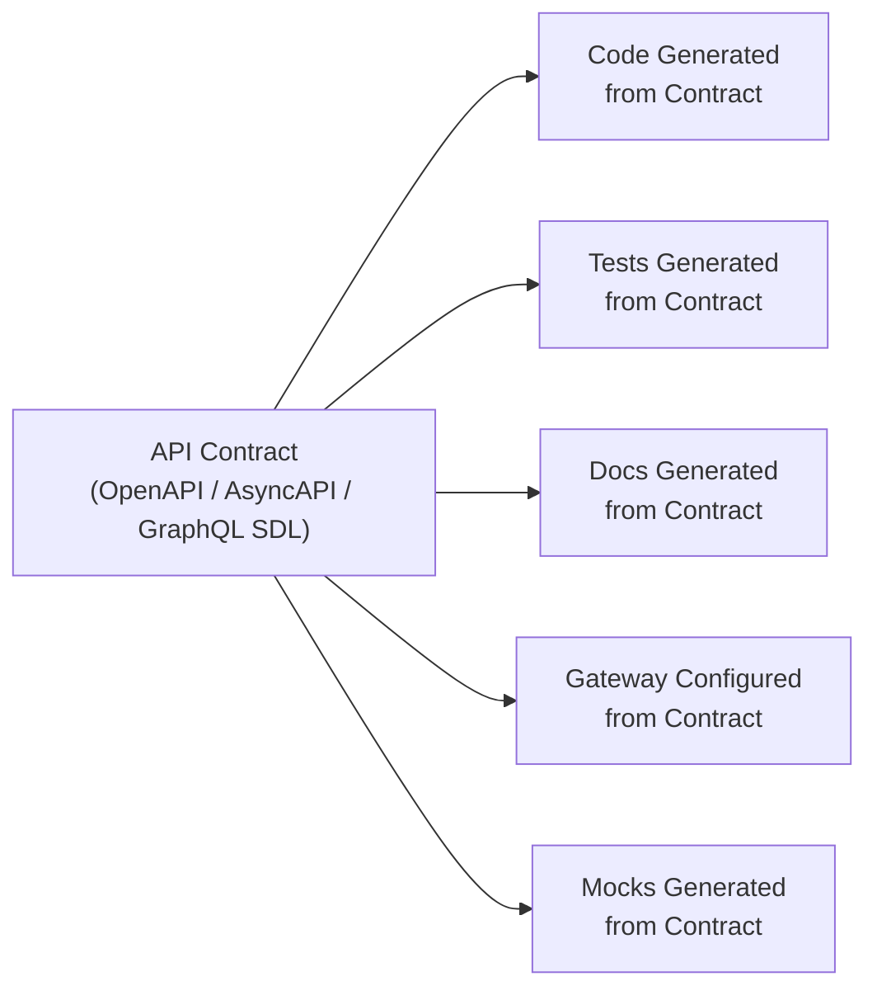
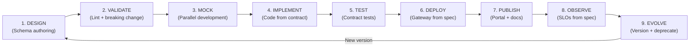
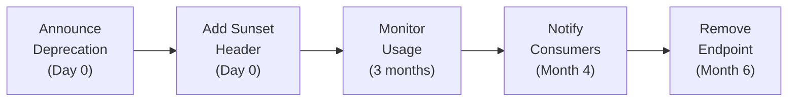
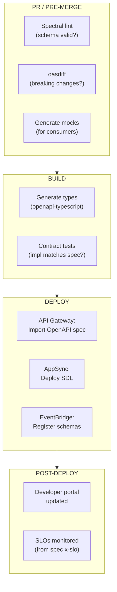

# APIOps Model — Contract-First API Lifecycle

## What Is APIOps?

APIOps applies **GitOps and DevOps principles to API lifecycle management**. Just as DevOps automates software delivery, APIOps automates the design, validation, deployment, and governance of APIs.

> "APIOps is a methodology that applies the concepts of GitOps and DevOps to API deployment. It helps teams make changes and deploy them in an iterative and automated way." — Microsoft Azure Architecture Center

### Core Principle: Contract-First



**The contract is the single source of truth.** Everything else is derived from it.

---

## API Lifecycle Stages



| Stage | Activity | AWS Tool | Artifact |
|-------|----------|----------|----------|
| **Design** | Author API schema | IDE + Spectral | `openapi.yaml` / `asyncapi.yaml` / `schema.graphql` |
| **Validate** | Lint rules + breaking change detection | Spectral + oasdiff | CI gate pass/fail |
| **Mock** | Generate mock server from spec | Prism / Stoplight | Mock endpoint for frontend teams |
| **Implement** | Generate types + validators from spec | openapi-typescript / GraphQL Codegen | TypeScript interfaces |
| **Test** | Verify implementation matches contract | Pact / Dredd / Schemathesis | Contract test results |
| **Deploy** | Configure gateway from spec | API Gateway (OpenAPI import) / AppSync (SDL) | Deployed API |
| **Publish** | API catalog + documentation | Developer portal / Backstage | Public docs |
| **Observe** | Monitor against SLOs defined in spec | CloudWatch + Application Signals | SLO dashboard |
| **Evolve** | Version, deprecate, sunset | Versioning strategy | Changelog |

---

## Contract Types by API Style

### REST APIs → OpenAPI 3.1

```yaml
# contracts/orders-api.openapi.yaml
openapi: "3.1.0"
info:
  title: Orders API
  version: "1.0.0"
  description: Order processing service
  x-amazon-apigateway-request-validators:
    all:
      validateRequestBody: true
      validateRequestParameters: true

paths:
  /orders:
    post:
      operationId: createOrder
      summary: Create a new order
      requestBody:
        required: true
        content:
          application/json:
            schema:
              $ref: '#/components/schemas/CreateOrderRequest'
      responses:
        '201':
          description: Order created
          content:
            application/json:
              schema:
                $ref: '#/components/schemas/Order'
        '400':
          $ref: '#/components/responses/ValidationError'
      x-amazon-apigateway-integration:
        type: aws_proxy
        httpMethod: POST
        uri: !Sub "arn:aws:apigateway:${AWS::Region}:lambda:path/..."

  /orders/{orderId}:
    get:
      operationId: getOrder
      parameters:
        - name: orderId
          in: path
          required: true
          schema:
            type: string
            format: uuid
      responses:
        '200':
          description: Order found
          content:
            application/json:
              schema:
                $ref: '#/components/schemas/Order'
        '404':
          $ref: '#/components/responses/NotFound'

components:
  schemas:
    CreateOrderRequest:
      type: object
      required: [customerId, items]
      properties:
        customerId:
          type: string
          format: uuid
        items:
          type: array
          minItems: 1
          items:
            $ref: '#/components/schemas/OrderItem'
    
    OrderItem:
      type: object
      required: [productId, quantity, price]
      properties:
        productId:
          type: string
        quantity:
          type: integer
          minimum: 1
        price:
          type: number
          minimum: 0.01

    Order:
      type: object
      properties:
        id:
          type: string
          format: uuid
        customerId:
          type: string
        status:
          type: string
          enum: [PLACED, VALIDATED, PROCESSING, COMPLETED, FAILED]
        items:
          type: array
          items:
            $ref: '#/components/schemas/OrderItem'
        total:
          type: number
        createdAt:
          type: string
          format: date-time

  responses:
    ValidationError:
      description: Validation failed
      content:
        application/json:
          schema:
            type: object
            properties:
              error: { type: string }
              details: { type: array, items: { type: string } }
    NotFound:
      description: Resource not found
```

### Event-Driven APIs → AsyncAPI

```yaml
# contracts/order-events.asyncapi.yaml
asyncapi: '2.6.0'
info:
  title: Order Events
  version: '1.0.0'
  description: Events emitted by the Orders cell

channels:
  orders/placed:
    publish:
      operationId: orderPlaced
      message:
        $ref: '#/components/messages/OrderPlaced'

  orders/completed:
    publish:
      operationId: orderCompleted
      message:
        $ref: '#/components/messages/OrderCompleted'

components:
  messages:
    OrderPlaced:
      name: OrderPlaced
      title: Order Placed Event
      contentType: application/json
      payload:
        type: object
        required: [orderId, customerId, total, timestamp]
        properties:
          orderId:
            type: string
            format: uuid
          customerId:
            type: string
          items:
            type: array
            items:
              type: object
              properties:
                productId: { type: string }
                quantity: { type: integer }
                price: { type: number }
          total:
            type: number
          timestamp:
            type: string
            format: date-time

    OrderCompleted:
      name: OrderCompleted
      title: Order Completed Event
      payload:
        type: object
        required: [orderId, completedAt]
        properties:
          orderId:
            type: string
            format: uuid
          completedAt:
            type: string
            format: date-time
```

### GraphQL APIs → SDL (AppSync)

```graphql
# contracts/orders.graphql
type Query {
  getOrder(id: ID!): Order
  listOrders(customerId: ID!, limit: Int, nextToken: String): OrderConnection!
}

type Mutation {
  createOrder(input: CreateOrderInput!): Order!
  cancelOrder(id: ID!): Order!
}

type Subscription {
  onOrderStatusChanged(customerId: ID!): Order
    @aws_subscribe(mutations: ["createOrder", "cancelOrder"])
}

input CreateOrderInput {
  customerId: ID!
  items: [OrderItemInput!]!
}

input OrderItemInput {
  productId: ID!
  quantity: Int!
  price: Float!
}

type Order {
  id: ID!
  customerId: ID!
  status: OrderStatus!
  items: [OrderItem!]!
  total: Float!
  createdAt: AWSDateTime!
}

type OrderItem {
  productId: ID!
  quantity: Int!
  price: Float!
}

type OrderConnection {
  items: [Order!]!
  nextToken: String
}

enum OrderStatus {
  PLACED
  VALIDATED
  PROCESSING
  COMPLETED
  FAILED
}
```

---

## REST API Standards

| Convention | Standard | Example |
|-----------|----------|---------|
| **URL naming** | Plural nouns, kebab-case | `/orders`, `/order-items` |
| **HTTP methods** | GET (read), POST (create), PUT (replace), PATCH (partial), DELETE | `POST /orders` |
| **Status codes** | 201 (created), 200 (OK), 204 (no content), 400, 401, 403, 404, 409, 500 | `201 Created` |
| **Pagination** | Cursor-based (nextToken) | `?limit=20&nextToken=abc` |
| **Error format** | Consistent JSON: `{error, message, details}` | `{"error":"VALIDATION_FAILED","message":"..."}` |
| **Versioning** | URL path (recommended for AWS) | `/v1/orders`, `/v2/orders` |
| **Idempotency** | `Idempotency-Key` header on POST/PATCH | `Idempotency-Key: uuid-here` |
| **Date format** | ISO 8601 | `2026-07-29T18:00:00Z` |
| **Filtering** | Query parameters | `?status=PLACED&customerId=123` |
| **Sorting** | `sort` parameter | `?sort=-createdAt` (desc) |

---

## Event Schema Standards

### Event Envelope (EventBridge)

```json
{
  "source": "orders-service",
  "detail-type": "OrderPlaced",
  "detail": {
    "metadata": {
      "eventId": "uuid",
      "correlationId": "uuid",
      "timestamp": "2026-07-29T18:00:00Z",
      "version": "1.0"
    },
    "data": {
      "orderId": "uuid",
      "customerId": "uuid",
      "total": 99.99
    }
  }
}
```

### Naming Conventions

| Element | Convention | Example |
|---------|-----------|---------|
| **Source** | `{cell-name}-service` | `orders-service` |
| **Detail-type** | PascalCase verb+noun | `OrderPlaced`, `PaymentFailed` |
| **Version** | Semantic in metadata | `"version": "1.0"` |

### EventBridge Schema Registry

```typescript
// CDK: Enable schema discovery
const bus = new events.EventBus(this, 'OrdersBus', { eventBusName: 'orders' });

new events.CfnDiscoverer(this, 'SchemaDiscoverer', {
  sourceArn: bus.eventBusArn,
  description: 'Auto-discover event schemas',
});
```

---

## API Governance

### Spectral Linting Rules

```yaml
# .spectral.yaml — Organization API standards
extends: "spectral:oas"
rules:
  operation-operationId:
    severity: error
    description: "Every operation must have an operationId"
  
  path-must-be-plural:
    severity: warn
    given: "$.paths[*]~"
    then:
      function: pattern
      functionOptions:
        match: "^/[a-z].*s(/|$)"
    description: "Paths should use plural nouns"

  must-have-pagination:
    severity: warn
    given: "$.paths[*].get.responses.200.content.application/json.schema"
    then:
      function: schema
      functionOptions:
        schema:
          properties:
            nextToken: {}
    description: "List endpoints should support pagination"

  no-breaking-changes:
    severity: error
    description: "Cannot remove required fields or change types"
```

### Breaking Change Policy

| Change Type | Breaking? | Action Required |
|-------------|-----------|----------------|
| Add optional field | No | Deploy freely |
| Add new endpoint | No | Deploy freely |
| Remove field | **YES** | Deprecate → sunset period → remove |
| Change field type | **YES** | New version required |
| Remove endpoint | **YES** | Deprecate (6 months) → remove |
| Add required field to request | **YES** | New version required |
| Rename field | **YES** | Add new + deprecate old |

### Deprecation Timeline



---

## APIOps in CI/CD Pipeline



### Pipeline Commands

```bash
# In CI/CD pipeline:

# 1. Lint the API spec
npx @stoplight/spectral-cli lint contracts/orders-api.openapi.yaml

# 2. Check for breaking changes (compare against main branch)
npx oasdiff breaking contracts/orders-api.openapi.yaml contracts/orders-api.openapi.yaml --base main

# 3. Generate TypeScript types from spec
npx openapi-typescript contracts/orders-api.openapi.yaml -o src/generated/api-types.ts

# 4. Run contract tests
npm run test:contract

# 5. Deploy API Gateway from spec (CDK)
cdk deploy --express  # CDK imports the OpenAPI spec directly
```

---

## AWS Implementation

### API Gateway from OpenAPI Spec (CDK)

```typescript
// Deploy API Gateway directly from OpenAPI specification
import * as apigw from 'aws-cdk-lib/aws-apigateway';
import * as fs from 'fs';

const api = new apigw.SpecRestApi(this, 'OrdersApi', {
  apiDefinition: apigw.ApiDefinition.fromAsset('contracts/orders-api.openapi.yaml'),
  deployOptions: {
    stageName: 'v1',
    tracingEnabled: true,
    metricsEnabled: true,
  },
});
```

### AppSync from GraphQL SDL (CDK)

```typescript
import * as appsync from 'aws-cdk-lib/aws-appsync';

const api = new appsync.GraphqlApi(this, 'OrdersGraphQL', {
  name: 'orders-api',
  definition: appsync.Definition.fromFile('contracts/orders.graphql'),
  authorizationConfig: {
    defaultAuthorization: {
      authorizationType: appsync.AuthorizationType.USER_POOL,
      userPoolConfig: { userPool },
    },
  },
});
```

### EventBridge Schema Registry (CDK)

```typescript
import * as schemas from 'aws-cdk-lib/aws-eventschemas';

const registry = new schemas.CfnRegistry(this, 'OrderSchemas', {
  registryName: 'orders-service-events',
  description: 'Event schemas for the Orders cell',
});

// Register schema from AsyncAPI spec
new schemas.CfnSchema(this, 'OrderPlacedSchema', {
  registryName: registry.registryName,
  schemaName: 'OrderPlaced',
  type: 'JSONSchemaDraft4',
  content: fs.readFileSync('contracts/schemas/order-placed.json', 'utf-8'),
});
```

---

## MCP as the API Contract for AI Agents

In the agentic era, **MCP tool descriptions ARE the API contract** for AI agents. The same design-first principles apply:

| REST API Contract | MCP Tool Contract |
|-------------------|-------------------|
| OpenAPI spec describes endpoints | MCP tool description describes capabilities |
| Request/response schema validates data | Tool input/output schema validates data |
| API docs explain usage | Tool description explains when to use |
| Versioning for backward compat | Tool versioning for agent compatibility |

```json
// MCP tool = API contract for AI agents
{
  "name": "create_order",
  "description": "Creates a new order for a customer. Use when the user wants to place an order with specific items.",
  "inputSchema": {
    "type": "object",
    "required": ["customerId", "items"],
    "properties": {
      "customerId": { "type": "string", "description": "UUID of the customer" },
      "items": {
        "type": "array",
        "items": {
          "type": "object",
          "properties": {
            "productId": { "type": "string" },
            "quantity": { "type": "integer", "minimum": 1 },
            "price": { "type": "number" }
          }
        }
      }
    }
  }
}
```

**Principle:** Design your MCP tools with the same rigor as your REST APIs — they're the interface contract for AI consumers.

---

## APIOps Checklist

### Design Phase
- [ ] API contract written BEFORE implementation (OpenAPI/AsyncAPI/GraphQL SDL)
- [ ] Spectral lint rules configured (`.spectral.yaml`)
- [ ] Event envelope format standardized
- [ ] Naming conventions documented and enforced
- [ ] Versioning strategy decided (URL path for REST)

### Pipeline Integration
- [ ] Spectral lint in PR checks
- [ ] Breaking change detection (oasdiff) blocks PR
- [ ] Type generation from spec (openapi-typescript / GraphQL Codegen)
- [ ] Contract tests verify implementation matches spec
- [ ] API Gateway/AppSync deployed from spec (not manually configured)

### Governance
- [ ] Schema registry enabled (EventBridge Schema Discovery)
- [ ] Deprecation policy defined (6-month sunset minimum)
- [ ] API catalog/portal available to all teams
- [ ] Consumer-driven contracts for critical integrations
- [ ] MCP tool descriptions reviewed with same rigor as API specs

### Operations
- [ ] SLOs defined per API (availability, latency, error rate)
- [ ] Rate limiting configured per consumer
- [ ] WAF rules applied to all public APIs
- [ ] API usage metrics tracked per consumer/team
