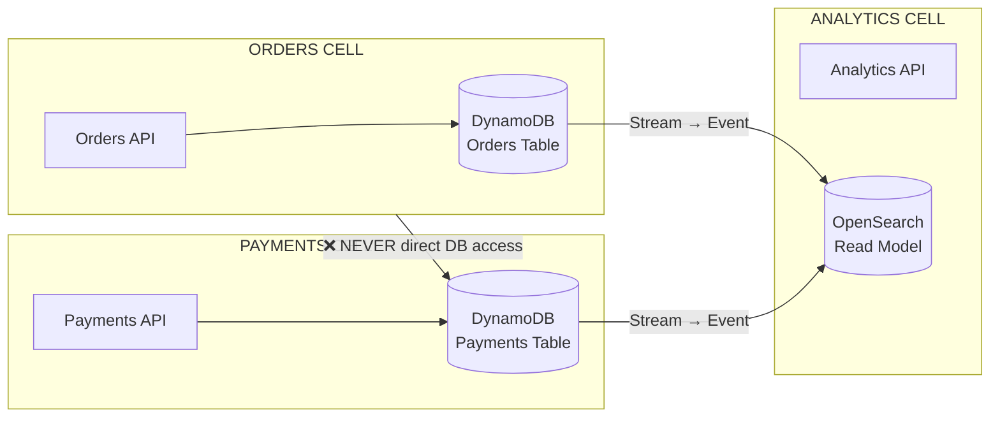
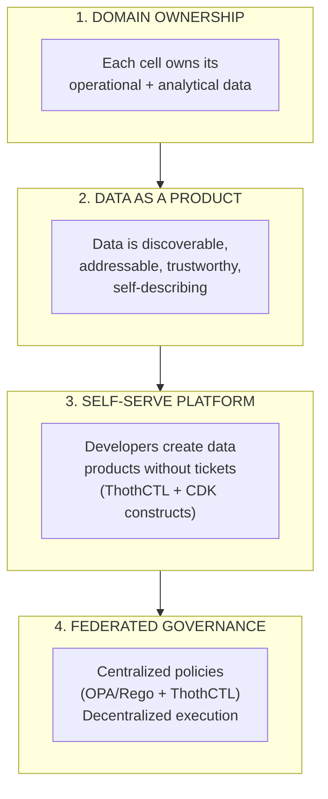
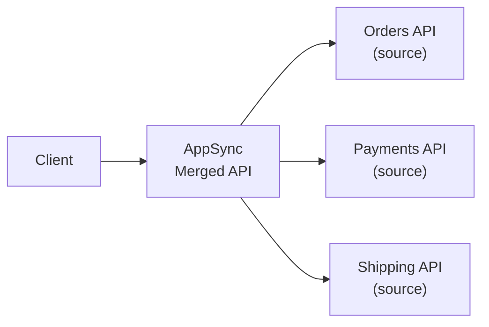
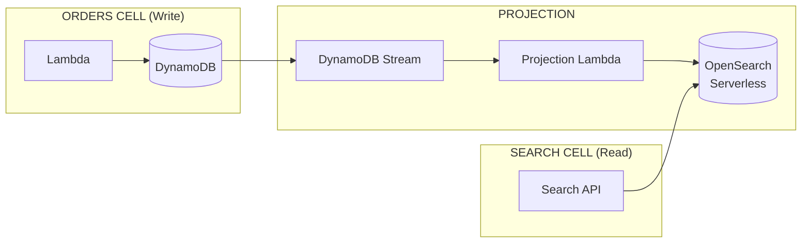
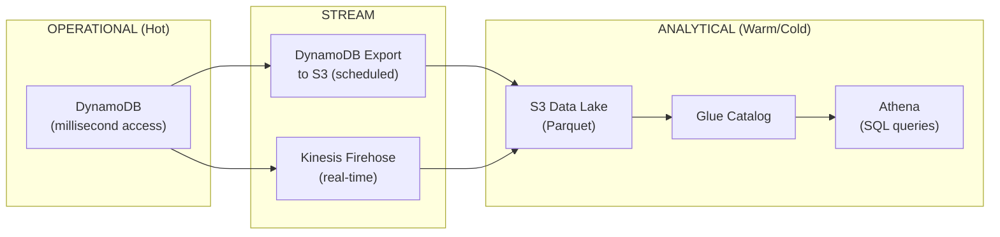
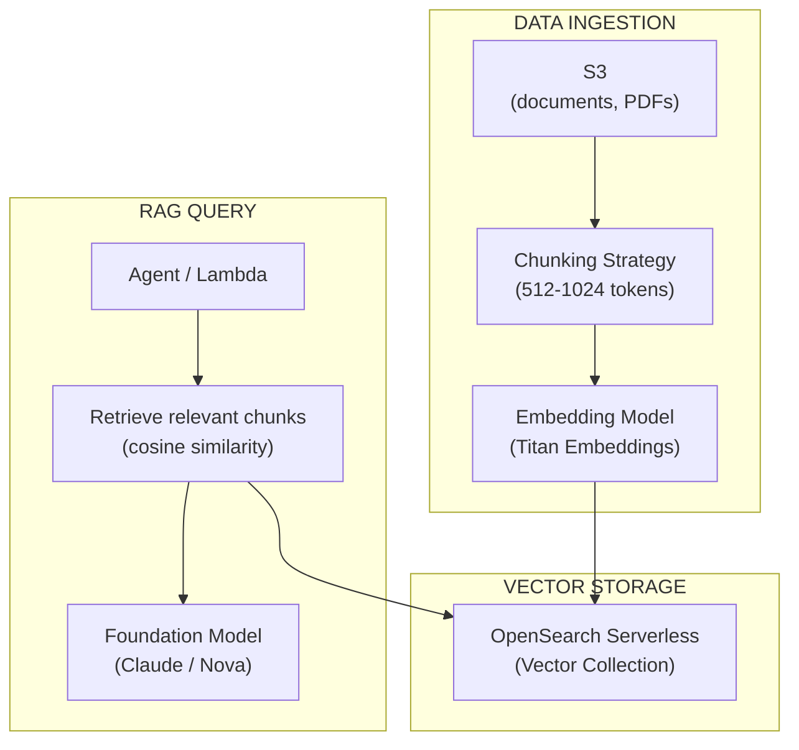

# Data Strategy — Domain Ownership & Cross-Cell Patterns

## Core Principle: Each Cell Owns Its Data

In cell-based architecture, **no database is shared between cells**. Each cell owns its data store, schema, and access patterns. Cross-cell data access is ONLY via events or APIs — never direct database reads.



---

## Data Mesh Principles for Serverless

Data Mesh (Zhamak Dehghani) applied to AWS serverless cell-based architecture:



### Mapping to AWS Serverless

| Data Mesh Principle | AWS Implementation |
|--------------------|-------------------|
| **Domain ownership** | Cell owns its DynamoDB table(s); no cross-cell table access |
| **Data as a product** | EventBridge events + Schema Registry = discoverable data products |
| **Self-serve platform** | CDK constructs for data infra; `thothctl generate` for boilerplate |
| **Federated governance** | OPA policies enforce encryption, backup, tagging; ThothCTL validates |

---

## Cross-Cell Data Access Patterns

### Pattern Comparison

| Pattern | When to Use | Latency | Consistency | Complexity |
|---------|-------------|---------|-------------|-----------|
| **Event-Carried State Transfer (ECST)** | Cell needs local copy of another cell's data | Low (pre-built) | Eventual | Medium |
| **API Composition** | Client needs data from multiple cells in one request | Higher (runtime) | Strong | Low |
| **CQRS Projection** | Need query patterns different from source (search, aggregation) | Low (pre-built) | Eventual | Medium |
| **Change Data Capture (CDC)** | Stream operational data to analytics/lakehouse | Variable | Eventual | Medium |
| **Direct DB access** | ❌ NEVER | — | — | — |

---

### Pattern 1: Event-Carried State Transfer (ECST)

> "Stop making API calls after every event. Carry the state IN the event."

```mermaid
flowchart TD
    subgraph OrdersCell["ORDERS CELL (Producer)"]
        O_WRITE["Write Order"] --> O_DB[("DynamoDB<br/>Orders")]
        O_DB --> STREAM["DynamoDB Stream"]
        STREAM --> PIPE["EventBridge Pipe<br/>(filter + enrich)"]
        PIPE --> BUS["EventBridge<br/>OrderPlaced event<br/>(FULL state included)"]
    end
    subgraph NotifyCell["NOTIFICATIONS CELL (Consumer)"]
        BUS --> N_LAMBDA["Lambda<br/>(process event)"]
        N_LAMBDA --> N_DB[("DynamoDB<br/>Orders Read Copy)"]
        N_LAMBDA --> SEND["Send Notification<br/>(uses local data)"]
    end
```

**The event carries the FULL state** — the consumer builds a local read model from events. No synchronous calls back to the producer cell.

#### CDK Implementation

```typescript
// Orders Cell: Publish full state on change
const ordersTable = new dynamodb.Table(this, 'Orders', {
  partitionKey: { name: 'PK', type: dynamodb.AttributeType.STRING },
  stream: dynamodb.StreamViewType.NEW_AND_OLD_IMAGES, // Full state in stream
  billingMode: dynamodb.BillingMode.PAY_PER_REQUEST,
});

// EventBridge Pipe: DynamoDB Stream → EventBridge (with full state)
new pipes.CfnPipe(this, 'OrderStreamPipe', {
  source: ordersTable.tableStreamArn!,
  target: eventBus.eventBusArn,
  sourceParameters: {
    dynamoDbStreamParameters: {
      startingPosition: 'LATEST',
      batchSize: 10,
    },
    filterCriteria: {
      filters: [{ pattern: '{"eventName":["INSERT","MODIFY"]}' }],
    },
  },
  targetParameters: {
    eventBridgeEventBusParameters: {
      source: 'orders-service',
      detailType: 'OrderStateChanged',
    },
  },
});
```

#### Consumer Cell: Build Local Read Model

```typescript
// Notifications Cell: Lambda processes event and stores local copy
export const handler = async (event: EventBridgeEvent<'OrderStateChanged', OrderState>) => {
  const order = event.detail;
  
  // Store local copy (read model) — never calls Orders API
  await dynamoClient.send(new PutItemCommand({
    TableName: process.env.LOCAL_ORDERS_TABLE,
    Item: marshall({
      PK: `ORDER#${order.orderId}`,
      customerId: order.customerId,
      status: order.status,
      total: order.total,
      lastUpdated: event.time,
    }),
  }));

  // Use local data to send notification
  if (order.status === 'COMPLETED') {
    await sendCompletionEmail(order.customerId, order.orderId, order.total);
  }
};
```

---

### Pattern 2: API Composition (AppSync Merged APIs)

When a client needs data from multiple cells in a single request:



```graphql
# Client query — resolved across 3 cells transparently
query GetOrderDetails($orderId: ID!) {
  order(id: $orderId) {          # → Orders cell
    id
    status
    items { productId, quantity }
    payment {                     # → Payments cell
      status
      method
      transactionId
    }
    shipping {                    # → Shipping cell
      trackingNumber
      estimatedDelivery
    }
  }
}
```

Each source API is independently deployed by its owning team. AppSync Merged APIs compose them at build-time.

---

### Pattern 3: CQRS Projection (Read Store)

When you need query patterns the source database doesn't support (full-text search, aggregations, faceted filters):



```typescript
// Projection Lambda: Transform DynamoDB record → OpenSearch document
export const handler = async (event: DynamoDBStreamEvent) => {
  for (const record of event.Records) {
    if (record.eventName === 'INSERT' || record.eventName === 'MODIFY') {
      const order = unmarshall(record.dynamodb!.NewImage!);
      
      await opensearchClient.index({
        index: 'orders',
        id: order.id,
        body: {
          orderId: order.id,
          customerId: order.customerId,
          status: order.status,
          total: order.total,
          items: order.items,
          createdAt: order.createdAt,
          // Denormalized fields for search
          productNames: order.items.map(i => i.productName).join(' '),
        },
      });
    }
  }
};
```

---

## Data Contracts

### What Is a Data Contract?

A **data contract** is a formal agreement between a data producer and its consumers about the schema, quality, and SLAs of a data product.

```yaml
# contracts/data/order-placed-contract.yaml
dataContract:
  name: OrderPlaced
  version: "1.0.0"
  owner: orders-squad
  description: "Emitted when a new order is created"
  
  schema:
    type: object
    required: [orderId, customerId, total, timestamp]
    properties:
      orderId: { type: string, format: uuid }
      customerId: { type: string, format: uuid }
      total: { type: number, minimum: 0.01 }
      status: { type: string, enum: [PLACED] }
      items: { type: array, minItems: 1 }
      timestamp: { type: string, format: date-time }

  quality:
    completeness: 99.9%   # Fields populated
    freshness: "< 5 seconds from write"
    accuracy: "Total = sum(item.price * item.quantity)"

  sla:
    availability: 99.9%
    latency: "< 500ms from write to event delivery"

  consumers:
    - notifications-cell
    - analytics-cell
    - shipping-cell
  
  breaking_change_policy: "6-month deprecation notice"
```

### Contract Validation in Pipeline

```bash
# ThothCTL validates data contracts
thothctl check iac -type data-contracts

# EventBridge Schema Registry enforces at runtime
# If event doesn't match registered schema → dead-letter queue
```

---

## DynamoDB Design Patterns

### Single-Table vs Multi-Table Decision

| Use Single-Table Design | Use Separate Tables Per Entity |
|------------------------|-------------------------------|
| Entities are always queried together | Entities have independent access patterns |
| Need transactions across entities | Entities scale independently |
| Same cell, same bounded context | Different cells (ALWAYS separate) |
| Known, fixed access patterns | Evolving/unknown access patterns |

### Single-Table Design (Within a Cell)

```
PK                  SK                  Type     Data
─────────────────── ─────────────────── ──────── ──────────────────────
ORDER#uuid-1        ORDER#uuid-1        Order    {status, total, ...}
ORDER#uuid-1        ITEM#product-1      Item     {quantity, price}
ORDER#uuid-1        ITEM#product-2      Item     {quantity, price}
CUSTOMER#cust-1     ORDER#2026-07-29    GSI1     {orderId, total}
STATUS#PLACED       ORDER#2026-07-29    GSI2     {orderId, customerId}
```

### Access Pattern → Key Design

| Access Pattern | Key Design | Index |
|---------------|-----------|-------|
| Get order by ID | PK=`ORDER#id`, SK=`ORDER#id` | Table |
| Get items for order | PK=`ORDER#id`, SK begins_with `ITEM#` | Table |
| Orders by customer | GSI1PK=`CUSTOMER#id`, GSI1SK=`ORDER#date` | GSI1 |
| Orders by status | GSI2PK=`STATUS#status`, GSI2SK=`ORDER#date` | GSI2 |

---

## Data Lake Integration

### Operational → Analytical Data Flow



**Principle:** Never run analytics queries against your operational database. Export to S3 → query with Athena.

---

## Data Classification & Encryption

| Level | Examples | Encryption | Access |
|-------|----------|-----------|--------|
| **L1: Public** | Product catalog, public docs | Default S3/DDB encryption | Any authenticated user |
| **L2: Internal** | Internal metrics, logs | SSE-S3 / DDB default | Organization principals only (RCPs) |
| **L3: Confidential** | Customer orders, financial data | SSE-KMS (CMK per cell) | Cell service roles only |
| **L4: Restricted** | PII, payment data, health records | SSE-KMS + client-side encryption | Named roles only + audit |

```typescript
// CDK: Encryption per classification level
const confidentialKey = new kms.Key(this, 'OrdersKey', {
  description: 'Encryption key for Orders cell (L3 Confidential)',
  enableKeyRotation: true,
  alias: 'alias/orders-cell',
});

const ordersTable = new dynamodb.Table(this, 'Orders', {
  encryption: dynamodb.TableEncryption.CUSTOMER_MANAGED,
  encryptionKey: confidentialKey,
  pointInTimeRecovery: true, // Required for L3+
});
```

---

## Backup & Recovery

| Service | Backup Strategy | RPO | RTO |
|---------|----------------|-----|-----|
| **DynamoDB** | PITR (continuous) + on-demand backups | 5 minutes (PITR) | < 1 hour |
| **Aurora Serverless** | Automated backups + manual snapshots | 5 minutes | < 30 minutes |
| **S3** | Versioning + cross-region replication | 0 (versioned) | Immediate |
| **OpenSearch** | Automated snapshots | 1 hour | < 2 hours |
| **Secrets Manager** | Automatic (managed) | 0 | Immediate |

```typescript
// CDK: Enforce PITR on all DynamoDB tables (via Aspect)
class BackupAspect implements IAspect {
  visit(node: IConstruct): void {
    if (node instanceof dynamodb.Table) {
      const cfnTable = node.node.defaultChild as dynamodb.CfnTable;
      if (!cfnTable.pointInTimeRecoverySpecification?.pointInTimeRecoveryEnabled) {
        Annotations.of(node).addError('ORG-DATA-001: DynamoDB tables must have PITR enabled');
      }
    }
  }
}
```

---

## AI/RAG Data Patterns

### Knowledge Base Architecture



### Chunking Strategy

| Document Type | Chunk Size | Overlap | Strategy |
|--------------|-----------|---------|----------|
| Technical docs | 512 tokens | 50 tokens | Semantic (paragraph-aware) |
| FAQ/Knowledge base | 256 tokens | 25 tokens | By question/answer pair |
| Code documentation | 1024 tokens | 100 tokens | By function/class |
| Long-form content | 768 tokens | 75 tokens | Recursive character split |

### Data Freshness for RAG

```bash
# Trigger re-ingestion when source data changes
# S3 event → EventBridge → Lambda → StartIngestionJob API

# CDK: Auto-sync knowledge base on document upload
bucket.addEventNotification(
  s3.EventType.OBJECT_CREATED,
  new s3n.LambdaDestination(reIngestionFunction),
  { prefix: 'knowledge-base/' }
);
```

---

## Data Governance with ThothCTL

```bash
# OPA policies for data governance
thothctl scan iac -t opa --policy-dir https://github.com/myorg/data-policies.git

# Policies enforce:
# - All DynamoDB tables have PITR enabled
# - All tables encrypted with KMS (not default)
# - All tables have TTL configured (if applicable)
# - All S3 buckets have versioning enabled
# - No public access on any data store
# - All tables tagged with DataClassification level
```

---

## Anti-Patterns

| Anti-Pattern | Why It's Wrong | Correct Pattern |
|-------------|---------------|-----------------|
| Shared database between cells | Coupling, can't deploy independently | Database per cell |
| Synchronous API call for data another cell owns | Tight coupling, latency, availability dependency | ECST (carry state in events) |
| Querying DynamoDB for analytics | Expensive, slow, blocks operational traffic | Export to S3 → Athena |
| No schema for events | Consumers break when producer changes format | AsyncAPI contract + Schema Registry |
| Storing PII without encryption | Compliance violation | L4 classification + client-side encryption |
| No backup on DynamoDB | Data loss risk | PITR mandatory (enforced via CDK Aspect) |

---

## Data Strategy Checklist

### Cell Data Ownership
- [ ] Each cell has its own DynamoDB table(s) — no sharing
- [ ] Cross-cell communication via events only (ECST)
- [ ] Data contracts defined (AsyncAPI / JSON Schema)
- [ ] EventBridge Schema Registry enabled

### Data Quality
- [ ] Data contracts have quality SLAs (completeness, freshness)
- [ ] Contract validation in CI/CD pipeline
- [ ] Dead-letter queue for schema-invalid events
- [ ] Consumer-driven contracts for critical integrations

### Security & Compliance
- [ ] Data classification applied to all tables (L1-L4 tags)
- [ ] KMS encryption per classification level
- [ ] PITR enabled on all DynamoDB tables
- [ ] RCPs enforce org-only access to data stores

### Analytics
- [ ] Operational data exported to S3 (not queried directly)
- [ ] Glue Catalog for schema discovery
- [ ] Athena for ad-hoc analytics queries
- [ ] Separation of operational and analytical workloads

### AI/RAG
- [ ] Knowledge Base configured (S3 → chunking → OpenSearch vectors)
- [ ] Auto-ingestion on document change
- [ ] Chunking strategy appropriate for document type
- [ ] Vector index optimized (HNSW/IVF based on volume)
