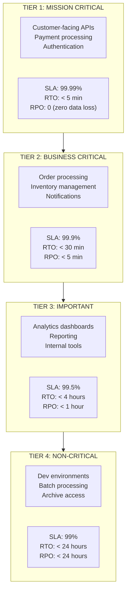
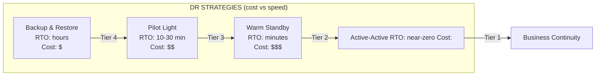
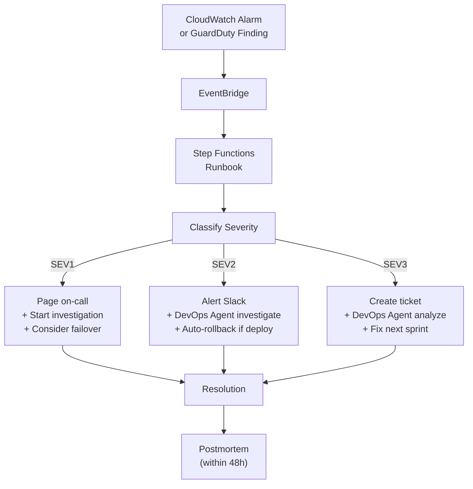
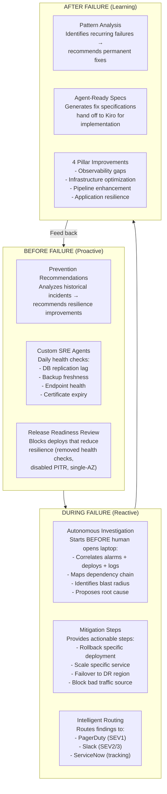
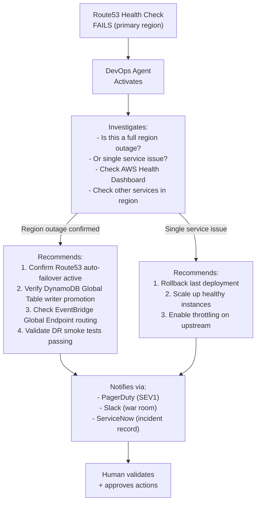
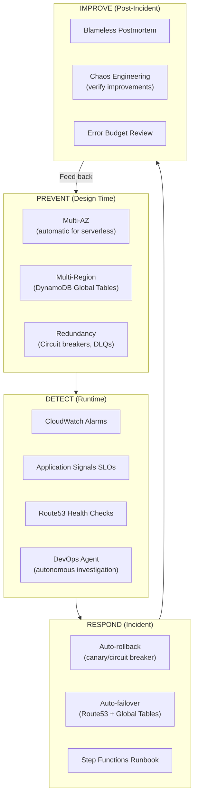

# Disaster Recovery & Business Continuity

## Operational Readiness Principles

Being "ready to operate" means your application can survive failures, recover within defined timeframes, and maintain business continuity. This goes beyond DevOps Agent incident investigation — it requires **architectural decisions made at design time**.

### Key Definitions

| Term | Definition | Example |
|------|-----------|---------|
| **RTO** (Recovery Time Objective) | Maximum acceptable time to restore service after failure | "We must be back online within 1 hour" |
| **RPO** (Recovery Point Objective) | Maximum acceptable data loss measured in time | "We can lose at most 5 minutes of data" |
| **MTTR** (Mean Time To Recovery) | Average time to restore after an incident | Measured from alarm → service restored |
| **MTBF** (Mean Time Between Failures) | Average time between incidents | Higher = more reliable |
| **SLA** (Service Level Agreement) | Contractual availability commitment | "99.9% uptime = 43.8 min downtime/month" |
| **SLO** (Service Level Objective) | Internal target (stricter than SLA) | "99.95% uptime (internal target)" |
| **Error Budget** | Allowed downtime before action required | "99.9% SLA = 43.8 min/month budget" |

---

## RTO/RPO Targets by Service Tier



### How to Classify Your Services

| Question | Tier 1 | Tier 2 | Tier 3 | Tier 4 |
|----------|--------|--------|--------|--------|
| Revenue impact if down? | Immediate loss | Delayed orders | Delayed insights | None |
| Customers affected? | External customers | Internal + some external | Internal only | Dev team only |
| Regulatory requirement? | Yes (financial, health) | Partial | No | No |
| Can users retry later? | No (real-time) | Yes (within hours) | Yes (within days) | Yes |

---

## DR Strategies by Tier



| Strategy | RTO | RPO | Cost | Use For | AWS Implementation |
|----------|-----|-----|------|---------|-------------------|
| **Backup & Restore** | Hours | Hours | $ | Tier 4 (non-critical) | S3 versioning + DynamoDB PITR + scheduled exports |
| **Pilot Light** | 10-30 min | Minutes | $$ | Tier 3 (important) | Core infra always running, scale up on failover |
| **Warm Standby** | Minutes | Seconds-minutes | $$$ | Tier 2 (business critical) | Scaled-down replica in DR region, auto-scale on failover |
| **Active-Active** | Near-zero | Zero | $$$$ | Tier 1 (mission critical) | DynamoDB Global Tables + multi-region Lambda + Route53 failover |

---

## Serverless DR Patterns (AWS)

### DynamoDB — Data Layer DR

| Feature | RPO | RTO | Cost | Use Case |
|---------|-----|-----|------|----------|
| **Point-in-Time Recovery (PITR)** | 5 minutes | < 1 hour | Low | Accidental deletion, corruption |
| **On-demand backups** | At backup time | Hours | Very low | Periodic snapshots |
| **Global Tables** | Seconds (async replication) | Near-zero (active-active) | 2x write cost | Multi-region active-active |
| **S3 Export** | At export time | Hours | Very low | Archive, compliance |

```typescript
// CDK: DynamoDB with full DR configuration
const table = new dynamodb.Table(this, 'Orders', {
  partitionKey: { name: 'PK', type: dynamodb.AttributeType.STRING },
  billingMode: dynamodb.BillingMode.PAY_PER_REQUEST,
  
  // DR: Point-in-Time Recovery (RPO: 5 min)
  pointInTimeRecovery: true,
  
  // DR: Multi-region active-active (RPO: near-zero)
  replicationRegions: ['eu-west-1'], // Add replica in DR region
  
  // DR: Prevent accidental deletion
  removalPolicy: cdk.RemovalPolicy.RETAIN,
  
  // DR: Deletion protection
  deletionProtection: true,
});
```

### Lambda — Compute Layer DR

Lambda is **inherently multi-AZ** within a region. For multi-region DR:

```typescript
// Primary region: us-east-1
// DR region: eu-west-1

// Deploy same stack to both regions via CDK Pipeline
pipeline.addStage(new AppStage(this, 'Primary', {
  env: { account: '111111111111', region: 'us-east-1' },
}));

pipeline.addStage(new AppStage(this, 'DR', {
  env: { account: '111111111111', region: 'eu-west-1' },
}));
```

### API Gateway / AppSync — Multi-Region Routing

```typescript
// Route53: Health check + failover routing
const healthCheck = new route53.CfnHealthCheck(this, 'ApiHealth', {
  healthCheckConfig: {
    type: 'HTTPS',
    fullyQualifiedDomainName: 'api-primary.example.com',
    resourcePath: '/health',
    requestInterval: 10,
    failureThreshold: 2,
  },
});

// Primary record (us-east-1)
new route53.ARecord(this, 'Primary', {
  zone: hostedZone,
  recordName: 'api',
  target: route53.RecordTarget.fromAlias(new targets.ApiGatewayDomain(primaryDomain)),
  region: 'us-east-1',
  healthCheck,
});

// Failover record (eu-west-1)
new route53.ARecord(this, 'Failover', {
  zone: hostedZone,
  recordName: 'api',
  target: route53.RecordTarget.fromAlias(new targets.ApiGatewayDomain(drDomain)),
  region: 'eu-west-1',
});
```

### EventBridge — Cross-Region Event Replication

```typescript
// Replicate events to DR region for async processing continuity
new events.CfnEventBusPolicy(this, 'CrossRegionPolicy', {
  // Allow DR region event bus to receive events
});

// EventBridge global endpoints: automatic failover
const globalEndpoint = new events.CfnEndpoint(this, 'GlobalEndpoint', {
  name: 'orders-global',
  routingConfig: {
    failoverConfig: {
      primary: { healthCheck: primaryHealthCheck.attrArn },
      secondary: { route: `arn:aws:events:eu-west-1:${account}:event-bus/orders` },
    },
  },
  replicationConfig: { state: 'ENABLED' },
  eventBuses: [
    { eventBusArn: `arn:aws:events:us-east-1:${account}:event-bus/orders` },
    { eventBusArn: `arn:aws:events:eu-west-1:${account}:event-bus/orders` },
  ],
});
```

### S3 — Object Storage DR

```typescript
const bucket = new s3.Bucket(this, 'Documents', {
  versioned: true, // RPO: 0 (every version retained)
  
  // Cross-region replication to DR
  // (configured via CfnBucket for replication rules)
});

// Cross-region replication rule
// Source: us-east-1 → Destination: eu-west-1
// Provides: RPO near-zero for object data
```

### ElastiCache / OpenSearch — Stateful Service DR

| Service | DR Strategy | RPO | RTO |
|---------|------------|-----|-----|
| **ElastiCache Serverless** | Multi-AZ automatic | 0 (within region) | Automatic failover |
| **ElastiCache (cross-region)** | Global Datastore | Seconds | Minutes |
| **OpenSearch Serverless** | Multi-AZ automatic | 0 (within region) | Automatic |
| **Aurora Serverless v2** | Global Database | Seconds | < 1 minute (RPO < 1s) |

---

## Failure Scenarios & Runbooks

### Scenario Classification

| Failure Type | Example | Detection | Response |
|-------------|---------|-----------|----------|
| **Single service** | One Lambda function errors | CloudWatch Alarm | Auto-rollback (canary) |
| **Cell failure** | Entire order processing cell down | Application Signals SLO breach | DevOps Agent investigates + failover |
| **AZ failure** | One availability zone unavailable | AWS Health Dashboard + alarms | Automatic (Lambda/DynamoDB multi-AZ) |
| **Region failure** | Entire region unavailable | Route53 health check fails | Failover to DR region |
| **Data corruption** | Bad deployment corrupts data | Data validation alarms | PITR restore + rollback |
| **Security breach** | Unauthorized access detected | GuardDuty + Continuum | Incident response runbook |

### Automated Runbooks (Step Functions)



### Runbook: Region Failover

```bash
# Automated via Step Functions or manual:

# 1. Detect: Route53 health check fails for primary
# 2. Confirm: Check AWS Health Dashboard
# 3. Failover:
#    - Route53 automatically routes to DR (if health-check failover configured)
#    - DynamoDB Global Tables: DR region becomes primary writer
#    - EventBridge Global Endpoint: routes to secondary bus
# 4. Notify: SNS → Slack/PagerDuty
# 5. Verify: Smoke tests against DR endpoint
# 6. Communicate: Status page update

# After primary region recovers:
# 7. Validate: Primary region healthy (health checks pass)
# 8. Sync: DynamoDB Global Tables auto-sync
# 9. Failback: Update Route53 to primary (gradual traffic shift)
# 10. Postmortem: Document within 48 hours
```

---

## Chaos Engineering — Verify Your DR Works

### AWS DevOps Agent in Disaster Recovery

DevOps Agent is not just for routine incidents — it plays a critical role across the entire DR lifecycle:



#### DevOps Agent: Proactive DR (Before Failure)

| Capability | How It Helps DR | Example |
|-----------|----------------|---------|
| **Prevention recommendations** | Identifies resilience weaknesses BEFORE they cause incidents | "Service X has no circuit breaker on its database dependency — add timeout + retry" |
| **Custom SRE agents (scheduled)** | Continuously verify DR readiness | Daily: "Check DynamoDB replication lag < 1s", "Verify PITR still enabled", "Confirm Route53 health checks passing" |
| **Release readiness review** | Blocks deploys that degrade resilience | "This PR removes the health check endpoint — BLOCK (required for failover detection)" |
| **Infrastructure verification** | Mathematical verification of IaC changes | "This change makes the service single-AZ — violates Tier 1 requirement" |

```bash
# Custom SRE Agent: Daily DR Health Check
# (runs automatically via DevOps Agent scheduled task)

# Checks:
# ✅ DynamoDB Global Table replication lag < 1000ms
# ✅ Route53 health checks all HEALTHY
# ✅ PITR enabled on all tables
# ✅ Cross-region S3 replication current
# ✅ DR region stack deployed and matching primary
# ✅ Last chaos experiment < 30 days ago
# ✅ Backup restore tested < 30 days ago

# If any check fails → alert platform team immediately
```

#### DevOps Agent: During Failure (Autonomous Investigation)

| Traditional (Without Agent) | With DevOps Agent |
|---------------------------|-------------------|
| Alarm fires at 2 AM | Alarm fires at 2 AM |
| Page on-call engineer | **Agent starts investigating immediately** |
| Engineer opens laptop (15-30 min) | Agent correlates: alarm + recent deploys + service map |
| Switch between CloudWatch, X-Ray, logs (30-60 min) | Agent checks: "Was there a deployment in last 2 hours?" |
| Form hypothesis, investigate (30-60 min) | Agent maps dependencies: "Service B depends on Service A which deployed 45 min ago" |
| Identify root cause (variable) | **Agent delivers root cause + mitigation steps in minutes** |
| Fix + verify (30-60 min) | Engineer executes fix with confidence (agent provided the answer) |
| **Total: 2-4 hours** | **Total: 20-30 minutes (77% MTTR reduction)** |

#### DevOps Agent: During Regional Failover



#### DevOps Agent: After Failure (Continuous Improvement)

| Capability | DR Benefit |
|-----------|-----------|
| **Pattern analysis** | "This is the 3rd timeout failure on Service X in 30 days → recommend adding circuit breaker" |
| **Agent-ready specs** | Generates implementation specs for Kiro: "Add circuit breaker with 5s timeout, 3 failures threshold, 30s cool-down" |
| **4-pillar recommendations** | Specific DR improvements: observability (add missing alarm), infrastructure (add redundancy), pipeline (add chaos test), resilience (add retry logic) |
| **Prevention tracking** | Tracks whether recommendations are implemented; re-surfaces if ignored |

---

### Chaos Engineering — Verify Your DR Works

### AWS Fault Injection Service (FIS) Experiments

| Experiment | What It Tests | Frequency |
|-----------|---------------|-----------|
| Kill one Lambda concurrent execution | Single function resilience | Weekly (staging) |
| DynamoDB throttling | Backoff/retry logic | Weekly |
| Inject API Gateway latency | Client timeout handling | Weekly |
| Stop ECS tasks | Service auto-healing | Weekly |
| Simulate AZ failure | Multi-AZ automatic failover | Monthly (staging) |
| Block network to region | Regional failover (Route53) | Quarterly (DR drill) |

```typescript
// CDK: FIS experiment template
const fisTemplate = new fis.CfnExperimentTemplate(this, 'DynamoThrottle', {
  description: 'Test DynamoDB throttling resilience',
  roleArn: fisRole.roleArn,
  targets: {
    'dynamodb-table': {
      resourceType: 'aws:dynamodb:table',
      selectionMode: 'ALL',
      resourceArns: [ordersTable.tableArn],
    },
  },
  actions: {
    'throttle': {
      actionId: 'aws:dynamodb:pause-replication', // Simulate degradation
      parameters: { duration: 'PT5M' }, // 5 minutes
      targets: { Tables: 'dynamodb-table' },
    },
  },
  stopConditions: [{
    source: 'aws:cloudwatch:alarm',
    value: errorAlarm.alarmArn, // Stop if errors exceed threshold
  }],
});
```

### Game Day Schedule

| Frequency | Activity | Scope |
|-----------|----------|-------|
| **Weekly** | Single-service chaos (staging) | One cell at a time |
| **Monthly** | Multi-service failure (staging) | Cross-cell dependency |
| **Quarterly** | Regional DR drill | Full failover to DR region |
| **Annually** | Complete business continuity test | Including comms, escalation, customer notification |

---

## Operational Readiness Review (ORR)

Before any service goes to production, it must pass the ORR:

### ORR Checklist

#### Reliability
- [ ] RTO/RPO defined and documented for this service
- [ ] Service tier classified (1-4)
- [ ] DR strategy implemented matching the tier
- [ ] Multi-AZ: Lambda (automatic), DynamoDB (automatic), ECS (multi-AZ tasks)
- [ ] DynamoDB PITR enabled
- [ ] Deletion protection enabled on stateful resources
- [ ] Circuit breaker configured (ECS) or canary with rollback (Lambda)

#### Observability
- [ ] Health endpoint exists and is monitored (Route53 health check)
- [ ] CloudWatch Alarms configured (errors, latency, throttles)
- [ ] Application Signals SLO defined
- [ ] X-Ray tracing enabled (end-to-end)
- [ ] Runbook exists for each known failure mode

#### Recovery
- [ ] Rollback procedure documented and tested
- [ ] Backup/restore tested within the last 30 days
- [ ] Chaos experiment run in staging within last 30 days
- [ ] Failover tested (if multi-region) within last quarter
- [ ] Error budget tracked and reviewed weekly

#### Operations
- [ ] On-call rotation defined
- [ ] Escalation path documented
- [ ] DevOps Agent configured for this service
- [ ] Postmortem process defined (blameless, within 48h)
- [ ] Capacity planning reviewed (auto-scaling verified under load)

#### Dependencies
- [ ] All upstream/downstream dependencies documented
- [ ] Timeout and retry configured for all external calls
- [ ] Circuit breaker on all synchronous dependencies
- [ ] DLQ configured on all async processing (SQS, EventBridge)
- [ ] Graceful degradation defined (what works when dependency X is down?)

---

## Availability Math

| SLA | Monthly Downtime Allowed | Annual Downtime |
|-----|-------------------------|-----------------|
| 99% | 7.3 hours | 3.65 days |
| 99.5% | 3.65 hours | 1.83 days |
| 99.9% | 43.8 minutes | 8.77 hours |
| 99.95% | 21.9 minutes | 4.38 hours |
| 99.99% | 4.38 minutes | 52.6 minutes |
| 99.999% | 26.3 seconds | 5.26 minutes |

### Compound Availability

If your service depends on 3 components each at 99.9%:
```
Combined = 0.999 × 0.999 × 0.999 = 99.7% (not 99.9%!)
```

**To achieve 99.9% with 3 dependencies:**
- Each dependency needs 99.97%, OR
- Use redundancy (multi-region, retry, circuit breaker) to compensate

---

## Summary: Operational Readiness Layers


