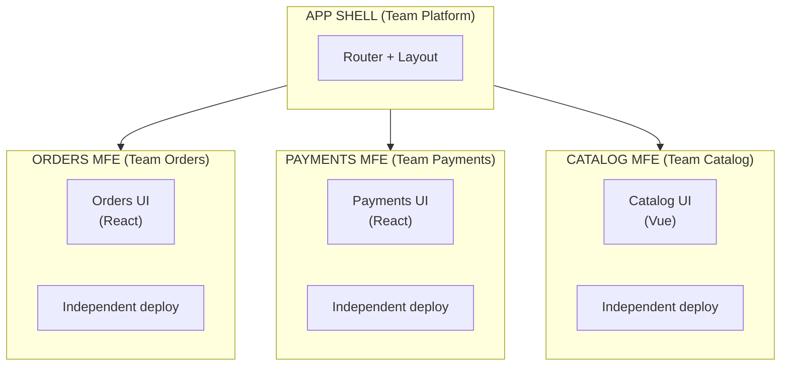
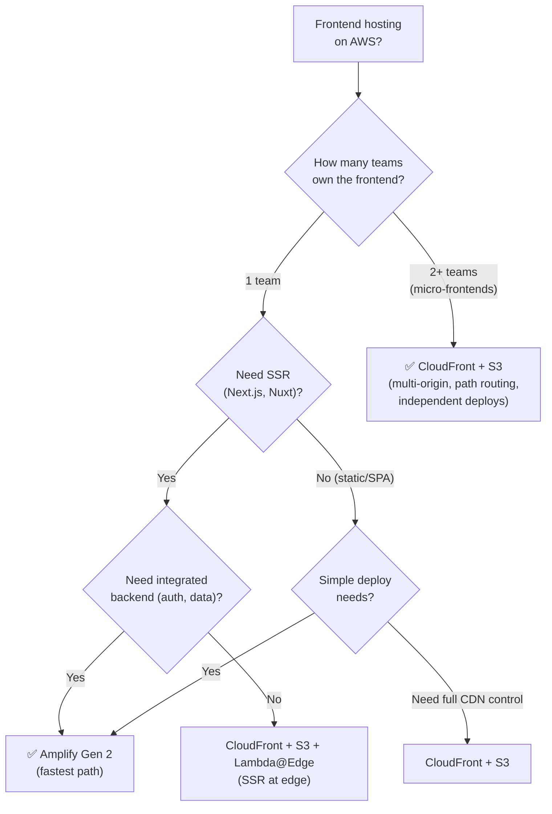
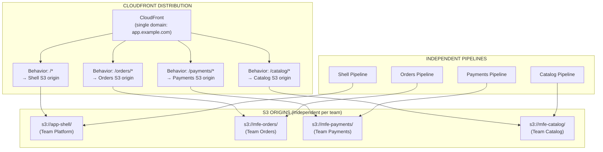
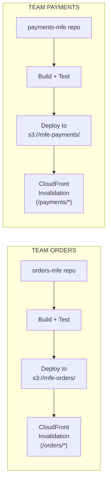
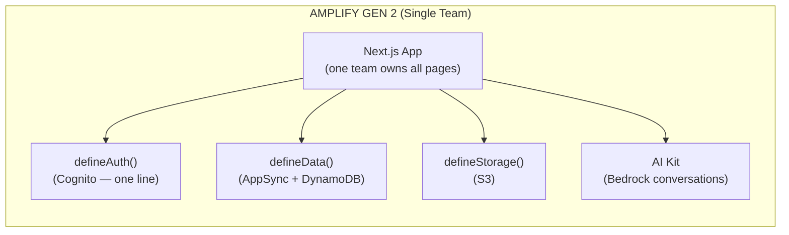

# Workshop: Micro-Frontends on AWS

## Overview

This workshop covers building **multi-team frontend applications** using micro-frontend architecture on AWS, with clear guidance on when to use Amplify Gen 2 vs CloudFront + S3.

### What Are Micro-Frontends?

Micro-frontends apply microservice principles to the frontend: **independently developed, deployed, and owned frontend fragments** composed into a single user experience.



### When to Use Micro-Frontends

| Use Micro-Frontends | Use Monolithic Frontend |
|--------------------|----------------------|
| 3+ teams working on same app | Single team owns the frontend |
| Teams need independent deploy cadence | Shared release cycle is fine |
| Different tech stacks per team acceptable | One framework for everyone |
| Application is large (50+ pages/routes) | Small-medium app (< 20 pages) |
| Teams are in different timezones | Co-located team |
| Need isolated failure domains | Shared failure is acceptable |

---

## Decision: Amplify Gen 2 vs CloudFront + S3

This is the **most important architectural decision** for frontend hosting on AWS:

### Comparison Table

| Dimension | Amplify Gen 2 | CloudFront + S3 (Custom) |
|-----------|--------------|--------------------------|
| **Best for** | Full-stack apps with integrated backend | Frontend-only hosting with full control |
| **SSR support** | ✅ Built-in (Next.js, Nuxt) | ✅ Lambda@Edge or CloudFront Functions |
| **Micro-frontends** | ⚠️ Limited (single app per Amplify project) | ✅ Full control (multi-origin, path routing) |
| **Independent team deploys** | ❌ One deploy per Amplify app | ✅ Each MFE deploys to own S3 prefix |
| **Multi-framework** | ⚠️ One framework per project | ✅ Each MFE can use different framework |
| **Auth integration** | ✅ Built-in (Cognito, one line) | Manual (Cognito + custom integration) |
| **Data integration** | ✅ Built-in (AppSync, DynamoDB) | Manual (separate backend) |
| **Custom CDN config** | ❌ Limited (managed CloudFront) | ✅ Full control (cache policies, behaviors, origins) |
| **Edge computing** | ⚠️ Limited | ✅ Lambda@Edge + CloudFront Functions |
| **CI/CD** | ✅ Built-in (Git-based auto-deploy) | Manual (CDK Pipelines, GitHub Actions) |
| **Preview environments** | ✅ Per-branch auto | Manual (CDK per-PR environments) |
| **Cost** | Pay per build + bandwidth | Pay per request + storage (usually cheaper at scale) |
| **Complexity** | Low (managed) | Medium-High (you manage everything) |

### Decision Flowchart



### The Rule

| Scenario | Choose |
|----------|--------|
| **Single team, full-stack, rapid delivery** | **Amplify Gen 2** |
| **Single team, SSR, need CDN control** | **CloudFront + S3 + Lambda@Edge** |
| **Multi-team, micro-frontends** | **CloudFront + S3** (always) |
| **Multi-team but shared deploy** | **Amplify Gen 2** (treat as monolith) |

**Why Amplify doesn't work for micro-frontends:** Amplify manages one application per project with a single build pipeline. Micro-frontends need each fragment to deploy independently from separate repos/teams. CloudFront + S3 gives you multi-origin routing where each team deploys to their own S3 path.

---

## Architecture: Micro-Frontends on CloudFront + S3



**Key:** Each team deploys to their own S3 bucket independently. CloudFront routes by path. No coordination needed between teams.

---

## Composition Approaches

### Option 1: Webpack Module Federation (Recommended)

Runtime composition — remotes loaded on-demand at runtime:

```typescript
// shell/webpack.config.ts (Host)
const ModuleFederationPlugin = require('webpack/lib/container/ModuleFederationPlugin');

module.exports = {
  plugins: [
    new ModuleFederationPlugin({
      name: 'shell',
      remotes: {
        orders: 'orders@https://app.example.com/orders/remoteEntry.js',
        payments: 'payments@https://app.example.com/payments/remoteEntry.js',
        catalog: 'catalog@https://app.example.com/catalog/remoteEntry.js',
      },
      shared: {
        react: { singleton: true, requiredVersion: '^18.0.0' },
        'react-dom': { singleton: true, requiredVersion: '^18.0.0' },
      },
    }),
  ],
};
```

```typescript
// orders/webpack.config.ts (Remote — Team Orders)
module.exports = {
  plugins: [
    new ModuleFederationPlugin({
      name: 'orders',
      filename: 'remoteEntry.js',
      exposes: {
        './OrdersApp': './src/OrdersApp',
        './OrderHistory': './src/components/OrderHistory',
      },
      shared: {
        react: { singleton: true, requiredVersion: '^18.0.0' },
        'react-dom': { singleton: true, requiredVersion: '^18.0.0' },
      },
    }),
  ],
};
```

```typescript
// shell/src/App.tsx — Load remotes dynamically
import React, { Suspense, lazy } from 'react';
import { BrowserRouter, Route, Routes } from 'react-router-dom';

const OrdersApp = lazy(() => import('orders/OrdersApp'));
const PaymentsApp = lazy(() => import('payments/PaymentsApp'));
const CatalogApp = lazy(() => import('catalog/CatalogApp'));

export const App = () => (
  <BrowserRouter>
    <Layout>
      <Suspense fallback={<Loading />}>
        <Routes>
          <Route path="/orders/*" element={<OrdersApp />} />
          <Route path="/payments/*" element={<PaymentsApp />} />
          <Route path="/catalog/*" element={<CatalogApp />} />
        </Routes>
      </Suspense>
    </Layout>
  </BrowserRouter>
);
```

### Option 2: Import Maps (Native Browser)

No bundler plugin — uses browser-native import maps:

```html
<!-- shell/index.html -->
<script type="importmap">
{
  "imports": {
    "orders/": "https://app.example.com/orders/",
    "payments/": "https://app.example.com/payments/",
    "catalog/": "https://app.example.com/catalog/"
  }
}
</script>
```

### Option 3: Server-Side Composition (Lambda@Edge)

For SSR micro-frontends — compose at the edge:

```typescript
// Lambda@Edge: Compose fragments server-side
export const handler = async (event) => {
  const request = event.Records[0].cf.request;
  
  // Fetch shell HTML
  const shell = await fetch('https://s3.../shell/index.html');
  
  // Fetch MFE fragment based on path
  const mfePath = request.uri.split('/')[1]; // orders, payments, catalog
  const fragment = await fetch(`https://s3.../mfe-${mfePath}/fragment.html`);
  
  // Compose
  const html = shell.replace('<!--MFE_SLOT-->', fragment);
  
  return { status: '200', body: html, headers: { 'content-type': [{ value: 'text/html' }] } };
};
```

---

## CDK Infrastructure

```typescript
// lib/stacks/frontend/micro-frontend-stack.ts
import * as cdk from 'aws-cdk-lib';
import * as s3 from 'aws-cdk-lib/aws-s3';
import * as cloudfront from 'aws-cdk-lib/aws-cloudfront';
import * as origins from 'aws-cdk-lib/aws-cloudfront-origins';

export class MicroFrontendStack extends cdk.Stack {
  constructor(scope: Construct, id: string) {
    super(scope, id);

    // S3 bucket per micro-frontend team
    const shellBucket = new s3.Bucket(this, 'ShellBucket', {
      blockPublicAccess: s3.BlockPublicAccess.BLOCK_ALL,
    });
    const ordersBucket = new s3.Bucket(this, 'OrdersBucket', {
      blockPublicAccess: s3.BlockPublicAccess.BLOCK_ALL,
    });
    const paymentsBucket = new s3.Bucket(this, 'PaymentsBucket', {
      blockPublicAccess: s3.BlockPublicAccess.BLOCK_ALL,
    });

    // CloudFront distribution with path-based routing
    const distribution = new cloudfront.Distribution(this, 'MFEDistribution', {
      defaultBehavior: {
        origin: origins.S3BucketOrigin.withOriginAccessControl(shellBucket),
        viewerProtocolPolicy: cloudfront.ViewerProtocolPolicy.REDIRECT_TO_HTTPS,
        cachePolicy: cloudfront.CachePolicy.CACHING_OPTIMIZED,
      },
      additionalBehaviors: {
        '/orders/*': {
          origin: origins.S3BucketOrigin.withOriginAccessControl(ordersBucket),
          cachePolicy: cloudfront.CachePolicy.CACHING_OPTIMIZED,
        },
        '/payments/*': {
          origin: origins.S3BucketOrigin.withOriginAccessControl(paymentsBucket),
          cachePolicy: cloudfront.CachePolicy.CACHING_OPTIMIZED,
        },
      },
      defaultRootObject: 'index.html',
      // SPA fallback: route all 404s to index.html
      errorResponses: [{
        httpStatus: 404,
        responseHttpStatus: 200,
        responsePagePath: '/index.html',
      }],
    });
  }
}
```

---

## Independent Team Deployment

Each team has their own pipeline deploying to their own S3 bucket:



```bash
# Team Orders deploys independently (no coordination needed):
npm run build
aws s3 sync ./dist s3://mfe-orders/ --delete
aws cloudfront create-invalidation --distribution-id $CF_ID --paths "/orders/*"
```

---

## Caching Strategy for Micro-Frontends

| File Type | Cache Strategy | TTL | Why |
|-----------|---------------|-----|-----|
| `remoteEntry.js` | **Short TTL** (5 min) or no-cache | 300s | Manifest — must be fresh to load latest MFE version |
| `*.chunk.js` (hashed) | **Immutable** (1 year) | 31536000s | Content-addressed — hash changes on new build |
| `index.html` | **No-cache** | 0s | Must always be fresh to reference latest chunks |
| `*.css` (hashed) | **Immutable** | 31536000s | Same as chunks |
| Images/fonts | **Long** (30 days) | 2592000s | Rarely change |

```typescript
// CloudFront Function: Set cache headers by file type
function handler(event) {
  var response = event.response;
  var uri = event.request.uri;
  
  if (uri.endsWith('remoteEntry.js')) {
    response.headers['cache-control'] = { value: 'public, max-age=300' };
  } else if (uri.match(/\.[a-f0-9]{8,}\.(js|css)$/)) {
    response.headers['cache-control'] = { value: 'public, max-age=31536000, immutable' };
  } else if (uri.endsWith('.html')) {
    response.headers['cache-control'] = { value: 'no-cache' };
  }
  
  return response;
}
```

---

## Shared Dependencies (Avoiding Duplication)

### The Problem

If Orders MFE bundles React 18.2 and Payments MFE bundles React 18.3, the user downloads React twice.

### The Solution: Module Federation `shared` Config

```typescript
// Every MFE's webpack config:
shared: {
  react: { singleton: true, requiredVersion: '^18.0.0' },
  'react-dom': { singleton: true, requiredVersion: '^18.0.0' },
  'react-router-dom': { singleton: true, requiredVersion: '^6.0.0' },
  // Design system shared across all MFEs
  '@org/design-system': { singleton: true, requiredVersion: '^2.0.0' },
}
```

The shell loads the shared dependency once. All remotes use the same instance.

---

## When Amplify Gen 2 IS Right (Not Micro-Frontends)

Use Amplify Gen 2 when you have a **single team building a full-stack app**:



**Amplify is perfect when:**
- ✅ One team, one app, one framework
- ✅ Need auth + data + storage integrated (code-first, TypeScript)
- ✅ Want per-branch preview environments automatically
- ✅ Don't need multi-origin CDN routing
- ✅ SSR with Next.js/Nuxt (built-in support)
- ✅ Fastest time-to-production for a full-stack app

**Amplify is wrong when:**
- ❌ Multiple teams need independent deploy cadences
- ❌ Need custom CloudFront behaviors (multi-origin, edge compute)
- ❌ Different frameworks per section (React + Vue + Angular)
- ❌ Need fine-grained cache control per path
- ❌ Micro-frontend composition (Module Federation, import maps)

---

## Testing Micro-Frontends

| Test Type | What | Tool |
|-----------|------|------|
| **Unit (per MFE)** | Component tests in isolation | Jest + React Testing Library |
| **Integration (per MFE)** | MFE loads and renders correctly | Cypress component testing |
| **Contract** | Shell ↔ Remote interface matches | Pact / custom schema validation |
| **E2E (composed)** | Full app with all MFEs loaded | Playwright (against staging) |
| **Visual regression** | UI doesn't drift between deploys | Chromatic / Percy |

### Contract Testing Between Shell and Remotes

```typescript
// contract.test.ts — Verify remote exposes expected modules
describe('Orders MFE Contract', () => {
  it('exposes OrdersApp component', async () => {
    const remote = await import('orders/OrdersApp');
    expect(remote.default).toBeDefined();
    expect(typeof remote.default).toBe('function'); // React component
  });

  it('exposes OrderHistory component', async () => {
    const remote = await import('orders/OrderHistory');
    expect(remote.default).toBeDefined();
  });
});
```

---

## Observability for Micro-Frontends

```typescript
// Each MFE reports errors and performance to central observability
import { init as initRUM } from 'aws-rum-web';

const rum = initRUM({
  id: 'app-monitor-id',
  region: 'us-east-1',
  identityPoolId: 'us-east-1:xxx',
  endpoint: 'https://dataplane.rum.us-east-1.amazonaws.com',
  telemetries: ['errors', 'performance', 'http'],
  // Tag with MFE name for filtering
  sessionAttributes: { mfeName: 'orders' },
});
```

| Metric | Measured Per | Tool |
|--------|------------|------|
| Load time | Per MFE (remoteEntry.js fetch) | CloudWatch RUM |
| Error rate | Per MFE | CloudWatch RUM + Logs |
| Core Web Vitals | Whole page (composed) | CloudWatch RUM |
| Cache hit rate | Per S3 origin | CloudFront metrics |

---

## Summary: Micro-Frontend Decision Table

| Your Situation | Architecture | Hosting |
|---------------|-------------|---------|
| 1 team, full-stack app | Monolith frontend | **Amplify Gen 2** |
| 1 team, need CDN control | Monolith frontend | **CloudFront + S3** |
| 2-3 teams, shared framework | Micro-frontends (Module Federation) | **CloudFront + S3** (multi-origin) |
| 4+ teams, different frameworks | Micro-frontends (Import Maps or MF) | **CloudFront + S3** (multi-origin) |
| SSR per MFE needed | Micro-frontends + edge composition | **CloudFront + Lambda@Edge** |
| All teams use Next.js | Consider monorepo + Amplify per page | **Amplify** OR **CloudFront** |

---

## Checklist

### Architecture
- [ ] Composition approach chosen (Module Federation / Import Maps / Edge)
- [ ] Shared dependencies defined (React, design system, router)
- [ ] Contract between shell and remotes documented
- [ ] Caching strategy defined per file type

### Infrastructure
- [ ] S3 bucket per MFE team (independent deploys)
- [ ] CloudFront with path-based behaviors per MFE
- [ ] OAC configured (no public S3 access)
- [ ] Cache invalidation strategy per team

### Deployment
- [ ] Independent pipeline per MFE team
- [ ] No cross-team deploy coordination required
- [ ] CloudFront invalidation on each deploy (scoped to team's path)
- [ ] Canary/feature flags per MFE (CloudWatch Evidently)

### Testing
- [ ] Unit tests per MFE (isolated)
- [ ] Contract tests (shell ↔ remotes)
- [ ] E2E tests on composed app (staging)
- [ ] Visual regression tests

### Observability
- [ ] CloudWatch RUM per MFE
- [ ] Error tracking with MFE attribution
- [ ] Load performance per remote
- [ ] Cache hit ratio monitored
