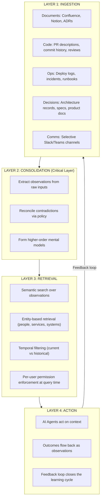
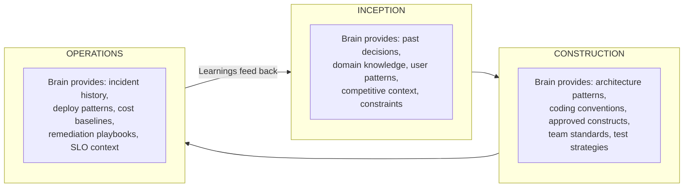
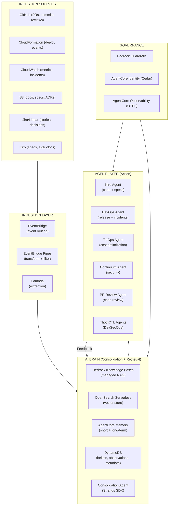
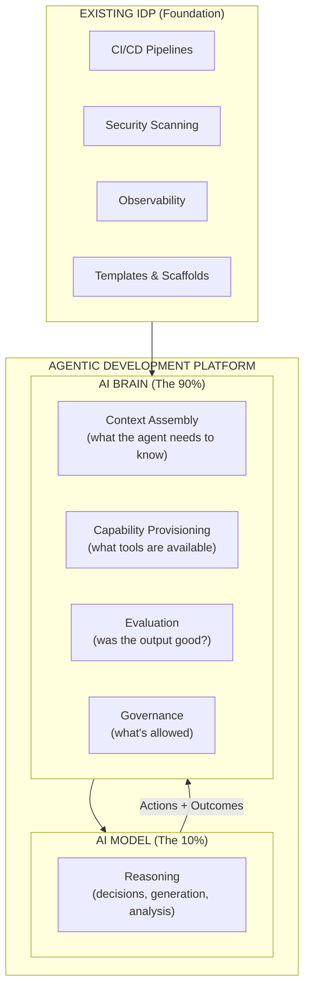
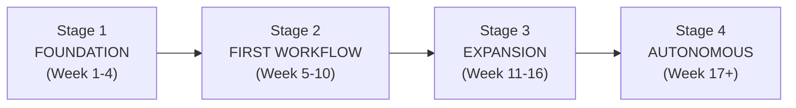
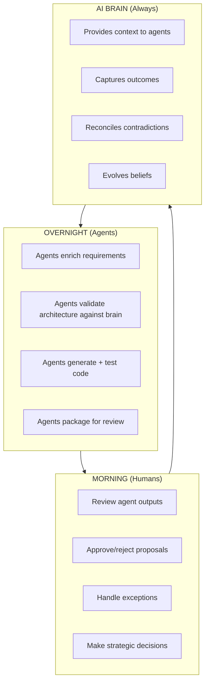
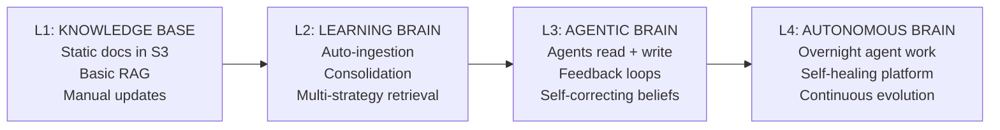
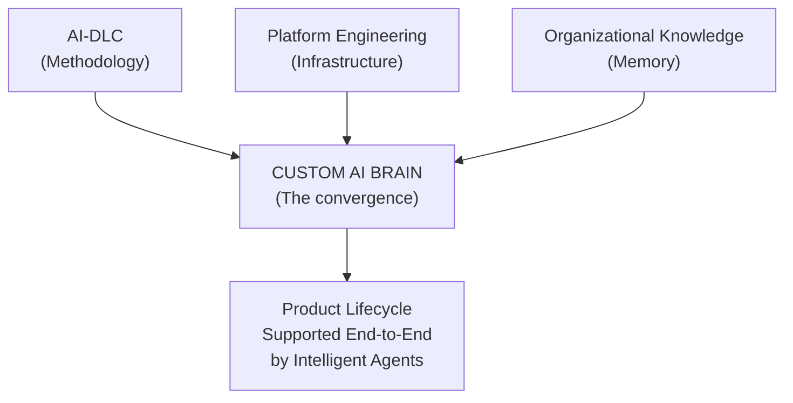

# Custom Intelligent AI Brains: How Organizations Build Knowledge Systems for the Entire Product Lifecycle

## Executive Summary

In 2026, the convergence of **AI-DLC (AI-Driven Development Lifecycle)**, **Platform Engineering (IDP → ADP)**, and **enterprise agentic AI** has created a new organizational capability: the **Custom Intelligent AI Brain** — a shared, learning memory layer that captures how an organization actually operates and serves that knowledge to both humans and autonomous AI agents across the entire product lifecycle.

This investigation synthesizes findings from:

- **AWS AI-DLC methodology** — The official AI-centric SDLC framework
- **Platform Engineering evolution** — From IDP to Agentic Development Platform (ADP)
- **AWS AI/ML stack** — Bedrock, AgentCore, Strands SDK, Knowledge Bases
- **Industry research** — Vectorize, Peloton, ThoughtWorks, McKinsey, Meta, MCP ecosystem

**Key finding:** The "Custom Intelligent AI Brain" is not a single product — it is an **architectural pattern** that combines organizational knowledge management, agent infrastructure, and platform engineering into a unified system that supports Plan → Design → Implement → Test → Deploy → Operate continuously.

---

## The Problem: Why Organizations Need an AI Brain

### The Context Gap

Frontier AI models (Claude, GPT-5, Nova) are *good enough* for nearly any reasoning task. What they cannot do — without help — is know:

- That your company calls the production environment "us-west-prod-3"
- That deploys require approval from the release coordinator
- That the customer asking about pricing is in a regulated industry
- That the bug being investigated was already fixed three weeks ago by another team
- What your team's convention is for error handling in Lambda functions
- Which CDK constructs are approved for production use

**This is not a model problem. It is an organizational context problem.**

### The Industry Reality (July 2026)

| Metric | Value | Source |
|--------|-------|--------|
| Organizations stuck in AI pilot phase | ~65% | McKinsey 2026 |
| AI projects abandoned due to data readiness | 60% (predicted through 2026) | Gartner |
| Organizations with AI agents in genuine production | 5-11% | ChatGPT Guide / DORA |
| Organizations *claiming* production AI agents | 57% | Industry surveys |
| Revenue lost on failed AI initiatives | 2.4% of annual revenue | CIO Dive |
| Peloton: idea to production feature | ~2 hours | AWS Blog Jul 2026 |
| Meta: company brain adoption | 60,000+ knowledge workers | Meta Engineering Blog |

The gap between the 5-11% who succeed and the 57% who claim they have is the **organizational context problem** — solved by building a Custom Intelligent AI Brain.

---


## What Is a Custom Intelligent AI Brain?

A Custom Intelligent AI Brain is a **shared, learning memory layer** that captures how your organization actually operates — decisions, conventions, context, architectural patterns, delivery processes — and serves it to humans and AI agents on demand across every lifecycle phase.

### The Four Required Properties

For a system to qualify as an organizational AI Brain (not just a wiki, vector store, or knowledge graph):

| Property | Description | What Happens Without It |
|----------|-------------|------------------------|
| **1. Shared** | One source of truth. All teams, agents, and systems compile through it. | Five teams have five different "truths" → agent confusion |
| **2. Enforceable** | Every consumer (human or AI agent) must use it. Alternative sources get deprecated. | Teams route around it → stale, unused |
| **3. Evolving** | Stays current automatically from live signals (PRs, deploys, incidents, decisions). | Goes stale like a wiki within months |
| **4. Agent-Readable** | Structured so AI agents can retrieve reliably, with per-user permissions at query time. | Only useful for humans; agents hallucinate |

> **Key differentiator from predecessors:** The AI Brain features **auto-consolidation** — when two sources disagree (and in a real org, they always do), it detects the conflict, applies a reconciliation policy (recency, authority, importance), and produces a current best answer. This is what separates it from wikis, knowledge graphs, and vector stores.
>
> — Source: Vectorize "How to Build a Company Brain for AI Agents" (June 2026)

### AI Brain vs. Prior Approaches

| Dimension | Knowledge Base | Knowledge Graph | Vector Store | **AI Brain** |
|-----------|---------------|-----------------|--------------|--------------|
| Source of truth | Human-curated docs | Typed entity relationships | Embedded text chunks | Org operations + observations |
| How it updates | Manual edits | Manual schema modeling | Re-embedding on doc change | Auto-consolidation from live signals |
| Resolves contradictions | No (last edit wins) | Partially (graph reasoning) | No (returns all matches) | **Yes** (policy-driven reconciliation) |
| Agent-readable | With effort | Yes (structured queries) | Yes (similarity search) | **Yes, natively** |
| Permissions model | Per-page ACL | Per-edge ACL | Per-chunk metadata | **Per-user, per-query enforcement** |
| Failure mode | Goes stale | Schema brittleness | Noisy retrieval | Self-correcting |

---


## The Four-Layer Architecture of an AI Brain



### Layer 1: Ingestion — What Feeds the Brain

Sources for a product lifecycle AI Brain:

| Source Category | Examples | Canonical? | Frequency |
|----------------|----------|------------|-----------|
| **Architecture** | ADRs, CDK L3 constructs, design docs | ✅ Canonical | On change |
| **Code** | PR descriptions, review comments, commit messages | ✅ Canonical | Real-time |
| **Deployment** | Deploy logs, CloudFormation events, canary results | ✅ Canonical | Real-time |
| **Operations** | Incident reports, runbooks, DevOps Agent RCAs | ✅ Canonical | On event |
| **Decisions** | Kiro specs, AI-DLC `aidlc-docs/`, product specs | ✅ Canonical | On change |
| **Governance** | SCP/RCP policies, OPA rules, cdk-nag results | ✅ Canonical | On change |
| **Communication** | Slack decisions channels (selective) | ⚠️ Signal | Batch |
| **Metrics** | DORA metrics, cost data, FinOps reports | ✅ Canonical | Scheduled |

**Principle:** Ingest selectively. A PR description is canonical; the Slack thread arguing about it is supporting signal. Don't ingest data you can't permission-control.

### Layer 2: Consolidation — The Critical Differentiator

Three jobs:

1. **Extract observations from raw inputs** — A PR titled "Switch deploy region to us-west-3" becomes observation: *"As of \[date\], deploys target us-west-3"*
2. **Reconcile new observations against existing beliefs** — When a new observation contradicts a held belief, apply policy: recency-weighted, source-weighted, or authority-driven
3. **Form higher-order mental models** — Dozens of related observations roll up into synthesized models ("the deploy process for production services") that become the unit of retrieval

> **This is where most implementations fail.** Without explicit consolidation, you're building a vector store with a chat interface. Retrieval works in the demo and degrades as the corpus grows.

### Layer 3: Retrieval — Multi-Strategy for Production

Production-grade retrieval combines:
- **Semantic search** over embedded observations
- **Entity-based retrieval** for queries naming specific people, products, or systems
- **Temporal filtering** for "current" vs "historical" queries
- **Graph traversal** when relationships matter

**Permission enforcement at retrieval time:** The brain stores everything; what comes out depends on who/what is asking. Cedar policies (AgentCore Identity) control what each agent can access.

### Layer 4: Action — The Feedback Loop

AI agents read from the brain, act on context, and **write outcomes back**:
- PR review agent queries conventions → posts review → outcome (accepted/rejected) feeds back
- DevOps Agent queries past incidents → investigates → resolution feeds back
- FinOps Agent queries cost patterns → recommends optimization → result feeds back

**Without the feedback loop, the brain captures inputs but never learns from outcomes.**

---


## AI Brain Across the Product Lifecycle (AI-DLC Mapping)

The Custom AI Brain serves every phase of the AI-DLC lifecycle:



### Phase-by-Phase Brain Contributions

| AI-DLC Phase | What the Brain Knows | Agent That Uses It | Outcome |
|-------------|---------------------|-------------------|---------|
| **Plan** | Past requirements, user stories, business rules, domain glossary | Kiro (spec generation) | Requirements grounded in organizational reality |
| **Design** | Approved architecture patterns, CDK L3 constructs, past ADRs | Kiro (architecture proposals) | Designs within approved boundaries |
| **Implement** | Coding conventions, team standards, common patterns, past PRs | Kiro (code generation) | Code that matches team style |
| **Test** | Test strategies, coverage requirements, past regressions, spec→test mapping | QA Agent (test generation) | Tests from specs, not from code (prevents circular validation) |
| **Deploy** | Deploy history, canary thresholds, rollback triggers, environment config | DevOps Agent (release review) | Release decisions grounded in history |
| **Operate** | Incident patterns, remediation playbooks, cost baselines, SLO context | DevOps Agent + FinOps Agent | Faster MTTR, proactive optimization |

### The Brain Solves Key AI-SDLC Anti-Patterns

| Anti-Pattern | How the Brain Prevents It |
|-------------|--------------------------|
| **Circular validation** (AI tests confirm AI code assumptions) | Brain stores specs as source of truth; tests derive from brain beliefs, not implementation |
| **Tool sprawl** (disconnected AI tools create trapped knowledge) | Brain is the unified context layer all tools share |
| **Verification tax** (time saved coding re-spent auditing) | Brain provides audit trail + provenance for every agent action |
| **Shadow AI** (uncontrolled agent use) | Brain's enforceable property means agents MUST use it → visibility |
| **Agentic debt** (fast decisions without governance) | Brain encodes approved patterns → agents generate within boundaries |

---


## AWS Implementation Architecture

### Reference Architecture: AI Brain on AWS



### AWS Services Mapped to Brain Layers

| Brain Layer | AWS Service | Role |
|------------|-------------|------|
| **Ingestion** | EventBridge + Lambda | Event-driven pipelines capturing org signals |
| **Ingestion** | S3 | Document storage for Knowledge Bases |
| **Ingestion** | Bedrock Data Automation | Parse unstructured docs (PDFs, images) |
| **Consolidation** | Strands SDK Agent | Custom consolidation logic (reconcile contradictions) |
| **Consolidation** | Step Functions | Orchestrate multi-step consolidation workflows |
| **Consolidation** | DynamoDB | Store beliefs, observations, metadata, versioning |
| **Retrieval** | Bedrock Knowledge Bases | Managed RAG with automatic chunking + embedding |
| **Retrieval** | OpenSearch Serverless | Vector search + entity retrieval + filtering |
| **Retrieval** | AgentCore Memory | Short-term (conversation) + long-term (learned) memory |
| **Retrieval** | AgentCore Gateway | MCP-compatible tool exposure for retrieval |
| **Action** | AgentCore Runtime | Serverless, secure agent execution |
| **Action** | Strands SDK | Build custom agents that read/write to brain |
| **Action** | Bedrock Agents | Managed agent orchestration with action groups |
| **Governance** | Bedrock Guardrails | Content safety, PII masking, topic blocking |
| **Governance** | AgentCore Identity | Cedar policies: per-agent, per-query authorization |
| **Governance** | AgentCore Observability | OTEL traces for every agent decision |

### Bedrock Knowledge Bases as the RAG Core

```python
# Setting up Knowledge Base for the AI Brain
import boto3

bedrock_agent = boto3.client('bedrock-agent')

# Create Knowledge Base with organizational docs
response = bedrock_agent.create_knowledge_base(
    name='org-ai-brain',
    description='Organizational AI Brain - architecture decisions, conventions, patterns',
    roleArn='arn:aws:iam::ACCOUNT:role/BrainKBRole',
    knowledgeBaseConfiguration={
        'type': 'VECTOR',
        'vectorKnowledgeBaseConfiguration': {
            'embeddingModelArn': 'arn:aws:bedrock:us-east-1::foundation-model/amazon.titan-embed-text-v2:0'
        }
    },
    storageConfiguration={
        'type': 'OPENSEARCH_SERVERLESS',
        'opensearchServerlessConfiguration': {
            'collectionArn': 'arn:aws:aoss:us-east-1:ACCOUNT:collection/brain-vectors',
            'vectorIndexName': 'brain-index',
            'fieldMapping': {
                'vectorField': 'embedding',
                'textField': 'text',
                'metadataField': 'metadata'
            }
        }
    }
)
```

### Consolidation Agent with Strands SDK

```python
from strands import Agent
from strands.tools import tool
import boto3

@tool
def get_current_beliefs(topic: str) -> str:
    """Retrieve current brain beliefs on a topic."""
    # Query DynamoDB for existing beliefs
    # Returns structured beliefs with timestamps and sources
    ...

@tool
def reconcile_contradiction(old_belief: str, new_observation: str, source_authority: str) -> str:
    """Reconcile a contradiction between existing belief and new observation."""
    # Apply reconciliation policy:
    # 1. Source authority (ADR > PR comment > Slack)
    # 2. Recency (newer observations weighted higher)
    # 3. Explicitness (explicit decisions > implicit patterns)
    ...

@tool
def update_belief(topic: str, new_belief: str, evidence: list[str]) -> str:
    """Update a belief in the brain with evidence trail."""
    # Write to DynamoDB with versioning
    # Trigger re-indexing in Knowledge Base
    ...

consolidation_agent = Agent(
    system_prompt="""You are the Consolidation Agent for the organizational AI Brain.
    Your job is to:
    1. Extract structured observations from raw inputs (PRs, deploys, incidents)
    2. Check if new observations contradict existing beliefs
    3. Reconcile contradictions using source authority and recency
    4. Form higher-order mental models from related observations
    
    NEVER discard information. Version beliefs. Track provenance.""",
    tools=[get_current_beliefs, reconcile_contradiction, update_belief]
)
```

---


## Platform Engineering: The AI Brain as the ADP Core

### The Brain IS the Agentic Development Platform

The key insight from PlatformCon 2026: **the platform does ~90% of the work in agentic workflows; the AI model handles ~10% (the reasoning)**. The AI Brain is that 90%.



### How the Brain Extends Each ADP Component

| ADP Component | Without Brain | With Brain |
|--------------|---------------|------------|
| **Context Assembly** | Agent searches files, maybe finds relevant code | Agent gets curated beliefs: "this team uses hexagonal architecture, DynamoDB single-table, 90% test coverage required" |
| **Capability Provisioning** | Agent has access to generic tools | Agent knows which tools THIS team uses, in what order, with what conventions |
| **Evaluation** | Pass/fail on tests | Brain compares output against team conventions, past patterns, architectural decisions |
| **Governance** | IAM roles + static policies | Cedar policies informed by brain beliefs about who owns what, what's sensitive, what requires approval |

### The Eight Core Paths — Brain-Enhanced

| Path | Without Brain | With Brain |
|------|--------------|------------|
| **1. Dispatch Work** | Route by file/service ownership | Route by brain's understanding of who owns what, who's on-call, who has context |
| **2. Retrieve Context** | Search files, read docs | Brain serves curated, consolidated, current beliefs directly |
| **3. Implement Code** | Generate from prompt | Generate within team's conventions, approved patterns, past decisions |
| **4. Validate Change** | Run tests, check lint | Compare against brain's understanding of what "good" looks like for this team |
| **5. Promote Change** | Approval workflows | Brain-informed risk assessment ("this service had 3 incidents last month") |
| **6. Deploy** | Standard pipeline | Brain provides environment-specific knowledge, deployment conventions |
| **7. Observe** | Monitor metrics | Brain correlates with past incidents ("this pattern looks like the outage from March") |
| **8. Remediate** | Generic troubleshooting | Brain provides team-specific playbooks, past remediations that worked |

### MCP as the Brain's Nervous System

MCP (Model Context Protocol) enables the brain to be universally accessible:

```mermaid
flowchart LR
    subgraph Agents["AI AGENTS"]
        KIRO["Kiro"]
        CLAUDE["Claude Code"]
        CURSOR["Cursor"]
        DEVOPS["DevOps Agent"]
    end
    subgraph MCP["MCP LAYER (97M monthly downloads)"]
        GW["AgentCore Gateway"]
        THOTH_MCP["ThothCTL MCP (24 tools)"]
        BRAIN_MCP["Brain MCP Server"]
    end
    subgraph Brain["AI BRAIN"]
        BELIEFS["Beliefs & Conventions"]
        PATTERNS["Architecture Patterns"]
        HISTORY["Decision History"]
        PLAYBOOKS["Runbooks & Playbooks"]
    end

    Agents --> MCP --> Brain
```



**MCP Stats (July 2026):**
- 97 million monthly SDK downloads
- 10,000+ active public MCP servers
- Adopted by OpenAI, Google, Microsoft, AWS
- Now under Linux Foundation Agentic AI Foundation
- Specification 2026-07-28: stateless core, multi-round-trip, header routing

The Brain exposes its retrieval layer as an MCP server, making it accessible to ANY AI agent regardless of framework (Kiro, Claude Code, Cursor, Windsurf, or custom Strands agents).

---


## Industry Case Studies

### Case Study 1: Peloton — AI-DLC at Scale (AWS Blog, July 2026)

Peloton rebuilt their entire SDLC around AI, creating an organizational AI brain through two platforms:

**Quarry (Credential Portal + AI Gateway):**
- All engineers authenticate via SSO → receive short-lived STS credentials scoped to Amazon Bedrock
- Zero static API keys in the entire system
- Same credential flow works for Claude Code, Windsurf, VS Code, Xcode
- Real-time leaderboard shows per-engineer usage (community, not compliance)
- 600+ users + 10 cross-org contributors

**Bureau (Autonomous Agent Platform):**
- Receives natural-language directives → provisions EKS agent pod → executes mission → terminates
- Access to GitHub, AWS, Slack, Jira, Datadog, Google Workspace (the organizational brain)
- Every action logged, every session produces structured report

**Results (first 20 days):**

| Metric | Value |
|--------|-------|
| User growth | 517% (Feb → Mar 2026) |
| AI missions executed | 1,150+ in 18 days |
| Automated daily missions | 347 scheduled |
| PRs merged | 400+ (33+/day average) |
| Idea to production feature | ~2 hours |
| Static API keys | Zero |
| CVEs after autonomous audit | Zero remaining |

**Key insight:** PMs built fully functional web apps — deployed with shareable URLs — from PRD descriptions alone. Six PMs independently built prototypes without a single engineering sprint, recovering 18 engineer-days in one month.

### Case Study 2: Meta — AI Second Brain for 60K+ Knowledge Workers

Meta's Analytics team built an "AI Second Brain" that:
- Started as a team experiment
- Scaled to 63,000+ installs across every organizational pillar
- Captures operational knowledge across the organization
- Serves both humans and AI agents with the same context
- Structurally meets all four brain properties (shared, enforceable, evolving, agent-readable)

### Case Study 3: McKinsey — The Agentic Organization

McKinsey's research (2025-2026) describes the "agentic organization" as the largest paradigm shift since the industrial revolution:

> "During the night, agents execute structured work at scale. Their tasks include enriching requirements, validating architecture, generating and testing code, and packaging outputs for review. In the morning, humans review."

The pattern requires an organizational AI brain because:
- Agents need context about WHAT to enrich (brain provides domain knowledge)
- Agents need context about HOW to validate (brain provides architecture standards)
- Agents need context about WHAT "good" looks like (brain provides conventions)
- Humans need to trust agent output (brain provides provenance + audit trail)

### Case Study 4: ThoughtWorks — Path to Production (July 2026)

ThoughtWorks identified that technology is rarely the blocker — **organizational standardization** is:

**Four Stage Gates (all brain-informed):**
1. **Compliance/Feasibility** — Brain provides: regulatory context, risk policies, data classification
2. **Secure Sandbox** — Brain provides: threat models, data access controls, environment conventions
3. **Production Readiness** — Brain provides: security baselines, past pen test findings, bias benchmarks
4. **Operational Handover** — Brain provides: monitoring patterns, SLO context, runbook templates

**Key quote:** "Organizations lose an average of 2.4% of annual revenue on AI initiatives that fail to scale. The path to production is not an engineering pipeline — it is a repeatable operating model."

---


## Implementation Roadmap: Building Your Organization's AI Brain

### Progressive Build Strategy

**Principle:** Start narrow, expand systematically. First workflow: 6-8 weeks. Second: 3-4 weeks. Third onward: 1-2 weeks each. The brain compounds.



### Stage 1: Foundation (Weeks 1-4)

**Goal:** Establish the IDP foundation and agent infrastructure.

```bash
# 1. Set up platform engineering foundation
thothctl init env
thothctl init project --project-type cdkv2

# 2. Install AI-DLC workflow rules
mkdir -p .kiro/steering
cp -R aidlc-rules/aws-aidlc-rules .kiro/steering/

# 3. Deploy Knowledge Base infrastructure
cdk deploy BrainInfraStack --express
# → S3 bucket (document storage)
# → OpenSearch Serverless collection (vectors)
# → Bedrock Knowledge Base (managed RAG)
# → DynamoDB table (beliefs, observations)
# → EventBridge bus (ingestion events)

# 4. Enable ThothCTL MCP for agent access
thothctl mcp  # Expose 24 DevSecOps tools to agents
```

**What you have at end of Stage 1:**
- IDP with golden paths
- Knowledge Base infrastructure deployed
- AI-DLC methodology active
- MCP connectivity for agents

### Stage 2: First Workflow (Weeks 5-10)

**Pick the highest-pain workflow.** Recommended start: **Code Review + Architecture Validation**

```bash
# 1. Ingest initial canonical sources
# Architecture decisions
aws s3 sync ./aidlc-docs/ s3://brain-docs/architecture/
aws s3 sync ./docs/adrs/ s3://brain-docs/decisions/

# 2. Ingest coding conventions
aws s3 cp .kiro/steering/ s3://brain-docs/conventions/ --recursive

# 3. Ingest approved patterns (CDK L3 constructs)
aws s3 sync ./lib/constructs/ s3://brain-docs/patterns/

# 4. Run Knowledge Base ingestion
aws bedrock-agent start-ingestion-job \
    --knowledge-base-id $KB_ID \
    --data-source-id $DS_ID

# 5. Wire PR Review Agent to brain
# Agent queries brain before reviewing PRs:
# "What are this team's conventions for error handling?"
# "What architecture pattern is approved for this service type?"
# "Has this pattern caused issues before?"
```

**Consolidation Agent (deployed on AgentCore):**

```python
from strands import Agent
from strands.tools import tool

@tool
def ingest_pr_decision(pr_url: str, decision: str, rationale: str) -> str:
    """When a PR is merged/closed, extract the decision and rationale as a new observation."""
    # Extract: what was decided, why, who decided, what it supersedes
    # Write observation to DynamoDB
    # Trigger belief reconciliation if contradicts existing belief
    ...

@tool  
def ingest_deploy_outcome(stack_name: str, outcome: str, metrics: dict) -> str:
    """After a deploy, capture the outcome as an observation."""
    # Was it successful? What was canary result?
    # Did alarms fire? What was rollback reason?
    # Update deployment beliefs for this service
    ...

brain_ingestor = Agent(
    system_prompt="You monitor organizational events and extract structured observations for the AI Brain.",
    tools=[ingest_pr_decision, ingest_deploy_outcome]
)
```

**What you have at end of Stage 2:**
- Brain knows your architecture decisions and conventions
- PR Review agent uses brain context for reviews
- Consolidation agent extracts decisions from merged PRs
- Deploy outcomes feed back into brain beliefs

### Stage 3: Expansion (Weeks 11-16)

Expand to adjacent workflows that reuse existing brain context:

| Workflow | Brain Reuse | New Ingestion Needed |
|----------|-------------|---------------------|
| **Incident Response** | Architecture + deploy history (already in brain) | Incident reports, DevOps Agent RCAs |
| **Cost Optimization** | Service patterns + deploy data (already in brain) | Cost reports, FinOps Agent recommendations |
| **Onboarding** | Architecture + conventions + patterns (already in brain) | Onboarding checklists, FAQ patterns |
| **Security** | Architecture + deploy data (already in brain) | Security scan results, Continuum findings |

```bash
# Expand ingestion to incident data
# EventBridge rule: CloudWatch Alarm → Lambda → Brain
aws events put-rule \
    --name "brain-ingest-incidents" \
    --event-pattern '{"source": ["aws.cloudwatch"], "detail-type": ["CloudWatch Alarm State Change"]}'

# Expand to cost data
# FinOps Agent reports → Brain
aws events put-rule \
    --name "brain-ingest-costs" \
    --event-pattern '{"source": ["aws.finops-agent"]}'

# Wire DevOps Agent to brain
# Agent queries brain: "Has a similar incident happened before? What fixed it?"
```

### Stage 4: Autonomous (Week 17+)

Full ADP with brain-powered autonomous operations:



**Self-healing platform patterns:**
- Agent detects drift → queries brain for expected state → auto-remediates
- Agent detects cost anomaly → queries brain for baselines → auto-right-sizes
- Agent detects security finding → queries brain for remediation patterns → auto-patches
- Agent detects failing tests → queries brain for past fixes → auto-resolves

---


## Governance & Safety

### The DORA Amplifier Effect

> "AI's primary role is an amplifier of existing organizational strengths and weaknesses." — DORA 2025

| If Your Brain Has... | AI Will... |
|---------------------|-----------|
| Strong architecture beliefs | Agents generate correct-by-default code within boundaries |
| Weak or stale beliefs | Agents propagate outdated patterns faster |
| Good governance policies encoded | Enable safe autonomy expansion |
| No consolidation (contradictions) | Amplify confusion — different agents get different answers |

### Brain Governance Stack on AWS

| Layer | Implementation | Purpose |
|-------|---------------|---------|
| **Content Safety** | Bedrock Guardrails | Filter PII, harmful content, off-topic queries |
| **Agent Authorization** | AgentCore Identity (Cedar) | Per-agent, per-query permissions on brain access |
| **Audit Trail** | CloudTrail + AgentCore Observability | Every brain query and update logged with OTEL traces |
| **Belief Provenance** | DynamoDB versioning | Track which sources informed each belief, when, by whom |
| **Access Control** | Per-fact permissioning at retrieval time | Brain stores everything; what returns depends on who asks |
| **Compliance** | GDPR, HIPAA, SOC 2 | Deletion marks observations as excluded; no re-indexing needed |

### Cedar Policy Example

```cedar
// PR Review Agent can read architecture beliefs and conventions
permit(
    principal == Agent::"pr-review-agent",
    action == Action::"brain:query",
    resource in BrainNamespace::"architecture"
) when {
    context.query_scope in ["conventions", "patterns", "decisions"]
};

// FinOps Agent can only read cost-related beliefs
permit(
    principal == Agent::"finops-agent", 
    action == Action::"brain:query",
    resource in BrainNamespace::"operations"
) when {
    context.query_scope == "cost"
};

// Only Consolidation Agent can write new beliefs
permit(
    principal == Agent::"consolidation-agent",
    action == Action::"brain:update",
    resource in BrainNamespace::*
);
```

---

## Maturity Model: AI Brain Capabilities



| Level | Ingestion | Consolidation | Retrieval | Action | Example |
|-------|-----------|---------------|-----------|--------|---------|
| **L1: Knowledge Base** | Manual S3 uploads | None (raw storage) | Basic RAG | Human reads answers | "Upload docs, ask questions" |
| **L2: Learning Brain** | Event-driven, real-time | Observation extraction + reconciliation | Multi-strategy + permissions | Agents query brain | "Brain knows team conventions" |
| **L3: Agentic Brain** | Agents write outcomes back | Beliefs evolve from outcomes | Context-aware, temporal | Agents act on beliefs | "PR agent uses brain for reviews" |
| **L4: Autonomous Brain** | Full lifecycle capture | Higher-order mental models | Predictive (anticipates needs) | Self-healing platform | "Brain detects + fixes drift overnight" |

### Alignment to Platform Maturity

| Platform Stage | Brain Level | AI-DLC Phase Coverage |
|---------------|-------------|----------------------|
| **Crawl** | L1 (Knowledge Base) | Construction (code context) |
| **Walk** | L2 (Learning Brain) | Construction + Operations |
| **Run** | L3 (Agentic Brain) | All phases (Inception → Operations) |
| **Fly** | L4 (Autonomous Brain) | Continuous, self-improving |

---

## Anti-Patterns: What Kills AI Brains

| Anti-Pattern | Symptom | Prevention |
|-------------|---------|-----------|
| **Ingest everything** | Noisy retrieval, low-quality beliefs | Selective ingestion; canonicality filter |
| **No consolidation pass** | Works in demo, degrades at scale | Explicit consolidation agent; reconciliation policies |
| **No feedback loop** | Brain captures inputs but never learns | Wire agent outcomes back as observations |
| **Wrong source authority** | Slack treated as canonical for decisions | Encode source hierarchy: ADR > PR > Slack |
| **Permission as afterthought** | Data leak → project paused for audit | Per-fact permissioning from day 1 (Cedar policies) |
| **Model the whole org at once** | Perpetual build, never delivers value | First workflow in 6 weeks → expand systematically |
| **Brain as wiki replacement** | Manual updates, goes stale | Brain is auto-evolving; wikis are one INPUT to the brain |
| **No evaluation metrics** | Can't prove brain is helping | Track: repeated-question rate, hallucination rate, MTTR |

---

## Metrics: Measuring Brain Effectiveness

| Metric | What to Measure | Target |
|--------|----------------|--------|
| **Time-to-context** | How long until an agent has full context for a task | < 5 seconds |
| **Repeated-question rate** | How often agents/humans ask the same question twice | Decreasing monthly |
| **Hallucination rate** | How often agents confidently produce wrong info | < 5% (with brain) vs 20%+ (without) |
| **Belief freshness** | Average age of beliefs in the brain | < 7 days for active domains |
| **Agent self-correction rate** | How often agents use brain to catch own mistakes | Increasing monthly |
| **MTTR improvement** | Time to restore after incidents (brain-assisted) | 50%+ reduction |
| **Onboarding time** | Time for new engineer to be productive | < 1 day (from 2-4 weeks) |
| **Convention compliance** | % of PRs matching team conventions on first attempt | > 90% |
| **Brain query volume** | How many agents/humans actively query the brain | Growing (proves value) |

---

## When You DON'T Need an AI Brain

Honest assessment — the cost doesn't always pay off:

| Situation | Why Brain Isn't Needed |
|-----------|----------------------|
| Team < 10 people meeting weekly | High context density already; informal sharing works |
| Single-product startup, year 1 | Not enough institutional knowledge yet |
| No AI agents deployed yet | Brain solves agent-context problem; build agents first |
| Stable, unchanging domain | Brain's evolving property adds overhead without value |

**Rule of thumb:** AI Brain earns its place once you have 30+ people AND active AI agent integration.

---

## Conclusion: The Convergence

The Custom Intelligent AI Brain is the convergence point of three industry forces:

1. **AWS AI-DLC** provides the methodology (WHAT to build, in what phases)
2. **Platform Engineering (IDP → ADP)** provides the infrastructure (HOW agents access and operate)
3. **Organizational Knowledge Management** provides the memory (brain properties + architecture)



**The organizations that will win in 2026-2027 are those that:**

1. Treat AI Brain as a **platform product** (not a one-off project)
2. Start with **one high-pain workflow** and expand systematically
3. Build the **consolidation layer** (not just another vector store)
4. Enforce the brain via **governance** (Cedar policies, not honor system)
5. Close the **feedback loop** (agents write outcomes back)
6. Measure effectiveness with **concrete metrics** (not vibes)

The window to build agent infrastructure is NOW — Gartner predicts by 2027, 65%+ of engineering teams using agentic coding will treat IDEs as optional. The platform (and its brain) becomes the control plane.

---

## References

| Resource | Source | Date |
|----------|--------|------|
| [How to Build a Company Brain for AI Agents](https://vectorize.io/articles/how-to-build-company-brain) | Vectorize | Jun 2026 |
| [Peloton Rebuilt the SDLC for the Agentic Era](https://aws.amazon.com/blogs/industries/blazing-a-trail-how-peloton-rebuilt-the-sdlc-for-the-agentic-era-with-amazon-bedrock/) | AWS Blog | Jul 2026 |
| [Path to Production for Enterprise AI](https://www.thoughtworks.com/en-us/insights/articles/Path-to-production-for-enterprise-AI) | ThoughtWorks | Jul 2026 |
| [The Agentic Organization](https://www.mckinsey.com/capabilities/people-and-organizational-performance/our-insights/the-agentic-organization-contours-of-the-next-paradigm-for-the-ai-era) | McKinsey | 2025-2026 |
| [Rewiring Software Delivery for the Agentic Era](https://www.mckinsey.com/capabilities/mckinsey-technology/our-insights/rewiring-software-delivery-for-the-agentic-era) | McKinsey | Jun 2026 |
| [MCP Specification 2026-07-28](https://blog.modelcontextprotocol.io/posts/2026-07-28/) | Model Context Protocol | Jul 2026 |
| [AI-DLC Workflows](https://github.com/awslabs/aidlc-workflows) | AWS Labs | 2025 |
| [Amazon Bedrock Managed Knowledge Base](https://aws.amazon.com/blogs/aws/introducing-amazon-bedrock-managed-knowledge-base-for-faster-more-accurate-enterprise-ai-applications/) | AWS Blog | Jun 2026 |
| [Meta AI Second Brain for 60K Workers](https://medium.com/@AnalyticsAtMeta/how-we-built-an-ai-second-brain-for-60k-knowledge-workers-78c507dd795b) | Meta Engineering | Apr 2026 |
| [PlatformCon 2026: Architecting ADPs](https://platformcon.com/sessions/architecting-agentic-development-platforms) | PlatformCon | 2026 |
| [Agentic AI Pilot-to-Production Timeline](https://chatgptguide.ai/agentic-ai-pilot-to-production-timeline/) | Industry Report | 2026 |
| [MCP Ecosystem 2026](https://www.requesty.ai/blog/mcp-ecosystem-2026-building-agent-tool-infrastructure-that-scales) | Requesty | 2026 |
