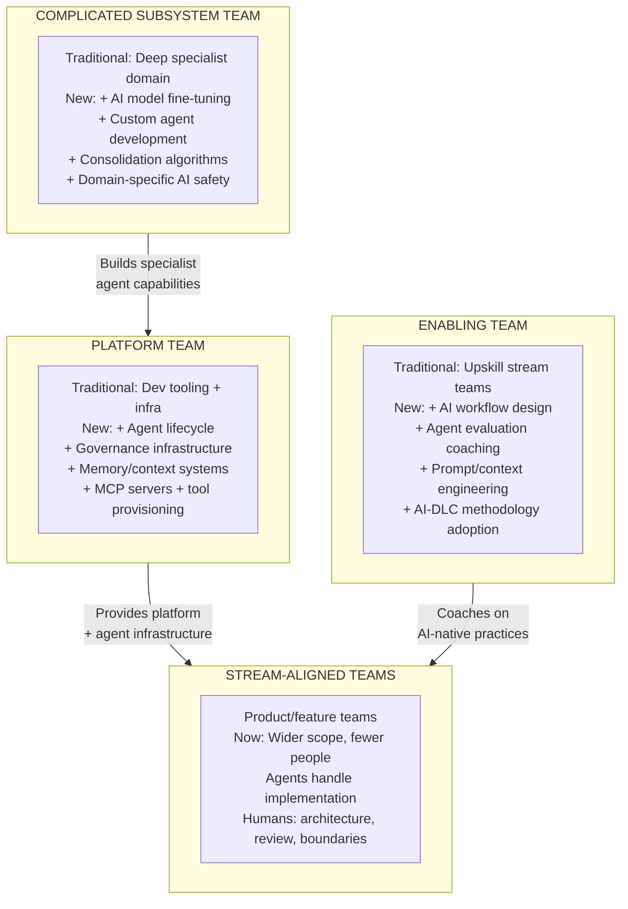
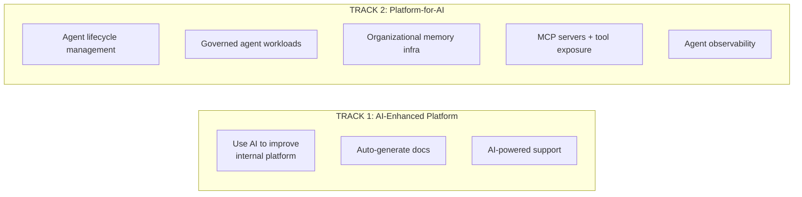
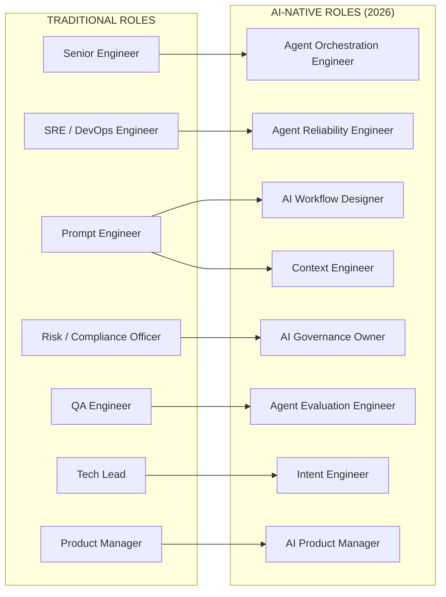
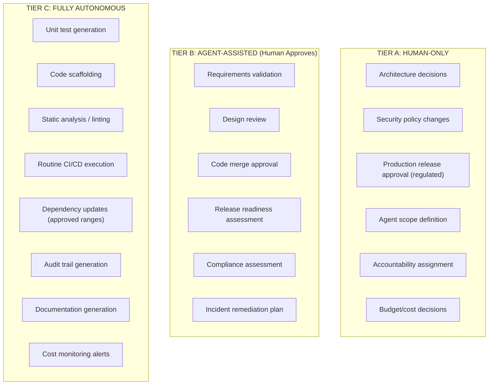
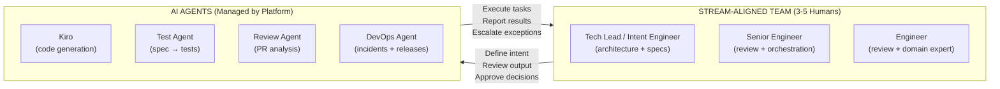
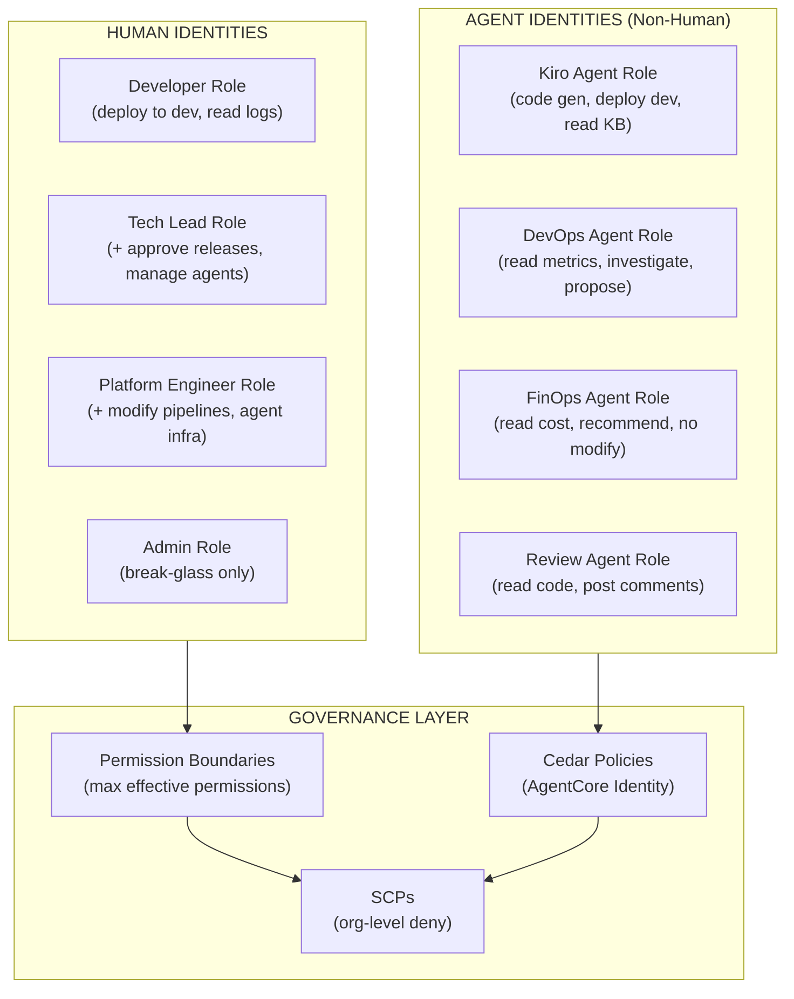
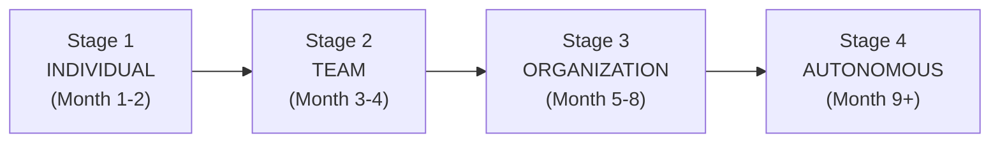

# Team Topologies, Roles & Permissions for the AI-Native Era

> **Status:** Living Document · **Last Updated:** 2026-07-30
> **Audience:** Engineering Leadership, Platform Teams, HR/People, Solution Architects
> **Purpose:** Define how organizations structure teams, assign roles, and manage permissions when AI agents become active participants in the product lifecycle.

---

## Table of Contents

1. [The Operating Model Shift](#the-operating-model-shift)
2. [Team Topologies for 2026](#team-topologies-for-2026)
3. [New Roles in the Agentic Era](#new-roles-in-the-agentic-era)
4. [Decision Authority and Permission Tiers](#decision-authority-and-permission-tiers)
5. [RACI Matrix for Agentic SDLC](#raci-matrix-for-agentic-sdlc)
6. [Team Sizing and Ratios](#team-sizing-and-ratios)
7. [AWS Permissions Model](#aws-permissions-model)
8. [Organizational Memory as Infrastructure](#organizational-memory-as-infrastructure)
9. [Measuring the Operating Model](#measuring-the-operating-model)
10. [Adoption Path](#adoption-path)

---

## The Operating Model Shift

> "Enterprise teams scaling AI agents face an operating model problem, not a tooling problem." — Augment Code, 2026

The shift from traditional to agentic engineering changes every dimension of how teams operate:

| Dimension | Pre-Agent (2023) | Agentic (2026) |
|-----------|-----------------|----------------|
| **Execution model** | Humans execute, tools assist | Humans steer, agents execute |
| **Team size to scope** | Large teams, bounded scope | Small teams, expanded scope |
| **Primary bottleneck** | Execution capacity | Judgment and review capacity |
| **Knowledge persistence** | Documentation, wikis | Shared organizational memory (AI Brain) |
| **Governance model** | Compliance overlay after the fact | Policy-as-code enforced at runtime |
| **Platform team mandate** | Developer tooling + infrastructure | + Agent lifecycle, orchestration, governance |
| **Value of developers** | Code translation speed | Business judgment + orchestration |

### The Amplifier Effect

> "AI amplifies existing organizational strengths and weaknesses. It is not a universal productivity lever." — DORA 2025

| If You Have... | AI Will... |
|---------------|-----------|
| Clear team boundaries | Agents get clear scopes → less coordination overhead |
| Fuzzy team ownership | Agents inherit ambiguity → cross-team conflicts multiply |
| Strong platform foundations | Enable governed agent scaling |
| Grassroots-only adoption | Individual speed up, organizational chaos |
| Defined decision authority | Safe autonomy expansion |
| Implicit decision-making | Shadow decisions at machine speed |

**Conway's Law applies to agents:** Fuzzy team boundaries produce fuzzy agent scopes, with the same downstream coordination costs as fuzzy service boundaries.

---

## Team Topologies for 2026

### The Four Fundamental Team Types (Extended for AI)



### Stream-Aligned Teams in 2026

Stream-aligned teams cover **wider domains with fewer people** doing direct execution work:

| Aspect | Traditional (2023) | AI-Native (2026) |
|--------|-------------------|------------------|
| Team size | 7-9 engineers | 3-5 engineers + agents |
| Scope | Single service / bounded context | Multiple services within a domain |
| Implementation | Humans write code | Agents write code, humans review |
| Testing | Humans write + run tests | Agents generate tests from specs, humans validate coverage |
| Deployment | Humans trigger pipeline | Agents propose + pipeline executes + humans approve (prod) |
| Incidents | Humans investigate | DevOps Agent investigates, humans decide remediation |
| Day-to-day focus | Coding 60% / Review 20% / Design 20% | Design 40% / Review 40% / Orchestration 20% |

**Key principle:** Boundary integrity is the main risk. Agents perform best when their scope matches the stream-aligned team they support. Design team boundaries and agent scopes together.

### Platform Team: Expanded Mandate

The platform team now runs **two tracks simultaneously:**



| Capability Area | Traditional Platform Scope | Agentic Extension |
|----------------|--------------------------|-------------------|
| **Developer Experience** | Self-service, golden paths | Agent-accessible APIs, MCP servers, pre-cleared tool integrations |
| **CI/CD** | Pipeline tooling | Agent-aware pipelines with human-in-the-loop gates |
| **Observability** | Metrics, logs, traces | Reasoning traces, tool call logs, prompt/context paths, evaluation pipelines |
| **Security** | IAM, secrets management | Agent permissions, least-privilege tool access, Cedar policies |
| **Governance** | Policy-as-code for infrastructure | Agent behavior policies, model provenance, out-of-band control plane |
| **Knowledge/Memory** | Documentation, wikis | Shared organizational memory (AI Brain), semantic retrieval at scale |

### Enabling Team: AI Adoption Coaching

| Traditional Enabling | AI-Era Enabling |
|---------------------|-----------------|
| Cloud migration coaching | AI-DLC methodology adoption |
| Observability best practices | Agent evaluation and testing patterns |
| Security training | Prompt/context engineering skills |
| Architecture guidance | Agent scope design + boundary management |
| Testing practices | Spec-driven development (preventing circular validation) |

### Complicated Subsystem Team: Agent Specialists

| Domain | Responsibility |
|--------|---------------|
| Custom agent development | Build domain-specific agents (Strands SDK) |
| Model fine-tuning | Optimize models for org-specific tasks |
| Consolidation algorithms | Build the AI Brain's reconciliation layer |
| AI safety | Domain-specific guardrails and evaluation |
| Agent evaluation frameworks | Behavioral consistency assessment beyond functional testing |

---


## New Roles in the Agentic Era

### Role Evolution Map



### Complete Role Definitions

| Role | Org Placement | Evolves From | Core Function |
|------|--------------|--------------|---------------|
| **Agent Orchestration Engineer** | Platform / Infrastructure | Tech Lead, Senior Engineer | Coordinates multi-agent systems: inter-agent handoffs, context delegation, output synchronization |
| **Agent Reliability Engineer** | SRE / Platform | SRE, DevOps Engineer | Production monitoring, behavioral reliability and cost management for live agent systems |
| **AI Workflow Designer** | Platform + Product | Prompt Engineer, Process Designer | Structures tasks into machine-executable steps with exception handling and escalation logic |
| **Context Engineer** | DevEx / Platform | Prompt Engineer | Manages memory, tool selection, context-window management, and multi-turn agent reasoning at infrastructure level |
| **AI Governance Owner** | Risk / CRO or Engineering | Risk Officer, Compliance | Defines agent autonomy boundaries, maintains decision protocols and escalation paths, owns audit trails |
| **Agent Evaluation Engineer** | QA / Platform | QA Engineer, ML Evaluator | Behavioral consistency assessment for agents — distinct from traditional functional correctness testing |
| **Intent Engineer** | All teams | Tech Lead, Architect | Translates ambiguous business goals into testable specifications that agents can execute |
| **AI Product Manager** | Product | Product Manager | Manages the agent stack: foundational models, data sources, tools, APIs the agents use |

### Roles from the AWS AI-DLC Ecosystem

| Role | Framework Document | Responsibility |
|------|-------------------|----------------|
| **Platform Product Manager** | Platform Engineering Guidelines | Owns platform roadmap, user research, developer NPS |
| **Platform Engineer** | Platform Engineering Guidelines | Builds golden paths, CI/CD, scaffolds, MCP servers |
| **Developer Experience Engineer** | Platform Engineering Guidelines | Onboarding, documentation, DX measurement |
| **Platform SRE** | Platform Engineering Guidelines | Platform availability, incident response (99.9%+ SLO) |
| **Intent Engineer** | AI-SDLC | Translates business goals into specs for AI-DLC Inception phase |
| **AI Workflow Orchestrator** | AI-SDLC | Designs and manages multi-agent workflows |
| **Agent Governance Lead** | AI-SDLC | Policies, review gates, audit trails for AI agents |
| **Spec-Driven QA Engineer** | AI-SDLC | Ensures tests derive from specifications (prevents circular validation) |
| **AgentOps Engineer** | AI-SDLC | Manages agent runtime, observability, cost, and performance |

### Boris Cherny's Five Team Archetypes (Claude Code Creator)

Different teams use AI agents in fundamentally different modes:

| Archetype | Focus | Agent Usage Pattern | Team Composition |
|-----------|-------|--------------------:|------------------|
| **Prototyper** | Rapid exploration, validation | Agent generates entire prototypes from specs | 1-2 humans + agents |
| **Builder** | New feature development | Agent implements, human architects | 2-3 humans + agents |
| **Sweeper** | Tech debt, migrations | Agent handles bulk changes at scale | 1-2 humans + agents (high parallelism) |
| **Grower** | Scaling existing systems | Agent extends patterns, human validates boundaries | 3-4 humans + agents |
| **Maintainer** | Operations, reliability | Agent investigates + remediates, human decides | 2-3 humans + agents |

---


## Decision Authority and Permission Tiers

### Three-Tier Decision Model

> "Governance moves from 'human-in-the-loop' (humans review every change) to 'human-on-the-loop' (humans define the harness of specifications and quality checks that govern agent execution)."



### Permission Matrix by Role

| Activity | Stream Dev | Tech Lead | Platform Eng | AI Gov Owner | Agent (Tier C) | Agent (Tier B) |
|----------|-----------|-----------|--------------|--------------|----------------|----------------|
| Define architecture | ✗ | ✅ Approve | ✗ | ✗ | ✗ | Propose |
| Write/modify code | ✅ | ✅ | ✅ | ✗ | ✅ Auto | ✅ + Review |
| Merge to main | ✗ | ✅ Approve | ✅ Platform code | ✗ | ✗ | PR created, human merges |
| Deploy to dev | ✅ | ✅ | ✅ | ✗ | ✅ Auto (Express) | ✅ Auto |
| Deploy to production | ✗ | ✅ Approve | ✗ | ✗ | ✗ | Propose + wait |
| Change IAM policies | ✗ | ✗ | ✅ Approve | ✅ Approve | ✗ | ✗ |
| Modify agent scope | ✗ | ✗ | ✅ | ✅ Approve | ✗ | ✗ |
| Access customer data | ✅ Scoped | ✅ Scoped | ✗ | ✗ | ✗ | ✗ |
| Create new agents | ✗ | ✅ Propose | ✅ Implement | ✅ Approve | ✗ | ✗ |
| Run security scan | ✅ | ✅ | ✅ | ✅ | ✅ Auto | ✅ Auto |
| Investigate incidents | ✅ | ✅ | ✅ | ✗ | ✅ Auto | ✅ + Report |
| Approve remediation | ✗ | ✅ | ✅ | ✗ | ✗ | Propose |

---

## RACI Matrix for Agentic SDLC

**R** = Responsible (does the work) · **A** = Accountable (final decision) · **C** = Consulted · **I** = Informed

| Activity | Stream Team | Platform Team | Enabling Team | AI Gov Owner | AI Agents |
|----------|------------|---------------|---------------|--------------|-----------|
| **INCEPTION** | | | | | |
| Business requirements | A | I | C | I | R (draft) |
| Spec authoring (AI-DLC) | A | I | C | I | R (generate) |
| Architecture decisions | A | C | C | I | R (propose) |
| **CONSTRUCTION** | | | | | |
| Code generation | C/A (review) | I | I | I | R |
| Test generation from specs | C/A (review) | I | C | I | R |
| Security scanning | I | A (infra) | I | C | R (execute) |
| Code review | A (approve) | I | I | I | R (first pass) |
| **DEPLOYMENT** | | | | | |
| Pipeline execution | I | A | I | I | R |
| Release readiness | A (approve) | C | I | C | R (assess) |
| Canary monitoring | I | A (infra) | I | I | R (monitor) |
| Rollback decision | A | C | I | I | R (recommend) |
| **OPERATIONS** | | | | | |
| Incident detection | I | I | I | I | R (auto) |
| Root cause analysis | A (validate) | C | I | I | R (investigate) |
| Remediation | A (approve) | C | I | C | R (propose) |
| Cost optimization | I | C | I | I | R (recommend) |
| **GOVERNANCE** | | | | | |
| Agent scope definition | C | R | C | A | I |
| Permission boundaries | I | R | I | A | I |
| Audit + compliance | I | R (implement) | I | A | R (generate) |
| Brain knowledge curation | R (domain) | R (infra) | C | A (policy) | R (ingest) |

---

## Team Sizing and Ratios

### Stream-Aligned Team Composition (2026)



### Recommended Ratios

| Organization Size | Stream Teams | Platform Team | Enabling Team | Agent Fleet |
|-------------------|-------------|---------------|---------------|-------------|
| **< 50 engineers** | 5-8 teams (3-4 people each) | 2-3 engineers | 1-2 (part-time) | Shared agents (Kiro + DevOps Agent) |
| **50-200 engineers** | 12-25 teams (3-5 people each) | 5-8 + PM + DX | 3-4 dedicated | Per-team agent configs + shared platform agents |
| **200-500 engineers** | 40-60 teams | 10-15 (multiple squads) | 5-8 | Dedicated agent orchestration team within platform |
| **500+ engineers** | 60+ teams | 15-25 (agent platform is its own squad) | 8-12 | Full agent platform team + per-domain agent specialists |

### The LinkedIn Pattern: Dedicated Agent Platform Team

LinkedIn stood up a fully funded agent platform team structured like its storage or ML infrastructure teams:

| Function | Responsibility |
|----------|---------------|
| Prompt orchestration | Centralized prompt management and versioning |
| Data access | Controlled, governed access to organizational data |
| Safety evaluations | Pre-deployment agent behavioral testing |
| Deployment | Agent deployment lifecycle (build, test, canary, promote) |
| Observability | Agent-specific metrics, traces, cost attribution |

---

## AWS Permissions Model

### IAM Strategy for Human + Agent Roles



### Agent Permission Boundaries (CDK)

```typescript
// Permission boundary for AI coding agents
const agentCodingBoundary = new iam.ManagedPolicy(this, 'AgentCodingBoundary', {
  statements: [
    // ALLOW: What coding agents can do
    new iam.PolicyStatement({
      effect: iam.Effect.ALLOW,
      actions: [
        'lambda:*', 'dynamodb:*', 'sqs:*', 'sns:*',
        'events:*', 'logs:*', 'xray:*', 'cloudwatch:Get*',
        's3:GetObject', 's3:PutObject', 's3:ListBucket',
        'cloudformation:*',  // Deploy via Express mode
        'bedrock:InvokeModel', 'bedrock:Retrieve',
      ],
      resources: ['*'],
      conditions: {
        StringEquals: { 'aws:RequestedRegion': ['us-east-1', 'us-west-2'] },
      },
    }),
    // DENY: What coding agents can NEVER do
    new iam.PolicyStatement({
      effect: iam.Effect.DENY,
      actions: [
        'iam:CreateUser', 'iam:CreateAccessKey', 'iam:AttachRolePolicy',
        'organizations:*',
        'kms:Delete*', 'kms:Disable*',
        'rds:DeleteDBCluster', 'dynamodb:DeleteTable',
        'ec2:*Vpc*', 'ec2:*SecurityGroup*',  // No network changes
      ],
      resources: ['*'],
    }),
  ],
});

// Permission boundary for DevOps Agent (read-heavy, limited write)
const agentDevOpsBoundary = new iam.ManagedPolicy(this, 'AgentDevOpsBoundary', {
  statements: [
    new iam.PolicyStatement({
      effect: iam.Effect.ALLOW,
      actions: [
        'cloudwatch:*', 'logs:*', 'xray:*',
        'cloudformation:Describe*', 'cloudformation:List*',
        'lambda:Get*', 'lambda:List*',
        'ecs:Describe*', 'ecs:List*',
        'codedeploy:Get*', 'codedeploy:List*',
        'bedrock:InvokeModel',
      ],
      resources: ['*'],
    }),
    // DevOps Agent can rollback but not deploy forward
    new iam.PolicyStatement({
      effect: iam.Effect.ALLOW,
      actions: ['codedeploy:StopDeployment'],
      resources: ['*'],
      conditions: {
        StringEquals: { 'aws:ResourceTag/ManagedBy': 'devops-agent' },
      },
    }),
  ],
});
```

### Cedar Policies for Agent Authorization (AgentCore Identity)

```cedar
// Coding agent can query AI Brain for conventions and patterns
permit(
    principal == Agent::"kiro-coding-agent",
    action in [Action::"brain:query", Action::"brain:search"],
    resource in BrainNamespace::"conventions"
);

// Coding agent can deploy to dev environment ONLY
permit(
    principal == Agent::"kiro-coding-agent",
    action == Action::"deploy:execute",
    resource in Environment::"dev"
) when { context.deployment_mode == "express" };

// DevOps Agent can investigate any environment
permit(
    principal == Agent::"devops-agent",
    action in [Action::"observe:query", Action::"observe:trace"],
    resource in Environment::*
);

// DevOps Agent can propose remediation (human approves)
permit(
    principal == Agent::"devops-agent",
    action == Action::"remediate:propose",
    resource in Environment::*
);

// DENY: No agent can modify IAM or network
forbid(
    principal in AgentGroup::"all-agents",
    action in [Action::"iam:modify", Action::"network:modify"],
    resource
);

// DENY: No agent can access production data directly
forbid(
    principal in AgentGroup::"all-agents",
    action == Action::"data:read",
    resource in DataClassification::"PII"
) unless { context.has_human_approval == true };
```

---


## Organizational Memory as Infrastructure

> Shared memory determines whether knowledge compounds across agents and teams or resets with every session.

### Memory Failure Modes

| Failure | Organizational Effect | Prevention |
|---------|----------------------|-----------|
| **Context fragmentation** | Increases synchronization overhead across tools and sessions | Unified AI Brain (see doc 32) |
| **Agent drift** | Reduces reliability as prompt changes interact with system updates | Version-controlled steering files (.kiro/steering/) |
| **Knowledge silo formation** | Prevents incident patterns from compounding across teams | Shared memory infrastructure (AgentCore Memory) |
| **Context rot** | Degrades performance even as more context is supplied | Active consolidation (brain reconciliation layer) |

### Who Owns What in the Memory Stack

| Layer | Owner | Responsibility |
|-------|-------|---------------|
| **Ingestion pipelines** | Platform Team | EventBridge rules, Lambda processors, S3 sync |
| **Consolidation logic** | Complicated Subsystem Team | Reconciliation algorithms, belief management |
| **Retrieval infrastructure** | Platform Team | Knowledge Bases, OpenSearch, MCP servers |
| **Domain knowledge** | Stream-Aligned Teams | Architecture decisions, conventions, domain context |
| **Governance policies** | AI Governance Owner | Access control, source authority rules, compliance |
| **Brain evaluation** | Agent Evaluation Engineer | Retrieval quality, belief freshness, hallucination rate |

---

## Measuring the Operating Model

### Four Metric Layers

| Layer | Key Metrics | Why It Matters |
|-------|-------------|----------------|
| **DORA (reinterpreted)** | Deployment frequency, lead time, change fail rate, **deployment rework rate**, recovery time | Deployment frequency alone is unreliable; pair with rework rate |
| **Agent performance** | Task success rate, consistency, cost per task, escalation frequency | Task success alone is insufficient; agents can succeed while being behaviorally unreliable |
| **Governance** | % of agent workflows with documented approval, AI assessment cadence | Regular AI assessments indicate governance maturity |
| **Human-agent coordination** | True autonomy rate, intervention classification, review queue depth | Review queue depth surfaces coordination mismatches that throughput metrics miss |

### Team Health Indicators

| Metric | Target | Red Flag |
|--------|--------|----------|
| Review queue depth | < 4 hours average | Growing backlog = agents producing faster than humans can review |
| Agent escalation rate | 5-15% of tasks | < 5% = agent may be overstepping; > 15% = agent scope too broad |
| Time-to-first-deploy (new engineer) | < 1 day | > 1 week = platform not self-service enough |
| Convention compliance rate | > 90% on first attempt | < 70% = brain doesn't have team conventions |
| Deployment rework rate | < 10% | > 20% = agents shipping untested/unverified code |
| Agent cost per PR | Track trend | Exponential growth = agent inefficiency or scope creep |

---

## Adoption Path

### Staged Team Transformation



### Stage 1: Individual Adoption (Month 1-2)

| Action | Owner | Outcome |
|--------|-------|---------|
| Install AI-DLC workflow rules | Each developer | Kiro steering active |
| Enable Kiro/Claude Code for all engineers | Platform Team | Agent access democratized |
| Define explicit AI stance | Engineering Leadership | Clear what's allowed and what's not |
| No new roles yet | — | Focus on learning |

**Team topology:** Unchanged. Agents are tools for individuals.

### Stage 2: Team-Level Integration (Month 3-4)

| Action | Owner | Outcome |
|--------|-------|---------|
| Appoint Intent Engineer per team | Tech Lead (role extension) | Specs become the control plane |
| Platform team adds MCP servers | Platform Team | Agents can call platform tools |
| Deploy PR Review Agent (brain-enhanced) | Platform Team | First team-level agent workflow |
| Define Tier A/B/C decisions | Engineering Leadership + AI Gov | Decision authority explicit |

**Team topology:** Stream teams + enhanced platform team. Enabling team starts AI coaching.

### Stage 3: Organizational Scale (Month 5-8)

| Action | Owner | Outcome |
|--------|-------|---------|
| Hire/appoint Agent Orchestration Engineer | Platform Team | Multi-agent coordination owned |
| Hire/appoint AI Governance Owner | Risk/Engineering | Autonomy boundaries enforced |
| Deploy AI Brain with consolidation | Platform + Complicated Subsystem | Organizational memory operational |
| Reduce stream team sizes (attrition, not layoffs) | Engineering Leadership | Wider scope, fewer people |
| Add Agent Evaluation Engineer | QA/Platform | Behavioral reliability measured |

**Team topology:** Full four-type topology with agentic extensions. Complicated Subsystem team owns brain.

### Stage 4: Autonomous Operations (Month 9+)

| Action | Owner | Outcome |
|--------|-------|---------|
| Enable Tier C autonomy fully | AI Governance Owner | Agents execute routine work autonomously |
| Overnight agent work cycles | Platform Team | Agents enrich, validate, generate — humans review mornings |
| Self-healing platform active | Platform + SRE | Agents detect + remediate without human intervention |
| Full RACI operational | All teams | Clear accountability at every step |

**Team topology:** Mature agentic organization. Platform team is "agent control plane."

---

## Anti-Patterns

| Anti-Pattern | What Happens | Fix |
|-------------|-------------|-----|
| **Grassroots without governance** | Individual speed up, organizational chaos, stability drops | Define decision tiers and AI stance FIRST |
| **All-at-once role changes** | Confusion, resistance, skill gaps | Staged adoption: extend roles before creating new ones |
| **Agent scope wider than team boundary** | Cross-team conflicts, ambiguous ownership | Design agent scope = team scope (Conway's Law) |
| **No review capacity planning** | Agent PRs pile up faster than humans can review | Measure review queue depth; adjust team size |
| **Platform team doesn't own agent infra** | Shadow agent deployments, inconsistent governance | Agent lifecycle is platform responsibility |
| **Copying other org's structure** | Mismatch with actual delivery needs | Start from your delivery bottlenecks, not role templates |

---

## References

| Resource | Source | Date |
|----------|--------|------|
| [Agentic Engineering Operating Model: Teams + Agents](https://www.augmentcode.com/guides/agentic-engineering-operating-model) | Augment Code | May 2026 |
| [The New Org Chart: AI-Native Roles in the Agentic Era](https://www.cio.com/article/4060162/the-new-org-chart-unlocking-value-with-ai-native-roles-in-the-agentic-era.html) | CIO.com | 2026 |
| [Rise of Agent Managers in AI Workforce Transformation](https://www.mckinsey.com/capabilities/tech-and-ai/our-insights/rewired-takes-how-ai-is-unlocking-creativity-and-heralding-the-rise-of-the-agent-manager) | McKinsey | Jul 2026 |
| [How Agentic AI Will Reshape Engineering Workflows](https://www.cio.com/article/4134741/how-agentic-ai-will-reshape-engineering-workflows-in-2026.html) | CIO.com | 2026 |
| [Agentic Enterprise 2028: Blueprint for Growth](https://www.deloitte.com/us/en/what-we-do/capabilities/applied-artificial-intelligence/articles/agentic-ai-enterprise-2028.html) | Deloitte | 2026 |
| [The AI Transformation Org Chart (5 Archetypes)](https://allenjhyang.substack.com/p/the-ai-transformation-org-chart) | Allen Yang (Substack) | Jul 2026 |
| [DORA 2025 Report](https://cloud.google.com/blog/products/ai-machine-learning/announcing-the-2025-dora-report) | Google Cloud | 2025 |
| [Organising 100+ Engineers to Build Agentic AI](https://ahmedkhamassi.substack.com/p/organising-100-engineers-to-build) | Ahmed Khamassi | 2026 |
| [Team Topologies](https://teamtopologies.com/) | Matthew Skelton & Manuel Pais | — |
| [Why You Shouldn't Treat AI Agents Like Employees](https://hbr.org/2026/05/research-why-you-shouldnt-treat-ai-agents-like-employees) | Harvard Business Review | May 2026 |
| [NIST IR 8596: AI Accountability](https://nvlpubs.nist.gov/nistpubs/ir/2025/NIST.IR.8596.iprd.pdf) | NIST | 2025 |
| [WEF: Organizational Transformation in the Age of AI](https://reports.weforum.org/docs/WEF_Organizational_Transformation_in_the_Age_of_AI_How_Organizations_Maximize_AI's_Potential_2026.pdf) | World Economic Forum | 2026 |
