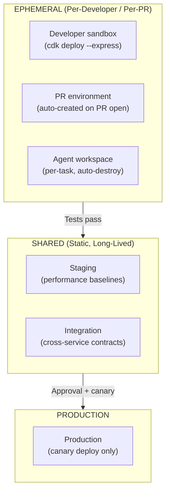
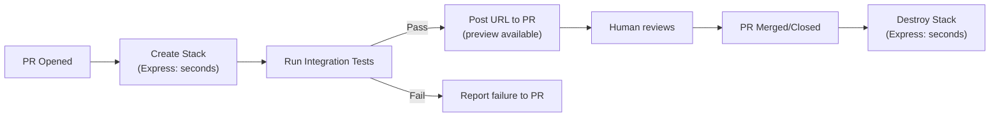
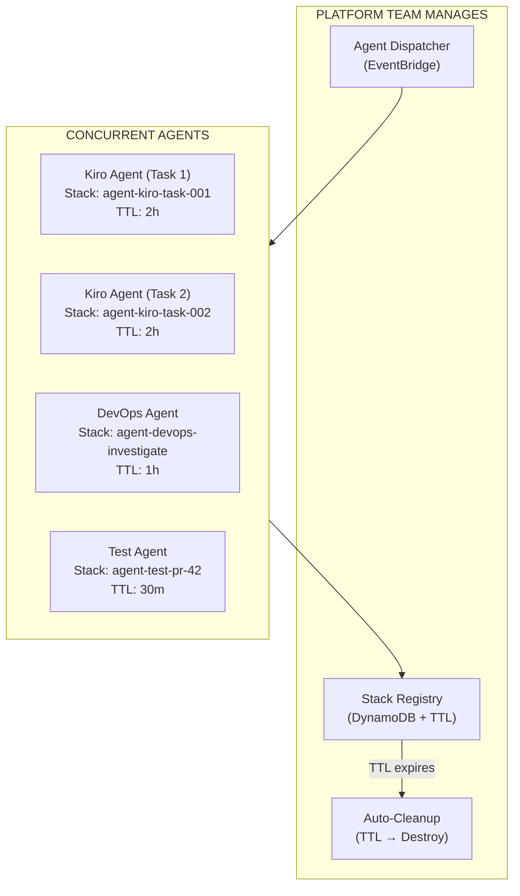
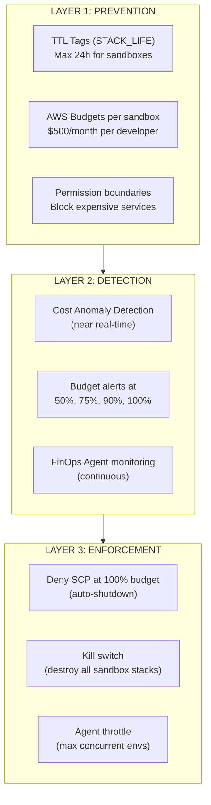
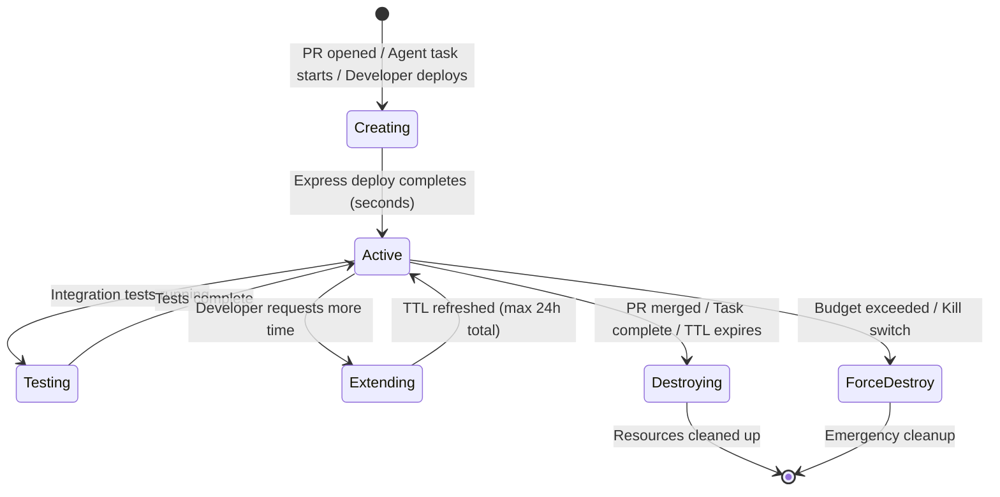
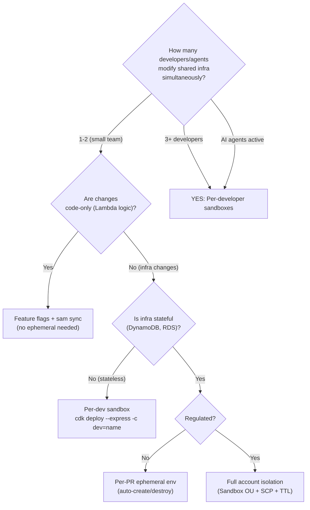

# Ephemeral Environments & Developer Concurrency

> **Status:** Living Document · **Last Updated:** 2026-08-05
> **Applies to:** All teams using CDK, SAM, or SST for development and CI/CD
> **Purpose:** Define how to implement ephemeral environments for both human developers and AI agents, manage developer concurrency, and control costs.

---

## Table of Contents

1. [Why Ephemeral Environments Are Foundational in 2026](#why-ephemeral-environments-are-foundational-in-2026)
2. [Ephemeral vs Static Environments](#ephemeral-vs-static-environments)
3. [Developer Concurrency Strategies](#developer-concurrency-strategies)
4. [Implementation Patterns on AWS](#implementation-patterns-on-aws)
5. [Agent Concurrency and Isolation](#agent-concurrency-and-isolation)
6. [Cost Guardrails](#cost-guardrails)
7. [Lifecycle Management](#lifecycle-management)
8. [Security and Blast Radius](#security-and-blast-radius)
9. [Decision Framework](#decision-framework)
10. [Checklist](#checklist)

---

## Why Ephemeral Environments Are Foundational in 2026

> "Ephemeral environments aren't optional. They're foundational." — Coder, 2025

Two converging forces made ephemeral environments critical in 2026:

### Force 1: AI Agents Need Isolation

AI agents don't second-guess themselves. If an agent runs destructive commands, generates garbage code, or enters an infinite loop, it does so at machine speed. In a traditional shared environment, that's organizational damage. In an ephemeral environment, you delete and restart in 30 seconds.

> "AI agents with too much access in poorly secured environments" is the "lethal trifecta." Ephemerality cuts through that risk. — Simon Willison, 2025

### Force 2: The Cost Crisis

| Metric | Value | Source |
|--------|-------|--------|
| Cloud waste | 29% of IaaS/PaaS spend (first rise in 5 years) | Flexera 2026 State of the Cloud |
| Cause | AI workloads making cost forecasting structurally harder | Flexera 2026 |
| Agentic AI projects canceled by 2027 | 40% (due to hidden costs) | Gartner 2026 |
| GenAI deployments with zero measurable ROI | 95% | MIT NANDA Initiative |
| Agent cost catastrophe (financial services) | $7,000 in 3 days (uncontrolled subagent) | Community incident May 2026 |
| Agent parallel burn rate | 887K tokens/min (TypeScript checks) | Community incident May 2026 |
| Billing alert lag | ~1 day behind actual spend | InfoQ Jul 2026 |

> "AI agents with cloud credentials outrun billing guardrails designed for human-speed mistakes." — InfoQ, July 2026

> "Agentic AI introduces cost volatility into direct cloud costs. The head of I&O will need runtime controls to keep production AI spend predictable." — Gartner, 2026

**Ephemeral environments solve both forces:** isolation prevents blast radius + TTLs prevent cost runaway.

### Force 3: CloudFormation Express Mode Changes the Economics

Before Express Mode (pre-June 2026), ephemeral environments were **theoretically** good but **practically** expensive in time:

| Operation | Standard Mode | Express Mode |
|-----------|--------------|--------------|
| Create full stack | 5-15 minutes | **Seconds** |
| Destroy full stack | 5-20 minutes | **Seconds** |
| Cost of waiting (10 devs x 4 deploys/day) | 3-10 hours/day wasted | ~Minutes/day |
| Per-PR environment viability | Barely practical | **First-class pattern** |
| AI agent iteration cycles per 10 min | 1 | **10+** |

Express Mode makes ephemeral environments **free in time**, which makes them **default** rather than opt-in.

---

## Ephemeral vs Static Environments

| Dimension | Ephemeral | Static (Shared Staging) |
|-----------|-----------|------------------------|
| **Lifecycle** | Created on demand, destroyed when done | Runs continuously |
| **State** | Clean slate every time | Accumulates drift |
| **Isolation** | Per-developer / per-PR / per-agent | Shared by all |
| **Cost model** | Pay only while active | Pay 24/7 |
| **Conflict risk** | Zero (fully isolated) | High (shared resources) |
| **Production parity** | High (fresh from IaC) | Degrades over time (snowflake) |
| **Setup time** | Seconds (Express Mode) | N/A (already running) |
| **Best for** | Feature development, testing, agent work | Performance baselines, long-running tests |

### When to Use Each

| Use Ephemeral | Use Static |
|---------------|-----------|
| Feature development (per-developer sandbox) | Production (obviously) |
| PR validation (integration tests) | Shared load testing environment |
| AI agent iteration (isolated workspace) | Persistent data needed across runs |
| Security testing (disposable after scan) | Compliance environments requiring audit history |
| Onboarding (clean-slate learning env) | Cross-team integration testing (shared contracts) |

### The Hybrid Model (Recommended)



---

## Developer Concurrency Strategies

### The Problem: N Developers Modifying Shared Infrastructure

When multiple developers work on the same service simultaneously, they hit:
- **State conflicts:** Dev A's DynamoDB schema change breaks Dev B's Lambda code
- **Resource name collisions:** Two developers deploying to the same stack overwrite each other
- **Slow feedback loops:** Waiting for shared env to be "free" (staging bottleneck)
- **Agent multiplication:** AI agents iterate 10x faster than humans, multiplying all conflicts

### Strategy 1: Per-Developer Sandbox (Primary — Recommended Default)

Every developer gets their own isolated AWS stack. Express Mode makes this seconds, not minutes.

```typescript
// cdk.ts — Per-developer stack isolation
import * as cdk from 'aws-cdk-lib';

const app = new cdk.App();
const developer = app.node.tryGetContext('developer') || process.env.USER || 'shared';

new MyServiceStack(app, `MyService-${developer}`, {
  env: { account: process.env.CDK_DEFAULT_ACCOUNT, region: 'us-east-1' },
  stackName: `my-service-${developer}`,
  description: `Ephemeral sandbox for ${developer} — auto-destroy after 8h`,
  tags: {
    'STACK_LIFE': '8h',           // TTL for auto-cleanup
    'Owner': developer,
    'Environment': 'sandbox',
    'CostCenter': 'engineering',
  },
});
```

**Usage:**
```bash
# Developer deploys their isolated stack in seconds
cdk deploy --express -c developer=walej

# Or via ThothCTL (platform integration)
thothctl deploy sandbox --developer walej --ttl 8h

# AI agent deploys its own isolated workspace
cdk deploy --express -c developer=agent-kiro-task-42
```

**Concurrency:** Unlimited. Each developer/agent has their own stack. Zero conflicts.

### Strategy 2: Per-PR Ephemeral Environment (CI/CD Pipeline)

Every Pull Request automatically creates an isolated environment, runs tests, and destroys it on merge/close.



### Strategy 3: Feature Flags + Shared Environment (Lightweight Alternative)

For code-only changes that don't modify infrastructure:

```bash
# Deploy code dark (flag off) to shared dev
sam sync --watch

# Enable feature for specific users via Evidently
aws evidently update-feature \
    --project my-app \
    --feature new-checkout \
    --entity-overrides '{"walej": "ENABLED"}'
```

**Best for:** Lambda handler logic, UI changes, non-infrastructure modifications.

### Strategy 4: Namespace Isolation (Shared Account, Isolated Resources)

```typescript
// All resources prefixed with developer name
const prefix = props.developer; // e.g., "walej"

new dynamodb.Table(this, 'OrdersTable', {
  tableName: `${prefix}-orders`,  // walej-orders, agent-kiro-orders, etc.
});

new lambda.Function(this, 'ProcessOrder', {
  functionName: `${prefix}-process-order`,
  environment: {
    TABLE_NAME: `${prefix}-orders`,
    EVENT_BUS: `${prefix}-events`,
  },
});
```

**Best for:** Teams wanting isolation without full stack-per-developer cost.

### Strategy Comparison

| Strategy | Isolation Level | Cost | Setup Complexity | Best For |
|----------|----------------|------|-----------------|----------|
| Per-developer sandbox | Full stack | Medium | Low (CDK context) | Infrastructure changes |
| Per-PR environment | Full stack (temp) | Low (short-lived) | Medium (pipeline) | Integration testing |
| Feature flags | Code only | Zero extra | Low | Logic-only changes |
| Namespace isolation | Resource-level | Low | Medium | Shared account teams |

---


## Implementation Patterns on AWS

### Pattern 1: CDK Pipeline with Ephemeral PR Stages

```typescript
import * as pipelines from 'aws-cdk-lib/pipelines';
import * as cdk from 'aws-cdk-lib';

export class EphemeralPipelineStack extends cdk.Stack {
  constructor(scope: cdk.App, id: string, props: cdk.StackProps) {
    super(scope, id, props);

    const pipeline = new pipelines.CodePipeline(this, 'Pipeline', {
      pipelineName: 'MyApp-Pipeline',
      synth: new pipelines.ShellStep('Synth', {
        input: pipelines.CodePipelineSource.gitHub('org/my-app', 'main'),
        commands: ['npm ci', 'npm run build', 'npx cdk synth'],
      }),
    });

    // Permanent stages
    pipeline.addStage(new AppStage(this, 'Dev', {
      env: { account: DEV_ACCOUNT, region: 'us-east-1' },
    }));

    pipeline.addStage(new AppStage(this, 'Prod', {
      env: { account: PROD_ACCOUNT, region: 'us-east-1' },
    }), {
      pre: [new pipelines.ManualApprovalStep('ApproveProd')],
    });
  }
}
```

**GitHub Actions for ephemeral PR environments:**

```yaml
# .github/workflows/ephemeral-pr.yml
name: Ephemeral PR Environment

on:
  pull_request:
    types: [opened, synchronize, reopened]
  pull_request_target:
    types: [closed]

permissions:
  id-token: write
  contents: read
  pull-requests: write

jobs:
  deploy-ephemeral:
    if: github.event.action != 'closed'
    runs-on: ubuntu-latest
    steps:
      - uses: actions/checkout@v4
      
      - uses: aws-actions/configure-aws-credentials@v4
        with:
          role-to-assume: arn:aws:iam::${{ vars.DEV_ACCOUNT }}:role/github-actions-deploy
          aws-region: us-east-1
      
      - name: Install dependencies
        run: npm ci
      
      - name: Deploy ephemeral environment (Express Mode)
        run: |
          npx cdk deploy --express \
            --all \
            --require-approval never \
            -c environment=pr-${{ github.event.number }} \
            --tags "STACK_LIFE=24h" \
            --tags "PR=${{ github.event.number }}" \
            --tags "Owner=${{ github.actor }}"
      
      - name: Run integration tests
        run: npm run test:integration
        env:
          API_URL: ${{ steps.deploy.outputs.api-url }}
      
      - name: Comment PR with environment URL
        uses: actions/github-script@v7
        with:
          script: |
            github.rest.issues.createComment({
              owner: context.repo.owner,
              repo: context.repo.repo,
              issue_number: context.issue.number,
              body: `## Ephemeral Environment Deployed
              
              | Resource | URL |
              |----------|-----|
              | API | ${{ steps.deploy.outputs.api-url }} |
              | Frontend | ${{ steps.deploy.outputs.frontend-url }} |
              
              **Auto-destroys:** 24h or on PR close
              **Stack:** \`my-app-pr-${{ github.event.number }}\``
            })

  destroy-ephemeral:
    if: github.event.action == 'closed'
    runs-on: ubuntu-latest
    steps:
      - uses: actions/checkout@v4
      
      - uses: aws-actions/configure-aws-credentials@v4
        with:
          role-to-assume: arn:aws:iam::${{ vars.DEV_ACCOUNT }}:role/github-actions-deploy
          aws-region: us-east-1
      
      - name: Destroy ephemeral environment
        run: |
          npx cdk destroy --express \
            --all \
            --force \
            -c environment=pr-${{ github.event.number }}
```

### Pattern 2: TTL-Based Auto-Cleanup (STACK_LIFE Tag)

Based on the AWS Community Projects `ephemeral` pattern:

```typescript
import * as cdk from 'aws-cdk-lib';
import * as dynamodb from 'aws-cdk-lib/aws-dynamodb';
import * as lambda from 'aws-cdk-lib/aws-lambda';
import * as events from 'aws-cdk-lib/aws-events';
import * as targets from 'aws-cdk-lib/aws-events-targets';

export class EphemeralCleanupStack extends cdk.Stack {
  constructor(scope: cdk.App, id: string) {
    super(scope, id);

    // DynamoDB table with TTL for tracking ephemeral stacks
    const stackRegistry = new dynamodb.Table(this, 'EphemeralRegistry', {
      tableName: 'ephemeral-stack-registry',
      partitionKey: { name: 'stackName', type: dynamodb.AttributeType.STRING },
      timeToLive: { attributeName: 'ttl' },
      stream: dynamodb.StreamViewType.OLD_IMAGE,
      removalPolicy: cdk.RemovalPolicy.DESTROY,
    });

    // Lambda triggered on TTL expiration (DynamoDB Stream)
    const destroyerFn = new lambda.Function(this, 'StackDestroyer', {
      functionName: 'ephemeral-stack-destroyer',
      runtime: lambda.Runtime.NODEJS_20_X,
      handler: 'index.handler',
      code: lambda.Code.fromInline(`
        const { CloudFormationClient, DeleteStackCommand } = require('@aws-sdk/client-cloudformation');
        const cfn = new CloudFormationClient({});
        
        exports.handler = async (event) => {
          for (const record of event.Records) {
            if (record.eventName === 'REMOVE') {
              const stackName = record.dynamodb.OldImage.stackName.S;
              console.log('TTL expired — destroying stack:', stackName);
              await cfn.send(new DeleteStackCommand({ 
                StackName: stackName,
                DeletionMode: 'FORCE_DELETE_STACK'  // Express deletion
              }));
            }
          }
        };
      `),
      timeout: cdk.Duration.minutes(5),
    });

    // Grant permissions
    stackRegistry.grantStreamRead(destroyerFn);
    destroyerFn.addToRolePolicy(new cdk.aws_iam.PolicyStatement({
      actions: ['cloudformation:DeleteStack', 'cloudformation:DescribeStacks'],
      resources: ['*'],
      conditions: {
        StringEquals: { 'aws:ResourceTag/Environment': 'sandbox' },
      },
    }));

    // DynamoDB Stream → Lambda
    destroyerFn.addEventSource(
      new cdk.aws_lambda_event_sources.DynamoEventSource(stackRegistry, {
        startingPosition: lambda.StartingPosition.LATEST,
        filterPatterns: [{ eventName: ['REMOVE'] }],
      })
    );

    // Hourly scanner: register untracked STACK_LIFE-tagged stacks
    const scannerFn = new lambda.Function(this, 'StackScanner', {
      functionName: 'ephemeral-stack-scanner',
      runtime: lambda.Runtime.NODEJS_20_X,
      handler: 'index.handler',
      code: lambda.Code.fromInline(`
        const { CloudFormationClient, ListStacksCommand, DescribeStacksCommand } = require('@aws-sdk/client-cloudformation');
        const { DynamoDBClient, PutItemCommand, GetItemCommand } = require('@aws-sdk/client-dynamodb');
        
        const cfn = new CloudFormationClient({});
        const ddb = new DynamoDBClient({});
        
        exports.handler = async () => {
          const stacks = await cfn.send(new ListStacksCommand({
            StackStatusFilter: ['CREATE_COMPLETE', 'UPDATE_COMPLETE']
          }));
          
          for (const stack of stacks.StackSummaries || []) {
            const details = await cfn.send(new DescribeStacksCommand({ StackName: stack.StackName }));
            const tags = details.Stacks?.[0]?.Tags || [];
            const lifeTag = tags.find(t => t.Key === 'STACK_LIFE');
            
            if (lifeTag) {
              const hours = parseInt(lifeTag.Value);
              const ttl = Math.floor(Date.now() / 1000) + (hours * 3600);
              
              // Register if not already tracked
              const existing = await ddb.send(new GetItemCommand({
                TableName: 'ephemeral-stack-registry',
                Key: { stackName: { S: stack.StackName } }
              }));
              
              if (!existing.Item) {
                await ddb.send(new PutItemCommand({
                  TableName: 'ephemeral-stack-registry',
                  Item: {
                    stackName: { S: stack.StackName },
                    ttl: { N: ttl.toString() },
                    owner: { S: tags.find(t => t.Key === 'Owner')?.Value || 'unknown' },
                    createdAt: { S: new Date().toISOString() },
                  }
                }));
              }
            }
          }
        };
      `),
    });

    // Run scanner every hour
    new events.Rule(this, 'ScanSchedule', {
      schedule: events.Schedule.rate(cdk.Duration.hours(1)),
      targets: [new targets.LambdaFunction(scannerFn)],
    });
  }
}
```

### Pattern 3: SAM + Express for Lambda-Focused Teams

```bash
# Per-developer sandbox with SAM
sam deploy --express \
    --stack-name my-app-${USER} \
    --parameter-overrides "Environment=sandbox-${USER}" \
    --tags "STACK_LIFE=8h Owner=${USER} Environment=sandbox"

# Real-time sync (code-only, no CloudFormation)
sam sync --watch --stack-name my-app-${USER}

# Cleanup
sam delete --stack-name my-app-${USER} --no-prompts
```

### Pattern 4: Amplify Gen 2 Per-Developer Sandbox

```bash
# Each developer gets isolated cloud backend
npx ampx sandbox --identifier ${USER}

# Changes auto-deploy on save
# Isolated: Auth, Data, Storage, Functions — all personal

# Cleanup
npx ampx sandbox delete --identifier ${USER}
```

### Pattern 5: SST v3 Stage-Based Isolation

```bash
# Per-developer stage
sst deploy --stage walej

# Per-PR stage
sst deploy --stage pr-42

# Cleanup
sst remove --stage pr-42
```

---


## Agent Concurrency and Isolation

### Why Agents Need Ephemeral Environments More Than Humans

| Human Developer | AI Agent |
|----------------|----------|
| Makes 4-8 deploy attempts per day | Makes 10+ deploy attempts per 10 minutes |
| Notices when something breaks | Doesn't notice — keeps iterating on broken state |
| Stops working at EOD | Can run 24/7 (overnight work cycles) |
| Costs $0.05/deploy in time | Costs $0.05/deploy x 100 deploys = real money |
| Self-limits destructive actions | Will `rm -rf` if that's what the plan says |
| Adapts to environment quirks | Needs reproducible environment to be reliable |

### Agent Isolation Architecture



### Agent Environment Lifecycle

```bash
# 1. Agent receives task
# 2. Platform provisions isolated environment
cdk deploy --express \
    -c environment=agent-kiro-task-${TASK_ID} \
    --tags "STACK_LIFE=2h" \
    --tags "Owner=kiro-agent" \
    --tags "TaskID=${TASK_ID}" \
    --tags "CostCenter=ai-agents"

# 3. Agent iterates (deploy/test/fix cycles)
#    All within its isolated stack

# 4. Agent completes task → environment auto-destroyed
#    OR TTL expires → forced destruction (safety net)
```

### Preventing Agent Cost Catastrophes

The three documented cost catastrophes (May 2026) show what happens without controls:

| Incident | Cost | Root Cause | Prevention |
|----------|------|-----------|-----------|
| Financial services subagent runaway | $7,000 in 3 days | Uncontrolled recursive spawning | TTL + max-cost-per-task |
| TypeScript parallel-49 burn | 887K tokens/min | 49 parallel agents with no throttle | Concurrency limits + TTL |
| Overnight cache-TTL surprise | Thousands | Agent running overnight without monitoring | Session TTL + off-hours kill switch |

**All preventable with ephemeral environment controls:**

```typescript
// Agent permission boundary with cost controls
const agentBoundary = new iam.ManagedPolicy(this, 'AgentEphemeralBoundary', {
  statements: [
    // Agent can only create stacks tagged with TTL
    new iam.PolicyStatement({
      effect: iam.Effect.ALLOW,
      actions: ['cloudformation:CreateStack', 'cloudformation:UpdateStack'],
      resources: ['*'],
      conditions: {
        'ForAnyValue:StringEquals': {
          'aws:RequestTag/STACK_LIFE': ['30m', '1h', '2h', '4h', '8h'],
        },
        StringEquals: {
          'aws:RequestTag/Environment': 'sandbox',
        },
      },
    }),
    // Agent CANNOT remove the TTL tag
    new iam.PolicyStatement({
      effect: iam.Effect.DENY,
      actions: ['cloudformation:TagResource'],
      resources: ['*'],
      conditions: {
        'ForAnyValue:StringEquals': {
          'aws:TagKeys': ['STACK_LIFE'],
        },
      },
    }),
  ],
});
```

---

## Cost Guardrails

### Multi-Layer Cost Protection



### Cost Rules for Ephemeral Environments

| Rule | Implementation | Rationale |
|------|---------------|-----------|
| **Max TTL: 24h** | STACK_LIFE tag enforced via SCP | No zombie environments |
| **Default TTL: 8h** (human) / **2h** (agent) | Convention in scaffold | Covers a workday / single task |
| **Budget per sandbox account: $500/month** | AWS Budgets + deny SCP at 100% | Hard stop prevents runaway |
| **Max concurrent agent envs: 5** | Platform dispatch logic | Prevents parallel explosion |
| **Expensive services blocked** | Permission boundary | No RDS, Redshift, SageMaker endpoints in sandbox |
| **Weekend auto-destroy** | EventBridge Scheduler (Friday 6 PM) | Nothing runs over weekend |
| **Agent cost-per-task limit: $10** | Platform monitoring + kill | Single task can't exceed threshold |

### SCP: Enforce TTL on Sandbox Stacks

```json
{
  "Version": "2012-10-17",
  "Statement": [
    {
      "Sid": "DenyCfnWithoutTTL",
      "Effect": "Deny",
      "Action": "cloudformation:CreateStack",
      "Resource": "*",
      "Condition": {
        "StringEquals": { "aws:RequestedRegion": ["us-east-1"] },
        "Null": { "aws:RequestTag/STACK_LIFE": "true" },
        "StringEquals": {
          "aws:PrincipalOrgPaths": ["o-org/r-root/ou-sandbox/"]
        }
      }
    }
  ]
}
```

### Budget Action: Auto-Shutdown

```typescript
// When sandbox budget hits 100%, apply deny-all SCP
new budgets.CfnBudget(this, 'SandboxBudget', {
  budget: {
    budgetName: `sandbox-${developer}-monthly`,
    budgetLimit: { amount: 500, unit: 'USD' },
    budgetType: 'COST',
    timeUnit: 'MONTHLY',
  },
  notificationsWithSubscribers: [
    {
      notification: {
        comparisonOperator: 'GREATER_THAN',
        threshold: 90,
        thresholdType: 'PERCENTAGE',
        notificationType: 'ACTUAL',
      },
      subscribers: [{ subscriptionType: 'SNS', address: alertTopic.topicArn }],
    },
  ],
});
```

---

## Lifecycle Management

### Environment States



### Shared vs Isolated Resources

Not everything should be ephemeral. Some resources are shared across environments:

| Resource | Shared or Isolated? | Rationale |
|----------|--------------------|-----------| 
| **VPC/Networking** | Shared (dev account VPC) | Expensive to create per-env; use security groups for isolation |
| **DynamoDB Tables** | Isolated (prefix per env) | State conflicts between developers |
| **Lambda Functions** | Isolated (stack per env) | Code versions differ per developer |
| **S3 Buckets** | Isolated (prefix per env) | Data isolation; prefix-based access |
| **EventBridge Bus** | Shared (filter by source) | One bus, events filtered by env tag |
| **Secrets Manager** | Shared (read-only in sandbox) | Don't duplicate secrets |
| **ECR Registry** | Shared | Images are immutable; share across envs |
| **Bedrock/AI Models** | Shared | Stateless API; no isolation needed |
| **Knowledge Base** | Shared (read) / Isolated (write) | AI Brain is shared context; test writes are isolated |

### Cleanup Automation

```bash
# Scheduled: Destroy all stacks older than TTL (runs hourly)
# EventBridge Scheduler → Lambda → CloudFormation DeleteStack

# On-demand: Developer/agent finished
cdk destroy --express --all -c environment=walej --force

# Emergency: Kill all sandbox stacks
aws cloudformation list-stacks \
    --stack-status-filter CREATE_COMPLETE UPDATE_COMPLETE \
    --query "StackSummaries[?contains(StackName, 'sandbox')].[StackName]" \
    --output text | xargs -I {} aws cloudformation delete-stack --stack-name {}
```

---

## Security and Blast Radius

### The Lethal Trifecta (Simon Willison)

> AI agents + too much access + poorly secured environments = catastrophe

Ephemeral environments neutralize all three:

| Risk | How Ephemerality Helps |
|------|----------------------|
| **Too much access** | Permission boundaries scoped to sandbox account; deny expensive/destructive actions |
| **Poorly secured** | Fresh from IaC every time; no drift, no leftover credentials, no snowflake config |
| **AI agents** | Blast radius contained to single ephemeral stack; destroy and restart in seconds |

### Security Controls for Ephemeral Environments

| Control | Implementation |
|---------|---------------|
| **Sandbox in separate AWS account** | Multi-account landing zone (OU: Sandbox) |
| **Permission boundaries** | Agent and developer roles capped (see doc 33) |
| **No production data** | Synthetic/anonymized data in sandbox; SCP blocks cross-account reads |
| **Network isolation** | No peering to production VPCs |
| **Short-lived credentials** | STS tokens (15 min for agents, 1h for humans) |
| **Audit trail** | CloudTrail in sandbox account; all actions logged |
| **No secrets in environment** | SSM Parameter Store references (not values) |

---

## Decision Framework

### Do You Need Ephemeral Environments?



### Quick Reference: Which Pattern to Use

| Your Situation | Pattern | Command |
|---------------|---------|---------|
| Solo dev, Lambda code changes | `sam sync --watch` | No ephemeral needed |
| Team of 3+, shared service | Per-developer sandbox | `cdk deploy --express -c developer=$USER` |
| PR needs integration testing | Per-PR environment | Automatic via GitHub Actions |
| AI agent performing tasks | Per-task agent workspace | `cdk deploy --express -c environment=agent-task-$ID` |
| Frontend preview for stakeholders | Amplify branch deploy | `git push` (automatic) |
| Performance/load testing | Shared staging (static) | Use dedicated staging account |

---

## Checklist

### Infrastructure Setup
- [ ] Sandbox AWS account in dedicated OU (Sandbox OU)
- [ ] Permission boundaries deployed for developers and agents
- [ ] SCP enforcing STACK_LIFE tag on all sandbox stacks
- [ ] Budget alerts configured ($500/month per developer)
- [ ] Budget action: deny SCP at 100% utilization
- [ ] TTL-based auto-cleanup Lambda deployed (STACK_LIFE tag scanner)
- [ ] EventBridge Scheduler for weekend/off-hours destruction

### Developer Experience
- [ ] `cdk deploy --express -c developer=$USER` works in < 30 seconds
- [ ] Per-PR environment pipeline configured (GitHub Actions / CDK Pipelines)
- [ ] Cleanup command documented: `cdk destroy --express --force`
- [ ] ThothCTL integration: `thothctl deploy sandbox --ttl 8h`
- [ ] Onboarding guide includes ephemeral environment setup

### Agent Integration
- [ ] Agent permission boundary deployed (max TTL: 2h, max cost: $10/task)
- [ ] Agent dispatch system enforces concurrency limits (max 5 concurrent)
- [ ] Agent environments auto-destroy on task completion or TTL
- [ ] Agent cost monitoring active (per-task attribution)
- [ ] Kill switch available: destroy all agent stacks immediately

### Governance
- [ ] Tagging policy enforced: STACK_LIFE, Owner, Environment, CostCenter
- [ ] No production data accessible from sandbox account
- [ ] CloudTrail active in sandbox account
- [ ] Weekly report: sandbox costs per developer/agent
- [ ] Monthly cleanup: orphaned resources scan

---

## References

| Resource | Source | Date |
|----------|--------|------|
| [Why Your AI Agents Need Ephemeral Environments](https://coder.com/blog/ephemeral-environments) | Coder | Oct 2025 |
| [Ephemeral Sandbox Environments Guide](https://northflank.com/blog/ephemeral-sandbox-environments) | Northflank | 2026 |
| [Ephemeral Execution Environments for AI Agents](https://northflank.com/blog/ephemeral-execution-environments-ai-agents) | Northflank | 2026 |
| [Ephemeral vs Static Environments](https://www.signadot.com/articles/ephemeral-environments-vs-static-environments-a-modern-development-shift/) | Signadot | Jul 2026 |
| [Build an Ephemeral Developer Testing Environment](https://developer.harness.io/3k-docs/internal-developer-portal/environment-management/tutorials/tutorial1) | Harness | 2026 |
| [CloudFormation Express Mode](https://docs.aws.amazon.com/AWSCloudFormation/latest/UserGuide/cloudformation-express-mode.html) | AWS | Jun 2026 |
| [STACK_LIFE TTL Pattern](https://github.com/aws-community-projects/ephemeral) | AWS Community | 2024 |
| [Scheduling Automatic Deletion of CloudFormation Stacks](https://aws.amazon.com/blogs/infrastructure-and-automation/scheduling-automatic-deletion-of-aws-cloudformation-stacks/) | AWS Blog | 2019 |
| [AI Agents Outrunning Billing Guardrails](https://www.infoq.com/news/2026/07/ai-agents-billing-guardrails/) | InfoQ | Jul 2026 |
| [Cloud Waste Rises to 29%](https://techinformed.com/ai-workloads-drive-estimated-cloud-waste-to-29/) | Flexera / TechInformed | 2026 |
| [Agentic IT Operations Cost Control Playbook](https://www.gartner.com/en/documents/7878077) | Gartner | 2026 |
| [Three Claude Code Cost Catastrophes (May 2026)](https://gist.github.com/yurukusa/f87c20636bbb12dfe03d5f0598768937) | Community Analysis | May 2026 |
| [Decay Always Wins: Cloud Waste and AI Agents](https://www.quali.com/blog/decay-always-wins-cloud-waste-ai-agents/) | Quali | Jul 2026 |
| [The Lethal Trifecta](https://simonwillison.net/2025/Jun/16/the-lethal-trifecta/) | Simon Willison | Jun 2025 |
