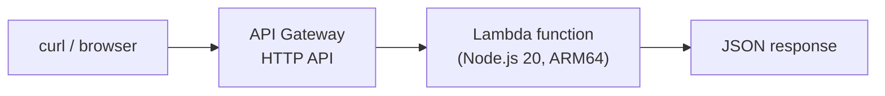
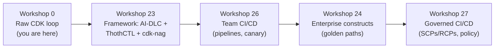

# Workshop 0: Foundations — Your First Serverless Deploy

> **Persona:** 👩‍💻 Developer (new to AWS IaC) · 🧑‍🔧 SME evaluating the golden path
> **Maturity level:** Pre-L1 → L1
> **Time:** 45–60 minutes
> **Prerequisite for:** [Workshop: Serverless End-to-End](23-workshop-serverless.md)

## Why This Workshop Exists

The rest of the workshop series layers a lot at once — AI-DLC, ThothCTL, cdk-nag, multi-account pipelines, policy-as-code. That is the right destination, but it is not the right *starting point* for someone who has never deployed infrastructure as code.

This lab gives you one fast, safe win first: **write a tiny amount of code, deploy real AWS resources, call them, and tear them down** — using nothing but the AWS CDK. No framework tooling, no methodology, no governance layer. Once you have felt the full loop (write → deploy → verify → destroy), Workshop 23 will make far more sense because you will recognize what the framework is automating *for* you.

### What You'll Build

A minimal serverless HTTP endpoint:



That is the entire architecture. One function, one route. Everything else in the series builds on this shape.

### What You'll Learn

| Concept | You'll experience it by... |
|---------|----------------------------|
| IaC is just code | Writing a CDK stack in TypeScript |
| Bootstrap | Running `cdk bootstrap` once per account/region |
| The deploy loop | `cdk synth` → `cdk deploy` → test → `cdk destroy` |
| Express mode | Redeploying with `--express` and feeling the speed difference |
| Cost safety | Setting a budget alarm and destroying resources when done |

---

## 1. Prerequisites

This workshop deliberately uses **only** the AWS CDK and AWS CLI — not ThothCTL — so you can see the raw mechanics.

### 1.1 Accounts and access

- An **AWS account you can safely experiment in** (a personal/sandbox account, not shared production).
- **IAM permissions:** to complete this lab you need permission to create the resources CDK uses. For a sandbox account the simplest path is a role/user with broad access; in a managed account, ask your platform team for a role that can deploy CloudFormation, Lambda, API Gateway, IAM roles, S3 (for the CDK bootstrap bucket), and ECR. If you hit `AccessDenied`, this is almost always the cause — see [Troubleshooting](#7-troubleshooting).
- A **region** to work in. This lab uses `us-east-1`; substitute your own consistently.

### 1.2 Tools

| Tool | Verify | Minimum |
|------|--------|---------|
| Node.js | `node --version` | 20.x |
| npm | `npm --version` | 10.x |
| AWS CLI | `aws --version` | 2.x |
| AWS CDK | `npm install -g aws-cdk && cdk --version` | 2.170+ |

> **Note on Express mode:** `cdk deploy --express` requires a CDK CLI version that supports CloudFormation Express mode (a June 2026 capability). If your CDK is older, the `--express` flag will be rejected — upgrade with `npm install -g aws-cdk@latest`, or simply omit the flag (standard mode works everywhere).

### 1.3 Configure credentials

```bash
# Option A: SSO (recommended in organizations)
aws sso login --profile my-sandbox
export AWS_PROFILE=my-sandbox

# Option B: static credentials (sandbox only)
aws configure

# Verify you are who you think you are, in the region you expect
aws sts get-caller-identity
aws configure get region
```

**✅ Checkpoint:** `aws sts get-caller-identity` returns your account ID without error.

---

## 2. Set a Cost Guardrail First (Do This Before Deploying)

You are about to create real resources. The workload in this lab costs effectively **$0** under normal free-tier/low-usage conditions (Lambda and HTTP API are pay-per-request and scale to zero), but building the habit of setting a guardrail *before* you deploy is the single most important discipline for self-service autonomy.

Create a small monthly budget with an email alert:

```bash
# Replace the account ID and email
ACCOUNT_ID=$(aws sts get-caller-identity --query Account --output text)

cat > /tmp/budget.json <<EOF
{
  "BudgetName": "workshop0-guardrail",
  "BudgetLimit": { "Amount": "5", "Unit": "USD" },
  "TimeUnit": "MONTHLY",
  "BudgetType": "COST"
}
EOF

cat > /tmp/notifications.json <<EOF
[
  {
    "Notification": {
      "NotificationType": "ACTUAL",
      "ComparisonOperator": "GREATER_THAN",
      "Threshold": 80,
      "ThresholdType": "PERCENTAGE"
    },
    "Subscribers": [
      { "SubscriptionType": "EMAIL", "Address": "you@example.com" }
    ]
  }
]
EOF

aws budgets create-budget \
  --account-id "$ACCOUNT_ID" \
  --budget file:///tmp/budget.json \
  --notifications-with-subscribers file:///tmp/notifications.json
```

**✅ Checkpoint:** `aws budgets describe-budgets --account-id "$ACCOUNT_ID"` lists `workshop0-guardrail`.

> This is a lab-scale guardrail. The framework's [FinOps & Cost Governance](18-finops-cost-governance.md) chapter covers organization-wide budgets, anomaly detection, and the FinOps Agent.

---

## 3. Create the Project

```bash
mkdir hello-serverless && cd hello-serverless

# Scaffold a minimal CDK app in TypeScript
cdk init app --language typescript

# Install the CDK library modules we need
npm install aws-cdk-lib constructs
```

`cdk init` creates this structure:

```
hello-serverless/
├── bin/hello-serverless.ts     # App entry point
├── lib/hello-serverless-stack.ts  # Where our infrastructure goes
├── cdk.json                    # CDK configuration
├── package.json
└── tsconfig.json
```

**Key insight:** `lib/hello-serverless-stack.ts` is your infrastructure — as ordinary, reviewable, version-controlled code. There is no separate "config language"; it is TypeScript.

---

## 4. Write the Infrastructure

### 4.1 The Lambda handler

Create the function source:

```bash
mkdir -p lambda
```

```typescript
// lambda/hello.ts
export const handler = async (event: any) => {
  return {
    statusCode: 200,
    headers: { 'content-type': 'application/json' },
    body: JSON.stringify({
      message: 'Hello from your first serverless deploy!',
      path: event.rawPath,
      time: new Date().toISOString(),
    }),
  };
};
```

### 4.2 The stack

Replace the contents of `lib/hello-serverless-stack.ts`:

```typescript
import * as cdk from 'aws-cdk-lib';
import { Construct } from 'constructs';
import * as lambda from 'aws-cdk-lib/aws-lambda';
import * as nodejs from 'aws-cdk-lib/aws-lambda-nodejs';
import * as apigwv2 from 'aws-cdk-lib/aws-apigatewayv2';
import * as integrations from 'aws-cdk-lib/aws-apigatewayv2-integrations';

export class HelloServerlessStack extends cdk.Stack {
  constructor(scope: Construct, id: string, props?: cdk.StackProps) {
    super(scope, id, props);

    // 1. The Lambda function (ARM64 = ~20% cheaper, and the framework default)
    const helloFn = new nodejs.NodejsFunction(this, 'HelloFunction', {
      entry: 'lambda/hello.ts',
      handler: 'handler',
      runtime: lambda.Runtime.NODEJS_20_X,
      architecture: lambda.Architecture.ARM_64,
      timeout: cdk.Duration.seconds(10),
      memorySize: 128,
    });

    // 2. An HTTP API in front of it
    const httpApi = new apigwv2.HttpApi(this, 'HelloApi', {
      apiName: 'hello-serverless',
    });

    httpApi.addRoutes({
      path: '/hello',
      methods: [apigwv2.HttpMethod.GET],
      integration: new integrations.HttpLambdaIntegration('HelloIntegration', helloFn),
    });

    // 3. Print the URL after deploy so we can test it
    new cdk.CfnOutput(this, 'ApiUrl', {
      value: `${httpApi.apiEndpoint}/hello`,
      description: 'Invoke this URL to test the function',
    });
  }
}
```

> `NodejsFunction` bundles your TypeScript with esbuild automatically. If esbuild is not present, CDK uses Docker to bundle — so either have `esbuild` installed (`npm install --save-dev esbuild`) or Docker running. Installing esbuild is the faster path for this lab.

```bash
npm install --save-dev esbuild
```

**✅ Checkpoint:** `npm run build` (or `npx tsc --noEmit`) compiles with no errors.

---

## 5. Deploy, Verify, Iterate

### 5.1 Bootstrap (once per account + region)

CDK needs a small set of supporting resources (an S3 bucket, roles, an ECR repo) in each account/region before its first deploy. This is a **one-time** step.

```bash
cdk bootstrap
# Equivalent to: cdk bootstrap aws://<ACCOUNT_ID>/us-east-1
```

> **Lab note:** by default `cdk bootstrap` grants the deployment role `AdministratorAccess`. That is fine in a sandbox but is *not* what you do in a governed organization — the enterprise workshops ([24](24-workshop-enterprise-cdk.md), [27](27-workshop-cicd-phase2.md)) show scoped execution policies and permission boundaries. For now, bootstrap in a sandbox account only.

### 5.2 Preview what will be created

```bash
# Synthesize the CloudFormation template CDK generates from your code
cdk synth

# See the resource-level diff before you commit to it
cdk diff
```

Reading `cdk diff` before every deploy is the habit that makes autonomy safe. You always know what is about to change.

### 5.3 Deploy (standard mode)

```bash
cdk deploy
# Review the IAM changes it prints, then confirm with 'y'
```

When it finishes, CDK prints the `ApiUrl` output. Test it:

```bash
# Copy the URL from the ApiUrl output, then:
curl https://<your-api-id>.execute-api.us-east-1.amazonaws.com/hello
```

**✅ Checkpoint:** You get a JSON response with `"message": "Hello from your first serverless deploy!"`.

### 5.4 Iterate with Express mode

Now change the message in `lambda/hello.ts` (e.g., add `"v2"`), and redeploy using Express mode:

```bash
cdk deploy --express
```

**Express mode** reports success as soon as CloudFormation applies the configuration, without waiting for full stabilization — it is meant for exactly this kind of fast dev iteration. You should notice it returns faster than the standard deploy.

> **Important — verified against AWS docs:**
> - Express mode **disables automatic rollback by default**. If a deploy fails, the stack is left in a failed state for immediate fix-and-retry. To keep automatic rollback, add `--rollback`:
>   ```bash
>   cdk deploy --express --rollback
>   ```
> - AWS **does not recommend Express mode for production** — it is targeted at iterative development. In the CI/CD workshops you will see Express used for the **dev** stage only, with standard mode for staging/production.

Re-test:

```bash
curl https://<your-api-id>.execute-api.us-east-1.amazonaws.com/hello
```

**✅ Checkpoint:** The response now shows your updated message.

---

## 6. Tear Down (Do Not Skip This)

Leaving stacks running is how workshop attendees get surprise bills. Destroy everything you created:

```bash
# Remove the application stack (and the resources it created)
cdk destroy
# Confirm with 'y'

# Faster teardown with Express mode (optional)
cdk destroy --express
```

Verify nothing is left behind:

```bash
# The stack should no longer be listed
aws cloudformation list-stacks \
  --stack-status-filter CREATE_COMPLETE UPDATE_COMPLETE \
  --query "StackSummaries[?contains(StackName, 'HelloServerless')].StackName"
```

Optional cleanup of the lab budget and the CDK bootstrap stack:

```bash
# Remove the budget guardrail
aws budgets delete-budget --account-id "$ACCOUNT_ID" --budget-name workshop0-guardrail

# The CDKToolkit (bootstrap) stack is reusable across projects — usually LEAVE IT.
# Only delete it if you are completely done with CDK in this account:
# aws cloudformation delete-stack --stack-name CDKToolkit
```

**✅ Checkpoint:** The application stack is gone from the CloudFormation list. Your account is back to a clean state.

---

## 7. Troubleshooting

| Symptom | Likely cause | Fix |
|---------|--------------|-----|
| `Unknown option '--express'` | CDK CLI too old | `npm install -g aws-cdk@latest`, or drop the flag |
| `AccessDenied` during deploy | IAM role lacks permissions | Use a broader sandbox role, or ask your platform team for deploy permissions |
| `This stack uses assets, so the toolkit stack must be deployed` | Not bootstrapped | Run `cdk bootstrap` |
| `Cannot find esbuild` / Docker error during synth | Bundler missing | `npm install --save-dev esbuild`, or start Docker |
| `Need to perform AWS calls but no credentials configured` | Not logged in | `aws sso login` / `aws configure`, set `AWS_PROFILE` |
| Deploy hangs after a failed Express deploy | Express disabled rollback | Inspect stack events, fix the error, redeploy; use `--rollback` next time |

---

## What You Just Proved

You deployed real, working serverless infrastructure from code, iterated on it fast, and cleaned it up safely — with full visibility (`cdk diff`) and a cost guardrail in place. That is the core of IaC autonomy.

Everything the rest of the series adds is about doing this **safely and repeatably at scale**:



| What you did manually here | What the framework automates later |
|----------------------------|------------------------------------|
| Read `cdk diff` yourself | cdk-nag + policy-as-code check it automatically |
| Set one budget by hand | FinOps Agent + org budgets |
| Remembered to `cdk destroy` | Ephemeral environments with TTL auto-cleanup |
| Deployed from your laptop | Self-mutating CDK Pipelines |
| Used a broad sandbox role | Scoped execution policies + permission boundaries |

---

## Next Step

➡️ **[Workshop: Serverless End-to-End](23-workshop-serverless.md)** — rebuild this same idea as a production-shaped Order Processing API using the framework's golden path (scaffold, AI-DLC, ThothCTL, observability, compliance).

---

## References

| Resource | Link |
|----------|------|
| AWS CDK — Getting Started | https://docs.aws.amazon.com/cdk/v2/guide/getting_started.html |
| CloudFormation Express Mode | https://docs.aws.amazon.com/AWSCloudFormation/latest/UserGuide/cloudformation-express-mode.html |
| `cdk deploy` reference (incl. `--express`) | https://docs.aws.amazon.com/cdk/v2/guide/ref-cli-cmd-deploy.html |
| API Gateway HTTP APIs | https://docs.aws.amazon.com/apigateway/latest/developerguide/http-api.html |
| AWS Budgets | https://docs.aws.amazon.com/cost-management/latest/userguide/budgets-managing-costs.html |
