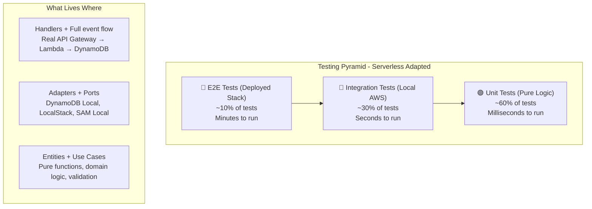
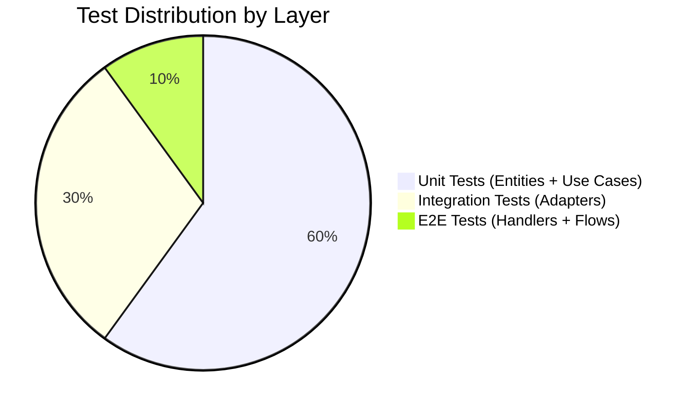
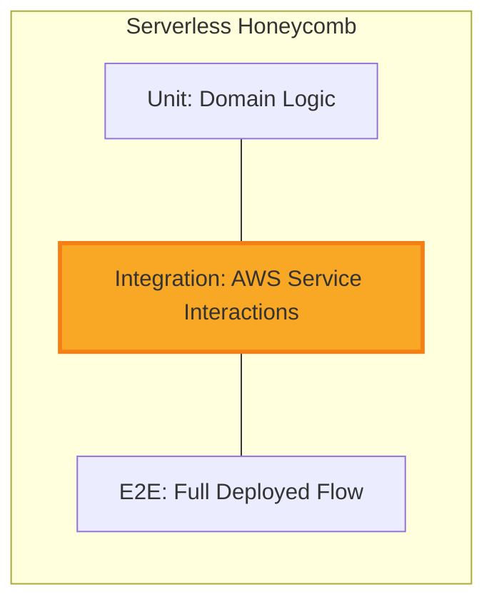
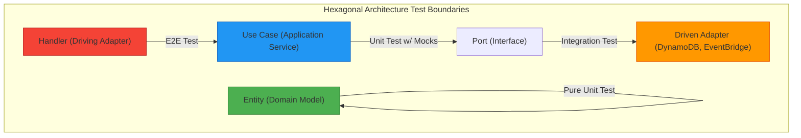
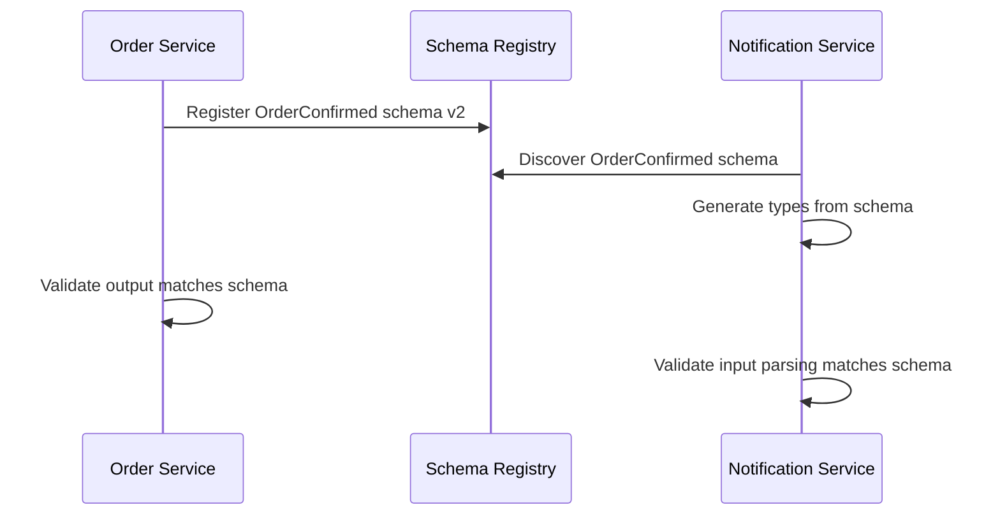
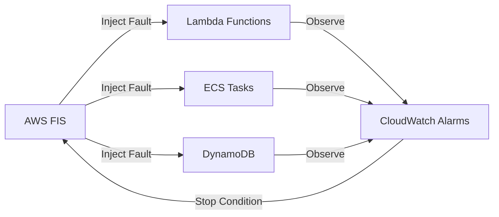
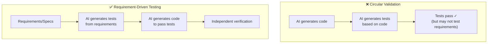

# 20 — Testing Strategy for Modern Cloud-Native Serverless Framework

> **Status**: Living Document  
> **Last Updated**: 2026-07-29  
> **Applies To**: Lambda Functions, ECS Services, EventBridge, API Gateway, DynamoDB  

---

## Table of Contents

1. [Philosophy](#philosophy)
2. [Testing Pyramid for Serverless](#testing-pyramid-for-serverless)
3. [Testing by Hexagonal Architecture Layer](#testing-by-hexagonal-architecture-layer)
4. [Tools & Infrastructure](#tools-infrastructure)
5. [Contract Testing](#contract-testing)
6. [Chaos Testing](#chaos-testing)
7. [Load Testing](#load-testing)
8. [Testing in CI/CD Pipeline](#testing-in-cicd-pipeline)
9. [Testing ECS Services](#testing-ecs-services)
10. [Preventing Circular Validation with AI-Generated Tests](#preventing-circular-validation-with-ai-generated-tests)
11. [Complete Testing Checklist](#complete-testing-checklist)

---

## Philosophy

Traditional testing strategies fail for serverless architectures because:

- **No long-running server** — you cannot simply "start the app" and hit it with requests.
- **Cloud glue is the application** — IAM, EventBridge rules, DynamoDB streams ARE the logic.
- **Cold starts affect behavior** — timing-dependent bugs only manifest under real conditions.
- **Distributed by default** — a single "unit" may span Lambda → EventBridge → Lambda → DynamoDB.

Our strategy embraces the **hexagonal architecture** (ports & adapters) to create clear seams for testing at every layer, from millisecond unit tests to full chaos experiments.

### Guiding Principles

1. **Fast feedback first** — 80% of tests run in < 5 seconds total.
2. **Test behavior, not implementation** — assert on outcomes, not internal calls.
3. **Real AWS services where cheap** — DynamoDB Local is free; use it.
4. **Contract-first** — EventBridge schemas are the source of truth.
5. **Shift left** — catch issues before deployment, not after.

---

## Testing Pyramid for Serverless

The classic testing pyramid is inverted for serverless. Integration tests provide more value than traditional unit tests because the "glue" between services IS the application logic.





### Key Insight: The "Honeycomb" Model

For serverless, many teams adopt a **honeycomb** shape where integration tests form the bulk:



We use a **hybrid approach**: heavy unit tests for domain logic (entities/use cases) combined with targeted integration tests for every adapter boundary.

---

## Testing by Hexagonal Architecture Layer




### Layer 1: Entities — Pure Unit Tests

**Characteristics**: Zero dependencies, zero I/O, milliseconds execution.

Entities encapsulate domain rules. They are pure TypeScript classes/functions with no awareness of AWS, databases, or HTTP.

**What to test**:
- Validation rules (email format, price constraints)
- State transitions (order status machine)
- Business calculations (pricing, discounts)
- Invariant enforcement (cannot ship cancelled order)

```typescript
// src/domain/entities/Order.ts
export class Order {
  constructor(
    public readonly id: string,
    public readonly items: OrderItem[],
    public readonly status: OrderStatus = 'PENDING',
  ) {
    if (items.length === 0) {
      throw new DomainError('Order must have at least one item');
    }
  }

  get total(): number {
    return this.items.reduce((sum, item) => sum + item.price * item.quantity, 0);
  }

  confirm(): Order {
    if (this.status !== 'PENDING') {
      throw new DomainError(`Cannot confirm order in status: ${this.status}`);
    }
    return new Order(this.id, this.items, 'CONFIRMED');
  }

  cancel(): Order {
    if (this.status === 'SHIPPED') {
      throw new DomainError('Cannot cancel shipped order');
    }
    return new Order(this.id, this.items, 'CANCELLED');
  }
}
```

```typescript
// tests/unit/entities/Order.test.ts
import { Order } from '@/domain/entities/Order';
import { DomainError } from '@/domain/errors';

describe('Order Entity', () => {
  const validItems = [{ productId: 'p1', price: 29.99, quantity: 2 }];

  describe('creation', () => {
    it('creates order with valid items', () => {
      const order = new Order('ord-1', validItems);
      expect(order.status).toBe('PENDING');
      expect(order.total).toBe(59.98);
    });

    it('rejects empty items', () => {
      expect(() => new Order('ord-1', [])).toThrow(DomainError);
    });
  });

  describe('state transitions', () => {
    it('confirms pending order', () => {
      const order = new Order('ord-1', validItems);
      const confirmed = order.confirm();
      expect(confirmed.status).toBe('CONFIRMED');
    });

    it('cannot confirm already confirmed order', () => {
      const order = new Order('ord-1', validItems, 'CONFIRMED');
      expect(() => order.confirm()).toThrow('Cannot confirm order in status: CONFIRMED');
    });

    it('cannot cancel shipped order', () => {
      const order = new Order('ord-1', validItems, 'SHIPPED');
      expect(() => order.cancel()).toThrow('Cannot cancel shipped order');
    });

    it('can cancel pending order', () => {
      const order = new Order('ord-1', validItems);
      const cancelled = order.cancel();
      expect(cancelled.status).toBe('CANCELLED');
    });
  });

  describe('calculations', () => {
    it('computes total for multiple items', () => {
      const items = [
        { productId: 'p1', price: 10.0, quantity: 3 },
        { productId: 'p2', price: 5.5, quantity: 2 },
      ];
      const order = new Order('ord-2', items);
      expect(order.total).toBe(41.0);
    });
  });
});
```

**Run time target**: < 50ms for entire entity test suite.

---

### Layer 2: Use Cases — Unit Tests with Mocked Ports

**Characteristics**: Tests application orchestration logic with port interfaces mocked.

Use cases coordinate entities and call port interfaces (repositories, event publishers). We mock the ports to test orchestration in isolation.

**What to test**:
- Correct orchestration sequence
- Error handling and rollback logic
- Event emission after successful operations
- Authorization checks

```typescript
// src/domain/ports/OrderRepository.ts
export interface OrderRepository {
  save(order: Order): Promise<void>;
  findById(id: string): Promise<Order | null>;
  findByCustomer(customerId: string): Promise<Order[]>;
}

// src/domain/ports/EventPublisher.ts
export interface EventPublisher {
  publish(event: DomainEvent): Promise<void>;
}
```

```typescript
// src/application/use-cases/ConfirmOrderUseCase.ts
export class ConfirmOrderUseCase {
  constructor(
    private readonly orderRepo: OrderRepository,
    private readonly eventPublisher: EventPublisher,
    private readonly paymentService: PaymentPort,
  ) {}

  async execute(orderId: string): Promise<Order> {
    const order = await this.orderRepo.findById(orderId);
    if (!order) {
      throw new NotFoundError(`Order ${orderId} not found`);
    }

    // Charge payment
    await this.paymentService.charge(order.id, order.total);

    // Domain logic
    const confirmed = order.confirm();

    // Persist
    await this.orderRepo.save(confirmed);

    // Publish event
    await this.eventPublisher.publish({
      type: 'OrderConfirmed',
      payload: { orderId: confirmed.id, total: confirmed.total },
      timestamp: new Date().toISOString(),
    });

    return confirmed;
  }
}
```

```typescript
// tests/unit/use-cases/ConfirmOrderUseCase.test.ts
import { ConfirmOrderUseCase } from '@/application/use-cases/ConfirmOrderUseCase';
import { Order } from '@/domain/entities/Order';
import { NotFoundError } from '@/domain/errors';

describe('ConfirmOrderUseCase', () => {
  let useCase: ConfirmOrderUseCase;
  let mockOrderRepo: jest.Mocked<OrderRepository>;
  let mockEventPublisher: jest.Mocked<EventPublisher>;
  let mockPaymentService: jest.Mocked<PaymentPort>;

  beforeEach(() => {
    mockOrderRepo = {
      save: jest.fn().mockResolvedValue(undefined),
      findById: jest.fn(),
      findByCustomer: jest.fn(),
    };
    mockEventPublisher = {
      publish: jest.fn().mockResolvedValue(undefined),
    };
    mockPaymentService = {
      charge: jest.fn().mockResolvedValue({ transactionId: 'tx-123' }),
    };

    useCase = new ConfirmOrderUseCase(
      mockOrderRepo,
      mockEventPublisher,
      mockPaymentService,
    );
  });

  it('confirms order and publishes event', async () => {
    const order = new Order('ord-1', [{ productId: 'p1', price: 50, quantity: 1 }]);
    mockOrderRepo.findById.mockResolvedValue(order);

    const result = await useCase.execute('ord-1');

    expect(result.status).toBe('CONFIRMED');
    expect(mockPaymentService.charge).toHaveBeenCalledWith('ord-1', 50);
    expect(mockOrderRepo.save).toHaveBeenCalledWith(
      expect.objectContaining({ status: 'CONFIRMED' }),
    );
    expect(mockEventPublisher.publish).toHaveBeenCalledWith(
      expect.objectContaining({ type: 'OrderConfirmed' }),
    );
  });

  it('throws NotFoundError for missing order', async () => {
    mockOrderRepo.findById.mockResolvedValue(null);
    await expect(useCase.execute('ord-999')).rejects.toThrow(NotFoundError);
  });

  it('does not publish event if payment fails', async () => {
    const order = new Order('ord-1', [{ productId: 'p1', price: 50, quantity: 1 }]);
    mockOrderRepo.findById.mockResolvedValue(order);
    mockPaymentService.charge.mockRejectedValue(new Error('Insufficient funds'));

    await expect(useCase.execute('ord-1')).rejects.toThrow('Insufficient funds');
    expect(mockEventPublisher.publish).not.toHaveBeenCalled();
    expect(mockOrderRepo.save).not.toHaveBeenCalled();
  });
});
```

**Run time target**: < 200ms for entire use case test suite.

---

### Layer 3: Adapters — Integration Tests with Real DynamoDB Local

**Characteristics**: Tests actual AWS SDK calls against local emulators. Seconds to run.

Adapters implement port interfaces using real AWS SDKs. We test them against DynamoDB Local, LocalStack, or Testcontainers to verify real serialization, query patterns, and error handling.

**What to test**:
- Correct DynamoDB table operations (put, get, query, update)
- GSI query patterns
- Pagination handling
- Conditional writes and optimistic locking
- EventBridge event serialization

```typescript
// src/infrastructure/adapters/DynamoDBOrderRepository.ts
import { DynamoDBDocumentClient, PutCommand, GetCommand, QueryCommand } from '@aws-sdk/lib-dynamodb';

export class DynamoDBOrderRepository implements OrderRepository {
  constructor(
    private readonly client: DynamoDBDocumentClient,
    private readonly tableName: string,
  ) {}

  async save(order: Order): Promise<void> {
    await this.client.send(new PutCommand({
      TableName: this.tableName,
      Item: {
        PK: `ORDER#${order.id}`,
        SK: `ORDER#${order.id}`,
        GSI1PK: `CUSTOMER#${order.customerId}`,
        GSI1SK: `ORDER#${order.createdAt}`,
        ...this.serialize(order),
      },
      ConditionExpression: 'attribute_not_exists(PK) OR #version = :expectedVersion',
      ExpressionAttributeNames: { '#version': 'version' },
      ExpressionAttributeValues: { ':expectedVersion': order.version },
    }));
  }

  async findById(id: string): Promise<Order | null> {
    const result = await this.client.send(new GetCommand({
      TableName: this.tableName,
      Key: { PK: `ORDER#${id}`, SK: `ORDER#${id}` },
    }));
    return result.Item ? this.deserialize(result.Item) : null;
  }

  async findByCustomer(customerId: string): Promise<Order[]> {
    const result = await this.client.send(new QueryCommand({
      TableName: this.tableName,
      IndexName: 'GSI1',
      KeyConditionExpression: 'GSI1PK = :pk',
      ExpressionAttributeValues: { ':pk': `CUSTOMER#${customerId}` },
    }));
    return (result.Items ?? []).map(item => this.deserialize(item));
  }

  private serialize(order: Order): Record<string, unknown> {
    return {
      id: order.id,
      items: order.items,
      status: order.status,
      total: order.total,
      version: order.version + 1,
      customerId: order.customerId,
      createdAt: order.createdAt,
    };
  }

  private deserialize(item: Record<string, unknown>): Order {
    return new Order(
      item.id as string,
      item.items as OrderItem[],
      item.status as OrderStatus,
      item.customerId as string,
      item.version as number,
    );
  }
}
```

```typescript
// tests/integration/adapters/DynamoDBOrderRepository.test.ts
import { DynamoDBClient } from '@aws-sdk/client-dynamodb';
import { DynamoDBDocumentClient } from '@aws-sdk/lib-dynamodb';
import { CreateTableCommand } from '@aws-sdk/client-dynamodb';
import { DynamoDBOrderRepository } from '@/infrastructure/adapters/DynamoDBOrderRepository';
import { Order } from '@/domain/entities/Order';

describe('DynamoDBOrderRepository (Integration)', () => {
  let repository: DynamoDBOrderRepository;
  let client: DynamoDBDocumentClient;
  const TABLE_NAME = 'orders-test';

  beforeAll(async () => {
    // Connect to DynamoDB Local (started via docker-compose or Testcontainers)
    const ddbClient = new DynamoDBClient({
      endpoint: 'http://localhost:8000',
      region: 'us-east-1',
      credentials: { accessKeyId: 'test', secretAccessKey: 'test' },
    });

    client = DynamoDBDocumentClient.from(ddbClient);

    // Create table
    await ddbClient.send(new CreateTableCommand({
      TableName: TABLE_NAME,
      KeySchema: [
        { AttributeName: 'PK', KeyType: 'HASH' },
        { AttributeName: 'SK', KeyType: 'RANGE' },
      ],
      AttributeDefinitions: [
        { AttributeName: 'PK', AttributeType: 'S' },
        { AttributeName: 'SK', AttributeType: 'S' },
        { AttributeName: 'GSI1PK', AttributeType: 'S' },
        { AttributeName: 'GSI1SK', AttributeType: 'S' },
      ],
      GlobalSecondaryIndexes: [{
        IndexName: 'GSI1',
        KeySchema: [
          { AttributeName: 'GSI1PK', KeyType: 'HASH' },
          { AttributeName: 'GSI1SK', KeyType: 'RANGE' },
        ],
        Projection: { ProjectionType: 'ALL' },
        ProvisionedThroughput: { ReadCapacityUnits: 5, WriteCapacityUnits: 5 },
      }],
      ProvisionedThroughput: { ReadCapacityUnits: 5, WriteCapacityUnits: 5 },
    }));

    repository = new DynamoDBOrderRepository(client, TABLE_NAME);
  });

  afterAll(async () => {
    // Cleanup handled by Testcontainers stopping the container
  });

  it('saves and retrieves an order by ID', async () => {
    const order = new Order('ord-int-1', [
      { productId: 'p1', price: 25.0, quantity: 2 },
    ], 'PENDING', 'cust-1', 0);

    await repository.save(order);
    const retrieved = await repository.findById('ord-int-1');

    expect(retrieved).not.toBeNull();
    expect(retrieved!.id).toBe('ord-int-1');
    expect(retrieved!.status).toBe('PENDING');
    expect(retrieved!.total).toBe(50.0);
  });

  it('returns null for non-existent order', async () => {
    const result = await repository.findById('ord-nonexistent');
    expect(result).toBeNull();
  });

  it('queries orders by customer ID', async () => {
    const order1 = new Order('ord-c1', [{ productId: 'p1', price: 10, quantity: 1 }],
      'PENDING', 'cust-query', 0);
    const order2 = new Order('ord-c2', [{ productId: 'p2', price: 20, quantity: 1 }],
      'CONFIRMED', 'cust-query', 0);

    await repository.save(order1);
    await repository.save(order2);

    const results = await repository.findByCustomer('cust-query');
    expect(results).toHaveLength(2);
    expect(results.map(o => o.id)).toContain('ord-c1');
    expect(results.map(o => o.id)).toContain('ord-c2');
  });

  it('enforces optimistic locking on concurrent writes', async () => {
    const order = new Order('ord-lock', [{ productId: 'p1', price: 10, quantity: 1 }],
      'PENDING', 'cust-lock', 0);
    await repository.save(order);

    // Simulate concurrent modification
    const staleOrder = new Order('ord-lock', [{ productId: 'p1', price: 10, quantity: 1 }],
      'PENDING', 'cust-lock', 0); // same version

    // First update succeeds (version 0 → 1)
    const updatedOrder = new Order('ord-lock', [{ productId: 'p1', price: 10, quantity: 1 }],
      'CONFIRMED', 'cust-lock', 1);
    await repository.save(updatedOrder);

    // Stale update should fail (expected version 0, but actual is 1)
    await expect(repository.save(staleOrder)).rejects.toThrow();
  });
});
```

**Run time target**: < 10 seconds (including DynamoDB Local startup).

---

### Layer 4: Handlers — E2E Tests with Deployed Stack

**Characteristics**: Tests the full Lambda handler with real API Gateway events against a deployed test stack.

Handler tests verify:
- API Gateway event parsing
- Authentication/authorization middleware
- Cold start behavior
- Real IAM permissions
- Actual DynamoDB table access
- EventBridge event delivery

```typescript
// tests/e2e/handlers/createOrder.e2e.test.ts
import { APIGatewayProxyEvent, Context } from 'aws-lambda';

// For SAM Local testing
describe('CreateOrder Handler (SAM Local)', () => {
  const { execSync } = require('child_process');

  it('creates order via SAM local invoke', () => {
    const event = {
      httpMethod: 'POST',
      path: '/orders',
      headers: { 'Content-Type': 'application/json' },
      body: JSON.stringify({
        customerId: 'cust-e2e-1',
        items: [{ productId: 'p1', price: 29.99, quantity: 1 }],
      }),
    };

    // Write event to temp file
    const fs = require('fs');
    fs.writeFileSync('/tmp/event.json', JSON.stringify(event));

    const result = execSync(
      'sam local invoke CreateOrderFunction --event /tmp/event.json --env-vars env.json',
      { encoding: 'utf-8', timeout: 30000 },
    );

    const response = JSON.parse(result);
    expect(response.statusCode).toBe(201);

    const body = JSON.parse(response.body);
    expect(body.order.id).toBeDefined();
    expect(body.order.status).toBe('PENDING');
  });
});

// For deployed stack testing
describe('CreateOrder Handler (Deployed)', () => {
  const API_URL = process.env.API_URL; // Set by CI/CD after deployment

  it('creates order via real API Gateway', async () => {
    const response = await fetch(`${API_URL}/orders`, {
      method: 'POST',
      headers: {
        'Content-Type': 'application/json',
        'Authorization': `Bearer ${await getTestToken()}`,
      },
      body: JSON.stringify({
        customerId: 'cust-e2e-deployed',
        items: [{ productId: 'prod-1', price: 49.99, quantity: 2 }],
      }),
    });

    expect(response.status).toBe(201);
    const body = await response.json();
    expect(body.order.id).toMatch(/^ord-/);
    expect(body.order.total).toBe(99.98);

    // Verify order persisted in DynamoDB
    const getResponse = await fetch(`${API_URL}/orders/${body.order.id}`, {
      headers: { 'Authorization': `Bearer ${await getTestToken()}` },
    });
    expect(getResponse.status).toBe(200);
  });

  it('returns 401 without auth token', async () => {
    const response = await fetch(`${API_URL}/orders`, {
      method: 'POST',
      headers: { 'Content-Type': 'application/json' },
      body: JSON.stringify({ customerId: 'c1', items: [] }),
    });
    expect(response.status).toBe(401);
  });

  it('returns 400 for invalid payload', async () => {
    const response = await fetch(`${API_URL}/orders`, {
      method: 'POST',
      headers: {
        'Content-Type': 'application/json',
        'Authorization': `Bearer ${await getTestToken()}`,
      },
      body: JSON.stringify({ customerId: 'c1', items: [] }),
    });
    expect(response.status).toBe(400);
  });
});

async function getTestToken(): Promise<string> {
  // Use Cognito test user credentials
  const { CognitoIdentityProviderClient, InitiateAuthCommand } = await import(
    '@aws-sdk/client-cognito-identity-provider'
  );
  const client = new CognitoIdentityProviderClient({ region: 'us-east-1' });
  const result = await client.send(new InitiateAuthCommand({
    AuthFlow: 'USER_PASSWORD_AUTH',
    ClientId: process.env.COGNITO_CLIENT_ID!,
    AuthParameters: {
      USERNAME: process.env.TEST_USER_EMAIL!,
      PASSWORD: process.env.TEST_USER_PASSWORD!,
    },
  }));
  return result.AuthenticationResult!.IdToken!;
}
```

**Run time target**: < 60 seconds for critical path E2E tests.

---

## Tools & Infrastructure

### Jest Configuration

```typescript
// jest.config.ts
import type { Config } from 'jest';

const config: Config = {
  preset: 'ts-jest',
  testEnvironment: 'node',
  roots: ['<rootDir>/tests'],
  moduleNameMapper: {
    '^@/(.*)$': '<rootDir>/src/$1',
  },
  projects: [
    {
      displayName: 'unit',
      testMatch: ['<rootDir>/tests/unit/**/*.test.ts'],
      setupFiles: [],
      testTimeout: 5000,
    },
    {
      displayName: 'integration',
      testMatch: ['<rootDir>/tests/integration/**/*.test.ts'],
      setupFiles: ['<rootDir>/tests/integration/setup.ts'],
      testTimeout: 30000,
      globalSetup: '<rootDir>/tests/integration/globalSetup.ts',
      globalTeardown: '<rootDir>/tests/integration/globalTeardown.ts',
    },
    {
      displayName: 'e2e',
      testMatch: ['<rootDir>/tests/e2e/**/*.test.ts'],
      testTimeout: 120000,
    },
  ],
  collectCoverageFrom: [
    'src/**/*.ts',
    '!src/**/*.d.ts',
    '!src/**/index.ts',
  ],
  coverageThresholds: {
    global: {
      branches: 80,
      functions: 85,
      lines: 85,
      statements: 85,
    },
  },
};

export default config;
```

### DynamoDB Local with Testcontainers

```typescript
// tests/integration/globalSetup.ts
import { GenericContainer, StartedTestContainer } from 'testcontainers';

let container: StartedTestContainer;

export default async function globalSetup() {
  container = await new GenericContainer('amazon/dynamodb-local')
    .withExposedPorts(8000)
    .withCommand(['-jar', 'DynamoDBLocal.jar', '-inMemory', '-sharedDb'])
    .start();

  const port = container.getMappedPort(8000);
  const host = container.getHost();

  process.env.DYNAMODB_ENDPOINT = `http://${host}:${port}`;
  process.env.AWS_ACCESS_KEY_ID = 'test';
  process.env.AWS_SECRET_ACCESS_KEY = 'test';
  process.env.AWS_REGION = 'us-east-1';

  // Store container reference for teardown
  (globalThis as any).__DYNAMODB_CONTAINER__ = container;
}
```

```typescript
// tests/integration/globalTeardown.ts
export default async function globalTeardown() {
  const container = (globalThis as any).__DYNAMODB_CONTAINER__;
  if (container) {
    await container.stop();
  }
}
```

### SAM Local Invoke

```yaml
# template.yaml (excerpt for testing)
Globals:
  Function:
    Runtime: nodejs20.x
    Timeout: 30
    Environment:
      Variables:
        TABLE_NAME: !Ref OrdersTable
        EVENT_BUS_NAME: !Ref ApplicationEventBus

Resources:
  CreateOrderFunction:
    Type: AWS::Serverless::Function
    Properties:
      Handler: dist/handlers/createOrder.handler
      Events:
        Api:
          Type: Api
          Properties:
            Path: /orders
            Method: POST
```

```bash
# Run SAM local for integration testing
sam local start-api --docker-network host --env-vars env.json

# Invoke a single function with event
sam local invoke CreateOrderFunction \
  --event tests/events/createOrder.json \
  --env-vars tests/env.json \
  --docker-network lambda-local
```

### Docker Compose for Local Testing Stack

```yaml
# docker-compose.test.yml
version: '3.8'
services:
  dynamodb-local:
    image: amazon/dynamodb-local:latest
    ports:
      - "8000:8000"
    command: ["-jar", "DynamoDBLocal.jar", "-inMemory", "-sharedDb"]

  localstack:
    image: localstack/localstack:3.0
    ports:
      - "4566:4566"
    environment:
      - SERVICES=events,sqs,sns
      - DEBUG=0
      - DOCKER_HOST=unix:///var/run/docker.sock
    volumes:
      - "/var/run/docker.sock:/var/run/docker.sock"

  setup-tables:
    image: amazon/aws-cli
    depends_on:
      - dynamodb-local
    entrypoint: /bin/sh
    command: >
      -c "
      aws dynamodb create-table
        --endpoint-url http://dynamodb-local:8000
        --table-name orders
        --attribute-definitions
          AttributeName=PK,AttributeType=S
          AttributeName=SK,AttributeType=S
        --key-schema
          AttributeName=PK,KeyType=HASH
          AttributeName=SK,KeyType=RANGE
        --provisioned-throughput ReadCapacityUnits=5,WriteCapacityUnits=5
        --region us-east-1
      "
    environment:
      - AWS_ACCESS_KEY_ID=test
      - AWS_SECRET_ACCESS_KEY=test
```

---

## Contract Testing

### EventBridge Schema Registry

Every event published to EventBridge has a registered schema. Contract tests ensure:
1. **Producers** emit events matching the schema.
2. **Consumers** can parse events from the schema.



```typescript
// tests/contract/producer/orderConfirmed.contract.test.ts
import Ajv from 'ajv';
import { orderConfirmedSchema } from '@/schemas/orderConfirmed.schema.json';

describe('OrderConfirmed Event Contract (Producer)', () => {
  const ajv = new Ajv({ allErrors: true });
  const validate = ajv.compile(orderConfirmedSchema);

  it('produces valid OrderConfirmed event', () => {
    const event = {
      version: '0',
      id: 'evt-123',
      source: 'com.myapp.orders',
      'detail-type': 'OrderConfirmed',
      detail: {
        orderId: 'ord-456',
        customerId: 'cust-789',
        total: 99.99,
        items: [{ productId: 'p1', quantity: 2, price: 49.995 }],
        confirmedAt: '2026-07-29T12:00:00Z',
      },
    };

    const valid = validate(event.detail);
    if (!valid) {
      console.error('Schema validation errors:', validate.errors);
    }
    expect(valid).toBe(true);
  });

  it('rejects event with missing required fields', () => {
    const invalidEvent = {
      orderId: 'ord-456',
      // Missing customerId, total, items
    };

    const valid = validate(invalidEvent);
    expect(valid).toBe(false);
    expect(validate.errors).toContainEqual(
      expect.objectContaining({ keyword: 'required' }),
    );
  });
});
```

```typescript
// tests/contract/consumer/orderConfirmed.consumer.test.ts
import { OrderConfirmedHandler } from '@/handlers/notifications/orderConfirmed';

describe('OrderConfirmed Event Contract (Consumer)', () => {
  it('parses v1 event format', () => {
    const v1Event = {
      detail: {
        orderId: 'ord-100',
        customerId: 'cust-200',
        total: 50.0,
        items: [{ productId: 'p1', quantity: 1, price: 50.0 }],
        confirmedAt: '2026-07-29T10:00:00Z',
      },
    };

    const parsed = OrderConfirmedHandler.parseEvent(v1Event);
    expect(parsed.orderId).toBe('ord-100');
    expect(parsed.total).toBe(50.0);
  });

  it('parses v2 event format with new fields', () => {
    const v2Event = {
      detail: {
        orderId: 'ord-100',
        customerId: 'cust-200',
        total: 50.0,
        items: [{ productId: 'p1', quantity: 1, price: 50.0 }],
        confirmedAt: '2026-07-29T10:00:00Z',
        // v2 additions
        paymentMethod: 'credit_card',
        shippingEstimate: '2026-08-02',
      },
    };

    const parsed = OrderConfirmedHandler.parseEvent(v2Event);
    expect(parsed.orderId).toBe('ord-100');
    // Consumer ignores unknown fields gracefully
    expect(parsed).not.toHaveProperty('paymentMethod');
  });
});
```

### Consumer-Driven Contract Testing with Pact

```typescript
// tests/contract/pact/orderService.pact.test.ts
import { PactV4, MatchersV3 } from '@pact-foundation/pact';
const { like, eachLike, iso8601DateTimeWithMillis } = MatchersV3;

describe('Order Service API Contract', () => {
  const pact = new PactV4({
    consumer: 'NotificationService',
    provider: 'OrderService',
    dir: './pacts',
  });

  it('returns order details for confirmed order', async () => {
    await pact
      .addInteraction()
      .given('order ord-123 exists and is confirmed')
      .uponReceiving('a request for order details')
      .withRequest('GET', '/orders/ord-123')
      .willRespondWith(200, (builder) => {
        builder.jsonBody({
          id: like('ord-123'),
          status: 'CONFIRMED',
          total: like(99.99),
          items: eachLike({ productId: like('p1'), quantity: like(1) }),
          confirmedAt: iso8601DateTimeWithMillis(),
        });
      })
      .executeTest(async (mockServer) => {
        const response = await fetch(`${mockServer.url}/orders/ord-123`);
        const body = await response.json();
        expect(body.status).toBe('CONFIRMED');
        expect(body.items.length).toBeGreaterThan(0);
      });
  });
});
```

---

## Chaos Testing

### AWS Fault Injection Service (FIS)

Chaos testing validates that our system degrades gracefully under real failure conditions.



#### Experiment: Lambda Throttling

```typescript
// infrastructure/chaos/lambda-throttle-experiment.ts
import { FisClient, CreateExperimentTemplateCommand } from '@aws-sdk/client-fis';

export async function createLambdaThrottleExperiment() {
  const fis = new FisClient({ region: 'us-east-1' });

  await fis.send(new CreateExperimentTemplateCommand({
    description: 'Throttle CreateOrder Lambda to test retry behavior',
    roleArn: 'arn:aws:iam::123456789012:role/FISExperimentRole',
    stopConditions: [{
      source: 'aws:cloudwatch:alarm',
      value: 'arn:aws:cloudwatch:us-east-1:123456789012:alarm:OrderErrorRateHigh',
    }],
    actions: {
      'throttle-lambda': {
        actionId: 'aws:lambda:invocation-add-delay',
        parameters: {
          duration: 'PT5M',
          delayMilliseconds: '3000',
          invocationPercentage: '50',
        },
        targets: { Functions: 'order-functions' },
      },
    },
    targets: {
      'order-functions': {
        resourceType: 'aws:lambda:function',
        resourceArns: [
          'arn:aws:lambda:us-east-1:123456789012:function:CreateOrder',
          'arn:aws:lambda:us-east-1:123456789012:function:ConfirmOrder',
        ],
        selectionMode: 'ALL',
      },
    },
    tags: { Environment: 'staging', Team: 'platform' },
  }));
}
```

#### Experiment: DynamoDB Unavailability

```typescript
// tests/chaos/dynamodb-failure.chaos.test.ts
import { FisClient, StartExperimentCommand, GetExperimentCommand } from '@aws-sdk/client-fis';

describe('Chaos: DynamoDB Failure Handling', () => {
  const fis = new FisClient({ region: 'us-east-1' });
  const TEMPLATE_ID = process.env.FIS_DDB_TEMPLATE_ID!;

  it('returns 503 gracefully when DynamoDB is unavailable', async () => {
    // Start chaos experiment
    const experiment = await fis.send(new StartExperimentCommand({
      experimentTemplateId: TEMPLATE_ID,
      tags: { TestRun: `chaos-${Date.now()}` },
    }));

    const experimentId = experiment.experiment!.id!;

    try {
      // Wait for fault injection to take effect
      await new Promise(resolve => setTimeout(resolve, 10000));

      // Make request during chaos
      const response = await fetch(`${process.env.API_URL}/orders`, {
        method: 'POST',
        headers: {
          'Content-Type': 'application/json',
          'Authorization': `Bearer ${await getTestToken()}`,
        },
        body: JSON.stringify({
          customerId: 'cust-chaos',
          items: [{ productId: 'p1', price: 10, quantity: 1 }],
        }),
      });

      // System should degrade gracefully
      expect(response.status).toBe(503);
      const body = await response.json();
      expect(body.error).toContain('temporarily unavailable');
      expect(body.retryAfter).toBeDefined();
    } finally {
      // Stop experiment
      await fis.send(new StopExperimentCommand({ id: experimentId }));
    }
  });
});
```

#### Experiment: ECS Task Termination

```typescript
// infrastructure/chaos/ecs-task-stop-experiment.ts
export const ecsTaskStopTemplate = {
  description: 'Stop 30% of ECS tasks to verify auto-recovery',
  actions: {
    'stop-tasks': {
      actionId: 'aws:ecs:stop-task',
      parameters: { },
      targets: { Tasks: 'background-workers' },
    },
  },
  targets: {
    'background-workers': {
      resourceType: 'aws:ecs:task',
      resourceTags: { Service: 'order-processor' },
      selectionMode: 'PERCENT(30)',
      filters: [{ path: 'State.Name', values: ['RUNNING'] }],
    },
  },
  stopConditions: [{
    source: 'aws:cloudwatch:alarm',
    value: 'arn:aws:cloudwatch:us-east-1:123456789012:alarm:ECSHealthyTasksLow',
  }],
};
```

### Chaos Testing Runbook

| Experiment | Target | Hypothesis | Abort Condition |
|-----------|--------|-----------|-----------------|
| Lambda throttle (50%) | CreateOrder | Clients retry; no data loss | Error rate > 10% for 5min |
| DynamoDB latency (+2s) | All functions | Timeouts handled; 503 returned | P99 latency > 10s |
| ECS task kill (30%) | Workers | Auto-recovery < 60s; no message loss | Healthy tasks < 50% |
| Network partition | VPC Lambda | Fallback to cached data | Complete service outage |

---

## Load Testing

### Artillery Configuration

```yaml
# tests/load/artillery-config.yml
config:
  target: "{{ $processEnvironment.API_URL }}"
  phases:
    - name: "Warm up"
      duration: 60
      arrivalRate: 5
    - name: "Ramp up"
      duration: 120
      arrivalRate: 5
      rampTo: 50
    - name: "Sustained load"
      duration: 300
      arrivalRate: 50
    - name: "Spike"
      duration: 30
      arrivalRate: 200
    - name: "Cool down"
      duration: 60
      arrivalRate: 10
  plugins:
    metrics-by-endpoint:
      useOnlyRequestNames: true
    expect: {}
  defaults:
    headers:
      Content-Type: "application/json"

scenarios:
  - name: "Create and Confirm Order Flow"
    weight: 70
    flow:
      - post:
          url: "/orders"
          headers:
            Authorization: "Bearer {{ $processEnvironment.LOAD_TEST_TOKEN }}"
          json:
            customerId: "load-test-{{ $randomNumber(1, 1000) }}"
            items:
              - productId: "prod-{{ $randomNumber(1, 100) }}"
                price: "{{ $randomNumber(10, 200) }}"
                quantity: "{{ $randomNumber(1, 5) }}"
          capture:
            - json: "$.order.id"
              as: "orderId"
          expect:
            - statusCode: 201
            - hasProperty: "order.id"
      - think: 2
      - put:
          url: "/orders/{{ orderId }}/confirm"
          headers:
            Authorization: "Bearer {{ $processEnvironment.LOAD_TEST_TOKEN }}"
          expect:
            - statusCode: 200
            - hasProperty: "order.status"

  - name: "Get Order Details"
    weight: 30
    flow:
      - get:
          url: "/orders/ord-load-{{ $randomNumber(1, 500) }}"
          headers:
            Authorization: "Bearer {{ $processEnvironment.LOAD_TEST_TOKEN }}"
          expect:
            - statusCode:
                - 200
                - 404
```

### k6 Load Test Script

```typescript
// tests/load/k6-order-flow.ts
import http from 'k6/http';
import { check, sleep, group } from 'k6';
import { Rate, Trend } from 'k6/metrics';

const errorRate = new Rate('errors');
const orderCreationTime = new Trend('order_creation_time');
const orderConfirmationTime = new Trend('order_confirmation_time');

export const options = {
  stages: [
    { duration: '1m', target: 10 },    // Warm up
    { duration: '3m', target: 50 },    // Ramp to target
    { duration: '5m', target: 50 },    // Sustained load
    { duration: '1m', target: 100 },   // Spike
    { duration: '2m', target: 0 },     // Cool down
  ],
  thresholds: {
    http_req_duration: ['p(95)<3000', 'p(99)<5000'],
    errors: ['rate<0.05'],
    order_creation_time: ['p(95)<2000'],
    order_confirmation_time: ['p(95)<1500'],
  },
};

const BASE_URL = __ENV.API_URL;
const AUTH_TOKEN = __ENV.LOAD_TEST_TOKEN;

const headers = {
  'Content-Type': 'application/json',
  'Authorization': `Bearer ${AUTH_TOKEN}`,
};

export default function () {
  group('Order Lifecycle', () => {
    // Create order
    const createPayload = JSON.stringify({
      customerId: `k6-user-${__VU}`,
      items: [
        { productId: `prod-${Math.floor(Math.random() * 100)}`, price: 29.99, quantity: 2 },
      ],
    });

    const createStart = Date.now();
    const createRes = http.post(`${BASE_URL}/orders`, createPayload, { headers });
    orderCreationTime.add(Date.now() - createStart);

    const createSuccess = check(createRes, {
      'create: status is 201': (r) => r.status === 201,
      'create: has order id': (r) => JSON.parse(r.body as string).order?.id !== undefined,
    });
    errorRate.add(!createSuccess);

    if (!createSuccess) return;

    const orderId = JSON.parse(createRes.body as string).order.id;
    sleep(1);

    // Confirm order
    const confirmStart = Date.now();
    const confirmRes = http.put(`${BASE_URL}/orders/${orderId}/confirm`, null, { headers });
    orderConfirmationTime.add(Date.now() - confirmStart);

    const confirmSuccess = check(confirmRes, {
      'confirm: status is 200': (r) => r.status === 200,
      'confirm: status is CONFIRMED': (r) =>
        JSON.parse(r.body as string).order?.status === 'CONFIRMED',
    });
    errorRate.add(!confirmSuccess);

    sleep(2);
  });
}
```

### Load Test Execution & Reporting

```bash
# Run Artillery load test
npx artillery run tests/load/artillery-config.yml \
  --output reports/load-test-$(date +%Y%m%d).json \
  --record --key $ARTILLERY_CLOUD_KEY

# Generate HTML report
npx artillery report reports/load-test-*.json --output reports/load-test.html

# Run k6 load test
k6 run tests/load/k6-order-flow.ts \
  --out json=reports/k6-results.json \
  --out cloud
```

### Load Test Success Criteria

| Metric | Target | Critical |
|--------|--------|----------|
| P50 Latency | < 200ms | < 500ms |
| P95 Latency | < 1000ms | < 3000ms |
| P99 Latency | < 3000ms | < 5000ms |
| Error Rate | < 1% | < 5% |
| Throughput | > 100 RPS | > 50 RPS |
| Cold Start Impact | < 5% of requests | < 10% |

---

## Testing in CI/CD Pipeline

```mermaid
graph LR
    subgraph "PR Stage"
        A1["Unit Tests"] --> A2["Lint + Type Check"]
        A2 --> A3["Integration Tests<br/>(DynamoDB Local)"]
        A3 --> A4["Contract Tests"]
    end

    subgraph "Build Stage"
        B1["SAM Build"] --> B2["CFN Lint"]
        B2 --> B3["Security Scan<br/>(Snyk/Trivy)"]
    end

    subgraph "Deploy to Staging"
        C1["SAM Deploy (staging)"] --> C2["E2E Tests"]
        C2 --> C3["Load Tests (light)"]
        C3 --> C4["Chaos Tests"]
    end

    subgraph "Deploy to Production"
        D1["Canary Deploy (10%)"] --> D2["Smoke Tests"]
        D2 --> D3["Monitor 15min"]
        D3 --> D4["Full Rollout"]
    end

    A4 --> B1
    B3 --> C1
    C4 --> D1
```



### Stage Breakdown

#### 1. PR / Feature Branch (< 5 minutes)

```yaml
# .github/workflows/pr-checks.yml
name: PR Checks
on: pull_request

jobs:
  unit-and-integration:
    runs-on: ubuntu-latest
    services:
      dynamodb:
        image: amazon/dynamodb-local
        ports:
          - 8000:8000
    steps:
      - uses: actions/checkout@v4
      - uses: actions/setup-node@v4
        with:
          node-version: '20'
          cache: 'npm'
      - run: npm ci
      - run: npm run lint
      - run: npm run typecheck
      - name: Unit Tests
        run: npx jest --project unit --coverage --ci
      - name: Integration Tests
        run: npx jest --project integration --ci
        env:
          DYNAMODB_ENDPOINT: http://localhost:8000
      - name: Contract Tests
        run: npx jest --project contract --ci
      - name: Upload Coverage
        uses: codecov/codecov-action@v4
        with:
          token: ${{ secrets.CODECOV_TOKEN }}
```

#### 2. Build Stage (< 3 minutes)

```yaml
  build:
    needs: unit-and-integration
    runs-on: ubuntu-latest
    steps:
      - uses: actions/checkout@v4
      - uses: aws-actions/setup-sam@v2
      - run: sam build
      - run: sam validate --lint
      - name: CFN Nag Security Scan
        run: |
          gem install cfn-nag
          cfn_nag_scan --input-path .aws-sam/build/template.yaml
      - name: Trivy Container Scan
        run: |
          trivy fs --severity HIGH,CRITICAL --exit-code 1 .
      - uses: actions/upload-artifact@v4
        with:
          name: sam-build
          path: .aws-sam/
```

#### 3. Staging Deployment (< 15 minutes)

```yaml
  deploy-staging:
    needs: build
    runs-on: ubuntu-latest
    environment: staging
    steps:
      - uses: actions/download-artifact@v4
        with:
          name: sam-build
      - name: Deploy to Staging
        run: |
          sam deploy \
            --stack-name myapp-staging \
            --resolve-s3 \
            --capabilities CAPABILITY_IAM \
            --parameter-overrides Environment=staging
      - name: Get Stack Outputs
        id: stack
        run: |
          API_URL=$(aws cloudformation describe-stacks \
            --stack-name myapp-staging \
            --query 'Stacks[0].Outputs[?OutputKey==`ApiUrl`].OutputValue' \
            --output text)
          echo "api_url=$API_URL" >> $GITHUB_OUTPUT
      - name: E2E Tests
        run: npx jest --project e2e --ci
        env:
          API_URL: ${{ steps.stack.outputs.api_url }}
      - name: Light Load Test
        run: |
          npx artillery run tests/load/artillery-config.yml \
            --environment staging-light \
            --quiet
        env:
          API_URL: ${{ steps.stack.outputs.api_url }}
```

#### 4. Production Deployment (Canary)

```yaml
  deploy-production:
    needs: deploy-staging
    runs-on: ubuntu-latest
    environment: production
    steps:
      - name: Canary Deploy (10% traffic)
        run: |
          sam deploy \
            --stack-name myapp-prod \
            --resolve-s3 \
            --capabilities CAPABILITY_IAM \
            --parameter-overrides \
              Environment=production \
              CanaryPercentage=10
      - name: Smoke Tests
        run: npx jest tests/smoke/ --ci
        env:
          API_URL: ${{ vars.PROD_API_URL }}
      - name: Monitor (15 minutes)
        run: |
          python scripts/monitor-canary.py \
            --duration 900 \
            --alarm-prefix myapp-prod \
            --rollback-on-failure
      - name: Full Rollout
        run: |
          aws lambda update-alias \
            --function-name CreateOrder \
            --name live \
            --routing-config AdditionalVersionWeights={}
```

---

## Testing ECS Services

### Docker Compose for Local ECS Testing

```yaml
# docker-compose.ecs-test.yml
version: '3.8'
services:
  order-processor:
    build:
      context: ./services/order-processor
      dockerfile: Dockerfile
    ports:
      - "3001:3001"
    environment:
      - DYNAMODB_ENDPOINT=http://dynamodb-local:8000
      - EVENT_BUS_ENDPOINT=http://localstack:4566
      - AWS_REGION=us-east-1
      - AWS_ACCESS_KEY_ID=test
      - AWS_SECRET_ACCESS_KEY=test
      - LOG_LEVEL=debug
    depends_on:
      dynamodb-local:
        condition: service_started
      setup-tables:
        condition: service_completed_successfully
    healthcheck:
      test: ["CMD", "curl", "-f", "http://localhost:3001/health"]
      interval: 5s
      timeout: 3s
      retries: 5
      start_period: 10s

  dynamodb-local:
    image: amazon/dynamodb-local:latest
    ports:
      - "8000:8000"
    command: ["-jar", "DynamoDBLocal.jar", "-inMemory", "-sharedDb"]

  localstack:
    image: localstack/localstack:3.0
    ports:
      - "4566:4566"
    environment:
      - SERVICES=events,sqs

  setup-tables:
    image: amazon/aws-cli
    depends_on:
      - dynamodb-local
    entrypoint: /bin/sh
    command: -c "aws dynamodb create-table --endpoint-url http://dynamodb-local:8000 --table-name orders --attribute-definitions AttributeName=PK,AttributeType=S AttributeName=SK,AttributeType=S --key-schema AttributeName=PK,KeyType=HASH AttributeName=SK,KeyType=RANGE --billing-mode PAY_PER_REQUEST --region us-east-1"
    environment:
      AWS_ACCESS_KEY_ID: test
      AWS_SECRET_ACCESS_KEY: test
```

### ECS Health Check Tests

```typescript
// tests/integration/ecs/health-check.test.ts
import { execSync } from 'child_process';

describe('ECS Order Processor Service', () => {
  beforeAll(async () => {
    // Start docker-compose stack
    execSync('docker-compose -f docker-compose.ecs-test.yml up -d', {
      stdio: 'pipe',
    });
    // Wait for health check to pass
    await waitForHealthy('http://localhost:3001/health', 30000);
  });

  afterAll(() => {
    execSync('docker-compose -f docker-compose.ecs-test.yml down -v', {
      stdio: 'pipe',
    });
  });

  it('responds to health check', async () => {
    const response = await fetch('http://localhost:3001/health');
    expect(response.status).toBe(200);
    const body = await response.json();
    expect(body).toEqual({
      status: 'healthy',
      version: expect.any(String),
      dependencies: {
        dynamodb: 'connected',
        eventBridge: 'connected',
      },
    });
  });

  it('processes order from SQS queue', async () => {
    // Send message to local SQS queue via LocalStack
    const { SQSClient, SendMessageCommand } = await import('@aws-sdk/client-sqs');
    const sqs = new SQSClient({
      endpoint: 'http://localhost:4566',
      region: 'us-east-1',
      credentials: { accessKeyId: 'test', secretAccessKey: 'test' },
    });

    await sqs.send(new SendMessageCommand({
      QueueUrl: 'http://localhost:4566/000000000000/order-processing-queue',
      MessageBody: JSON.stringify({
        orderId: 'ord-ecs-1',
        action: 'PROCESS_PAYMENT',
      }),
    }));

    // Wait for processing
    await new Promise(resolve => setTimeout(resolve, 5000));

    // Verify order was processed
    const response = await fetch('http://localhost:3001/orders/ord-ecs-1');
    expect(response.status).toBe(200);
    const order = await response.json();
    expect(order.paymentStatus).toBe('PROCESSED');
  });

  it('gracefully handles shutdown signal', async () => {
    // Send SIGTERM to container
    execSync('docker-compose -f docker-compose.ecs-test.yml kill -s SIGTERM order-processor');

    // Container should drain connections within 30s
    await new Promise(resolve => setTimeout(resolve, 5000));

    const logs = execSync(
      'docker-compose -f docker-compose.ecs-test.yml logs order-processor',
      { encoding: 'utf-8' },
    );
    expect(logs).toContain('Graceful shutdown initiated');
    expect(logs).toContain('All connections drained');
  });
});

async function waitForHealthy(url: string, timeoutMs: number): Promise<void> {
  const start = Date.now();
  while (Date.now() - start < timeoutMs) {
    try {
      const res = await fetch(url);
      if (res.status === 200) return;
    } catch {
      // Service not ready yet
    }
    await new Promise(resolve => setTimeout(resolve, 1000));
  }
  throw new Error(`Service at ${url} did not become healthy within ${timeoutMs}ms`);
}
```

### ECS Task Definition Validation

```typescript
// tests/unit/infrastructure/ecs-task-definition.test.ts
import { Template } from 'aws-cdk-lib/assertions';
import { App } from 'aws-cdk-lib';
import { EcsServiceStack } from '@/infrastructure/stacks/EcsServiceStack';

describe('ECS Task Definition', () => {
  const app = new App();
  const stack = new EcsServiceStack(app, 'TestStack', { env: { region: 'us-east-1' } });
  const template = Template.fromStack(stack);

  it('has correct health check configuration', () => {
    template.hasResourceProperties('AWS::ECS::TaskDefinition', {
      ContainerDefinitions: [{
        HealthCheck: {
          Command: ['CMD-SHELL', 'curl -f http://localhost:3001/health || exit 1'],
          Interval: 10,
          Timeout: 5,
          Retries: 3,
          StartPeriod: 30,
        },
      }],
    });
  });

  it('has memory and CPU limits set', () => {
    template.hasResourceProperties('AWS::ECS::TaskDefinition', {
      Cpu: '512',
      Memory: '1024',
    });
  });

  it('uses Fargate launch type', () => {
    template.hasResourceProperties('AWS::ECS::Service', {
      LaunchType: 'FARGATE',
    });
  });
});
```

---

## Preventing Circular Validation with AI-Generated Tests

### The Problem

When AI generates both the implementation AND the tests, there is a risk of **circular validation** — the AI might write tests that simply mirror the implementation rather than testing actual requirements.



### Strategies to Prevent Circular Validation

#### 1. Specification-First Test Generation

```typescript
// Generate tests from OpenAPI spec, NOT from implementation
// scripts/generate-contract-tests.ts
import { readFileSync } from 'fs';
import { parse } from 'yaml';

interface OpenApiSpec {
  paths: Record<string, Record<string, OperationObject>>;
}

export function generateTestsFromSpec(specPath: string): string {
  const spec: OpenApiSpec = parse(readFileSync(specPath, 'utf-8'));
  const tests: string[] = [];

  for (const [path, methods] of Object.entries(spec.paths)) {
    for (const [method, operation] of Object.entries(methods)) {
      tests.push(generateEndpointTest(path, method, operation));
    }
  }

  return tests.join('\n\n');
}

function generateEndpointTest(
  path: string,
  method: string,
  operation: OperationObject,
): string {
  return `
  describe('${method.toUpperCase()} ${path}', () => {
    it('returns ${operation.responses['200'] ? '200' : '201'} for valid request', async () => {
      const response = await fetch(\`\${API_URL}${path}\`, {
        method: '${method.toUpperCase()}',
        headers: { 'Content-Type': 'application/json' },
        body: ${JSON.stringify(generateSampleFromSchema(operation.requestBody))},
      });
      expect(response.status).toBe(${operation.responses['200'] ? 200 : 201});
    });

    ${generateErrorCases(operation)}
  });`;
}
```

#### 2. Mutation Testing to Verify Test Quality

```typescript
// jest.mutation.config.ts — Stryker Mutator configuration
// Introduces bugs into code to verify tests catch them
export default {
  mutator: 'typescript',
  packageManager: 'npm',
  reporters: ['clear-text', 'html', 'dashboard'],
  testRunner: 'jest',
  jest: {
    configFile: 'jest.config.ts',
    projectType: 'custom',
    config: { testMatch: ['<rootDir>/tests/unit/**/*.test.ts'] },
  },
  coverageAnalysis: 'perTest',
  thresholds: {
    high: 80,
    low: 60,
    break: 50, // Fail CI if mutation score < 50%
  },
  mutate: [
    'src/domain/**/*.ts',
    'src/application/**/*.ts',
    '!src/**/*.d.ts',
  ],
};
```

```bash
# Run mutation testing
npx stryker run
# Output: Mutation score: 87% (234 killed / 269 total mutants)
```

#### 3. Property-Based Testing (AI Cannot Easily Game)

```typescript
// tests/unit/entities/Order.property.test.ts
import * as fc from 'fast-check';
import { Order } from '@/domain/entities/Order';

describe('Order Entity (Property-Based)', () => {
  const orderItemArb = fc.record({
    productId: fc.string({ minLength: 1, maxLength: 20 }),
    price: fc.float({ min: 0.01, max: 10000, noNaN: true }),
    quantity: fc.integer({ min: 1, max: 100 }),
  });

  it('total is always sum of (price × quantity) for all items', () => {
    fc.assert(
      fc.property(
        fc.array(orderItemArb, { minLength: 1, maxLength: 20 }),
        (items) => {
          const order = new Order('test-id', items);
          const expectedTotal = items.reduce(
            (sum, item) => sum + item.price * item.quantity, 0,
          );
          return Math.abs(order.total - expectedTotal) < 0.001; // floating point tolerance
        },
      ),
    );
  });

  it('confirmed order cannot be confirmed again (idempotency violation)', () => {
    fc.assert(
      fc.property(
        fc.array(orderItemArb, { minLength: 1, maxLength: 5 }),
        (items) => {
          const order = new Order('test-id', items, 'PENDING');
          const confirmed = order.confirm();
          try {
            confirmed.confirm();
            return false; // Should have thrown
          } catch {
            return true; // Correctly threw
          }
        },
      ),
    );
  });

  it('cancel is only possible from non-SHIPPED states', () => {
    fc.assert(
      fc.property(
        fc.array(orderItemArb, { minLength: 1, maxLength: 5 }),
        fc.constantFrom('PENDING', 'CONFIRMED') as fc.Arbitrary<OrderStatus>,
        (items, status) => {
          const order = new Order('test-id', items, status);
          const cancelled = order.cancel();
          return cancelled.status === 'CANCELLED';
        },
      ),
    );
  });
});
```

#### 4. Independent Test Review Pipeline

```yaml
# .github/workflows/test-quality.yml
name: Test Quality Gate
on: pull_request

jobs:
  mutation-testing:
    runs-on: ubuntu-latest
    steps:
      - uses: actions/checkout@v4
      - run: npm ci
      - name: Run Stryker Mutation Testing
        run: npx stryker run
      - name: Check Mutation Score
        run: |
          SCORE=$(cat reports/mutation/mutation-report.json | jq '.schemaVersion')
          if [ "$SCORE" -lt 60 ]; then
            echo "::error::Mutation score too low. Tests may not be catching real bugs."
            exit 1
          fi

  coverage-diff:
    runs-on: ubuntu-latest
    steps:
      - uses: actions/checkout@v4
        with:
          fetch-depth: 0
      - run: npm ci
      - name: Check new code has tests
        run: |
          # Ensure any new src/ files have corresponding test files
          NEW_SRC=$(git diff --name-only origin/main...HEAD -- 'src/**/*.ts' | grep -v '.d.ts')
          for file in $NEW_SRC; do
            TEST_FILE=$(echo $file | sed 's|src/|tests/unit/|' | sed 's|.ts|.test.ts|')
            if [ ! -f "$TEST_FILE" ]; then
              echo "::warning::Missing test for new file: $file"
            fi
          done
```

---

## Complete Testing Checklist

### Before Every PR

- [ ] **Unit tests pass** — `npx jest --project unit`
- [ ] **Integration tests pass** — `npx jest --project integration`
- [ ] **Contract tests pass** — `npx jest --project contract`
- [ ] **Type checking passes** — `npx tsc --noEmit`
- [ ] **Linting passes** — `npx eslint src/ tests/`
- [ ] **Coverage threshold met** — branches ≥ 80%, lines ≥ 85%
- [ ] **No new `any` types** — enforced by eslint rule
- [ ] **New code has corresponding tests** — verified by CI

### Before Staging Deploy

- [ ] **SAM build succeeds** — `sam build`
- [ ] **CloudFormation lint passes** — `sam validate --lint`
- [ ] **Security scan clean** — no HIGH/CRITICAL vulnerabilities
- [ ] **Container scan clean** — Trivy reports no issues
- [ ] **All unit + integration + contract tests pass in CI**

### After Staging Deploy

- [ ] **E2E tests pass against deployed stack**
- [ ] **API responds within latency SLOs** — P95 < 1s
- [ ] **Light load test passes** — 10 RPS for 5 minutes, error rate < 1%
- [ ] **EventBridge events flowing** — verify in CloudWatch Logs
- [ ] **DynamoDB operations succeed** — check CloudWatch metrics
- [ ] **Alarms not firing** — all CloudWatch alarms in OK state

### Before Production Deploy

- [ ] **Staging E2E + load tests green**
- [ ] **Chaos experiment passed in staging** — within last 7 days
- [ ] **Canary deployment configured** — 10% initial traffic
- [ ] **Rollback automation ready** — CloudWatch alarm triggers rollback
- [ ] **On-call engineer aware** — deployment window communicated

### After Production Deploy

- [ ] **Smoke tests pass** — critical paths verified
- [ ] **Canary metrics healthy** — 15 minute observation
- [ ] **No new errors in logs** — CloudWatch Logs Insights query
- [ ] **Full rollout completed** — 100% traffic on new version
- [ ] **Dashboard shows normal metrics** — latency, errors, throughput

### Weekly / Monthly

- [ ] **Full chaos experiment suite run** — all scenarios from runbook
- [ ] **Full load test** — sustained 100 RPS for 30 minutes
- [ ] **Mutation testing score** — above 60% threshold
- [ ] **Dependency updates** — `npm audit`, renovate/dependabot PRs merged
- [ ] **Test flakiness report** — quarantine or fix flaky tests
- [ ] **Contract drift check** — verify schemas match deployed services

---

## Appendix: Test File Structure

```
tests/
├── unit/
│   ├── entities/
│   │   ├── Order.test.ts
│   │   ├── Order.property.test.ts
│   │   └── Customer.test.ts
│   ├── use-cases/
│   │   ├── ConfirmOrderUseCase.test.ts
│   │   ├── CreateOrderUseCase.test.ts
│   │   └── CancelOrderUseCase.test.ts
│   └── infrastructure/
│       └── ecs-task-definition.test.ts
├── integration/
│   ├── adapters/
│   │   ├── DynamoDBOrderRepository.test.ts
│   │   └── EventBridgePublisher.test.ts
│   ├── ecs/
│   │   └── health-check.test.ts
│   ├── setup.ts
│   ├── globalSetup.ts
│   └── globalTeardown.ts
├── contract/
│   ├── producer/
│   │   └── orderConfirmed.contract.test.ts
│   ├── consumer/
│   │   └── orderConfirmed.consumer.test.ts
│   └── pact/
│       └── orderService.pact.test.ts
├── e2e/
│   ├── handlers/
│   │   ├── createOrder.e2e.test.ts
│   │   └── confirmOrder.e2e.test.ts
│   └── flows/
│       └── orderLifecycle.e2e.test.ts
├── chaos/
│   └── dynamodb-failure.chaos.test.ts
├── load/
│   ├── artillery-config.yml
│   └── k6-order-flow.ts
├── smoke/
│   └── critical-paths.test.ts
└── events/
    ├── createOrder.json
    └── confirmOrder.json
```

---

## Appendix: NPM Scripts

```json
{
  "scripts": {
    "test": "jest --project unit",
    "test:unit": "jest --project unit --coverage",
    "test:integration": "jest --project integration",
    "test:contract": "jest --project contract",
    "test:e2e": "jest --project e2e",
    "test:all": "jest --coverage",
    "test:watch": "jest --project unit --watch",
    "test:mutation": "stryker run",
    "test:load": "artillery run tests/load/artillery-config.yml",
    "test:load:k6": "k6 run tests/load/k6-order-flow.ts",
    "test:chaos": "jest tests/chaos/ --runInBand",
    "test:smoke": "jest tests/smoke/",
    "lint": "eslint src/ tests/ --ext .ts",
    "typecheck": "tsc --noEmit",
    "docker:test": "docker-compose -f docker-compose.test.yml up -d",
    "docker:test:down": "docker-compose -f docker-compose.test.yml down -v"
  }
}
```
