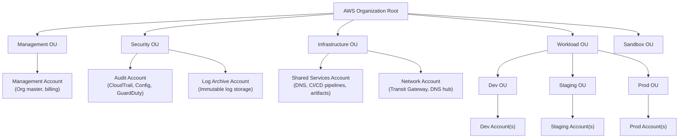
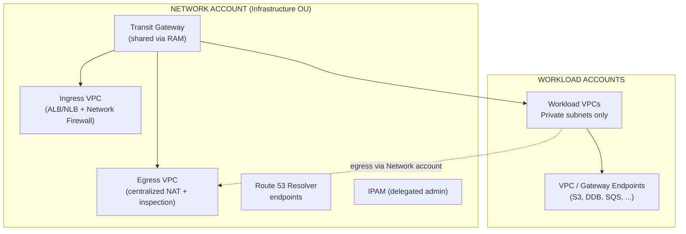
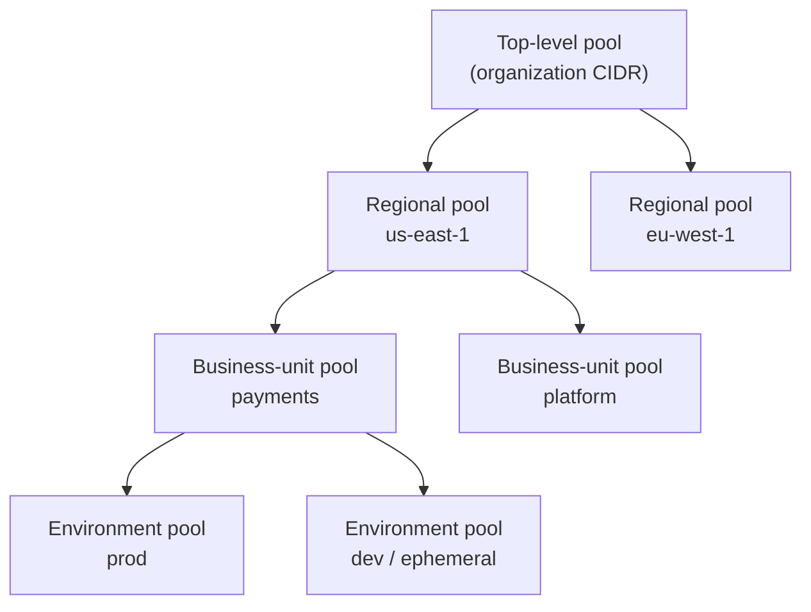
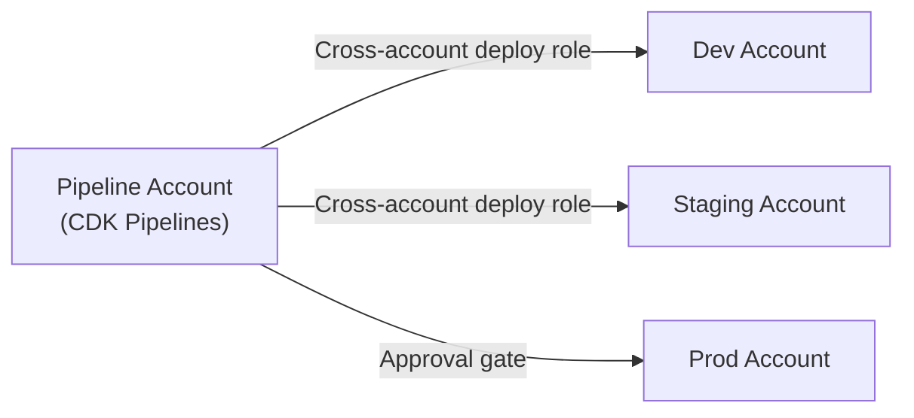

# Multi-Account Landing Zone

> Enterprise AWS governance with AWS Control Tower, SCPs, RCPs, and CDK Pipelines.

---

## Table of Contents

1. [Account Structure](#1-account-structure)
2. [AWS Control Tower](#2-aws-control-tower)
3. [Service Control Policies (SCPs)](#3-service-control-policies-scps)
4. [Resource Control Policies (RCPs)](#4-resource-control-policies-rcps)
5. [Permission Boundaries](#5-permission-boundaries)
6. [Networking](#6-networking)
7. [Centralized Logging](#7-centralized-logging)
8. [Pipeline Account](#8-pipeline-account)
9. [Cost Management](#9-cost-management)
10. [Bootstrap](#10-bootstrap)

---

## 1. Account Structure

### Organizational Units (OUs)



### Account Responsibilities

| Account | Purpose | Key Services |
|---------|---------|--------------|
| **Management** | Organization root, billing, SCPs | AWS Organizations, SSO |
| **Audit** | Security monitoring, compliance | CloudTrail, Config, GuardDuty, Security Hub |
| **Log Archive** | Immutable centralized logs | S3 (Object Lock), Athena |
| **Shared Services** | CI/CD pipelines, shared artifacts | CodePipeline, ECR, S3 Artifacts |
| **Network** | Centralized networking | Transit Gateway, Route 53, VPC |
| **Dev / Staging / Prod** | Workload isolation per environment | Lambda, API Gateway, DynamoDB, etc. |

### Design Principles

- **Least privilege**: Each account has only the permissions it needs.
- **Blast radius reduction**: A compromise in Dev cannot reach Prod.
- **Separation of duties**: Security team owns Audit; platform team owns Shared Services.
- **Immutable audit trail**: Log Archive uses S3 Object Lock with governance mode.

---

## 2. AWS Control Tower

### Initial Setup

```bash
# Control Tower is set up via the AWS Console, but account vending is automated:
aws controltower create-managed-account \
  --account-name "prod-workload-team-a" \
  --account-email "prod-team-a@company.com" \
  --organizational-unit-name "Prod" \
  --sso-user-email "admin@company.com"
```

### Account Factory (AFT)

Use **Account Factory for Terraform (AFT)** or **CDK-based custom account vending**:

```typescript
// CDK: Invoke Control Tower Account Factory via Service Catalog
import { CfnProvisionedProduct } from 'aws-cdk-lib/aws-servicecatalog';

new CfnProvisionedProduct(this, 'NewWorkloadAccount', {
  productName: 'AWS Control Tower Account Factory',
  provisioningArtifactName: 'AWS Control Tower Account Factory',
  provisionedProductName: 'team-b-prod',
  provisioningParameters: [
    { key: 'AccountName', value: 'team-b-prod' },
    { key: 'AccountEmail', value: 'team-b-prod@company.com' },
    { key: 'ManagedOrganizationalUnit', value: 'Prod' },
    { key: 'SSOUserEmail', value: 'admin@company.com' },
    { key: 'SSOUserFirstName', value: 'Admin' },
    { key: 'SSOUserLastName', value: 'User' },
  ],
});
```

### Guardrails

#### Preventive Guardrails (SCPs)

| Guardrail | Effect |
|-----------|--------|
| Disallow changes to CloudTrail | Prevents tampering with audit logs |
| Disallow deletion of log archive | Protects immutable storage |
| Disallow changes to AWS Config | Maintains compliance visibility |
| Disallow public access to S3 | Prevents data leakage |

#### Detective Guardrails (AWS Config Rules)

| Guardrail | Detection |
|-----------|-----------|
| EBS volumes encrypted | Flags unencrypted volumes |
| RDS instances not public | Detects public DB endpoints |
| MFA enabled for root | Alerts if root lacks MFA |
| S3 bucket logging enabled | Ensures access logging |

```bash
# Enable a Control Tower guardrail
aws controltower enable-control \
  --control-identifier "arn:aws:controltower:us-east-1::control/AWS-GR_DISALLOW_CROSS_REGION_NETWORKING" \
  --target-identifier "arn:aws:organizations::111111111111:ou/o-abc123/ou-defg-456789"
```

---

## 3. Service Control Policies (SCPs)

SCPs are attached at the OU level and define the **maximum permissions** for all accounts within.

### 3.1 Deny Direct Deploy (Must Use Pipeline)

```json
{
  "Version": "2012-10-17",
  "Statement": [
    {
      "Sid": "DenyDirectDeploy",
      "Effect": "Deny",
      "Action": [
        "cloudformation:CreateStack",
        "cloudformation:UpdateStack",
        "cloudformation:DeleteStack",
        "lambda:CreateFunction",
        "lambda:UpdateFunctionCode",
        "lambda:UpdateFunctionConfiguration",
        "apigateway:POST",
        "apigateway:PUT",
        "apigateway:PATCH",
        "dynamodb:CreateTable",
        "dynamodb:DeleteTable"
      ],
      "Resource": "*",
      "Condition": {
        "StringNotEquals": {
          "aws:PrincipalOrgPaths": [
            "o-orgid/r-rootid/ou-infraid/"
          ]
        },
        "ArnNotLike": {
          "aws:PrincipalArn": [
            "arn:aws:iam::*:role/cdk-*-deploy-role-*",
            "arn:aws:iam::*:role/cdk-*-cfn-exec-role-*",
            "arn:aws:iam::*:role/AWSControlTowerExecution"
          ]
        }
      }
    }
  ]
}
```

### 3.2 Deny Disable Security Services

```json
{
  "Version": "2012-10-17",
  "Statement": [
    {
      "Sid": "DenyDisableSecurity",
      "Effect": "Deny",
      "Action": [
        "guardduty:DeleteDetector",
        "guardduty:DisassociateFromMasterAccount",
        "guardduty:UpdateDetector",
        "securityhub:DisableSecurityHub",
        "securityhub:DeleteMembers",
        "config:StopConfigurationRecorder",
        "config:DeleteConfigurationRecorder",
        "config:DeleteDeliveryChannel",
        "cloudtrail:StopLogging",
        "cloudtrail:DeleteTrail",
        "access-analyzer:DeleteAnalyzer"
      ],
      "Resource": "*",
      "Condition": {
        "ArnNotLike": {
          "aws:PrincipalArn": [
            "arn:aws:iam::*:role/AWSControlTowerExecution",
            "arn:aws:iam::*:role/OrganizationAccountAccessRole"
          ]
        }
      }
    }
  ]
}
```

### 3.3 Deny Public S3

```json
{
  "Version": "2012-10-17",
  "Statement": [
    {
      "Sid": "DenyS3PublicAccess",
      "Effect": "Deny",
      "Action": "s3:PutBucketPublicAccessBlock",
      "Resource": "arn:aws:s3:::*",
      "Condition": {
        "StringNotEquals": {
          "s3:x-amz-public-access-block-configuration-block-public-acls": "true",
          "s3:x-amz-public-access-block-configuration-block-public-policy": "true",
          "s3:x-amz-public-access-block-configuration-ignore-public-acls": "true",
          "s3:x-amz-public-access-block-configuration-restrict-public-buckets": "true"
        }
      }
    },
    {
      "Sid": "DenyS3PublicObjectACLs",
      "Effect": "Deny",
      "Action": [
        "s3:PutBucketAcl",
        "s3:PutObjectAcl"
      ],
      "Resource": "arn:aws:s3:::*",
      "Condition": {
        "StringEquals": {
          "s3:x-amz-acl": [
            "public-read",
            "public-read-write",
            "authenticated-read"
          ]
        }
      }
    }
  ]
}
```

### 3.4 Region Restriction

```json
{
  "Version": "2012-10-17",
  "Statement": [
    {
      "Sid": "DenyNonApprovedRegions",
      "Effect": "Deny",
      "NotAction": [
        "a]4m:*",
        "iam:*",
        "sts:*",
        "organizations:*",
        "route53:*",
        "cloudfront:*",
        "support:*",
        "billing:*",
        "health:*",
        "trustedadvisor:*"
      ],
      "Resource": "*",
      "Condition": {
        "StringNotEquals": {
          "aws:RequestedRegion": [
            "us-east-1",
            "us-west-2",
            "eu-west-1"
          ]
        }
      }
    }
  ]
}
```

### CDK Implementation of SCPs

```typescript
import * as organizations from 'aws-cdk-lib/aws-organizations';
import * as iam from 'aws-cdk-lib/aws-iam';

// SCP: Deny direct deploy
const denyDirectDeployScp = new organizations.CfnPolicy(this, 'DenyDirectDeploy', {
  name: 'deny-direct-deploy',
  description: 'Force all deployments through CI/CD pipeline roles',
  type: 'SERVICE_CONTROL_POLICY',
  content: JSON.stringify({
    Version: '2012-10-17',
    Statement: [{
      Sid: 'DenyDirectDeploy',
      Effect: 'Deny',
      Action: [
        'cloudformation:CreateStack',
        'cloudformation:UpdateStack',
        'cloudformation:DeleteStack',
        'lambda:CreateFunction',
        'lambda:UpdateFunctionCode',
      ],
      Resource: '*',
      Condition: {
        ArnNotLike: {
          'aws:PrincipalArn': [
            'arn:aws:iam::*:role/cdk-*-deploy-role-*',
            'arn:aws:iam::*:role/cdk-*-cfn-exec-role-*',
          ],
        },
      },
    }],
  }),
  targetIds: ['ou-workload-id'], // Attach to Workload OU
});
```


---

## 4. Resource Control Policies (RCPs)

RCPs restrict which **external principals** can access resources within your organization — the complement to SCPs (which restrict what your principals can do).

| Policy Type | Controls | Applied To |
|------------|----------|-----------|
| **SCPs** | What YOUR principals can do | Organization accounts |
| **RCPs** | Who can access YOUR resources | Organization resources |

```json
{
  "Version": "2012-10-17",
  "Statement": [
    {
      "Sid": "DenyExternalAccess",
      "Effect": "Deny",
      "Principal": "*",
      "Action": "*",
      "Resource": "*",
      "Condition": {
        "StringNotEquals": {
          "aws:PrincipalOrgID": "o-your-org-id"
        },
        "BoolIfExists": {
          "aws:PrincipalIsAWSService": "false"
        }
      }
    }
  ]
}
```

---

## 5. Permission Boundaries

Permission boundaries define the **maximum effective permissions** for IAM roles created by developers. Even if a role policy grants `s3:*`, the permission boundary can restrict it to specific buckets.

```typescript
const permissionBoundary = new iam.ManagedPolicy(this, 'DevBoundary', {
  statements: [
    new iam.PolicyStatement({
      effect: iam.Effect.ALLOW,
      actions: [
        'lambda:*', 'dynamodb:*', 'sqs:*', 'sns:*',
        'events:*', 'logs:*', 'xray:*', 'cloudwatch:*',
      ],
      resources: ['*'],
    }),
    new iam.PolicyStatement({
      effect: iam.Effect.DENY,
      actions: ['iam:CreateUser', 'iam:CreateAccessKey', 'organizations:*'],
      resources: ['*'],
    }),
  ],
});
```

---

## 6. Networking

Networking is centralized in a dedicated **Network account** in the Infrastructure OU. Workload teams own their applications; the platform/network team owns connectivity, IP planning, egress, and traffic inspection. This separates duties, contains blast radius, and avoids duplicating expensive shared infrastructure (NAT gateways, firewalls) in every account.

### Network Account — Inbound / Outbound Separation

The AWS Security Reference Architecture recommends splitting traffic into separate **inbound** and **outbound** VPCs in the Network account. Inbound (ingress) traffic is treated as higher-risk and gets dedicated routing, monitoring, and inspection; outbound (egress) is centralized so spoke VPCs need no NAT gateways of their own.



**Key principles:**

- Serverless workloads reach AWS services through VPC/Gateway endpoints (no NAT for AWS API calls)
- No public subnets in workload accounts — ingress/egress live in the Network account
- Centralized egress: spoke VPCs route internet-bound traffic through the egress VPC, so no per-account NAT
- Transit Gateway (shared via AWS RAM) for cross-account/on-prem connectivity, with **custom route tables** to isolate domains (e.g., dev VPCs cannot reach prod through the TGW)
- VPC Lattice for application-layer service-to-service networking

### Connectivity Model — Transit Gateway vs Shared VPC

Two "sharing" mechanisms solve different problems and are often combined. Transit Gateway *routes between* independent VPCs; Shared VPC (via RAM) lets multiple accounts *build into the same* VPC.

| Option | Use when | Trade-off |
|--------|----------|-----------|
| **VPC Peering** | A handful of VPCs, simple 1:1 connectivity | Cheap; no transitive routing, doesn't scale |
| **Transit Gateway** | Many VPCs + on-prem, need traffic segmentation | Scales to thousands of VPCs; per-attachment + data-processing cost, more ops |
| **Shared VPC (RAM subnet sharing)** | Teams need tight interconnectivity with central network management | Implicit intra-VPC routing (no peering/TGW hops); owner controls the VPC, so less per-team network isolation |
| **PrivateLink** | Expose a *single service* privately | Solves service access, not whole-network joining |

**Shared VPC** fits when network isolation between teams need not be strict, but account-level resource and IAM separation must be: one owner account creates and manages the VPC, then shares **subnets** into participant accounts, which launch their own resources there. Constrain who can share what with SCPs. **Transit Gateway** fits when each team needs its own VPC but you still want centrally-governed, segmented connectivity between them.

### Security Groups Across Accounts

- **Shared VPC:** the VPC owner can share a security group with participant accounts (via AWS Organizations); participants attach it to resources they launch in the shared subnets — centrally managed rules, per-account resources.
- **Across Transit Gateway:** security-group *referencing* lets a rule reference a security group in another VPC across the TGW instead of hard-coding CIDR ranges. This eases peering→TGW migration and improves posture at scale by managing rules by SG identity rather than IP ranges.

### IP Address Management (IPAM)

Amazon VPC **IPAM** plans, tracks, and monitors public and private IP usage across the whole organization. It prevents the classic multi-account failure mode — **overlapping CIDRs**, which silently break Transit Gateway routing and VPC peering. This matters especially for serverless estates with many [ephemeral / per-PR environments](34-ephemeral-environments.md), which allocate and release VPC/ENI address space rapidly.



**Practices:**

- **Hierarchical pools** — top-level → per-Region → per-business-unit → per-environment. New VPCs draw non-overlapping CIDRs automatically from the correct pool.
- **Delegated admin** — a member account (typically the Network account) is delegated as the IPAM admin and owns allocation and monitoring org-wide.
- **Compliance monitoring** — IPAM watches CIDRs for overlap and for compliance with each pool's allocation rules, at both VPC and subnet level.
- **Predictable public IPs** — IPAM can supply predictable IP blocks for internet-facing ALBs and integrates with NAT gateway + prefix lists for scalable IPv4.

> **Sources:** [SRA — Network account](https://docs.aws.amazon.com/prescriptive-guidance/latest/security-reference-architecture/network.html), [Building a Scalable Multi-VPC Network (whitepaper)](https://docs.aws.amazon.com/whitepapers/latest/building-scalable-secure-multi-vpc-network-infrastructure/welcome.html), [VPC sharing best practices](https://aws.amazon.com/blogs/networking-and-content-delivery/vpc-sharing-key-considerations-and-best-practices/), [Security group referencing for Transit Gateway](https://aws.amazon.com/blogs/networking-and-content-delivery/introducing-security-group-referencing-for-aws-transit-gateway/), [IPAM (prescriptive guidance)](https://docs.aws.amazon.com/prescriptive-guidance/latest/robust-network-design-control-tower/ipam.html), [Multi-Region IPAM architecture](https://docs.aws.amazon.com/prescriptive-guidance/latest/patterns/multi-region-ipam-architecture.html). Content was rephrased for compliance with licensing restrictions.

---

## 7. Centralized Logging

All accounts forward logs to a centralized Security/Audit account:

| Log Type | Service | Destination |
|----------|---------|-------------|
| API calls | CloudTrail | Organization trail → S3 (log archive) |
| VPC traffic | VPC Flow Logs | CloudWatch Logs → S3 |
| DNS queries | Route 53 Resolver | CloudWatch Logs |
| Security findings | SecurityHub | Delegated admin account |
| Config compliance | AWS Config | Aggregator in security account |

---

## 8. Pipeline Account

A dedicated account hosts all CI/CD pipelines, isolated from workload accounts:



**CDK Pipelines cross-account setup:**

- Pipeline account has `cdk-*-deploy-role` in each target account
- SCPs allow only pipeline roles to deploy (deny direct human deploy)
- Express mode for dev stages, standard + canary for production

---

## 9. Cost Management

| Control | Implementation |
|---------|---------------|
| **Budget alerts** | AWS Budgets per account + OU-level aggregation |
| **Cost allocation tags** | Mandatory tags enforced via SCP (deny untagged resources) |
| **FinOps Agent** | Monitors anomalies, recommends optimizations |
| **Reserved capacity** | Savings Plans at organization level (shared benefit) |
| **Right-sizing** | Compute Optimizer recommendations + agent automation |

---

## 10. Bootstrap

### CDK Bootstrap for Multi-Account

```bash
# Bootstrap each account with trust to pipeline account
cdk bootstrap aws://DEV_ACCOUNT_ID/us-east-1 \
    --trust PIPELINE_ACCOUNT_ID \
    --cloudformation-execution-policies "arn:aws:iam::aws:policy/AdministratorAccess" \
    --qualifier framework

cdk bootstrap aws://STAGING_ACCOUNT_ID/us-east-1 \
    --trust PIPELINE_ACCOUNT_ID \
    --cloudformation-execution-policies "arn:aws:iam::aws:policy/AdministratorAccess" \
    --qualifier framework

cdk bootstrap aws://PROD_ACCOUNT_ID/us-east-1 \
    --trust PIPELINE_ACCOUNT_ID \
    --cloudformation-execution-policies "arn:aws:iam::aws:policy/AdministratorAccess" \
    --qualifier framework
```

### Control Tower Account Factory

```bash
# Create new workload account via Control Tower
aws controltower create-managed-account \
    --account-name "my-new-service" \
    --account-email "my-new-service@company.com" \
    --organizational-unit-name "Workload"
    
# After provisioning, bootstrap for CDK
cdk bootstrap aws://NEW_ACCOUNT_ID/us-east-1 \
    --trust PIPELINE_ACCOUNT_ID \
    --qualifier framework
```

<!-- FRAMEWORK-NAV -->
---

[← Back to index](index.md)

| Previous | Next |
|:---------|-----:|
| ← [Security Baseline](16-security-baseline.md) | [FinOps & Cost Governance](18-finops-cost-governance.md) → |
