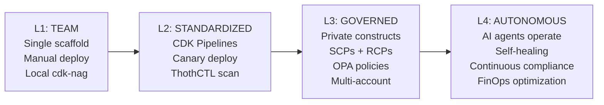

# Modern Cloud-Native Serverless Framework on AWS

## What Is This Framework?

A comprehensive, opinionated framework for building **enterprise-grade cloud-native applications** on AWS. It covers everything from architecture principles and software design patterns to CI/CD pipelines, observability, AI integration, and hands-on workshops.

This is not just documentation — it's a **decision framework** that tells you:
- **What** to build with (services, tools, patterns)
- **How** to structure code (hexagonal architecture, DDD)
- **How** to deploy safely (TPF, canary, Express mode)
- **How** to govern at scale (SCPs, RCPs, policy-as-code)
- **How** to operate (frontier agents, observability, drift detection)
- **How** to develop with AI (AI-DLC, Kiro, ThothCTL)

---

## Framework Components

```mermaid
flowchart TD
    subgraph Principles["PRINCIPLES & PATTERNS"]
        ARCH["Architecture Principles<br/>(16-Factor, Well-Architected, Cell-Based)"]
        SW["Software Architecture<br/>(Hexagonal, DDD, CQRS, Vertical Slice)"]
    end
    subgraph Infrastructure["INFRASTRUCTURE"]
        COMPUTE["Compute<br/>(Lambda, ECS, Step Functions)"]
        IAC["IaC<br/>(CDK + Express, SAM, SST)"]
        API["API & Events<br/>(AppSync, EventBridge, VPC Lattice)"]
        DATA["Data Layer<br/>(DynamoDB, Aurora, ElastiCache)"]
        FRONT["Frontend<br/>(Amplify, SST, Edge)"]
    end
    subgraph Delivery["DELIVERY & OPERATIONS"]
        CICD["CI/CD<br/>(TPF, Ten Pillars, CDK Pipelines)"]
        OBS["Observability<br/>(OpenTelemetry, ADOT, Powertools)"]
        SEC["Security<br/>(Continuum, Guardrails, RCPs)"]
        AIOPS["AI Operations<br/>(DevOps Agent, FinOps Agent)"]
    end
    subgraph Methodology["METHODOLOGY & TOOLS"]
        AIDLC["AI-DLC<br/>(Inception → Construction → Operations)"]
        THOTH["ThothCTL<br/>(Platform Engineering CLI)"]
        KIRO["Kiro<br/>(AI-assisted development)"]
    end
    subgraph Workshops["HANDS-ON WORKSHOPS"]
        W1["Serverless<br/>(Lambda + CDK)"]
        W2["Enterprise<br/>(Constructs + CodeArtifact)"]
        W3["ECS Backend<br/>(Containers + Express Mode)"]
        W4["CI/CD<br/>(Pipelines + Agents)"]
    end

    Principles --> Infrastructure
    Infrastructure --> Delivery
    Delivery --> Methodology
    Methodology --> Workshops
```



---

## Quick Start

```bash
# Install the platform CLI
pip install thothctl

# Initialize development environment (installs all tools)
thothctl init env

# Scaffold a new project
git clone https://github.com/thothforge/cdkv2_typescript_scaffold.git my-project
cd my-project && npm install

# Start AI-DLC workflow with Kiro
kiro-cli chat
> Using AI-DLC, build a serverless order processing API...
```

---

## Documentation Index

### Foundations

| Document | Description |
|----------|-------------|
| [Compute Layer](08-compute.md) | Lambda (SnapStart, ARM64, streaming), Step Functions, ECS Fargate |
| [Infrastructure as Code](09-iac.md) | CDK + Express Mode, SAM, SST v3, Terraform — post-Express comparison |
| [API & Event Patterns](11-api-events.md) | API Gateway, AppSync, EventBridge (Bus, Pipes, Scheduler), VPC Lattice |
| [Data Layer](12-data-layer.md) | DynamoDB, Aurora Serverless v2, ElastiCache, OpenSearch, S3 Express |
| [Frontend & Full-Stack](13-frontend-fullstack.md) | Amplify Gen 2, SST v3, CloudFront Functions, Lambda@Edge |

### Operations & Delivery

| Document | Description |
|----------|-------------|
| [Observability](15-observability.md) | OpenTelemetry (ADOT), Lambda Powertools, Application Signals, Frontier Agents |
| [AI/ML Integration](14-ai-ml.md) | Bedrock, AgentCore, Strands SDK, Guardrails, RAG patterns |
| [CloudFormation Express](10-cfn-express.md) | How Express mode changes the IaC landscape |
| [Reference Architecture](19-reference-architecture.md) | E-commerce, SaaS, IoT — complete stack diagrams |
| [Recommendations](20-recommendations.md) | Final recommendations by team type and application |

### Principles & Patterns

| Document | Description |
|----------|-------------|
| [Architecture Principles](01-architecture-principles.md) | 16-Factor App, Well-Architected, TPF, Platform Engineering, Cell-Based |
| [Software Architecture](02-software-architecture-patterns.md) | Hexagonal, Vertical Slice, CQRS, Event Sourcing, DDD — when to use each |
| [Platform Engineering](03-platform-engineering-guidelines.md) | Manifesto, golden paths, self-service, DX metrics, maturity model |
| [IDP → ADP](04-platform-engineering-idp-to-adp.md) | Four levels of agentic maturity, 3 path types, 8 core paths |
| [AI-SDLC](05-ai-sdlc.md) | AWS AI-DLC methodology, Agentic SDLC, 5-layer reference architecture |
| [DevOps & CI/CD (TPF)](06-devops-cicd.md) | Ten Pillars of Pragmatic Deployments, DORA metrics, canary, Express mode |
| [Testing Strategy](07-testing-strategy.md) | Testing pyramid, hexagonal testing, contract, chaos, load |
| [APIOps Model](28-apiops.md) | Contract-first, API lifecycle, OpenAPI/AsyncAPI/GraphQL, governance |
| [Data Strategy](29-data-strategy.md) | Cell data ownership, ECST, data mesh, data contracts, DynamoDB patterns |

### Workshops

| Document | Description |
|----------|-------------|
| [Workshop: Serverless End-to-End](23-workshop-serverless.md) | Lambda + CDK + AI-DLC + ThothCTL — full application from scratch |
| [Workshop: Enterprise CDK](24-workshop-enterprise-cdk.md) | Private constructs, CodeArtifact, Projen, multi-account, RCPs |
| [Workshop: ECS Backend](25-workshop-ecs-backend.md) | Containers, ECS Express Mode, Docker Compose → cloud, Service Connect |
| [Workshop: CI/CD Phase 1](26-workshop-cicd-phase1.md) | CDK Pipelines, canary, feature flags, ThothCTL DevSecOps |
| [Workshop: CI/CD Phase 2](27-workshop-cicd-phase2.md) | Continuum, DevOps Agent, FinOps Agent, supply chain, SCPs + RCPs |

---

## Key Technologies

| Layer | Technology | Role |
|-------|-----------|------|
| **AI Methodology** | AWS AI-DLC + Kiro | AI-driven development lifecycle (Inception → Construction → Operations) |
| **Platform CLI** | ThothCTL | DevSecOps automation, scanning, cost analysis, governance |
| **IaC** | CDK v2 + Express Mode | Fast, type-safe infrastructure with compliance (cdk-nag) |
| **Compute** | Lambda + ECS Fargate | Serverless functions + serverless containers |
| **API** | AppSync + API Gateway | GraphQL (real-time) + REST |
| **Events** | EventBridge | Async backbone (Bus + Pipes + Scheduler) |
| **Data** | DynamoDB + Aurora Serverless v2 | NoSQL (default) + SQL (when needed) |
| **AI/ML** | Bedrock + AgentCore + Strands | Foundation models + agent runtime + agent SDK |
| **Observability** | OpenTelemetry (ADOT) + Powertools | Vendor-neutral traces/metrics/logs |
| **Security** | Continuum + Guardrails + cdk-nag | Continuous pen testing + AI safety + compliance |
| **Operations** | DevOps Agent + FinOps Agent | Autonomous incident investigation + cost monitoring |
| **Deployment** | CDK Pipelines + CodeDeploy | Self-mutating CI/CD + canary rollouts |
| **Governance** | SCPs + RCPs + OPA/Rego | Principal controls + resource controls + policy-as-code |
| **Scaffold** | [cdkv2_typescript_scaffold](https://github.com/thothforge/cdkv2_typescript_scaffold) | Golden path project template |

---

## Architecture Principles (Summary)

1. **Serverless-First** — Managed services that scale to zero
2. **AI-Native** — Bedrock + agents as first-class capabilities
3. **Event-Driven** — Async by default; sync only at edges
4. **Cell-Based** — Independent, blast-radius-contained units
5. **Hexagonal Code** — Ports & adapters; domain never depends on infrastructure
6. **Zero-Trust Security** — SCPs + RCPs + Cedar + least privilege
7. **Shift-Left** — Security, cost, compliance validated before merge
8. **Observable** — OpenTelemetry + Powertools + Application Signals from day one
9. **Cost-Aware** — ARM64, SnapStart, Valkey, scales-to-zero
10. **Platform Engineering** — Golden paths via constructs, scaffolds, and ThothCTL

---

## Maturity Model



| Level | Deploy | Security | Cost | Operations |
|-------|--------|----------|------|-----------|
| **L1** | `cdk deploy` manually | cdk-nag locally | Manual review | CloudWatch dashboards |
| **L2** | CDK Pipelines + canary | ThothCTL scan in CI | Cost estimation in PR | Application Signals |
| **L3** | Multi-account + approval gates | Continuum + SCPs + RCPs | FinOps Agent monitoring | DevOps Agent investigation |
| **L4** | AI proposes + human approves | Auto-remediation | Auto-optimization | Self-healing with guardrails |

---

## Getting Started

| Your Goal | Start Here |
|-----------|-----------|
| Build a new serverless app | [Workshop: Serverless End-to-End](23-workshop-serverless.md) |
| Build a container-based backend | [Workshop: ECS Backend](25-workshop-ecs-backend.md) |
| Set up enterprise CI/CD | [Workshop: CI/CD Phase 1](26-workshop-cicd-phase1.md) |
| Understand architecture decisions | [Architecture Principles](01-architecture-principles.md) |
| Learn software design patterns | [Software Architecture Patterns](02-software-architecture-patterns.md) |
| Set up organizational governance | [Workshop: Enterprise CDK](24-workshop-enterprise-cdk.md) |

---

## View This Documentation Locally

```bash
# Install Zensical
pip install zensical

# Preview with hot-reload
zensical serve

# Build static site
zensical build
# → Output in site/ (deploy to S3 + CloudFront, Amplify Hosting, etc.)
```
